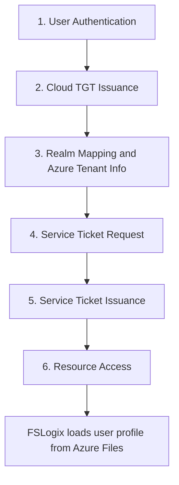

# Microsoft Entra Kerberos overview


**Microsoft Entra Kerberos** is an authentication capability that brings the Kerberos protocol to Microsoft Entra ID. In a sense, it turns Microsoft Entra ID into a cloud based Key Distribution Center (KDC) for Kerberos authentication. This capability allows Microsoft Entra ID to issue kerberos tickets for users, extending traditional Kerberos authentication beyond on-premises Active Directory. Microsoft Entra Kerberos was introduced in 2021 to help bridge the gap between legacy, on-premises authentication protocols, and modern cloud identity. 

In a hybrid scenario, where accounts exist on-premises Active Directory Domain Services (AD-DS) and those users are synchronized to Microsoft Entra ID, Microsoft Entra Kerberos plays a crucial role. It enables these hybrid users to authenticate to cloud and on-premises resources using Kerberos without needing direct line of sight to domain controllers. For example, if Microsoft Entra ID joined windows client accesses a file share or application over the internet, Microsoft Entra ID can issue the necessary Kerberos tickets on behalf of the on-premises Active Directory environment. 


>[!IMPORTANT]
> At this time, Microsoft Entra Kerberos only works with hybrid identities.


> [!NOTE]
> For more information about Kerberos in Windows, see [Kerberos authentication overview](/windows-server/security/kerberos/kerberos-authentication-overview).

## Key Features and Benefits

- **Cloud-Based KDC**: Uses Microsoft Entra ID as the Key Distribution Center, reducing the need for connectivity to domain controllers.
- **Hybrid Identity Support**: Authenticates users from on-premises Active Directory, easing the move to cloud services.
- **Modern Authentication**: Supports multifactor authentication (MFA), passwordless options, and conditional access policies.
- **Seamless Access**: Authenticate to Azure services without VPN or direct on-premises connections.
- **Simplified Infrastructure and Management**: Reduces reliance on on-premises infrastructure, making management easier with fewer authentication servers required.
- **Enhanced Security**: Centralized authentication with advanced security features like [single sign-on](../enterprise-apps/what-is-single-sign-on.md), [multifactor authentication](concept-mfa-howitworks.md), [conditional access](../conditional-access/overview.md), and [Windows Hello for Business cloud trust](/windows/security/identity-protection/hello-for-business/hello-hybrid-cloud-trust).
- **Azure Integration**: Works seamlessly with Azure services, requiring minimal configuration.
- **Scalability and Reliability**: Uses Azure's infrastructure for authentication at scale, supporting large-scale deployments with ease.
- **Interoperability**: Compatible with various operating systems and devices.

## How Microsoft Entra Kerberos Works

Microsoft Entra Kerberos enables your Microsoft Entra ID tenant to function as a parallel Kerberos realm alongside your on-premises Active Directory Kerberos realm. When a user signs into a Windows device that is joined to Microsoft Entra ID or is hybrid joined, the device authenticates with Microsoft Entra ID and receives a [Primary Refresh Token](../devices/concept-primary-refresh-token.md). In addition to the PRT, Microsoft Entra ID can issue a Cloud Ticket Granting Ticket (TGT), which the user can use to request Kerberos tickets for accessing cloud resources, with Microsoft Entra ID serving as the KDC.

### Authentication flow

1. **User Authentication**:
    - The user signs into a Windows device.
    - The Local Security Authority (LSA) uses the Cloud Authentication Provider (CloudAP) to authenticate via OAuth to Microsoft Entra ID.
    - Microsoft Entra ID issues a Primary Refresh Token (PRT) containing user and device information.
    - If the user signs in with a passwordless method (such as FIDO2 or Windows Hello for Business), a Partial TGT may also be issued.

2. **Cloud TGT Issuance**:
    - Microsoft Entra ID acts as a Key Distribution Center (KDC), issuing a Cloud Kerberos Ticket Granting Ticket (TGT) to the client.
    - The TGT is stored in the client's Kerberos ticket cache.
    - The client recognizes the Microsoft Entra ID tenant as a separate Kerberos realm for cloud resources.

>[!NOTE]
> The Cloud TGT isn't a replacement for the on-premises TGT. It is an another ticket that allows access to cloud resources. The on-premises TGT is still required for accessing on-premises resources.

3. **Realm Mapping and Azure Tenant Info**:
    - Windows LSASS manages the Kerberos Cloud TGT, realm mapping, and Azure tenant information.
    - For Azure Virtual Desktop, the user receives both a PRT and Cloud TGT.
    - Azure Virtual Desktop uses FSLogix to load the user profile from Azure Files.
    - The Kerberos stack maintains the Cloud TGT and realm mapping, using a KDC Proxy to route Kerberos traffic to Microsoft Entra ID.

4. **Service Ticket Request**:
    - When the user accesses a service (for example, Azure Files), the client requests a service ticket from Microsoft Entra ID by presenting the TGT.
    - The client sends a Ticket Granting Service Request (TGS-REQ) to Microsoft Entra ID.
    - Kerberos identifies the service (for example, cifs/mystuff.file.core.windows.net) and maps the domain to KERBEROS.MICROSOFTONLINE.COM.
    - The KDC Proxy protocol enables Kerberos communication over the internet.

5. **Service Ticket Issuance**:
    - Microsoft Entra ID verifies the Cloud TGT and the user's identity.
    - Looks up the requested Service Principal Name (SPN) for the Azure Files resource registered in Microsoft Entra ID.
    - Generates a service ticket and encrypts it using the service principal's key.
    - Returns the ticket to the client in a TGS-REP.

6. **Resource Access**:
    - The Kerberos stack processes the TGS-REP, extracts the ticket, and generates an Application Request (AP-REQ).
    - The AP-REQ is provided to SMB, which includes it in the request to Azure Files.
    - Azure Files decrypts the ticket and grants access.
    - FSLogix can now read the user profile from Azure Files and load the Azure Virtual Desktop session.
    
```mermaid
flowchart TD
    A[User signs in] --> B[Cloud Authentication Provider]
    B --> C[Primary Refresh Token (PRT)]
    C --> D[Cloud TGT Issued]
    D --> E[Service Ticket Request]
    E --> F[Service Ticket Issued]
    F --> G[Resource Access]
    G --> H[FSLogix loads user profile from Azure Files]
```




## Example Use Cases

### Profile Containers with FSLogix for Azure Virtual Desktop

- **Scenario**: Hosting user profiles for virtual desktops.
- **Solution**: Store profiles in Azure Files accessed via Microsoft Entra Kerberos.
- **Benefit**: Reduces dependency on on-premises infrastructure and improves sign in times.

### Application Migration to Azure

- **Scenario**: "Lift and shift" of applications relying on Kerberos authentication.
- **Solution**: Use Microsoft Entra Kerberos to authenticate without modifying the application.
- **Benefit**: Simplifies migration while maintaining security requirements.

### Backup and Disaster Recovery

- **Scenario**: Backing up on-premises files to Azure Files.
- **Solution**: Authenticate to Azure Files using Microsoft Entra Kerberos, preserving permissions.
- **Benefit**: Ensures secure access during failover without relying on on-premises authentication.

## Limitations and Considerations

- **Hybrid Identities Only**: Currently supports only users synchronized from on-premises AD DS (hybrid users). Cloud-only Microsoft Entra ID accounts aren't supported.
- **Password Expiration**: Service principal passwords for storage accounts expire every six months and need to be rotated to maintain access.
- **Permissions Management**: Configuring NTFS permissions on Azure Files can still require connectivity to an on-premises domain controller.
- **Client Requirements**: Clients must be running supported versions of Windows with the necessary updates to utilize Microsoft Entra Kerberos.

## Getting Started with Microsoft Entra Kerberos

1. **Set Up Microsoft Entra Connect**:
    - Synchronize on-premises AD DS users to Microsoft Entra ID. For details, see the [Microsoft Entra Connect installation guide](../hybrid/connect/how-to-connect-install-prerequisites.md).

2. **Enable Microsoft Entra Kerberos**:
    - Configure Azure Files or other services to use Microsoft Entra Kerberos authentication. For instructions, see [Enable Microsoft Entra Kerberos for Azure Files](/azure/storage/files/storage-files-identity-auth-hybrid-cloud-trust?tabs=azure-portal).

3. **Client Configuration**:
    - Ensure Windows clients are up to date and [configured for Microsoft Entra Kerberos](/azure/azure-sql/managed-instance/winauth-azuread-setup-incoming-trust-based-flow#configure-the-group-policy-object-gpo).

4. **Manage Service Principals**:
    - Monitor and rotate service principal passwords as required.

5. **Monitor Authentication Activity**:
    - Use [Microsoft Entra ID reports and monitoring tools](../monitoring-health/overview-monitoring-health.md) to keep track of authentication events.

## Conclusion

Microsoft Entra Kerberos bridges the gap between traditional on-premises authentication and modern cloud-based services. By allowing Microsoft Entra ID to act as a KDC, it simplifies authentication for hybrid users accessing Azure services, enhances security with modern authentication methods, and reduces the need for on-premises infrastructure.

Administrators benefit from streamlined management, enhanced security features, and the ability to provide users with seamless access to cloud resources. As organizations continue to adopt cloud services, Microsoft Entra Kerberos plays a crucial role in maintaining secure and efficient authentication processes.

## Learn more

-   [Create the trusted domain object](/azure/storage/files/storage-files-identity-auth-hybrid-cloud-trust?tabs=azure-portal&preserve-view=true#create-the-trusted-domain-object)
-   [Configure clients to retrieve Kerberos tickets](/azure/storage/files/storage-files-identity-auth-hybrid-identities-enable?tabs=azure-portal%2Cintune&preserve-view=true#configure-the-clients-to-retrieve-kerberos-tickets)
-   [Configure the Group Policy Object (GPO) for Azure SQL managed instance](/azure/azure-sql/managed-instance/winauth-azuread-setup-incoming-trust-based-flow?view=azuresql#configure-the-group-policy-object-gpo)

