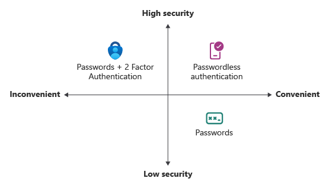

# What is Microsoft Entra authentication?

One of the main features of an identity platform is to verify, or *authenticate*, credentials when a user signs in to a device, application, or service. In Microsoft Entra ID, authentication involves more than just the verification of a username and password. To improve security and reduce the need for help-desk assistance, Microsoft Entra authentication includes the following components:

* Self-service password reset (SSPR)
* Multifactor authentication (MFA)
* Hybrid integration to write password changes back to an on-premises environment
* Hybrid integration to enforce password protection policies for an on-premises environment
* Passwordless authentication

To learn more about these authentication components, take a look at our short video.

> [!VIDEO https://learn-video.azurefd.net/vod/player?id=5ee3cad5-3360-48da-b520-1a0d96710a38]

## Improvements to the user experience

Microsoft Entra ID helps protect users' identities and simplify their sign-in experience. Features like SSPR let users update or change their passwords by using a web browser from any device. This feature is especially useful when users forget their passwords or their accounts are locked. Without waiting for a helpdesk or administrator to provide support, users can unblock themselves and continue to work.

MFA lets users choose an additional form of authentication during sign-in, such as a phone call or a mobile app notification. This ability reduces the requirement for a single, fixed form of secondary authentication, like a hardware token. If users don't currently have one form of additional authentication, they can choose a different method and continue to work.

Passwordless authentication removes the need for users to create and remember secure passwords. Capabilities like Windows Hello for Business or FIDO2 security keys let users sign in to devices or applications without a password. This ability can reduce the complexity of managing passwords across environments.

## Self-service password reset

SSPR gives users the ability to change or reset their passwords with no administrator or help-desk involvement. If users' accounts are locked or they forget their passwords, they can follow prompts to unblock themselves and get back to work. This ability reduces help-desk calls and loss of productivity when users can't sign in to their devices or applications.

SSPR works in the following scenarios:

* **Password change**: When a user knows the password but wants to change it to something new.
* **Password reset**: When a user can't sign in (for example, after forgetting the password) and wants to reset the password.
* **Account unlock**: When a user can't sign in because the account is locked, and the user wants to unlock the account.

When a user updates or resets a password by using SSPR, that password can also be written back to an on-premises Active Directory environment. Password writeback makes sure that a user can immediately use the updated credentials with on-premises devices and applications.

## Multifactor authentication

Multifactor authentication is a process in which a user is prompted for an additional form of identification during sign-in. For example, the user is prompted to enter a code on a phone or to provide a fingerprint scan.

If you use only a password to authenticate a user, it leaves an nonsecure vector for attack. If the password is weak or is exposed elsewhere, is it really the user who's signing in with the username and password, or is it an attacker? Requiring a second form of authentication increases security because this additional factor isn't easy for an attacker to obtain or duplicate.

Microsoft Entra MFA works by requiring two or more of the following authentication methods:

* Something the user knows, typically a password
* Something the user has, such as a trusted device or a hardware key that isn't easily duplicated
* Something the user is; that is, biometrics like a fingerprint or face scan

Users can register themselves for both SSPR and MFA in one step to simplify the onboarding experience. Administrators can define what forms of secondary authentication to use. Administrators can also require MFA when users perform a self-service password reset, to further secure that process.

## Password protection

By default, Microsoft Entra ID blocks weak passwords such as *Password1*. Microsoft Entra ID automatically updates and enforces a list of banned passwords are known to be weak. A Microsoft Entra user who tries to set a password to one of these weak passwords receives a notification to choose a password that's more secure.

To increase security, you can define custom policies for password protection. These policies can use filters to block any variation of a password that contains a name such as *Contoso* or a location like *London*, for example.

For hybrid security, you can integrate Microsoft Entra password protection with an on-premises Active Directory environment. A component installed in the on-premises environment receives the list of banned passwords and the custom policies for password protection from Microsoft Entra ID. Domain controllers then use that information to process password changes. This hybrid approach makes sure that no matter how or where users change their credentials, you enforce the use of strong passwords.

## Passwordless authentication

The goal for many environments is to remove the use of passwords as part of sign-in events. Features like Azure password protection or Microsoft Entra MFA help improve security, but a username/password combination remains a weak form of authentication that can be exposed or brute-force attacked.

When users sign in passwordlessly, they provide credentials by using methods like:

* Biometrics with Windows Hello for Business.
* A FIDO2 security key.

An attacker can't easily duplicate these authentication methods.

Microsoft Entra ID provides ways to natively authenticate by using passwordless methods to simplify the sign-in experience for users and reduce the risk of attacks.  

## Related content

* To get started, see the [tutorial for Microsoft Entra SSPR][tutorial-sspr] and the [tutorial for Microsoft Entra MFA][tutorial-azure-mfa].
* To learn more about SSPR concepts, see [How it works: Microsoft Entra self-service password reset][concept-sspr].
* To learn more about MFA concepts, see [How it works: Microsoft Entra multifactor authentication][concept-mfa].

<!-- INTERNAL LINKS -->
[tutorial-sspr]: tutorial-enable-sspr.md
[tutorial-azure-mfa]: tutorial-enable-azure-mfa.md
[concept-sspr]: concept-sspr-howitworks.md
[concept-mfa]: concept-mfa-howitworks.md
