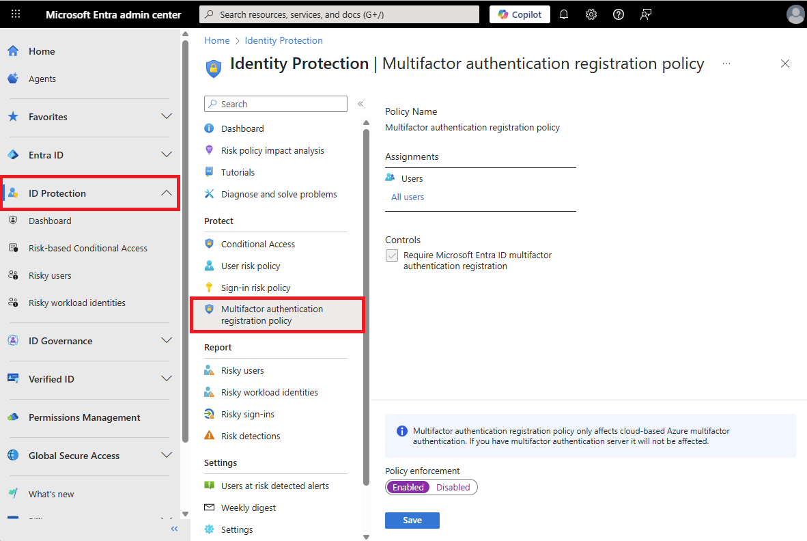

# Tutorial: Use risk detections for user sign-ins to trigger Microsoft Entra multifactor authentication or password changes

To protect your users, you can configure risk-based Microsoft Entra Conditional Access policies that automatically respond to risky behaviors. These policies can automatically block a sign-in attempt or require extra action, such as require a secure password change or prompting for Microsoft Entra multifactor authentication. These policies work with existing Microsoft Entra Conditional Access policies as an extra layer of protection for your organization. Users might never trigger a risky behavior in one of these policies, but your organization is protected if an attempt to compromise your security is made.

> [!IMPORTANT]
> This tutorial shows an administrator how to enable risk-based multifactor authentication.
>
> If your IT team hasn't enabled the ability to use Microsoft Entra multifactor authentication or you have problems during sign-in, reach out to your helpdesk for additional assistance.

In this tutorial, you learn how to:

> [!div class="checklist"]
> * Understand the available policies
> * Enable Microsoft Entra multifactor authentication registration
> * Enable risk-based password changes
> * Enable risk-based multifactor authentication
> * Test risk-based policies for user sign-in attempts

## Prerequisites

To complete this tutorial, you need the following resources and privileges:

* A working Microsoft Entra tenant with at least a Microsoft Entra ID P2 or trial license enabled.
   * If needed, [create one for free](https://azure.microsoft.com/free/?WT.mc_id=A261C142F).
* An account with Security Administrator privileges.
* Microsoft Entra ID configured for self-service password reset and Microsoft Entra multifactor authentication
   * If needed, [complete the tutorial to enable Microsoft Entra SSPR](tutorial-enable-sspr.md).
   * If needed, [complete the tutorial to enable Microsoft Entra multifactor authentication](tutorial-enable-azure-mfa.md).

## Overview of Microsoft Entra ID Protection

Each day, Microsoft collects and analyses trillions of anonymized signals as part of user sign-in attempts. These signals help build patterns of good user sign-in behavior, and identify potential risky sign-in attempts. Microsoft Entra ID Protection can review user sign-in attempts and take extra action if there's suspicious behavior:

Some of the following actions might trigger Microsoft Entra ID Protection risk detection:

* Users with leaked credentials.
* Sign-ins from anonymous IP addresses.
* Impossible travel to atypical locations.
* Sign-ins from infected devices.
* Sign-ins from IP addresses with suspicious activity.
* Sign-ins from unfamiliar locations.

The following three policies are available in Microsoft Entra ID Protection to protect users and respond to suspicious activity. You can choose to turn the policy enforcement on or off, select users or groups for the policy to apply to, and decide if you want to block access at sign-in or prompt for extra action.

* User risk policy
   * Identifies and responds to user accounts that might have compromised credentials. Can prompt the user to create a new password.
* Sign in risk policy
   * Identifies and responds to suspicious sign-in attempts. Can prompt the user to provide extra forms of verification using Microsoft Entra multifactor authentication.
* MFA registration policy
   * Makes sure users are registered for Microsoft Entra multifactor authentication. If a sign-in risk policy prompts for MFA, the user must already be registered for Microsoft Entra multifactor authentication.

When you enable a policy user or sign in risk policy, you can also choose the threshold for risk level - *low and above*, *medium and above*, or *high*. This flexibility lets you decide how aggressive you want to be in enforcing any controls for suspicious sign-in events.

For more information about Microsoft Entra ID Protection, see [What is Microsoft Entra ID Protection?](~/id-protection/overview-identity-protection.md)

## Enable MFA registration policy

[!INCLUDE [portal updates](~/includes/portal-update.md)]

Microsoft Entra ID Protection includes a default policy that can help get users registered for Microsoft Entra multifactor authentication. If you use other policies to protect sign-in events, you would need users to have already registered for MFA. When you enable this policy, it doesn't require users to perform MFA at each sign-in event. The policy only checks the registration status for a user and asks them to preregister if needed.

It's recommended to enable the MFA registration policy for users that use multifactor authentication. To enable this policy, complete the following steps:

1. Sign in to the [Microsoft Entra admin center](https://entra.microsoft.com) as at least a [Security Administrator](~/identity/role-based-access-control/permissions-reference.md#security-administrator).
1. Browse to **Protection** > **Multifactor authentication** > **MFA registration policy**.
1. By default, the policy applies to *All users*. If desired, select **Assignments**, then choose the users or groups to apply the policy on.
1. Under *Controls*, select **Access**. Make sure the option for *Require Microsoft Entra multifactor authentication registration* is checked, then choose **Select**.
1. Set **Enforce Policy** to *On*, then select **Save**.

    

## Enable user risk policy for password change

Microsoft works with researchers, law enforcement, various security teams at Microsoft, and other trusted sources to find username and password pairs. When one of these pairs matches an account in your environment, a risk-based password change can be requested. This policy and action requires the user update their password before they can sign in to make sure any previously exposed credentials no longer work.

To enable this policy, complete the following steps:

1. Sign in to the [Microsoft Entra admin center](https://entra.microsoft.com) as at least a [Conditional Access Administrator](~/identity/role-based-access-control/permissions-reference.md#conditional-access-administrator).
1. Browse to **Protection** > **Conditional Access**.
1. Select **New policy**.
1. Give your policy a name. We recommend that organizations create a meaningful standard for the names of their policies.
1. Under **Assignments**, select **Users or workload identities**.
   1. Under **Include**, select **All users**.
   1. Under **Exclude**, select **Users and groups** and choose your organization's emergency access or break-glass accounts. 
   1. Select **Done**.
1. Under **Cloud apps or actions** > **Include**, select **All cloud apps**.
1. Under **Conditions** > **User risk**, set **Configure** to **Yes**. 
   1. Under **Configure user risk levels needed for policy to be enforced**, select **High**.
   1. Select **Done**.
1. Under **Access controls** > **Grant**.
   1. Select **Grant access**, **Require multifactor authentication** and **Require password change**.
   1. Select **Select**.
1. Under **Session**.
   1. Select **Sign-in frequency**.
   1. Ensure **Every time** is selected.
   1. Select **Select**.
1. Confirm your settings and set **Enable policy** to **On**.
1. Select **Create** to create to enable your policy.

## Enable sign-in risk policy for MFA

Most users have a normal behavior that can be tracked. When they fall outside of this norm, it could be risky to allow them to successfully sign in. Instead, you might want to block that user, or ask them to perform a multifactor authentication. If the user successfully completes the MFA challenge, you can consider it a valid sign-in attempt and grant access to the application or service.

To enable this policy, complete the following steps:

1. Sign in to the [Microsoft Entra admin center](https://entra.microsoft.com) as at least a [Conditional Access Administrator](~/identity/role-based-access-control/permissions-reference.md#conditional-access-administrator).
1. Browse to **Protection** > **Conditional Access**.
1. Select **New policy**.
1. Give your policy a name. We recommend that organizations create a meaningful standard for the names of their policies.
1. Under **Assignments**, select **Users or workload identities**.
   1. Under **Include**, select **All users**.
   1. Under **Exclude**, select **Users and groups** and choose your organization's emergency access or break-glass accounts. 
   1. Select **Done**.
1. Under **Cloud apps or actions** > **Include**, select **All cloud apps**.
1. Under **Conditions** > **Sign-in risk**, set **Configure** to **Yes**. Under **Select the sign-in risk level this policy will apply to**.
   1. Select **High** and **Medium**.
   1. Select **Done**.
1. Under **Access controls** > **Grant**.
   1. Select **Grant access**, **Require multifactor authentication**.
   1. Select **Select**.
1. Under **Session**.
   1. Select **Sign-in frequency**.
   1. Ensure **Every time** is selected.
   1. Select **Select**.
1. Confirm your settings and set **Enable policy** to **On**.
1. Select **Create** to create to enable your policy.

## Test risky sign events

Most user sign-in events don't trigger the risk-based policies configured in the previous steps. A user might never see a prompt for MFA or to reset their password. If their credentials remain secure and their behavior consistent, their sign-in events would be successful.

To test the Microsoft Entra ID Protection policies created in the previous steps, you need a way to simulate risky behavior or potential attacks. The steps to do these tests vary based on the Microsoft Entra ID Protection policy you want to validate. For more information on scenarios and steps, see [Simulate risk detections in Microsoft Entra ID Protection](~/id-protection/howto-identity-protection-simulate-risk.md).

## Clean up resources

If you complete your testing and no longer want to have the risk-based policies enabled, return to each policy you want to disable and set **Enable policy** to *Off* or delete them.

## Next steps

In this tutorial, you enabled risk-based user policies for Microsoft Entra ID Protection. You learned how to:

> [!div class="checklist"]
> * Understand the available policies for Microsoft Entra ID Protection
> * Enable Microsoft Entra multifactor authentication registration
> * Enable risk-based password changes
> * Enable risk-based multifactor authentication
> * Test risk-based policies for user sign-in attempts

> [!div class="nextstepaction"]
> [Learn more about Microsoft Entra ID Protection](~/id-protection/overview-identity-protection.md)
