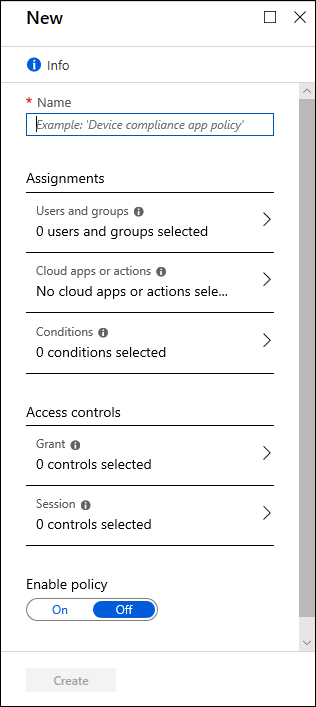

# Building a Conditional Access policy

As explained in the article [What is Conditional Access](overview.md), a Conditional Access policy is an if-then statement, of **Assignments** and **Access controls**. A Conditional Access policy brings signals together, to make decisions, and enforce organizational policies.

How does an organization create these policies? What is required? How are they applied?

:::image type="content" source="media/common-conditional-access-media/conditional-access-signal-decision-enforcement.png" alt-text="Diagram showing concept of Conditional Access signals plus decision to enforce organizational policy." lightbox="media/common-conditional-access-media/conditional-access-signal-decision-enforcement.png":::

Multiple Conditional Access policies might apply to an individual user at any time. In this case, all policies that apply must be satisfied. For example, if one policy requires multifactor authentication and another requires a compliant device, you must complete MFA, and use a compliant device. All assignments are logically **ANDed**. If you have more than one assignment configured, all assignments must be satisfied to trigger a policy.

If a policy where "Require one of the selected controls" is selected, we prompt in the order defined, as soon as the policy requirements are satisfied, access is granted.

All policies are enforced in two phases:

- **Phase 1**: Collect session details 
   - Gather session details, like network location and device identity necessary for policy evaluation. 
   - Phase 1 of policy evaluation occurs for enabled policies and policies in [report-only mode](concept-conditional-access-report-only.md).
- **Phase 2**: Enforcement 
   - Use the session details gathered in phase 1 to identify any requirements that aren't met. 
   - If there's a policy that is configured with the **block** grant control, enforcement stops here and the user is blocked. 
   - The user is prompted to complete more grant control requirements that weren't satisfied during phase 1 in the following order, until policy is satisfied:  
      1. [Multifactor authentication​](concept-conditional-access-grant.md#require-multifactor-authentication)
      2. [Device to be marked as compliant](./concept-conditional-access-grant.md#require-device-to-be-marked-as-compliant)
      3. [Microsoft Entra hybrid joined device](./concept-conditional-access-grant.md#require-hybrid-azure-ad-joined-device)
      4. [Approved client app](./concept-conditional-access-grant.md#require-approved-client-app)
      5. [App protection policy](./concept-conditional-access-grant.md#require-app-protection-policy)
      6. [Password change](./concept-conditional-access-grant.md#require-password-change)
      7. [Terms of use](concept-conditional-access-grant.md#terms-of-use)
      8. [Custom controls](./concept-conditional-access-grant.md#custom-controls-preview)
   - Once all grant controls are satisfied, apply session controls (App Enforced, Microsoft Defender for Cloud Apps, and token Lifetime) 
   - Phase 2 of policy evaluation occurs for all enabled policies. 

## Assignments

The assignments portion controls the who, what, and where of the Conditional Access policy.

### Users and groups

[Users and groups](concept-conditional-access-users-groups.md) assign who the policy include or exclude when applied. This assignment can include all users, specific groups of users, directory roles, or external guest users. 

### Target resources

[Target resources](concept-conditional-access-cloud-apps.md) can include or exclude cloud applications, user actions, or authentication contexts that are subjected to the policy.

### Network

[Network](concept-assignment-network.md) contains IP addresses, geographies, and [Global Secure Access' compliant network](/entra/global-secure-access/how-to-compliant-network) to Conditional Access policy decisions. Administrators can choose to define locations and mark some as trusted like those for their organization's primary network locations.

### Conditions

A policy can contain multiple [conditions](concept-conditional-access-conditions.md).

#### Sign-in risk

For organizations with [Microsoft Entra ID Protection](~/id-protection/overview-identity-protection.md), the risk detections generated there can influence your Conditional Access policies.

#### Device platforms

Organizations with multiple device operating system platforms might enforce specific policies on different platforms. 

The information used to calculate the device platform comes from unverified sources such as user agent strings that can be changed.

#### Client apps

The software the user is employing to access the cloud app. For example, 'Browser' and 'Mobile apps and desktop clients'. By default, all newly created Conditional Access policies apply to all client app types even if the client apps condition isn't configured.

#### Filter for devices

This control allows targeting specific devices based on their attributes in a policy.

## Access controls

The access controls portion of the Conditional Access policy controls how a policy is enforced.

### Grant

[Grant](concept-conditional-access-grant.md) provides administrators with a means of policy enforcement where they can block or grant access.

#### Block access

Block access does just that, it blocks access under the specified assignments. The block control is powerful and should be wielded with the appropriate knowledge.

#### Grant access

The grant control can trigger enforcement of one or more controls. 

- Require multifactor authentication
- Require authentication strength
- Require device to be marked as compliant (Intune)
- Require Microsoft Entra hybrid joined device
- Require approved client app
- Require app protection policy
- Require password change
- Require terms of use

Administrators can choose to require one of the previous controls or all selected controls using the following options. The default for multiple controls is to require all.

- Require all the selected controls (control and control)
- Require one of the selected controls (control or control)

### Session

[Session controls](concept-conditional-access-session.md) can limit the experience of users.

- Use app enforced restrictions:
   - Currently works with Exchange Online and SharePoint Online only.
   - Passes device information to allow control of experience granting full or limited access.
- Use Conditional Access App Control:
   - Uses signals from Microsoft Defender for Cloud Apps to do things like: 
      - Block download, cut, copy, and print of sensitive documents.
      - Monitor risky session behavior.
      - Require labeling of sensitive files.
- Sign-in frequency:
   - Ability to change the default sign in frequency for modern authentication.
- Persistent browser session:
   - Allows users to remain signed in after closing and reopening their browser window.
- Customize continuous access evaluation
- Disable resilience defaults 

## Simple policies

A Conditional Access policy must contain at minimum the following to be enforced:

- **Name** of the policy.
- **Assignments**
   - **Users and/or groups** to apply the policy to.
   - **Cloud apps or actions** to apply the policy to.
- **Access controls**
   - **Grant** or **Block** controls

The article [Common Conditional Access policies](concept-conditional-access-policy-common.md) includes some policies that we think would be useful to most organizations.

## Related content

- [Create a Conditional Access policy](~/identity/authentication/tutorial-enable-azure-mfa.md?bc=/azure/active-directory/conditional-access/breadcrumb/toc.json&toc=/azure/active-directory/conditional-access/toc.json#create-a-conditional-access-policy)

- [Managing device compliance with Intune](/mem/intune/protect/device-compliance-get-started)

- [Microsoft Defender for Cloud Apps and Conditional Access](/defender-cloud-apps/proxy-intro-aad)
