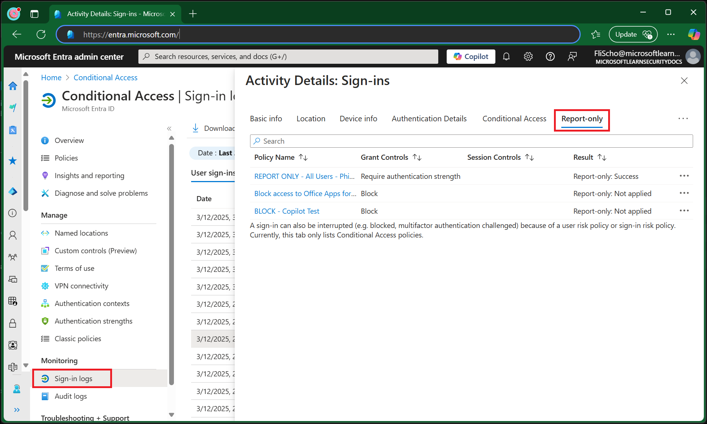

# Analyze Conditional Access Policy Impact

Conditional Access helps organizations stay secure by applying the right security access controls under the right circumstances. Understanding the impact of these policies can be challenging, especially when deploying new policies. This article explains how to analyze Conditional Access policy impact using report-only mode and other tools.

There are several options available to administrators based on report-only mode. Report-only mode is a policy state letting administrators test most Conditional Access policies before enabling them.

- Conditional Access policies can be evaluated in report-only mode except for items included in the "User Actions" scope.
- During sign-in, policies in report-only mode are evaluated but not enforced.
- Results are logged in the **Conditional Access** and **Report-only** tabs of the Sign-in log details.
- Customers with an Azure Monitor subscription can monitor the impact of their Conditional Access policies using the Conditional Access insights workbook.

> [!WARNING]
> Policies in report-only mode that require a compliant device might prompt users on macOS, iOS, and Android devices to select a device certificate during policy evaluation, even though device compliance isn't enforced. These prompts might repeat until the device is compliant. To prevent end users from receiving prompts during sign-in, exclude device platforms Mac, iOS, and Android from report-only policies that perform device compliance checks.

## Policy evaluation results

When a policy is evaluated for a given sign-in, there are several possible results:

| Result | Description |
| --- | --- |
| Report-only: Success | All configured policy conditions, required non-interactive grant controls, and session controls were satisfied. For example, a multifactor authentication requirement is satisfied by an MFA claim already present in the token, or a compliant device policy is satisfied by performing a device check on a compliant device. |
| Report-only: Failure | All configured policy conditions were satisfied but not all the required non-interactive grant controls or session controls were satisfied. For example, a policy applies to a user where a block control is configured, or a device fails a compliant device policy. |
| Report-only: User action required | All configured policy conditions were satisfied but user action would be required to satisfy the required grant controls or session controls. With report-only mode, the user isn't prompted to satisfy the required controls. For example, users aren't prompted for multifactor authentication challenges or terms of use.   |
| Report-only: Not applied | Not all configured policy conditions were satisfied. For example, the user is excluded from the policy or the policy only applies to certain trusted named locations. |
| Success | Sign-in events where the policy applied, the requirements were met, and the policy would allow the sign-in to proceed. The sign-in might still be blocked by a different policy. |
| Failure | Sign-in events where the policy applied, the requirements weren't met, and the policy would block the sign-in. This might be by design, like when sign-ins from a specific location are blocked, or accidental when the policy is misconfigured. |
| Not applied | Sign-in events where the policy wasn't applied, for example, the user was excluded. | 

## Reviewing results

Administrators can use several options to review the potential results of policies in their environment:

- Workbooks
- Sign-in logs
- Policy impact (Preview)

### Policy impact

The policy impact view of Conditional Access lets admins with at least the Security Reader role see a snapshot of information about the potential or existing impacts of policies on interactive sign-ins in your organization. This functionality lets you explore impact over a period of the past 24 hours, 7 days, or 1 month. Additionally, you can see and link to a sampling of sign-in events for further detail.

:::image type="content" source="media/concept-conditional-access-report-only/policy-impact-example-report-only.png" alt-text="Screenshot of Conditional Access policy impact example." lightbox="media/concept-conditional-access-report-only/policy-impact-example-report-only.png":::

### Workbooks

Administrators can create multiple policies in report-only mode, so it's necessary to understand both the individual impact of each policy and the combined impact of multiple policies evaluated together. The [Conditional Access Insights and Reporting workbook](howto-conditional-access-insights-reporting.md) lets administrators visualize Conditional Access policy, it queries and monitor the impact of a policy for a given time range, set of applications, and users. Administrators can customize workbooks to suit their specific needs.

### Sign-in logs

For deeper evaluation of Conditional Access policies and their application at a specific sign-in, administrators might investigate individual sign-in events. Each of these events includes details of what Conditional Access policies were enabled versus were in report-only mode, and applied or didn't apply. 

## Using these options

[!INCLUDE [conditional-access-report-only-mode](../../includes/conditional-access-report-only-mode.md)]

## Related content

- [Configure report-only mode on a Conditional Access policy](howto-conditional-access-insights-reporting.md)
