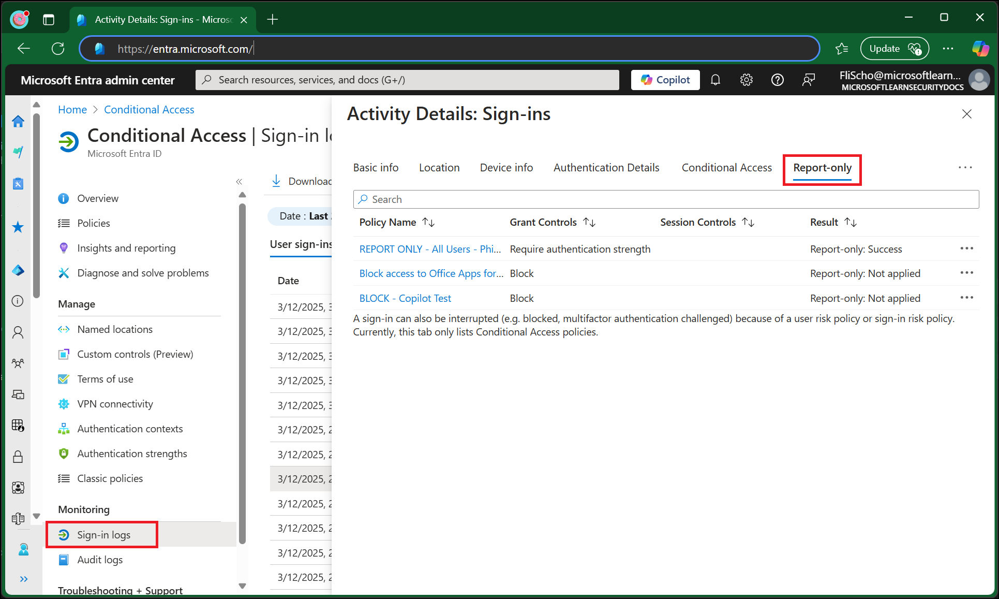

# Analyze Conditional Access Policy Impact

## Overview

Conditional Access helps organizations stay secure by applying the appropriate security access controls in the right circumstances. Understanding the impact of these policies is challenging, especially when deploying new policies. This article explains how to analyze the impact of Conditional Access policies using report-only mode and other tools.

Administrators have several options based on report-only mode. Report-only mode is a policy state that lets administrators test most Conditional Access policies before enabling them.

- Administrators can evaluate Conditional Access policies in report-only mode, except for items included in the "User Actions" scope.
- During sign-in, the system evaluates policies in report-only mode but doesn't enforce them.
- Results are logged in the **Conditional Access** and **Report-only** tabs of the Sign-in log details.
- Customers with an Azure Monitor subscription can monitor the impact of their Conditional Access policies using the Conditional Access insights workbook.

> [!WARNING]
> Policies in report-only mode that require a compliant device can prompt users on macOS, iOS, and Android devices to select a device certificate during policy evaluation, even though device compliance isn't enforced. These prompts can repeat until the device is compliant. To prevent end users from receiving prompts during sign-in, exclude the Mac, iOS, and Android device platforms from report-only policies that perform device compliance checks.

## Policy evaluation results

When a policy is evaluated for a given sign-in, there are several possible results:

| Result | Description |
| --- | --- |
| Report-only: Success | All configured policy conditions, required non-interactive grant controls, and session controls were satisfied. For example, a multifactor authentication requirement is satisfied by an MFA claim already present in the token, or a compliant device policy is satisfied by performing a device check on a compliant device. |
| Report-only: Failure | All configured policy conditions were satisfied but not all the required non-interactive grant controls or session controls were satisfied. For example, a policy applies to a user where a block control is configured, or a device fails a compliant device policy. |
| Report-only: User action required | All configured policy conditions were satisfied but user action would be required to satisfy the required grant controls or session controls. With report-only mode, the user isn't prompted to satisfy the required controls. For example, users aren't prompted for multifactor authentication challenges or terms of use.   |
| Report-only: Not applied | Not all configured policy conditions were satisfied. For example, the user is excluded from the policy or the policy only applies to certain trusted named locations. |
| Success | Sign-in events where the policy applied, the requirements were met, and the policy would allow the sign-in to proceed. The sign-in might still be blocked by a different policy. |
| Failure | Sign-in events where the policy applied, the requirements weren't met, and the policy would block the sign-in. This might be by design, like when sign-ins from a specific location are blocked, or accidental when the policy is misconfigured. |
| Not applied | Sign-in events where the policy wasn't applied, for example, the user was excluded. | 

## Reviewing results

Administrators can use several options to review the potential results of policies in their environment:

- Workbooks
- Sign-in logs
- Policy impact (preview)

### Policy impact

The policy impact view of Conditional Access lets admins with at least the Security Reader role see a snapshot of the potential or existing impacts of policies on interactive sign-ins in your organization. You can explore the impact over the past 24 hours, 7 days, or 1 month. You can also see and link to a sampling of sign-in events for more details.

:::image type="content" source="media/concept-conditional-access-report-only/policy-impact-example-report-only.png" alt-text="Screenshot of Conditional Access policy impact example." lightbox="media/concept-conditional-access-report-only/policy-impact-example-report-only.png":::

### Workbooks

Administrators can create multiple policies in report-only mode, so it's important to understand both the individual impact of each policy and the combined impact of multiple policies evaluated together. The [Conditional Access Insights and Reporting workbook](howto-conditional-access-insights-reporting.md) lets administrators visualize Conditional Access policies, query and monitor the impact of a policy for a specific time range, set of applications, and users. Administrators can customize workbooks to meet their needs.

### Sign-in logs

For deeper evaluation of Conditional Access policies and their application at a specific sign-in, administrators might investigate individual sign-in events. Each event includes details about which Conditional Access policies were enabled, in report-only mode, applied, or not applied. 

## Using these options

[!INCLUDE [conditional-access-report-only-mode](../../includes/conditional-access-report-only-mode.md)]

## Compare and validate policies before enforcement

Report-only mode is a valuable tool for validating policy changes progressively before you enforce them. Use the following practices to reduce the risk of unintended access disruptions:

- **Test new policies alongside enforced policies.** Create a new policy in report-only mode while your existing enforced policies remain active. This approach lets you observe what the new policy *would* do without affecting user access. Monitor the report-only results in sign-in logs to confirm the policy behaves as expected before you switch it to an enforced state.
- **Compare outcomes in the Insights workbook.** Use the [Conditional Access Insights and Reporting workbook](howto-conditional-access-insights-reporting.md) to view report-only and enforced policy results side by side for a specific time range, set of applications, and users. This comparison helps you identify where a new policy would change access decisions before those changes take effect.
- **Validate changes to existing policies.** Before you modify an enforced policy, create a copy in report-only mode with your proposed changes. Compare the report-only copy's results against the original enforced policy to verify the intended effect. When you're satisfied, update the enforced policy and remove the copy.
- **Use AI-assisted phased rollout.** The [Conditional Access Optimization Agent](../../security-copilot/conditional-access-agent-optimization.md) creates suggested policies in report-only mode. You can review the agent's analysis and projected impact before deciding to enforce. For more information, see [Phased rollout with the Conditional Access Optimization Agent](../../security-copilot/conditional-access-agent-optimization-phased-rollout.md).

> [!NOTE]
> Report-only mode evaluates policies but doesn't enforce grant controls or session controls. Users aren't prompted for multifactor authentication or blocked by report-only policies. Some limitations apply, such as policies that use the **User Actions** scope. For more information, see the [policy evaluation results](#policy-evaluation-results) in this article.

## Related content

- Learn how to [configure report-only mode on a Conditional Access policy](howto-conditional-access-insights-reporting.md).
