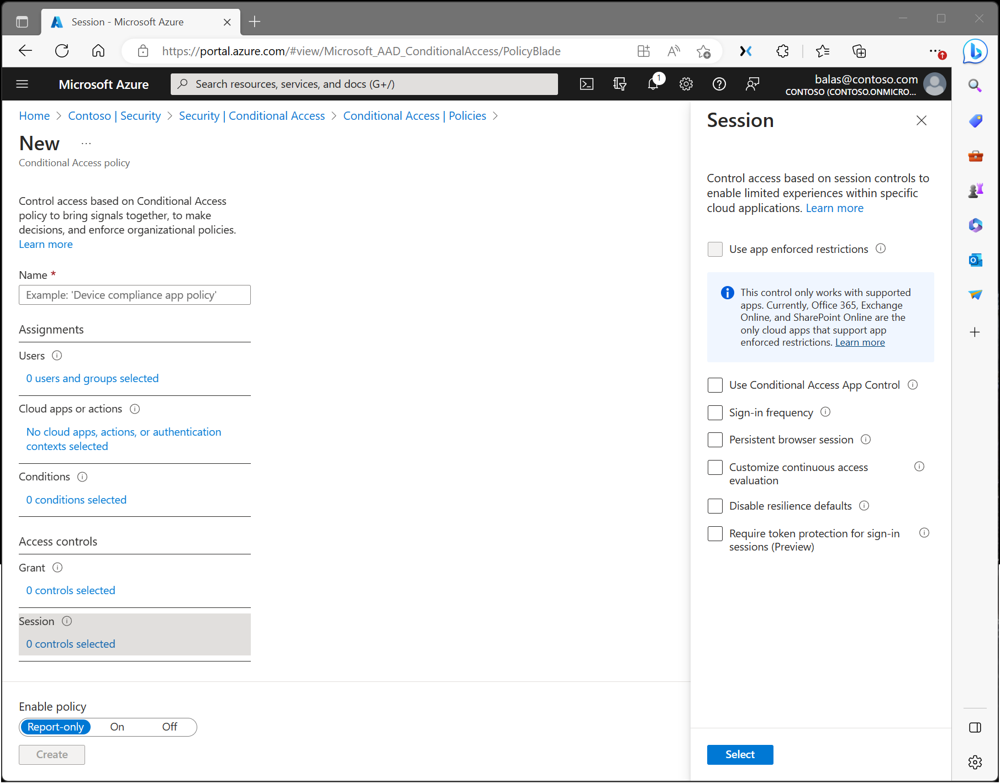

# Conditional Access: Session

Within a Conditional Access policy, an administrator can make use of session controls to enable limited experiences within specific cloud applications.

## Application enforced restrictions

Organizations can use this control to require Microsoft Entra ID to pass device information to the selected cloud apps. The device information allows cloud apps to know if a connection is from a compliant or domain-joined device and update the session experience. When selected, the cloud app uses the device information to provide users with a limited or full experience. Limited when the device isn't managed or compliant and full when the device is managed and compliant.

For a list of supported applications and how to configure policies, see the following articles: 

- [Idle session timeout for Microsoft 365](/microsoft-365/admin/manage/idle-session-timeout-web-apps#details-about-idle-session-timeout).
- [Enabling limited access with SharePoint Online](/sharepoint/control-access-from-unmanaged-devices)
- [Enabling limited access with Exchange Online](/microsoft-365/security/office-365-security/secure-email-recommended-policies#limit-access-to-exchange-online-from-outlook-on-the-web)

## Conditional Access application control

Conditional Access App Control uses a reverse proxy architecture and is uniquely integrated with Microsoft Entra Conditional Access. Microsoft Entra Conditional Access allows you to enforce access controls on your organization’s apps based on certain conditions. The conditions define what user or group of users, cloud apps, and locations and networks a Conditional Access policy applies to. After you determine the conditions, you can route users to where access and session controls apply.

### Microsoft Defender for Cloud Apps
[Microsoft Defender for Cloud Apps](/defender-cloud-apps/what-is-defender-for-cloud-apps) is where you can protect data with Conditional Access App Control by applying access and session controls.

Conditional Access App Control enables user app access and sessions to be monitored and controlled in real time based on access and session policies. Access and session policies are used within the Defender for Cloud Apps portal to refine filters and set actions to take. With the access and session policies, you can:

- Prevent data exfiltration: You can block the download, cut, copy, and print of sensitive documents on, for example, unmanaged devices.
- Protect on download: Instead of blocking the download of sensitive documents, you can require documents to be labeled and protected with Azure Information Protection. This action ensures the document is protected and user access is restricted in a potentially risky session.
- Prevent upload of unlabeled files: Before a sensitive file is uploaded, distributed, and used, it’s important to make sure that the file has the right label and protection. You can ensure that unlabeled files with sensitive content are blocked from being uploaded until the user classifies the content.
- Monitor user sessions for compliance (Preview): Risky users are monitored when they sign into apps and their actions are logged from within the session. You can investigate and analyze user behavior to understand where, and under what conditions, session policies should be applied in the future.
- Block access (Preview): You can granularly block access for specific apps and users depending on several risk factors. For example, you can block them if they're using client certificates as a form of device management.
- Block custom activities: Some apps have unique scenarios that carry risk, for example, sending messages with sensitive content in apps like Microsoft Teams or Slack. In these kinds of scenarios, you can scan messages for sensitive content and block them in real time.

For more information, see the article [Deploy Conditional Access App Control for featured apps](/defender-cloud-apps/proxy-deployment-aad).

### Microsoft Purview Data Loss Prevention
[Microsoft Purview Data Loss Prevention](/purview/dlp-browser-dlp-learn), is where you can [help prevent users from sharing sensitive info with Cloud Apps in Edge for Business](/purview/dlp-create-policy-prevent-cloud-sharing-from-edge-biz). Conditional Access session controls with the **Custom** setting selected are required for apps included in these policies.

For information on the capabilities available in Purview DLP to protect data sharing to cloud apps in the browser, please see [activities you can monitor and take action on in the browser for managed apps](/purview/dlp-browser-dlp-learn#activities-you-can-monitor-and-take-action-on)

## Sign-in frequency

Sign-in frequency defines the time period before a user is asked to sign in again when attempting to access a resource. Administrators can select a period of time (hours or days) or choose to require reauthentication every time.

Sign-in frequency setting works with apps that implement OAUTH2 or OIDC protocols according to the standards. Most Microsoft native apps for Windows, Mac, and Mobile including the following web applications follow the setting.

- Word, Excel, PowerPoint Online
- OneNote Online
- Office.com
- Microsoft 365 Admin portal
- Exchange Online
- SharePoint and OneDrive
- Teams web client
- Dynamics CRM Online
- Azure portal

For more information, see the article [Configure authentication session management with Conditional Access](concept-session-lifetime.md#user-sign-in-frequency).

## Persistent browser session

A persistent browser session allows users to remain signed in after closing and reopening their browser window.

For more information, see the article [Configure authentication session management with Conditional Access](concept-session-lifetime.md#persistence-of-browsing-sessions).

## Customize continuous access evaluation

[Continuous access evaluation](concept-continuous-access-evaluation.md) is auto enabled as part of an organization's Conditional Access policies. For organizations who wish to disable continuous access evaluation, this configuration is now an option within the session control within Conditional Access. Continuous access evaluation policies can be scoped to all users or specific users and groups. Admins can make the following selection while creating a new policy or while editing an existing Conditional Access policy.

- **Disable** only work when **All resources (formerly 'All cloud apps')** are selected, no conditions are selected, and **Disable** is selected under **Session** > **Customize continuous access evaluation** in a Conditional Access policy. You can choose to disable all users or specific users and groups.

:::image type="content" source="media/concept-conditional-access-session/continuous-access-evaluation-session-controls.png" alt-text="A screenshot showing CAE Settings in a new Conditional Access policy." lightbox="media/concept-conditional-access-session/continuous-access-evaluation-session-controls.png":::

## Disable resilience defaults

During an outage, Microsoft Entra ID extends access to existing sessions while enforcing Conditional Access policies.

If resilience defaults are disabled, access is denied once existing sessions expire. For more information, see the article [Conditional Access: Resilience defaults](resilience-defaults.md).

## Require token protection for sign-in sessions

Token protection (sometimes referred to as token binding in the industry) attempts to reduce attacks using token theft by ensuring a token is usable only from the intended device. When an attacker is able to steal a token, by hijacking or replay, they can impersonate their victim until the token expires or is revoked. Token theft is thought to be a relatively rare event, but the damage from it can be significant. For more information, see the article [Conditional Access: Token protection](concept-token-protection.md).

## Use Global Secure Access security profile

Using a security profile with Conditional Access unifies identity controls with network security in Microsoft's Security Service Edge (SSE) product, [Microsoft Entra Internet Access](../../global-secure-access/concept-internet-access.md#security-profiles). Selecting this Session control allows you to bring identity and context awareness to security profiles, which are groupings of various policies created and managed in Global Secure Access. 

## Related content

- [Conditional Access common policies](concept-conditional-access-policy-common.md)
- [Report-only mode](concept-conditional-access-report-only.md)
