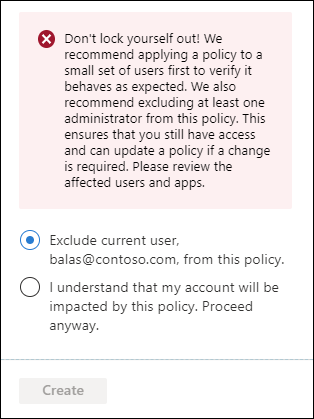

# Conditional Access: Users, groups, and workload identities

A Conditional Access policy includes a user, group, or workload identity assignment as one of the signals in the decision process. These identities can be included or excluded from Conditional Access policies. Microsoft Entra ID evaluates all policies and ensures all requirements are met before granting access. 

## Include users

This list typically includes all users an organization targets in a Conditional Access policy. 

The following options are available when creating a Conditional Access policy.

- None
   - No users are selected
- All users
   - All users in the directory, including B2B guests.
- Select users and groups
   - Guest or external users
      - This selection lets you target Conditional Access policies to specific guest or external user types and tenants containing those users. There are [several different types of guest or external users that can be selected](~/external-id/authentication-conditional-access.md#conditional-access-for-external-users), and multiple selections can be made:
         - B2B collaboration guest users
         - B2B collaboration member users
         - B2B direct connect users
         - Local guest users, for example any user belonging to the home tenant with the user type attribute set to guest
         - Service provider users, for example a Cloud Solution Provider (CSP)
         - Other external users, or users not represented by the other user type selections
      - One or more tenants can be specified for the selected user types, or you can specify all tenants. 
   - Directory roles
      - Lets admins select specific [built-in directory roles](../role-based-access-control/permissions-reference.md) to determine policy assignment. For example, organizations might create a more restrictive policy on users actively assigned a privileged role. Other role types aren't supported, including administrative unit-scoped roles and custom roles.
         - Conditional Access allows admins to select some [roles that are listed as deprecated](../role-based-access-control/permissions-reference.md#deprecated-roles). These roles still appear in the underlying API and we allow admins to apply policy to them.
   - Users and groups
      - Allows targeting of specific sets of users. For example, organizations can select a group that contains all members of the HR department when an HR app is selected as the cloud app. A group can be any type of user group in Microsoft Entra ID, including dynamic or assigned security and distribution groups. Policy is applied to nested users and groups.

> [!IMPORTANT]
> When selecting which users and groups are included in a Conditional Access Policy, there's a limit to the number of individual users that can be added directly to a Conditional Access policy. If many individual users need to be added to a Conditional Access policy, place them in a group and assign the group to the policy.
> 
> If users or groups belong to more than 2048 groups, their access might be blocked. This limit applies to both direct and nested group membership.

> [!WARNING]
> Conditional Access policies don't support users assigned a directory role [scoped to an administrative unit](../role-based-access-control/manage-roles-portal.md) or directory roles scoped directly to an object, like through [custom roles](../role-based-access-control/custom-create.md).

> [!NOTE]
> When targeting policies to B2B direct connect external users, these policies are applied to B2B collaboration users accessing Teams or SharePoint Online who are also eligible for B2B direct connect. The same applies for policies targeted to B2B collaboration external users, meaning users accessing Teams shared channels have B2B collaboration policies apply if they also have a guest user presence in the tenant.

## Exclude users

When organizations both include and exclude a user or group, the user or group is excluded from the policy. The exclude action overrides the include action in a policy. Exclusions are commonly used for emergency access accounts or break-glass accounts. More information about emergency access accounts and why they're important can be found in the following articles: 

* [Manage emergency access accounts in Microsoft Entra ID](~/identity/role-based-access-control/security-emergency-access.md)
* [Create a resilient access control management strategy with Microsoft Entra ID](~/identity/authentication/concept-resilient-controls.md)

The following options are available for exclusion when creating a Conditional Access policy.

- Guest or external users
    - This selection provides several choices that can be used to target Conditional Access policies to specific guest or external user types and specific tenants containing those types of users. There are [several different types of guest or external users that can be selected](~/external-id/authentication-conditional-access.md#conditional-access-for-external-users), and multiple selections can be made:
       - B2B collaboration guest users
       - B2B collaboration member users
       - B2B direct connect users
       - Local guest users, for example any user belonging to the home tenant with the user type attribute set to guest
       - Service provider users, for example a Cloud Solution Provider (CSP)
       - Other external users, or users not represented by the other user type selections
    - One or more tenants can be specified for the selected user types, or you can specify all tenants.
- Directory roles
   - Allows admins to select specific [Microsoft Entra directory roles](../role-based-access-control/permissions-reference.md) used to determine assignment.
- Users and groups
   - Allows targeting of specific sets of users. For example, organizations can select a group that contains all members of the HR department when an HR app is selected as the cloud app. A group can be any type of group in Microsoft Entra ID, including dynamic or assigned security and distribution groups. Policy is applied to nested users and groups.

### Preventing admin lockout

To prevent admin lockout, when creating a policy applied to **All users** and **All apps**, the following warning appears.

> Don't lock yourself out! We recommend applying a policy to a small set of users first to verify it behaves as expected. We also recommend excluding at least one admin from this policy. This ensures that you still have access and can update a policy if a change is required. Please review the affected users and apps.

By default, the policy provides an option to exclude the current user, but an admin can override it as shown in the following image. 

If you find yourself locked out, see [What to do if you're locked out?](troubleshoot-conditional-access.md#what-to-do-if-youre-locked-out).

### External partner access

Conditional Access policies that target external users might interfere with service provider access, such as granular delegated admin privileges. Learn more in [Introduction to granular delegated admin privileges (GDAP)](/partner-center/gdap-introduction). For policies that are intended to target service provider tenants, use the **Service provider user** external user type available in the **Guest or external users** selection options.

## Workload identities 

A workload identity is an identity that allows an application or service principal access to resources, sometimes in the context of a user. Conditional Access policies can be applied to single tenant service principals registered in your tenant. Non-Microsoft SaaS and multi-tenanted apps are out of scope. Managed identities aren't covered by policy.

Organizations can target specific workload identities to be included or excluded from policy.

For more information, see the article [Conditional Access for workload identities](workload-identity.md).

## Next steps

- [Conditional Access: Cloud apps or actions](concept-conditional-access-cloud-apps.md)
- [Conditional Access common policies](concept-conditional-access-policy-common.md)
