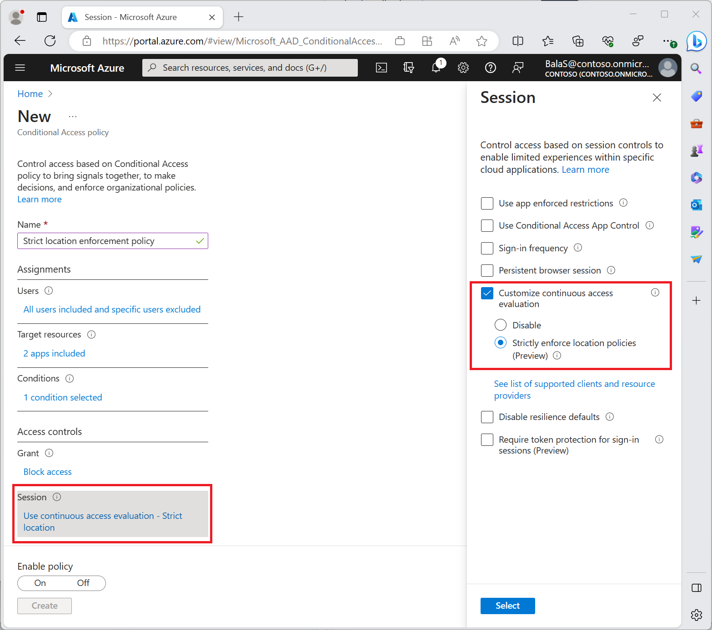
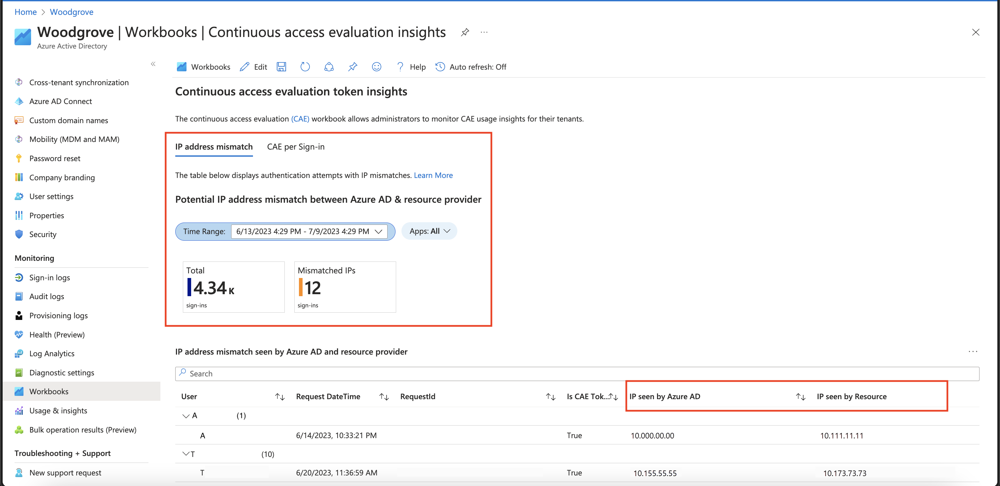
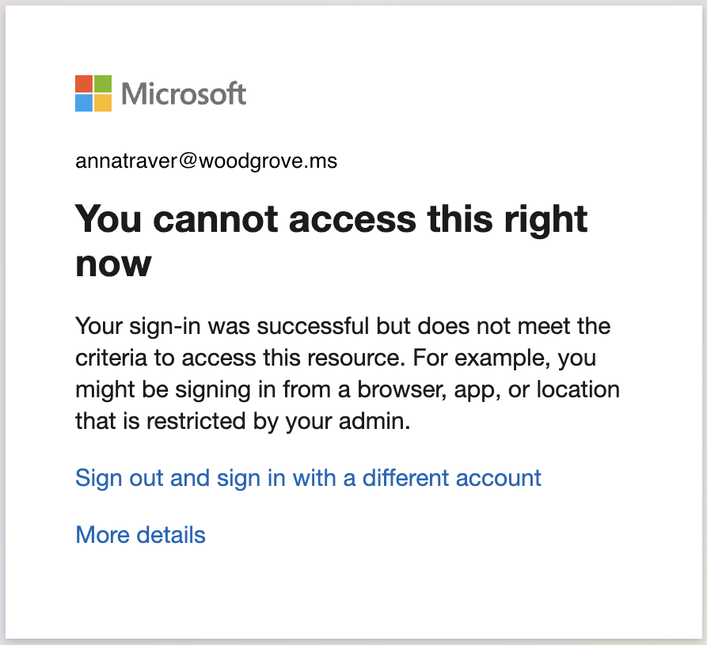
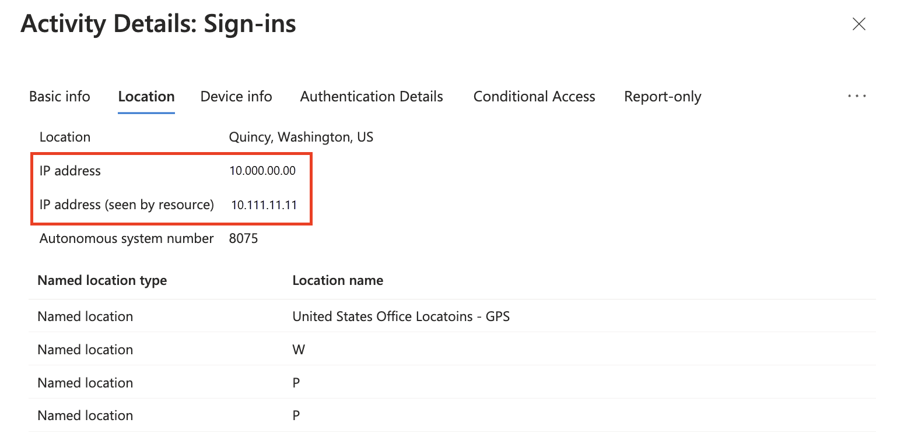
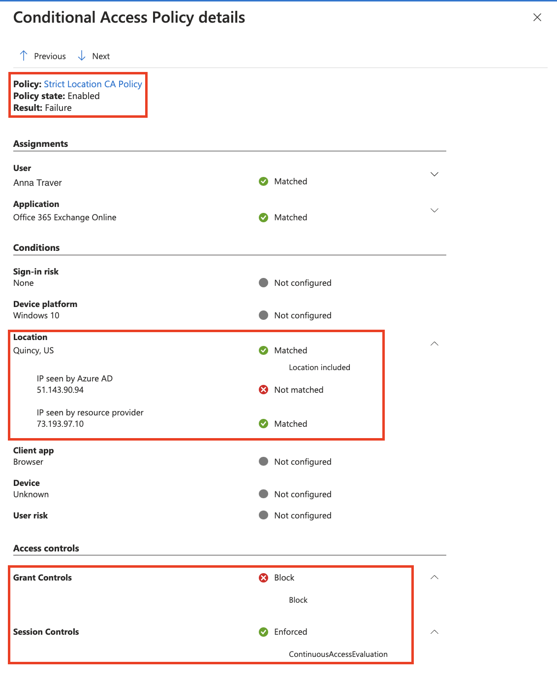
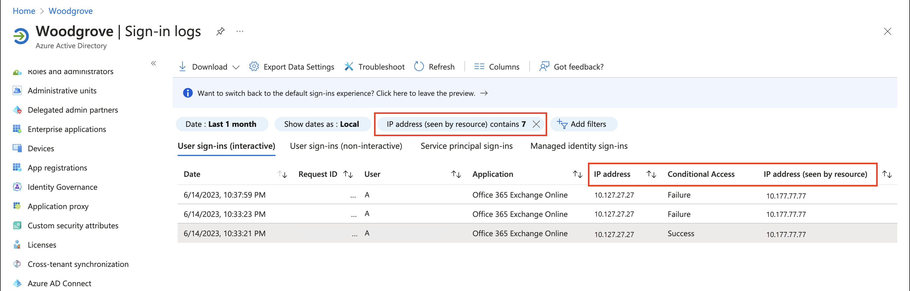
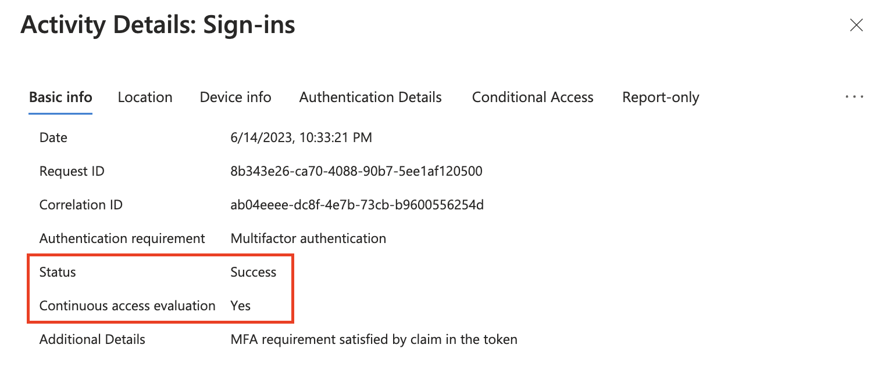
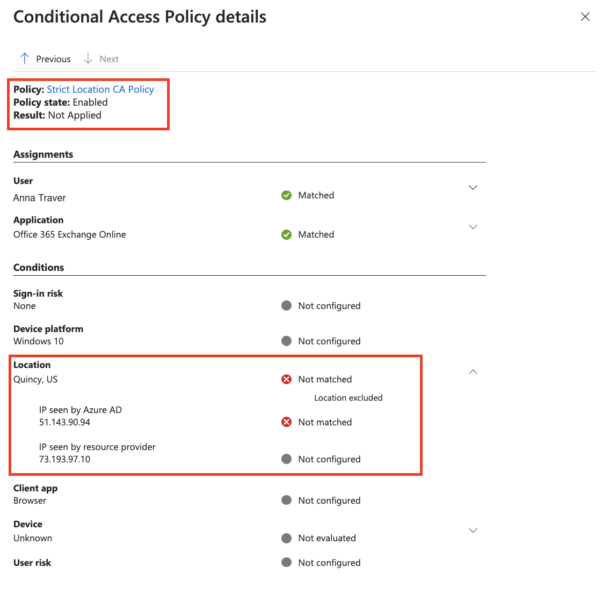
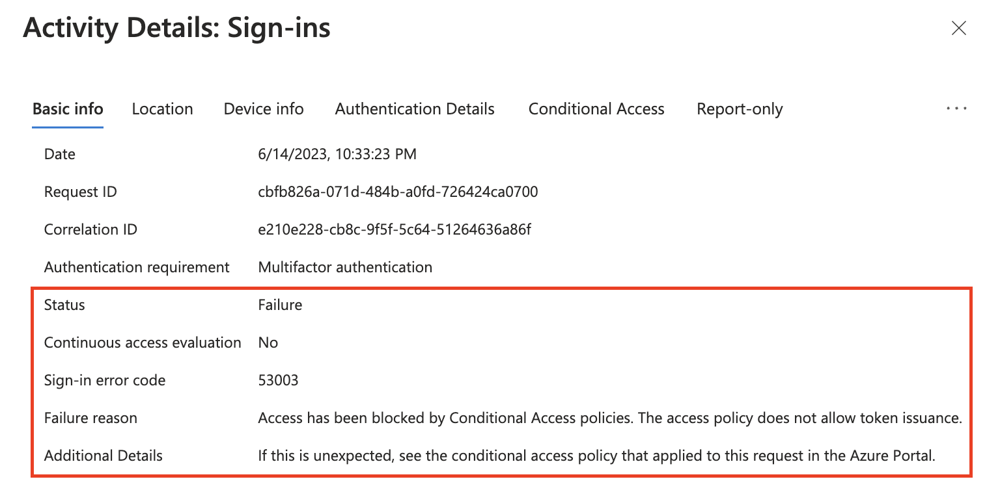

# Strictly enforce location policies using continuous access evaluation (preview)

Strictly enforce location policies is a new enforcement mode for continuous access evaluation (CAE), used in Conditional Access policies. This new mode provides protection for resources, immediately stopping access if the IP address detected by the resource provider isn't allowed by Conditional Access policy. This option is the highest security modality of CAE location enforcement, and requires that administrators understand the routing of authentication and access requests in their network environment. See our [Introduction to continuous access evaluation](concept-continuous-access-evaluation.md) for a review of how CAE-capable clients and resource providers, like the Outlook email client and Exchange Online evaluate location changes.  

| Location enforcement mode | Recommended network topology | If the IP address detected by the Resource isn't in the allowed list | Benefits | Configuration |
| --- | --- | --- | --- | --- |
| Standard (Default) | Suitable for all topologies | A short-lived token is issued only if Microsoft Entra ID detects an allowed IP address. Otherwise, access is blocked | Falls back to the pre-CAE location detection mode in split tunnel network deployments where CAE enforcement would affect productivity. CAE still enforces other events and policies. | None (Default Setting) |
| Strictly enforced location policies | Egress IP addresses are dedicated and enumerable for both Microsoft Entra ID and all resource provider traffic | Access blocked | Most secure, but requires well understood network paths | 1. Test IP address assumptions with a small population    2. Enable "Strictly enforce" under Session controls |

## Configure strictly enforced location policies

### Step 1 - Configure a Conditional Access location based policy for your target users

Before administrators create a Conditional Access policy requiring strict location enforcement, they must be comfortable using policies like the one described in [Conditional Access location based policies](howto-conditional-access-policy-location.yml). Policies like this one should be tested with a subset of users before proceeding to the next step. Administrators can avoid discrepancies between the allowed and actual IP addresses seen by Microsoft Entra ID during authentication, by testing before enabling strict enforcement.

### Step 2 - Test policy on a small subset of users

After enabling policies requiring strict location enforcement on a subset of test users, validate your testing experience using the filter **IP address (seen by resource)** in the Microsoft Entra sign-in logs. This validation allows administrators to find scenarios where strict location enforcement might block users with an unallowed IP seen by the CAE-enabled resource provider.

Before administrators turn on Conditional Access policies requiring strict location enforcement, they should:

- Ensure all authentication traffic towards Microsoft Entra ID and access traffic to resource providers are from dedicated egress IPs that are known. 
   - Like Exchange Online, Teams, SharePoint Online, and Microsoft Graph
- Ensure that all IP addresses from which their users can access Microsoft Entra ID and resource providers are included in their [IP-based named locations](concept-assignment-network.md#ipv4-and-ipv6-address-ranges).
- Ensure that they aren't sending traffic to non-Microsoft 365 applications through Global Secure Access.
   - [Source IP restoration](../../global-secure-access/how-to-source-ip-restoration.md) isn't supported for these non-Microsoft 365 applications. Enabling strict location enforcement with Global Secure Access blocks access even if the user is in a trusted IP location. 
- Review their Conditional Access policies to ensure that they don't have any policies that don't support CAE. For more information, see [CAE-supported CA policies](/entra/identity/conditional-access/concept-continuous-access-evaluation#supported-location-policies).

If administrators don't perform this validation, their users might be negatively impacted. If traffic to Microsoft Entra ID or a CAE supported resource is through a shared or undefinable egress IP, don't enable strict location enforcement in your Conditional Access policies.

### Step 3 - Use the CAE Workbook to Identify IP addresses that should be added to your named locations 

If you haven't already, create a new Azure Workbook using the public template "Continuous Access Evaluation Insights" to identify IP mismatch between IP address seen by Microsoft Entra ID and **IP address (seen by resource)**. In this case, you might have a split-tunnel network configuration. To ensure your users aren't accidentally locked out when strict location enforcement is enabled, administrators should: 

- Investigate and identify any IP addresses identified in the CAE Workbook.
- Add public IP addresses associated with known organizational egress points to their defined [named locations](concept-assignment-network.md#ipv4-and-ipv6-address-ranges).

     
  
  The following screenshot shows an example of a client’s access to a resource being blocked. This block is due to policies requiring CAE strict location enforcement being triggered revoking the client’s session. 

     
  
  This behavior can be verified in the sign-in logs. Look for **IP address (seen by resource)** and investigate adding this IP to [named locations](concept-assignment-network.md#ipv4-and-ipv6-address-ranges) if experiencing unexpected blocks from Conditional Access on users.

     
  
  Looking at the **Conditional Access Policy details** tab provides more details of blocked sign-in events. 

     
  
### Step 4 - Continue deployment

Repeat steps 2 and 3 with expanding groups of users until Strictly Enforce Location Policies are applied across your target user base. Roll out carefully to avoid impacting user experience. 

## Troubleshooting with Sign-in logs

Administrators can investigate the Sign-in logs to find cases with **IP address (seen by resource)**.

1. Sign in to the [Microsoft Entra admin center](https://entra.microsoft.com) as at least a [Reports Reader](~/identity/role-based-access-control/permissions-reference.md#reports-reader).
1. Browse to **Identity** > **Monitoring & health** > **Sign-in logs**.
1. Find events to review by adding filters and columns to filter out unnecessary information.
   1. Add the **IP address (seen by resource)** column and filter out any blank items to narrow the scope. The **IP address (seen by resource)** is blank when that IP seen by Microsoft Entra ID matches the IP address seen by the resource.
   
      
      
      **IP address (seen by resource)** contains filter isn't empty in the following examples: 

### Initial authentication

1. Authentication succeeds using a CAE token. 

   
   
1. The **IP address (seen by resource)** is different from the IP address seen by Microsoft Entra ID. Although the IP address seen by the resource is known, there's no enforcement until the resource redirects the user for reevaluation of the IP address seen by the resource.

   
   
1. Microsoft Entra authentication is successful because strict location enforcement isn't applied at the resource level.

   
   
### Resource redirect for reevaluation

1. Authentication fails and a CAE token isn't issued.  

   
   
1. **IP address (seen by resource)** is different from the IP seen by Microsoft Entra ID. 

   
   
1. Authentication isn't successful because **IP address (seen by resource)** isn't a known [named location](concept-assignment-network.md#ipv4-and-ipv6-address-ranges) in Conditional Access. 

   
   
## Related content

- [Continuous access evaluation in Microsoft Entra ID](concept-continuous-access-evaluation.md)
- [Claims challenges, claims requests, and client capabilities](~/identity-platform/claims-challenge.md)
- [How to use continuous access evaluation enabled APIs in your applications](~/identity-platform/app-resilience-continuous-access-evaluation.md)
- [Monitor and troubleshoot sign-ins with continuous access evaluation](howto-continuous-access-evaluation-troubleshoot.md#potential-ip-address-mismatch-between-azure-ad-and-resource-provider)
