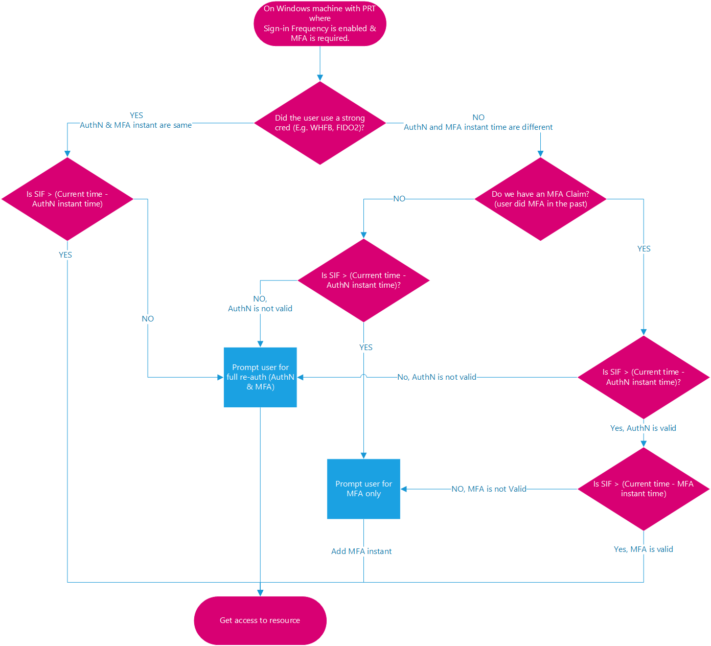

# Conditional Access adaptive session lifetime

In complex deployments, organizations might have a need to restrict authentication sessions. Some scenarios might include:

* Resource access from an unmanaged or shared device
* Access to sensitive information from an external network
* High impact users
* Critical business applications

Conditional Access provides adaptive session lifetime policy controls allowing you to create policies targeting specific use cases within your organization without affecting all users.

Before diving into details on how to configure the policy, let’s examine the default configuration.

## User sign-in frequency

Sign-in frequency defines the time period before a user is asked to sign in again when attempting to access a resource.

The Microsoft Entra ID default configuration for user sign-in frequency is a rolling window of 90 days. Asking users for credentials often seems like a sensible thing to do, but it can backfire: users that are trained to enter their credentials without thinking can unintentionally supply them to a malicious credential prompt.

It might sound alarming to not ask for a user to sign back in, in reality any violation of IT policies will revoke the session. Some examples include (but aren't limited to) a password change, an incompliant device, or account disable. You can also explicitly [revoke users’ sessions using Microsoft Graph PowerShell](/powershell/module/microsoft.graph.users.actions/revoke-mgusersigninsession). The Microsoft Entra ID default configuration comes down to “don’t ask users to provide their credentials if security posture of their sessions didn't change.”

The sign-in frequency setting works with apps that implement OAuth2 or OIDC protocols according to the standards. Most Microsoft native apps for Windows, Mac, and Mobile including the following web applications comply with the setting.

* Word, Excel, PowerPoint Online
* OneNote Online
* Office.com
* Microsoft 365 Admin portal
* Exchange Online
* SharePoint and OneDrive
* Teams web client
* Dynamics CRM Online
* Azure portal

Sign-in frequency (SIF) works with third-party SAML applications and apps that implement OAuth2 or OIDC protocols, as long as they don't drop their own cookies and are redirected back to Microsoft Entra ID for authentication on regular basis.

### User sign-in frequency and multifactor authentication

Sign-in frequency previously applied to only to the first factor authentication on devices that were Microsoft Entra joined, Microsoft Entra hybrid joined, and Microsoft Entra registered. There was no easy way for our customers to re-enforce multifactor authentication on those devices. Based on customer feedback, sign-in frequency applies for MFA as well.

### User sign-in frequency and device identities

On Microsoft Entra joined and Microsoft Entra hybrid joined devices, unlocking the device, or signing in interactively refreshes the Primary Refresh Token (PRT) every 4 hours. The last refresh timestamp recorded for the PRT compared with the current timestamp must be within the time allotted in SIF policy for the PRT to satisfy SIF and grant access to a PRT that has an existing MFA claim. On [Microsoft Entra registered devices](~/identity/devices/concept-device-registration.md), unlock/sign-in wouldn't satisfy the SIF policy because the user isn't accessing a Microsoft Entra registered device via a Microsoft Entra account. However, the [Microsoft Entra WAM](~/identity-platform/scenario-desktop-acquire-token-wam.md) plugin can refresh a PRT during native application authentication using WAM.

> [!NOTE]
> The timestamp captured from user log-in isn't necessarily the same as the last recorded timestamp of PRT refresh because of the 4-hour refresh cycle. The case when it's the same is when the PRT expired and a user log-in refreshes it for 4 hours. In the following examples, assume SIF policy is set to 1 hour and the PRT is refreshed at 00:00.

#### Example 1: When you continue to work on the same doc in SPO for an hour

* At 00:00, a user signs in to their Windows 11 Microsoft Entra joined device and starts work on a document stored on SharePoint Online.
* The user continues working on the same document on their device for an hour.
* At 01:00, the user is prompted to sign in again. This prompt is based on the sign-in frequency requirement in the Conditional Access policy configured by their administrator.

#### Example 2: When you pause work with a background task running in the browser, then interact again after the SIF policy time elapsed

* At 00:00, a user signs in to their Windows 11 Microsoft Entra joined device and starts to upload a document to SharePoint Online.
* At 00:10, the user gets up and takes a break locking their device. The background upload continues to SharePoint Online.
* At 02:45, the user returns from their break and unlocks the device. The background upload shows completion.
* At 02:45, the user is prompted to sign in when they interact again. This prompt is based on the sign-in frequency requirement in the Conditional Access policy configured by their administrator since the last sign-in happened at 00:00.

If the client app (under activity details) is a browser, we defer sign in frequency enforcement of events/policies on background services until the next user interaction. On confidential clients, sign-in frequency enforcement on non-interactive sign-ins is deferred until the next interactive sign-in.

#### Example 3: With four hour refresh cycle of primary refresh token from unlock

Scenario 1 - User returns within cycle

* At 00:00, a user signs into their Windows 11 Microsoft Entra joined device and starts work on a document stored on SharePoint Online.
* At 00:30, the user gets up and takes a break locking their device.
* At 00:45, the user returns from their break and unlocks the device.
* At 01:00, the user is prompted to sign in again. This prompt is based on the sign-in frequency requirement in the Conditional Access policy configured by their administrator, 1 hour after the initial sign-in.

Scenario 2 - User returns outside cycle

* At 00:00, a user signs into their Windows 11 Microsoft Entra joined device and starts work on a document stored on SharePoint Online.
* At 00:30, the user gets up and takes a break locking their device.
* At 04:45, the user returns from their break and unlocks the device.
* At 05:45, the user is prompted to sign in again. This prompt is based on the sign-in frequency requirement in the Conditional Access policy configured by their administrator. It's now 1 hour after the PRT was refreshed at 04:45, and over 4 hours since the initial sign-in at 00:00.

### Require reauthentication every time

There are scenarios where customers might want to require a fresh authentication, every time a user performs specific actions like:

* Accessing sensitive applications.
* Securing resources behind VPN or Network as a Service (NaaS) providers.
* Securing privileged role elevation in PIM​.
* Protecting user sign-ins to Azure Virtual Desktop machines.
* Protecting risky users and risky sign-ins​ identified by Microsoft Entra ID Protection.
* Securing sensitive user actions like Microsoft Intune enrollment.

Sign-in frequency set to **every time** works best when the resource has the logic of when a client should get a new token. These resources redirect the user back to Microsoft Entra-only once the session expires.

Administrators should limit the number of applications they enforce a policy requiring users to reauthenticate every time with. We factor for five minutes of clock skew when every time is selected in policy, so that we don’t prompt users more often than once every five minutes. Triggering reauthentication too frequently can increase security friction to a point that it causes users to experience MFA fatigue and open the door to phishing attempts. Web applications usually provide a less disruptive experience than their desktop counterparts when require reauthentication every time is enabled.

* For applications in the Microsoft 365 stack, we recommend using [time-based user sign-in frequency](#user-sign-in-frequency) for a better user experience.
* For the Azure portal and the Microsoft Entra admin center, we recommend either using [time-bassed user sign-in frequency](#user-sign-in-frequency) or to [require reauthentication on PIM activation](../../id-governance/privileged-identity-management/pim-how-to-change-default-settings.md#on-activation-require-microsoft-entra-conditional-access-authentication-context) using authentication context for a better user experience.

Generally available supported scenarios:

* Require user reauthentication during [Intune device enrollment](/mem/intune/fundamentals/deployment-guide-enrollment), regardless of their current MFA status.
* Require user reauthentication for risky users with the [require password change](concept-conditional-access-grant.md#require-password-change) grant control.
* Require user reauthentication for risky sign-ins with the [require multifactor authentication](concept-conditional-access-grant.md#require-multifactor-authentication) grant control.

The [February 2024 public preview capabilities](https://techcommunity.microsoft.com/t5/microsoft-entra-blog/prompt-users-for-reauthentication-on-sensitive-apps-and-high/ba-p/4062703) allow administrators to require authentication with:

* [SAML](../../architecture/auth-saml.md) or [OIDC](../../architecture/auth-oidc.md) enabled applications
* [Authentication context](concept-conditional-access-cloud-apps.md#authentication-context)
* Other [user actions](concept-conditional-access-cloud-apps.md#user-actions)

When administrators select **Every time**, it requires full reauthentication when the session is evaluated.

## Persistence of browsing sessions

A persistent browser session allows users to remain signed in after closing and reopening their browser window.

The Microsoft Entra ID default for browser session persistence allows users on personal devices to choose whether to persist the session by showing a “Stay signed in?” prompt after successful authentication. If browser persistence is configured in AD FS using the guidance in the article [AD FS single sign-on settings](/windows-server/identity/ad-fs/operations/ad-fs-single-sign-on-settings#enable-psso-for-office-365-users-to-access-sharepoint-online), we comply with that policy and persist the Microsoft Entra session as well. You can also configure whether users in your tenant see the “Stay signed in?” prompt by changing the appropriate setting in the [company branding pane](~/fundamentals/how-to-customize-branding.md).

In persistent browsers, cookies stay stored in the user’s device even after a user closes the browser. These cookies could have access to Microsoft Entra artifacts, and those artifacts are useable until token expiration regardless of the Conditional Access policies placed on the resource environment. So, token caching can be in direct violation of desired security policies for authentication. While it might seem convenient to store tokens beyond the current session, doing so can create a security vulnerability by allowing unauthorized access to Microsoft Entra artifacts.

## Configuring authentication session controls

Conditional Access is a Microsoft Entra ID P1 or P2 capability and requires a premium license. If you would like to learn more about Conditional Access, see [What is Conditional Access in Microsoft Entra ID?](overview.md#license-requirements)

> [!WARNING]
> If you are using the [configurable token lifetime](~/identity-platform/configurable-token-lifetimes.md) feature currently in public preview, please note that we don’t support creating two different policies for the same user or app combination: one with this feature and another one with configurable token lifetime feature. Microsoft retired the configurable token lifetime feature for refresh and session token lifetimes on January 30, 2021 and replaced it with the Conditional Access authentication session management feature.  
>
> Before enabling Sign-in Frequency, make sure other reauthentication settings are disabled in your tenant. If "Remember MFA on trusted devices" is enabled, be sure to disable it before using Sign-in frequency, as using these two settings together may lead to prompting users unexpectedly. To learn more about reauthentication prompts and session lifetime, see the article, [Optimize reauthentication prompts and understand session lifetime for Microsoft Entra multifactor authentication](~/identity/authentication/concepts-azure-multi-factor-authentication-prompts-session-lifetime.md).

## Next steps

* [Configure session lifetimes in Conditional Access policies](howto-conditional-access-session-lifetime.md)
* If you're ready to configure Conditional Access policies for your environment, see the article [Plan a Conditional Access deployment](plan-conditional-access.md).
