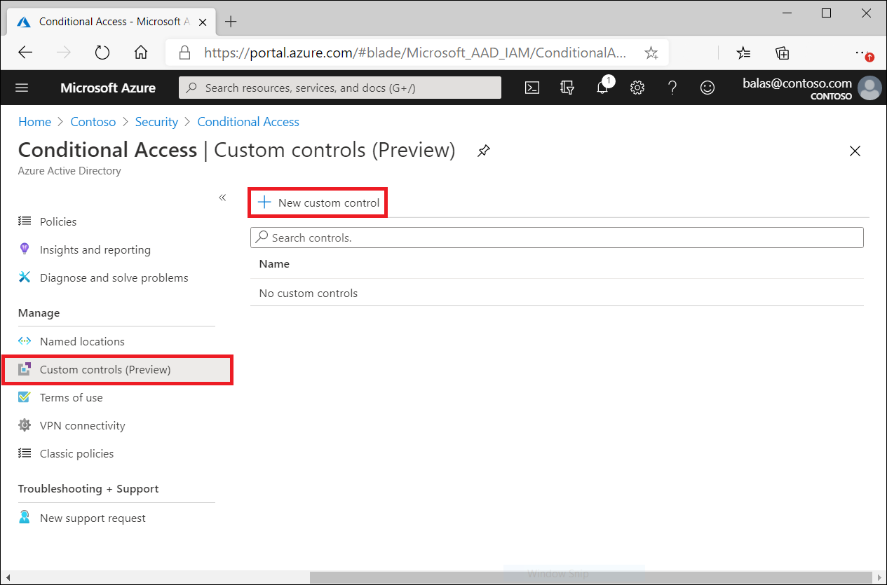
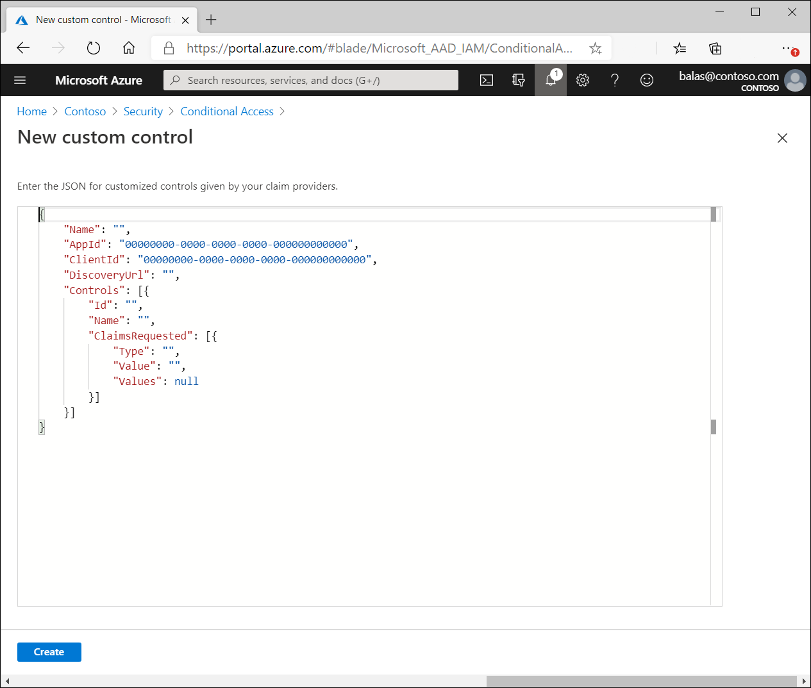

# Custom controls (preview)

Custom controls are a preview capability of the Microsoft Entra ID. When using custom controls, your users are redirected to a compatible service to satisfy authentication requirements outside of Microsoft Entra ID. To satisfy this control, a user's browser is redirected to the external service, performs any required authentication, and is then redirected back to Microsoft Entra ID. Microsoft Entra ID verifies the response and, if the user was successfully authenticated or validated, the user continues in the Conditional Access flow.

> [!NOTE]
> As Nitika Gupta mentioned in her blog post [Public preview: External authentication methods in Microsoft Entra ID](https://techcommunity.microsoft.com/t5/microsoft-entra-blog/public-preview-external-authentication-methods-in-microsoft/ba-p/4078808):
>
> ...External authentication methods are the replacement of custom controls, and they provide several benefits over the custom controls approach. These include: 
> 
> 1. External authentication method integration, which uses industry standards and supports an open model 
> 1. External authentication methods are managed the same way as Entra methods 
> 1. External authentication methods are supported for a wide range of Entra ID use cases (including PIM activation)

For more information, see the article [Manage an external authentication method in Microsoft Entra ID (Preview)](../authentication/how-to-authentication-external-method-manage.md).

## Creating custom controls

> [!CAUTION]
> Custom controls **can't** be used with: 
> 
> - Microsoft Entra ID Protection's automation requiring multifactor authentication
> - Microsoft Entra self-service password reset (SSPR)
> - Satisfying multifactor authentication claim requirements
> - Sign-in frequency controls
> - Privileged Identity Manager (PIM)
> - Intune device enrollment
> - Cross-tenant trusts
> - Joining devices to Microsoft Entra ID.

Custom Controls works with a limited set of approved authentication providers. To create a custom control, you should first contact the provider that you wish to utilize. Each non-Microsoft provider has its own process and requirements to sign up, subscribe, or otherwise become a part of the service, and to indicate that you wish to integrate with Conditional Access. At that point, the provider gives you a block of data in JSON format. This data allows the provider and Conditional Access to work together for your tenant, creates the new control and defines how Conditional Access can tell if your users have successfully performed verification with the provider.

Copy the JSON data and then paste it into the related textbox. Don't make any changes to the JSON unless you explicitly understand the change you're making. Making any change could break the connection between the provider and Microsoft and potentially lock you and your users out of your accounts.

The option to create a custom control is in the **Manage** section of the **Conditional Access** page.

Clicking **New custom control** opens a blade with a textbox for the JSON data of your control.  

## Deleting custom controls

To delete a custom control, you must first ensure that it isn't being used in any Conditional Access policy. Once complete:

1. Go to the Custom controls list
1. Select …  
1. Select **Delete**.

## Editing custom controls

To edit a custom control, you must delete the current control and create a new control with the updated information.

## Known limitations

Custom controls can't be used with Microsoft Entra ID Protection's automation requiring Microsoft Entra multifactor authentication, Microsoft Entra self-service password reset (SSPR), satisfying multifactor authentication claim requirements, with sign-in frequency controls, to elevate roles in Privileged Identity Manager (PIM), as part of Intune device enrollment, for cross-tenant trusts, or when joining devices to Microsoft Entra ID.

## Related content

- [Upcoming changes to Custom Controls](https://techcommunity.microsoft.com/t5/microsoft-entra-azure-ad-blog/upcoming-changes-to-custom-controls/ba-p/1144696)
