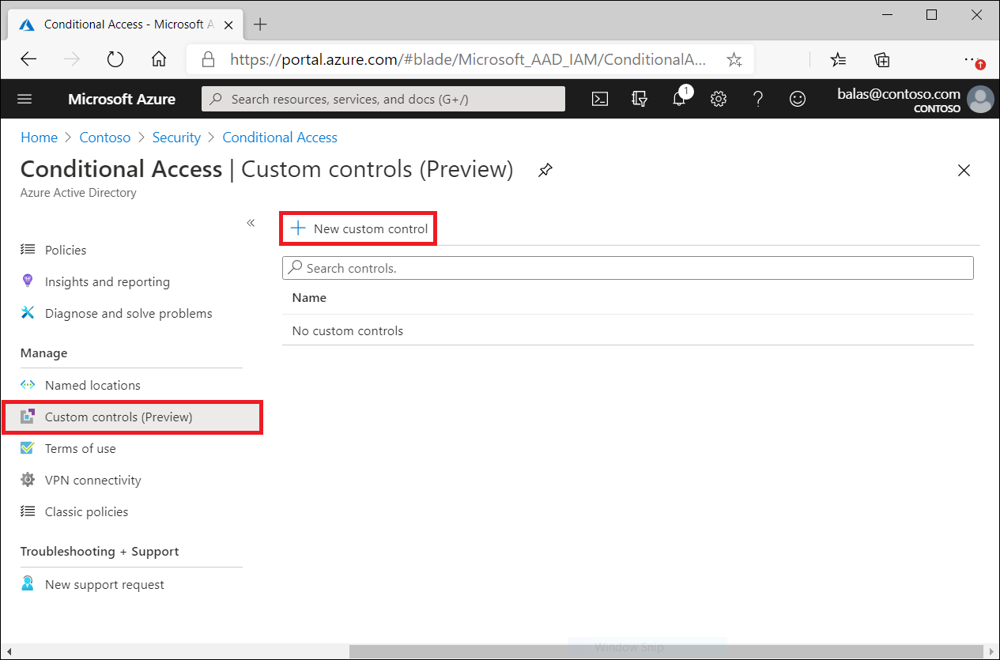
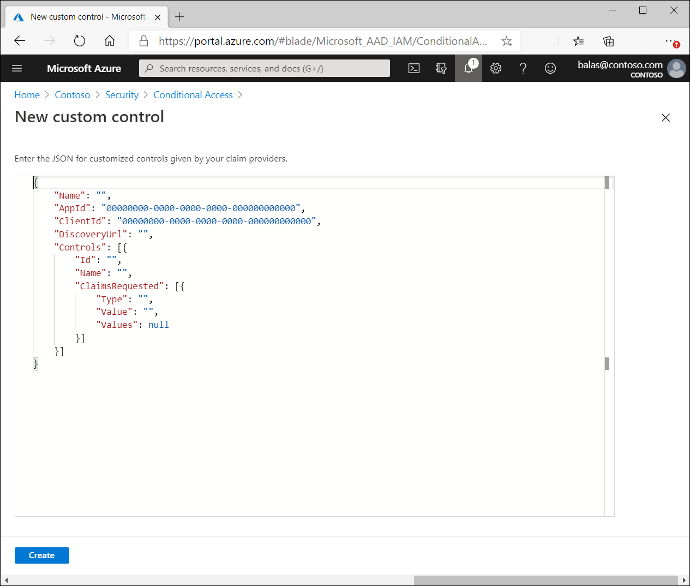

# Custom controls (preview)

## Overview

Custom controls are a preview capability of Microsoft Entra ID. When you use custom controls, users are redirected to a compatible service to meet authentication requirements outside of Microsoft Entra ID. To meet this control, a user's browser redirects to the external service, performs any required authentication, and then redirects back to Microsoft Entra ID. Microsoft Entra ID verifies the response and, if the user is successfully authenticated or validated, the user continues in the Conditional Access flow.

> [!IMPORTANT]
> Custom controls are deprecated and will be retired on September 30, 2026. External MFA (previously known as external authentication methods) is the replacement for custom controls and is now generally available. External MFA provides several benefits over the custom controls approach. Existing custom controls will continue to function until retirement, but new implementations should use external MFA. Start planning your migration now.

For more information, see [Manage external MFA in Microsoft Entra ID](../authentication/how-to-authentication-external-method-manage.md).

## Creating custom controls

> [!CAUTION]
> Custom controls **can't** be used with: 
> 
> - Microsoft Entra ID Protection's automation requiring multifactor authentication
> - Microsoft Entra self-service password reset (SSPR)
> - Satisfying multifactor authentication claim requirements
> - Sign-in frequency controls
> - Privileged Identity Manager (PIM)
> - Intune device enrollment
> - Cross-tenant trusts
> - Joining devices to Microsoft Entra ID.

Custom controls work with a limited set of approved authentication providers. To create a custom control, first contact the provider you want to use. Each non-Microsoft provider has its own process and requirements to sign up, subscribe, or join the service, and to indicate that you want to integrate with Conditional Access. At that point, the provider gives you a block of data in JSON format. This data allows the provider and Conditional Access to work together for your tenant, creates the new control and defines how Conditional Access can tell if your users have successfully performed verification with the provider.

Copy the JSON data and paste it into the related textbox. Don't change the JSON unless you fully understand the change you're making. Changing the JSON might break the connection between the provider and Microsoft, potentially locking you and your users out of your accounts.

The option to create a custom control is located in the **Manage** section of the **Conditional Access** page.

Selecting **New custom control** opens a blade with a textbox for the JSON data of your control.  

## Deleting custom controls

To delete a custom control, ensure that it isn't being used in any Conditional Access policy. After that:

1. Go to the Custom controls list.
1. Select … .
1. Select **Delete**.

## Editing custom controls

To edit a custom control, delete the current control and create a new one with the updated information.

## Known limitations

Custom controls can't be used with Microsoft Entra ID Protection's automation requiring Microsoft Entra multifactor authentication, Microsoft Entra self-service password reset (SSPR), satisfying multifactor authentication claim requirements, with sign-in frequency controls, to elevate roles in Privileged Identity Manager (PIM), as part of Intune device enrollment, for cross-tenant trusts, or when joining devices to Microsoft Entra ID.

## Related content

- [External MFA in Microsoft Entra ID is now generally available](https://techcommunity.microsoft.com/blog/microsoft-entra-blog/external-mfa-in-microsoft-entra-id-is-now-generally-available/4488926)
- [Manage external MFA in Microsoft Entra ID](../authentication/how-to-authentication-external-method-manage.md)
- [Upcoming changes to Custom Controls](https://techcommunity.microsoft.com/t5/microsoft-entra-azure-ad-blog/upcoming-changes-to-custom-controls/ba-p/1144696)
