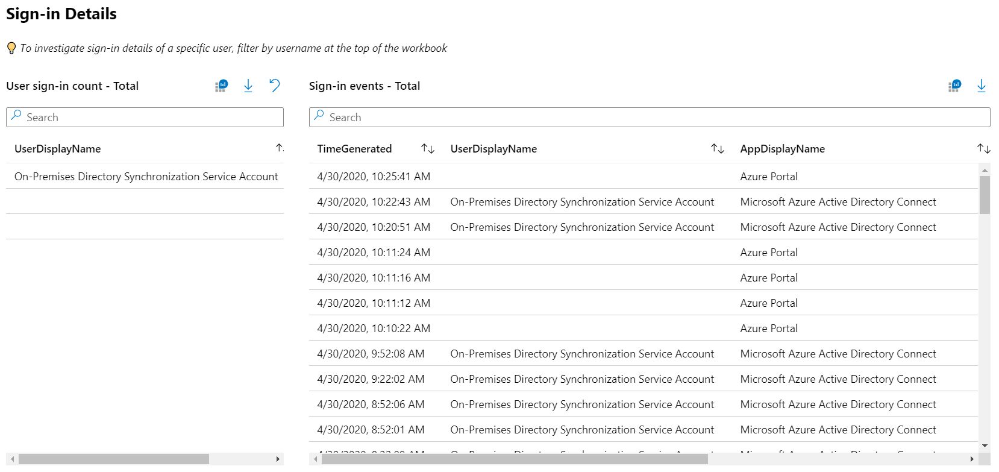
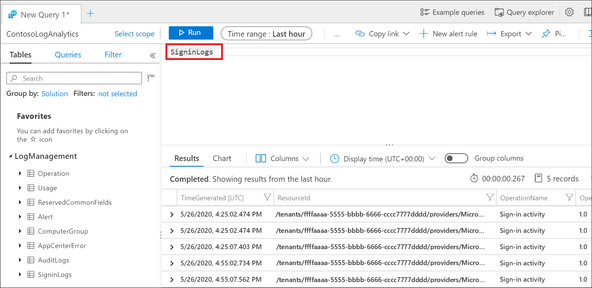

# Conditional Access insights and reporting

The Conditional Access insights and reporting workbook enables you to understand the impact of Conditional Access policies in your organization over time. During sign-in, one or more Conditional Access policies might apply, granting access if certain grant controls are satisfied or denying access otherwise. Because multiple Conditional Access policies might be evaluated during each sign-in, the insights and reporting workbook lets you examine the impact of an individual policy or a subset of all policies.  

## Prerequisites

To enable the insights and reporting workbook, your tenant must have:

- A Log Analytics workspace to retain sign-in logs data. 
- Microsoft Entra ID P1 licenses to use Conditional Access.

Users must have at least the Security Reader role assigned and Log Analytics workspace Contributor roles assigned.

<a name='stream-sign-in-logs-from-azure-ad-to-azure-monitor-logs-'></a>

### Stream sign-in logs from Microsoft Entra ID to Azure Monitor logs

If you haven't integrated Microsoft Entra logs with Azure Monitor logs, you need to take the following steps before the workbook loads:

1. [Create a Log Analytics workspace in Azure Monitor](/azure/azure-monitor/logs/quick-create-workspace).
1. [Integrate Microsoft Entra logs with Azure Monitor logs](../monitoring-health/howto-integrate-activity-logs-with-azure-monitor-logs.yml).

## How it works

To access the insights and reporting workbook:

1. Sign in to the [Microsoft Entra admin center](https://entra.microsoft.com) as at least a [Security Reader](../role-based-access-control/permissions-reference.md#security-reader).
1. Browse to **Entra ID** > **Conditional Access** > **Insights and reporting**.

### Get started: Select parameters 

The insights and reporting dashboard lets you see the impact of one or more Conditional Access policies over a specified period. Start by setting each of the parameters at the top of the workbook. 

:::image type="content" source="media/howto-conditional-access-insights-reporting/conditional-access-insights-and-reporting-dashboard.png" alt-text="Screenshot showing the Conditional Access insights and reporting workbook." lightbox="media/howto-conditional-access-insights-reporting/conditional-access-insights-and-reporting-dashboard-expanded.png":::

**Conditional Access policy**: To view their combined impact, select one or more Conditional Access policies. Policies are separated into two groups: **Enabled** and **Report-only** policies. By default, all **Enabled** policies are selected. These policies are the policies currently enforced in your tenant.  

**Time range**: Select a time range from 4 hours to as far back as 90 days. If you select a time range further back than when you integrated the Microsoft Entra logs with Azure Monitor, only sign-ins after the time of integration appear.  

**User**: By default, the dashboard shows the impact of the selected policies for all users. To filter by an individual user, type the name of the user into the text field. To filter by all users, type **All users** into the text field or leave the parameter empty. 

**App**: By default, the dashboard shows the impact of the selected policies for all apps. To filter by an individual app, type the name of the app into the text field. To filter by all apps, type **All apps** into the text field or leave the parameter empty. 

**Data view**: Select whether you want the dashboard to show results in terms of the number of users or number of sign-ins. An individual user might have hundreds of sign-ins to many apps with many different outcomes during a given time range. If you select the data view to be users, a user could be included in both the **Success** and **Failure** counts. For example, if there are 10 users, 8 of them might have a result of success in the past 30 days and 9 of them might have a failure in the past 30 days.

## Impact summary 

Once the parameters are set, the **Impact summary** loads. The summary shows how many users or sign-ins during the time range resulted in **Success**, **Failure**, **User action required** or **Not applied** when the selected policies were evaluated.  


**Total**: The number of users or sign-ins during the time period where at least one of the selected policies was evaluated.

**Success**: The number of users or sign-ins during the time period where the combined result of the selected policies was **Success** or **Report-only: Success**.

**Failure**: The number of users or sign-ins during the time period where the result of at least one of the selected policies was **Failure** or **Report-only: Failure**.

**User action required**: The number of users or sign-ins during the time period where the combined result of the selected policies was **Report-only: User action required**. User action is required when an interactive grant control, such as multifactor authentication is required. Since interactive grant controls aren't enforced by report-only policies, success or failure can't be determined.  

**Not applied**: The number of users or sign-ins during the time period where none of the selected policies applied.

### Understanding the impact 


View the breakdown of users or sign-ins for each of the conditions. You can filter the sign-ins of a particular result (for example, Success or Failure) by selecting on of the summary tiles at the top of the workbook. You can see the breakdown of sign-ins for each of the Conditional Access conditions: device state, device platform, client app, location, application, and sign-in risk.  

## Sign-in details 



You can also investigate the sign-ins of a specific user by searching for sign-ins at the bottom of the dashboard. The query displays the most frequent users. Selecting a user filters the query.  

> [!NOTE]
> When downloading the sign-in logs, choose JSON format to include Conditional Access report-only result data.

## Improve workbook performance

The standard Conditional Access insights and reporting workbook can capture a large amount of data with the default settings. The amount of data captured can affect the performance of the workbook so some queries might take longer to load or even time out. To improve performance, you can create a transformation in Azure Monitor.

Before proceeding with this optional step, review the [Transformation in Azure Monitor](/azure/azure-monitor/essentials/data-collection-transformations) article for a general overview and cost considerations.

To identify the results to keep or exclude from the transformation, use the following Kusto query in Log Analytics:

```kusto
SignInLogs
| extend CAPResult_CF = extract_all(@"(\{[^{}]*""result"":""(success|failure)""[^{}]*\})", tostring(ConditionalAccessPolicies))
| project-away ConditionalAccessPolicies 

```

The query looks specifically at Conditional Access policies that result in a success or failure. Other values you can include in the query include `notApplied`, `reportOnlySuccess`, `reportOnlyFailure`, `reportOnlyNotApplied`, and `notEnabled`.

To create the Data Collection Rule (DCR) for Sign-in logs:

1. Sign in to the [Azure portal](https://portal.azure.com) as at least a [Monitoring Contributor](/azure/role-based-access-control/built-in-roles/monitor#monitoring-contributor).
1. Browse to **Log Analytics workspaces** and select your workspace.
1. Go to **Settings** > **Tables** > select **SignInLogs**.
1. Open the menu on the right and select **Create transformation**.
1. Follow the prompts to create the transformation, selecting **Transformation editor** to change any of the details included in the transformation.

Once the transformation is created and deployed successfully, the Conditional Access insights and reporting workbook should load faster. The transformation only applies to new sign-in logs ingested after the transformation is created. Other workbooks that also pull from this table are affected by the transformation.

Keep in mind that if you exclude certain policy results from the transformation, you won't see any of those results in the workbook once the transformation is running. 

## Configure a Conditional Access policy in report-only mode

To configure a Conditional Access policy in report-only mode:

1. Sign in to the [Microsoft Entra admin center](https://entra.microsoft.com) as at least a [Conditional Access Administrator](../role-based-access-control/permissions-reference.md#conditional-access-administrator).
1. Browse to **Entra ID** > **Conditional Access** > **Policies**.
1. Select an existing policy or create a new policy.
1. Under **Enable policy** set the toggle to **Report-only** mode.
1. Select **Save**

> [!TIP]
> Editing the **Enable policy** state of an existing policy from **On** to **Report-only** disables existing policy enforcement. 

## Troubleshooting

### Why are queries failing due to a permissions error?

In order to access the workbook, you need the proper permissions in Microsoft Entra ID and Log Analytics. To test whether you have the proper workspace permissions by running a sample log analytics query:

1. Sign in to the [Microsoft Entra admin center](https://entra.microsoft.com) as at least a [Security Reader](../role-based-access-control/permissions-reference.md#security-reader).
1. Browse to **Entra ID** > **Monitoring & health** > **Log Analytics**.
1. Type `SigninLogs` into the query box and select **Run**.
1. If the query doesn't return any results, your workspace might not be configured correctly. 



For more information about how to stream Microsoft Entra sign-in logs to a Log Analytics workspace, see the article [Integrate Microsoft Entra logs with Azure Monitor logs](../monitoring-health/howto-integrate-activity-logs-with-azure-monitor-logs.yml).

### Why are the queries in the workbook failing?

Customers notice queries sometimes fail if the wrong or multiple workspaces are associated with the workbook. To fix this problem, select **Edit** at the top of the workbook and then the Settings gear. Select and then remove workspaces that aren't associated with the workbook. There should be only one workspace associated with each workbook.

### Why is the Conditional Access policies parameter empty?

The list of policies is generated by looking at the policies evaluated for the most recent sign-in event. If there are no recent sign-ins in your tenant, you might need to wait a few minutes for the workbook to load the list of Conditional Access policies. Empty results can happen immediately after configuring Log Analytics or if a tenant doesn’t have recent sign-in activity.

### Why is the workbook taking a long time to load or returning zero results?  

Depending on the time range selected and the size of your tenant, the workbook might be evaluating an extraordinarily large number of sign-in events. For large tenants, the volume of sign-ins might exceed the query capacity of Log Analytics. Try shortening the time range to 4 hours, then see if the workbook loads. Review the [Improve workbook performance](#improve-workbook-performance) section for more information about how to improve performance.

### Can I save my parameter selections or customize the workbook?  

You can save your parameter selections and customize the workbook at the top of the workbook. Browse to **Entra ID** > **Monitoring & health** > **Workbooks** > **Conditional Access Insights and reporting**. Here you find the workbook template, where you can edit the workbook and save a copy to your workspace, including the parameter selections, in **My reports** or **Shared reports**. To start editing the queries, select **Edit** at the top of the workbook.  
 
## Related content

- [Conditional Access report-only mode](concept-conditional-access-report-only.md)

- For more information about Microsoft Entra workbooks, see the article, [How to use Azure Monitor workbooks for Microsoft Entra reports](~/identity/monitoring-health/howto-use-workbooks.md).

- [Conditional Access common policies](concept-conditional-access-policy-common.md)
