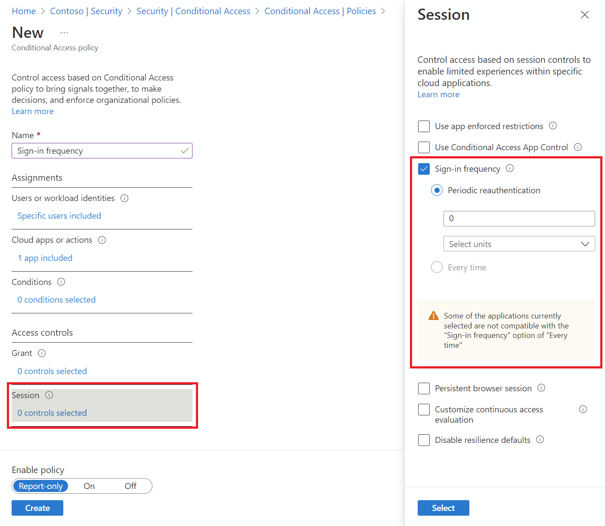

# Configure adaptive session lifetime policies

> [!WARNING]
> If you are using the [configurable token lifetime](~/identity-platform/configurable-token-lifetimes.md) feature currently in public preview, please note that we don’t support creating two different policies for the same user or app combination: one with this feature and another one with configurable token lifetime feature. Microsoft retired the configurable token lifetime feature for refresh and session token lifetimes on January 30, 2021 and replaced it with the Conditional Access authentication session management feature.  
>
> Before enabling Sign-in Frequency, make sure other reauthentication settings are disabled in your tenant. If "Remember MFA on trusted devices" is enabled, be sure to disable it before using Sign-in frequency, as using these two settings together may lead to prompting users unexpectedly. To learn more about reauthentication prompts and session lifetime, see the article, [Optimize reauthentication prompts and understand session lifetime for Microsoft Entra multifactor authentication](~/identity/authentication/concepts-azure-multi-factor-authentication-prompts-session-lifetime.md).

## Policy deployment

To make sure that your policy works as expected, the recommended best practice is to test it before rolling it out into production. Ideally, use a test tenant to verify whether your new policy works as intended. For more information, see the article [Plan a Conditional Access deployment](plan-conditional-access.md).

### Policy 1: Sign-in frequency control

1. Sign in to the [Microsoft Entra admin center](https://entra.microsoft.com) as at least a [Conditional Access Administrator](../role-based-access-control/permissions-reference.md#conditional-access-administrator).
1. Browse to **Entra ID** > **Conditional Access** > **Policies**.
1. Select **New policy**.
1. Give your policy a name. We recommend that organizations create a meaningful standard for the names of their policies.
1. Choose all required conditions for customer’s environment, including the target cloud apps.

   > [!NOTE]
   > It is recommended to set equal authentication prompt frequency for key Microsoft Office apps such as Exchange Online and SharePoint Online for best user experience.

1. Under **Access controls** > **Session**.
   1. Select **Sign-in frequency**.
      1. Choose **Periodic reauthentication** and enter a value of hours or days or select **Every time**.

   > 

1. Save your policy.

### Policy 2: Persistent browser session

1. Sign in to the [Microsoft Entra admin center](https://entra.microsoft.com) as at least a [Conditional Access Administrator](../role-based-access-control/permissions-reference.md#conditional-access-administrator).
1. Browse to **Entra ID** > **Conditional Access** > **Policies**.
1. Select **New policy**.
1. Give your policy a name. We recommend that organizations create a meaningful standard for the names of their policies.
1. Choose all required conditions.

   > [!NOTE]
   > This control requires to choose "All Cloud Apps" as a condition. Browser session persistence is controlled by authentication session token. All tabs in a browser session share a single session token and therefore they all must share persistence state.

1. Under **Access controls** > **Session**.
   1. Select **Persistent browser session**.

      > [!NOTE]
      > Persistent Browser Session configuration in Microsoft Entra Conditional Access overrides the "Stay signed in?" setting in the company branding pane for the same user if you have configured both policies.

   1. Select a value from dropdown.
1. Save your policy.

### Policy 3: Sign-in frequency control every time risky user

1. Sign in to the [Microsoft Entra admin center](https://entra.microsoft.com) as at least a [Conditional Access Administrator](~/identity/role-based-access-control/permissions-reference.md#conditional-access-administrator).
1. Browse to **Entra ID** > **Conditional Access**.
1. Select **New policy**.
1. Give your policy a name. We recommend that organizations create a meaningful standard for the names of their policies.
1. Under **Assignments**, select **Users or workload identities**.
   1. Under **Include**, select **All users**.
   1. Under **Exclude**, select **Users and groups** and choose your organization's emergency access or break-glass accounts. 
   1. Select **Done**.
1. Under **Target resources** > **Include**, select **All resources (formerly 'All cloud apps')**.
1. Under **Conditions** > **User risk**, set **Configure** to **Yes**. 
   1. Under **Configure user risk levels needed for policy to be enforced**, select **High**. [This guidance is based on Microsoft recommendations and might be different for each organization](../../id-protection/howto-identity-protection-configure-risk-policies.md#choosing-acceptable-risk-levels)
   1. Select **Done**.
1. Under **Access controls** > **Grant**, select **Grant access**.
   1. Select **Require authentication strength**, then select the built-in **Multifactor authentication** authentication strength from the list.
   1. Select **Require password change**.
   1. Select **Select**.
1. Under **Session**.
   1. Select **Sign-in frequency**.
   1. Ensure **Every time** is selected.
   1. Select **Select**.
1. Confirm your settings and set **Enable policy** to **Report-only**.
1. Select **Create** to create to enable your policy.

After administrators confirm your settings using [report-only mode](howto-conditional-access-insights-reporting.md), they can move the **Enable policy** toggle from **Report-only** to **On**.

### Validation

Use the [What If tool](what-if-tool.md) to simulate a sign-in from the user to the target application and other conditions based on how you configured your policy. The authentication session management controls show up in the result of the tool.

## Prompt tolerance

We factor for five minutes of clock skew when **every time** is selected in policy, so that we don’t prompt users more often than once every five minutes. If the user completed MFA in the last 5 minutes, and they hit another Conditional Access policy that requires reauthentication, we don't prompt the user. Over-prompting users for reauthentication can impact their productivity and increase the risk of users approving MFA requests they didn’t initiate. Use "Sign-in frequency – every time" only for specific business needs.

## Known issues

* If you configure sign-in frequency for mobile devices: Authentication after each sign-in frequency interval could be slow, it can take 30 seconds on average. Also, it could happen across various apps at the same time.
* On iOS devices: If an app configures certificates as the first authentication factor and the app has both Sign-in frequency and [Intune mobile application management policies](/mem/intune/apps/app-lifecycle) applied, end-users are blocked from signing in to the app when the policy triggers.
* Microsoft Entra Private Access does not yet support setting sign-in frequency to every time. 

## Next steps

* If you're ready to configure Conditional Access policies for your environment, see the article [Plan a Conditional Access deployment](plan-conditional-access.md).
