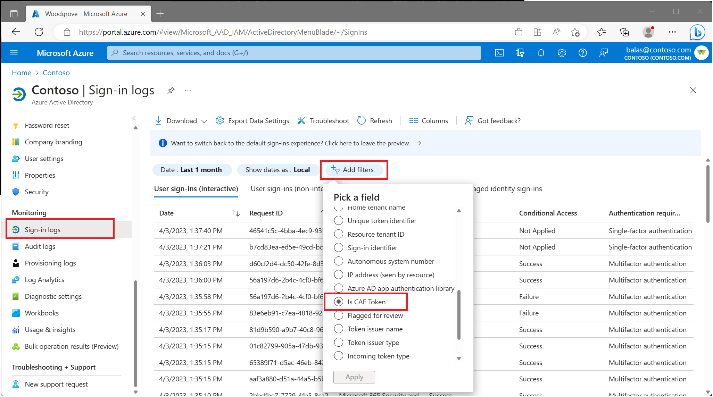

# Monitor and troubleshoot continuous access evaluation

Administrators can monitor and troubleshoot sign in events where [continuous access evaluation (CAE)](concept-continuous-access-evaluation.md) is applied in multiple ways.

## Continuous access evaluation sign-in reporting

Administrators can monitor user sign-ins where continuous access evaluation (CAE) is applied. This information is found in the Microsoft Entra sign-in logs:

1. Sign in to the [Microsoft Entra admin center](https://entra.microsoft.com) as at least a [Security Reader](../role-based-access-control/permissions-reference.md#security-reader).
1. Browse to **Identity** > **Monitoring & health** > **Sign-in logs**. 
1. Apply the **Is CAE Token** filter. 

From here, admins are presented with information about their user’s sign-in events. Select any sign-in to see details about the session, like which Conditional Access policies applied and if CAE enabled. 

There are multiple sign-in requests for each authentication. Some are on the interactive tab, while others are on the non-interactive tab. CAE is only marked true for one of the requests it can be on the interactive tab or non-interactive tab. Admins must check both tabs to confirm whether the user's authentication is CAE enabled or not. 

### Searching for specific sign-in attempts

Sign-in logs contain information on success and failure events. Use filters to narrow your search. For example, if a user signed in to Teams, use the Application filter and set it to Teams. Admins might need to check the sign-ins from both interactive and non-interactive tabs to locate the specific sign-in. To further narrow the search, admins might apply multiple filters.

## Continuous access evaluation workbooks

The continuous access evaluation insights workbook allows administrators to view and monitor CAE usage insights for their tenants. The table displays authentication attempts with IP mismatches. This workbook can be found as template under the Conditional Access category. 

### Accessing the CAE workbook template

Log Analytics integration must be completed before workbooks are displayed. For more information about how to stream Microsoft Entra sign-in logs to a Log Analytics workspace, see the article [Integrate Microsoft Entra logs with Azure Monitor logs](~/identity/monitoring-health/howto-integrate-activity-logs-with-azure-monitor-logs.yml).
 
1. Sign in to the [Microsoft Entra admin center](https://entra.microsoft.com) as at least a [Security Reader](../role-based-access-control/permissions-reference.md#security-reader). 
1. Browse to **Identity** > **Monitoring & health** > **Workbooks**.
1. Under **Public Templates**, search for **Continuous access evaluation insights**.

The **Continuous access evaluation insights** workbook contains the following table:

### Potential IP address mismatch between Microsoft Entra ID and resource provider  

The potential IP address mismatch between Microsoft Entra ID & resource provider table allows admins to investigate sessions where the IP address detected by Microsoft Entra ID doesn't match with the IP address detected by the resource provider. 

This workbook table sheds light on these scenarios by displaying the respective IP addresses and whether a CAE token was issued during the session. 

### Continuous access evaluation insights per sign-in 

The continuous access evaluation insights per sign-in page in the workbook connects multiple requests from the sign-in logs and displays a single request where a CAE token was issued. 

This workbook can come in handy, for example,  when: A user opens Outlook on their desktop and attempts to access resources inside of Exchange Online. This sign-in action might map to multiple interactive and non-interactive sign-in requests in the logs making issues hard to diagnose.

## IP address configuration

Your identity provider and resource providers might see different IP addresses. This mismatch might happen because of the following examples:

- Your network implements split tunneling.
- Your resource provider is using an IPv6 address and Microsoft Entra ID is using an IPv4 address.
- Because of network configurations, Microsoft Entra ID sees one IP address from the client and your resource provider sees a different IP address from the client.

If this scenario exists in your environment, to avoid infinite loops, Microsoft Entra ID issues a one-hour CAE token and doesn't enforce client location change during that one-hour period. Even in this case, security is improved compared to traditional one-hour tokens since we're still evaluating the other events besides client location change events.

Admins can view records filtered by time range and application. Admins can compare the number of mismatched IPs detected with the total number of sign-ins during a specified time period. 

To unblock users, administrators can add specific IP addresses to a trusted named location.

1. Sign in to the [Microsoft Entra admin center](https://entra.microsoft.com) as at least a [Conditional Access Administrator](../role-based-access-control/permissions-reference.md#conditional-access-administrator). 
1. Browse to **Protection** > **Conditional Access** > **Named locations**. Here you can create or update trusted IP locations.

> [!NOTE]
> Before adding an IP address as a trusted named location, confirm that the IP address does in fact belong to the intended organization.

For more information about named locations, see the article [Using the location condition](concept-assignment-network.md).
 
## Related content

- [Integrate Microsoft Entra logs with Azure Monitor logs](~/identity/monitoring-health/howto-integrate-activity-logs-with-azure-monitor-logs.yml)
- [Using the location condition](location-condition.md#named-locations)
- [Continuous access evaluation](concept-continuous-access-evaluation.md)
