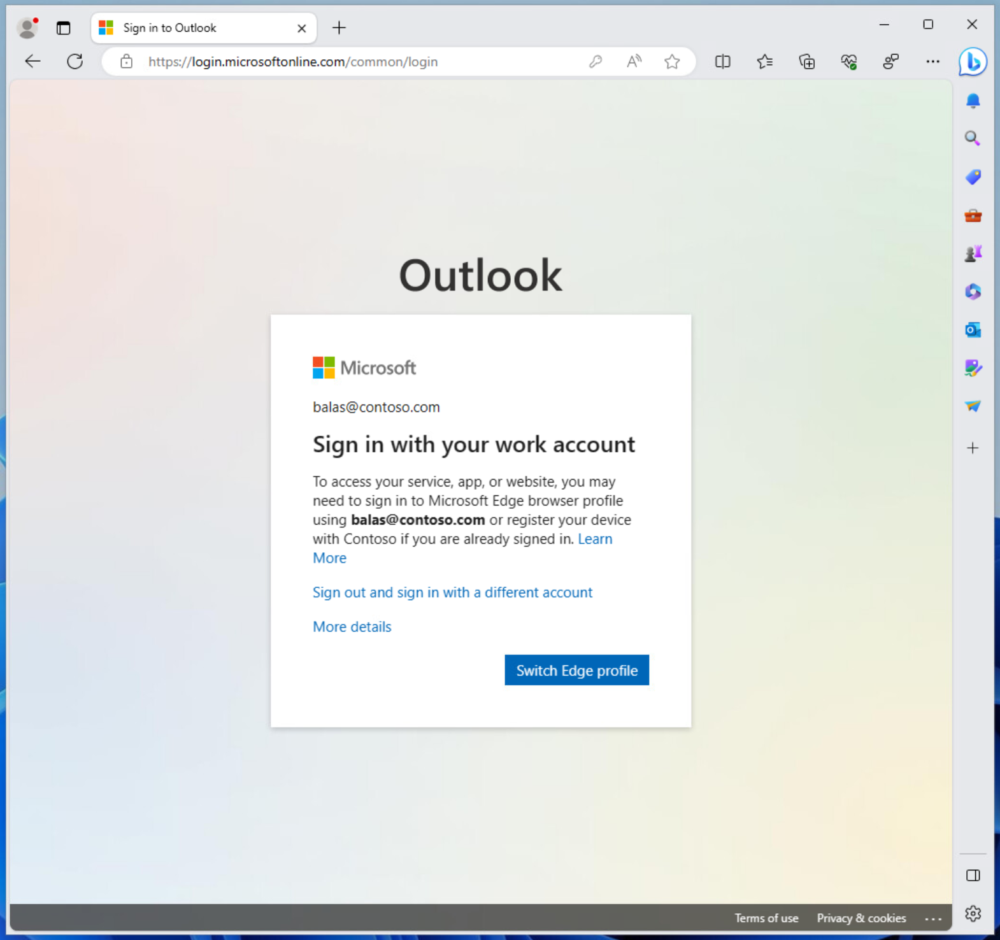
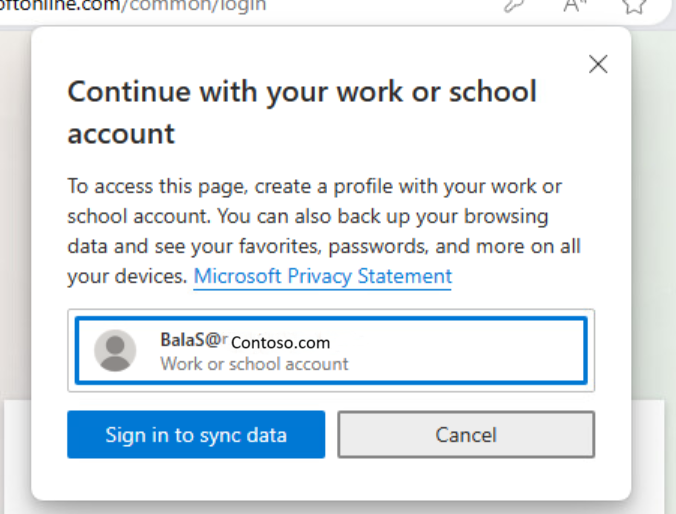
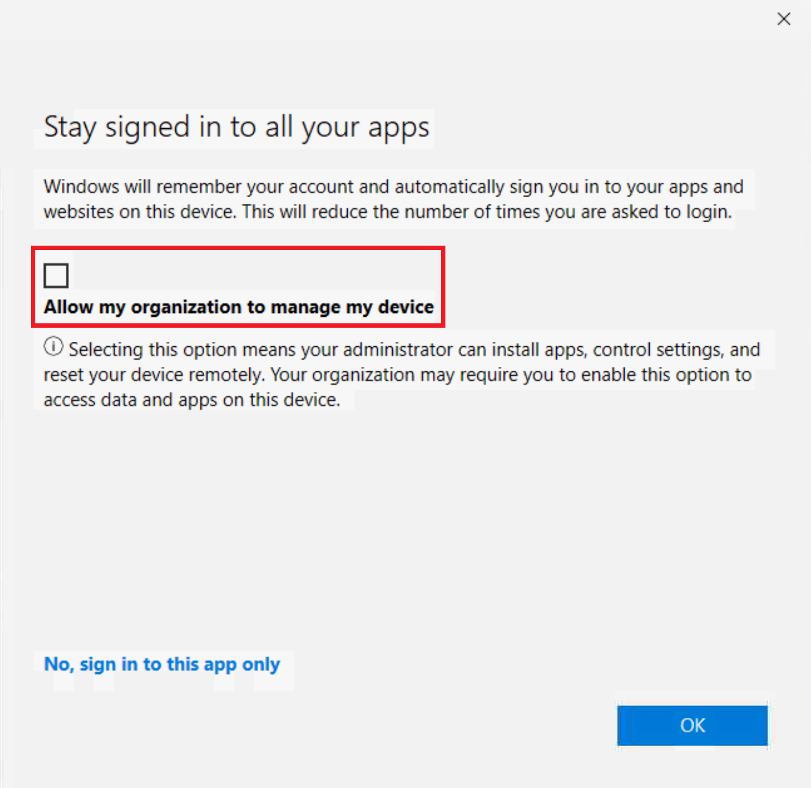

# Require an app protection policy on Windows devices

App protection policies apply [mobile application management (MAM)](/mem/intune/apps/app-management#mobile-application-management-mam-basics) to specific applications on a device. These policies allow for securing data within an application in support of scenarios like bring your own device (BYOD).

## Prerequisites

- We support applying policy to the Microsoft Edge browser on devices running Windows 11 and Windows 10 version 20H2 and higher with KB5031445.
- [Configured app protection policy targeting Windows devices](/mem/intune/apps/app-protection-policy-settings-windows).
- Currently unsupported in sovereign clouds.

## User exclusions
[!INCLUDE [active-directory-policy-exclusions](~/includes/entra-policy-exclude-user.md)]

## Create a Conditional Access policy

The following policy is put in to [Report-only mode](howto-conditional-access-insights-reporting.md) to start so administrators can determine the impact they have on existing users. When administrators are comfortable that the policy applies as they intend, they can switch to **On** or stage the deployment by adding specific groups and excluding others.

### Require app protection policy for Windows devices

The following steps help create a Conditional Access policy requiring an app protection policy when using a Windows device accessing the Office 365 apps grouping in Conditional Access. The app protection policy must also be configured and assigned to your users in Microsoft Intune. For more information about how to create the app protection policy, see the article [App protection policy settings for Windows](/mem/intune/apps/app-protection-policy-settings-windows). The following policy includes multiple controls allowing devices to either use app protection policies for mobile application management (MAM) or be managed and compliant with mobile device management (MDM) policies.

> [!TIP]
> App protection policies (MAM) support unmanaged devices:
>
> - If a device is already managed through mobile device management (MDM), then Intune MAM enrollment is blocked, and app protection policy settings aren't applied.
> - If a device becomes managed after MAM enrollment, app protection policy settings are no longer applied.

1. Sign in to the [Microsoft Entra admin center](https://entra.microsoft.com) as at least a [Conditional Access Administrator](../role-based-access-control/permissions-reference.md#conditional-access-administrator).
1. Browse to **Entra ID** > **Conditional Access** > **Policies**.
1. Select **New policy**.
1. Give your policy a name. We recommend that organizations create a meaningful standard for the names of their policies.
1. Under **Assignments**, select **Users or workload identities**.
   1. Under **Include**, select **All users**.
   1. Under **Exclude**, select **Users and groups** and choose at least your organization's emergency access or break-glass accounts.
1. Under **Target resources** > **Resources (formerly cloud apps)** > **Include**, select **Office 365**.
1. Under **Conditions**:
   1. **Device platforms** set **Configure** to **Yes**.
      1. Under **Include**, **Select device platforms**.
      1. Choose **Windows** only.
      1. Select **Done**.
   1. **Client apps** set **Configure** to **Yes**.
      1. Select **Browser** only.
1. Under **Access controls** > **Grant**, select **Grant access**.
   1. Select **Require app protection policy** and **Require device to be marked as compliant**.
   1. **For multiple controls** select **Require one of the selected controls**
1. Confirm your settings and set **Enable policy** to **Report-only**.
1. Select **Create** to create to enable your policy.

>[!Note]
>If you set to **Require all the selected controls** or just use the **Require app protection policy** control alone, you need to make sure that you only target unmanaged devices or that the devices are not MDM managed. Otherwise, the policy will block access to all applications since it cannot assess whether the application is compliant as per policy.

[!INCLUDE [conditional-access-report-only-mode](../../includes/conditional-access-report-only-mode.md)]

> [!TIP]
> Organizations should also deploy a policy that [blocks access from unsupported or unknown device platforms](policy-all-users-device-unknown-unsupported.md) along with this policy.

## Sign in to Windows devices

When users attempt to sign in to a site that is protected by an app protection policy for the first time, they're prompted: To access your service, app, or website, you might need to sign in to Microsoft Edge using `username@domain.com` or register your device with `organization` if you're already signed in.

Clicking on **Switch Edge profile** opens a window listing their Work or school account along with an option to **Sign in to sync data**.

   

This process opens a window offering to allow Windows to remember your account and automatically sign you in to your apps and websites.

> [!CAUTION]
> You must *CLEAR THE CHECKBOX* **Allow my organization to manage my device**. Leaving this checked enrolls your device in mobile device management (MDM) not mobile application management (MAM).
>
> Don't select **No, sign in to this app only**.

After selecting **OK**, you might see a progress window while policy is applied. After a few moments, you should see a window saying **You're all set**, app protection policies are applied.

## Troubleshooting

### Common issues

In some circumstances, after getting the "you're all set" page you might still be prompted to sign in with your work account. This prompt might happen when:

- Your profile is added to Microsoft Edge, but MAM enrollment is still being processed.
- Your profile is added to Microsoft Edge, but you selected "this app only" on the heads up page.
- You enrolled into MAM but your enrollment expired or you aren't compliant with your organization's requirements.

To resolve these possible scenarios:

- Wait a few minutes and try again in a new tab.
- Contact your administrator to check that Microsoft Intune MAM policies are applying to your account correctly.

### Existing account

There's a known issue where there's a pre-existing, unregistered account, like `user@contoso.com` in Microsoft Edge, or if a user signs in without registering using the Heads Up Page, then the account isn't properly enrolled in MAM. This configuration blocks the user from being properly enrolled in MAM.

## Next steps

- [What is Microsoft Intune app management?](/mem/intune/apps/app-management)
- [App protection policies overview](/mem/intune/apps/app-protection-policy)
