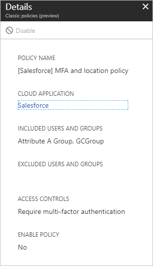
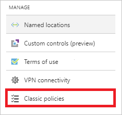
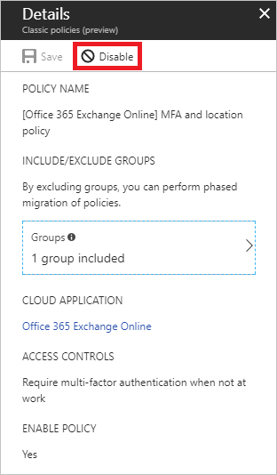

# Migrate from a classic policy

This article shows an example of how to migrate a classic policy that requires **Multifactor authentication** for a cloud app.

> [!TIP]
> As of the August 2023 Intune service release (2308), classic Conditional Access policies are no longer created for the Microsoft Defender for Endpoint connector. If your tenant has a classic Conditional Access policy that was previously created for integration with Microsoft Defender for Endpoint, it can be deleted. 

> [!WARNING]
> Once disabled a classic policy can't be re-enabled.

## Open a classic policy

1. Sign in to the [Microsoft Entra admin center](https://entra.microsoft.com) as at least a [Conditional Access Administrator](../role-based-access-control/permissions-reference.md#conditional-access-administrator).
1. Browse to **Protection** > **Conditional Access** > **Classic policies**.

   

1. In the list of classic policies, select the policy you wish to migrate. Document the configuration settings so that you can re-create with a new Conditional Access policy.

For examples of common policies and their configuration, see the article [Common Conditional Access policies](concept-conditional-access-policy-common.md).

## Disable the classic policy

To disable your classic policy, select **Disable** in the **Details** view.

> [!WARNING]
> Once disabled a classic policy can't be re-enabled.

## Related content

- [Conditional Access template policies](concept-conditional-access-policy-common.md)
- [Classic Conditional Access policies and Microsoft Defender for Endpoint connector](/mem/intune/protect/advanced-threat-protection-configure)
