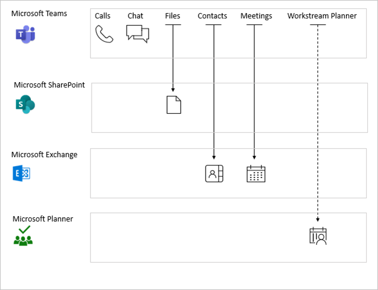

# Service dependencies in Microsoft Entra Conditional Access

With Conditional Access policies, you specify requirements to use websites and services. For example, your requirements can include requiring multifactor authentication (MFA) or [managed devices](./concept-conditional-access-grant.md).

When you use a site or service directly, it's usually easy to see how a related policy affects you. For example, if you set a policy that requires multifactor authentication (MFA) for SharePoint Online, MFA is required for each sign-in to the SharePoint web portal. But sometimes it's hard to know how a policy affects you because some cloud apps depend on other cloud apps. For example, Microsoft Teams lets you use resources in SharePoint Online. So, when you use Microsoft Teams in this scenario, you're also subject to the SharePoint MFA policy.

> [!TIP]
> Use the [Office 365](concept-conditional-access-cloud-apps.md#office-365) app to target all Office apps and avoid issues with service dependencies in the Office stack.

<!-- docutune:ignore "Windows Azure Active Directory" -->

## Policy enforcement

If you have a service dependency configured, the policy can apply using early-bound or late-bound enforcement.

- **Early-bound policy enforcement** means a user must meet the dependent service policy before using the calling app. For example, a user must meet the SharePoint policy before signing in to Microsoft Teams.
- **Late-bound policy enforcement** happens after the user signs in to the calling app. Enforcement is deferred until the calling app requests a token for the downstream service. Examples include Microsoft Teams accessing Planner, and Office.com accessing SharePoint.

The following diagram shows Microsoft Teams service dependencies. Solid arrows indicate early-bound enforcement, and the dashed arrow for Planner indicates late-bound enforcement.

Set common policies across related apps and services whenever possible. A consistent security posture gives you the best user experience. For example, setting a common policy across Exchange Online, SharePoint Online, and Microsoft Teams reduces prompts that can come from different policies applied to downstream services.

To set a common policy for Microsoft 365 apps, use the [Office 365 app](concept-conditional-access-cloud-apps.md#office-365) instead of targeting individual applications.

The following table lists some more service dependencies, where the client apps must satisfy. This list isn't exhaustive.

| Client apps         | Downstream service                          | Enforcement |
| :--                 | :--                                         | ---         |
| Azure Data Lake     | Windows Azure Service Management API (portal and API) | Early-bound |
| Microsoft Classroom | Exchange                                    | Early-bound |
|                     | SharePoint                                  | Early-bound |
| Microsoft Teams     | Exchange                                    | Early-bound |
|                     | MS Planner                                  | Late-bound  |
|                     | Microsoft Stream                            | Late-bound  |
|                     | SharePoint                                  | Early-bound |
|                     | Skype for Business Online                   | Early-bound |
|                     | Microsoft Whiteboard                        | Late-bound  |
| Office Portal       | Exchange                                    | Late-bound  |
|                     | SharePoint                                  | Late-bound  |
| Outlook groups      | Exchange                                    | Early-bound |
|                     | SharePoint                                  | Early-bound |
| Power Apps          | Windows Azure Service Management API (portal and API) | Early-bound |
|                     | Windows Azure Active Directory              | Early-bound |
|                     | SharePoint                                  | Early-bound |
|                     | Exchange                                    | Early-bound |
| Power Automate      | Power Apps                                  | Early-bound |
| Project             | Dynamics CRM                                | Early-bound |
| Skype for Business  | Exchange                                    | Early-bound |
| Visual Studio       | Windows Azure Service Management API (portal and API) | Early-bound |
| Microsoft Forms     | Exchange                                    | Early-bound |
|                     | SharePoint                                  | Early-bound |
| Microsoft To Do     | Exchange                                    | Early-bound |
| SharePoint          | SharePoint Online Web Client Extensibility  | Early-bound |
|                     | SharePoint Online Web Client Extensibility Isolated | Early-bound |
|                     | SharePoint Client Extensibility web application principal (where present) | Early-bound |

## Troubleshooting service dependencies

The Microsoft Entra sign-in log is a valuable source of information when you troubleshoot why and how a Conditional Access policy applies in your environment. The sign-in logs include helpful information like applications, resources, and audiences. For more information about troubleshooting unexpected sign-in outcomes related to Conditional Access, see the article [Troubleshooting sign-in problems with Conditional Access](troubleshoot-conditional-access.md#service-dependencies).

## Next steps

Learn how to implement Conditional Access in your environment in [Plan your Conditional Access deployment in Microsoft Entra ID](plan-conditional-access.md).
