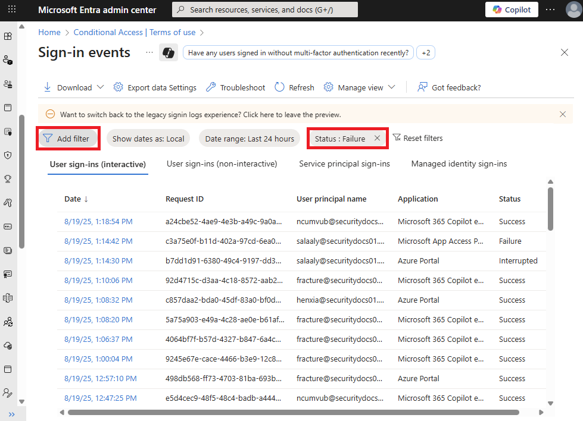

# Troubleshoot sign-in problems with Conditional Access

Use this article to fix unexpected sign-in outcomes related to Conditional Access by checking error messages and Microsoft Entra sign-in logs.

## Select "all" consequences

The Conditional Access framework gives you a lot of configuration flexibility. But this flexibility means you need to carefully review each configuration policy before releasing it to avoid unwanted results. In this context, pay special attention to assignments that affect complete sets like **all users / groups / resources**.

Don't use the following configurations:

**For all users, all resources:**

- **Block access** - This configuration blocks the entire organization.
- **Require device to be marked as compliant** - For users who haven't enrolled their devices yet, this policy blocks all access, including access to the Intune portal. If you're an admin without an enrolled device, this policy blocks you from getting back in to change the policy.
- **Require Hybrid Microsoft Entra domain joined device** - This policy can also block access for all users in your organization if they don't have a Microsoft Entra hybrid joined device.
- **Require app protection policy** - This policy can also block access for all users in your organization if you don't have an Intune policy. If you're an admin without a client app that has an [Intune app protection policy](/intune/intune-service/apps/app-protection-policy), this policy blocks you from getting back into portals like Intune and Azure.

**For all users, all resources, all device platforms:**

- **Block access** - This configuration blocks your entire organization.

## Conditional Access sign-in interrupt

Check the error message that appears. If you're signing in with a web browser, the error page usually has detailed information. This information often describes the problem and suggests a solution.

In this error, the message says you can only use the application from devices or client applications that meet your company's mobile device management policy. Here, the application and device don't meet the policy.

## Microsoft Entra sign-in events

To get detailed information about the sign-in interruption, review the Microsoft Entra sign-in events to see which Conditional Access policy or policies applied and why.

More information can be found about the problem by clicking **More Details** in the initial error page. Clicking **More Details** reveals troubleshooting information that is helpful when searching the Microsoft Entra sign-in events for the specific failure event the user saw or when opening a support incident with Microsoft.

Follow these steps to find out which Conditional Access policy or policies applied and why.

1. Sign in to the [Microsoft Entra admin center](https://entra.microsoft.com) as at least a [Reports Reader](../role-based-access-control/permissions-reference.md#reports-reader).
1. Browse to **Entra ID** > **Monitoring & health** > **Sign-in logs**.
1. Find the event for the sign-in to review. Add or remove filters and columns to filter out unnecessary information.
   1. Narrow the scope by adding filters like:
      1. **Correlation ID** when you have a specific event to investigate.
      1. **Conditional Access** to see policy failure and success. Scope your filter to show only failures to limit results.
      1. **Username** to see information related to specific users.
      1. **Date** scoped to the time frame in question.
      1. **Resource** to see information related to the resource called.

   

1. After finding the sign-in event that corresponds to the user's sign-in failure, select the **Conditional Access** tab. The Conditional Access tab shows the specific policy or policies that resulted in the sign-in interruption.
   1. Information in the **Troubleshooting and support** tab might provide a clear reason as to why a sign-in failed such as a device that didn't meet compliance requirements.
   1. To investigate further, drill down into the configuration of the policies by clicking on the **Policy Name**. Clicking the **Policy Name** shows the policy configuration user interface for the selected policy for review and editing.
   1. The **client user** and **device details** that were used for the Conditional Access policy assessment are also available in the **Basic Info**, **Location**, **Device Info**, **Authentication Details**, and **Additional Details** tabs of the sign-in event.

### Policy not working as intended

Select the ellipsis on the right side of the policy in a sign-in event to see policy details. This option gives admins more information about why a policy was applied or not.

:::image type="content" source="media/troubleshoot-conditional-access/activity-details-sign-ins.png" alt-text="Screenshot showing Conditional Access Policy details to see why policy applied or not." lightbox="media/troubleshoot-conditional-access/activity-details-sign-ins.png":::

The left side provides details collected at sign-in and the right side provides details of whether those details satisfy the requirements of the applied Conditional Access policies. Conditional Access policies only apply when all conditions are satisfied or not configured.

If the information in the event isn't enough to understand the sign-in results or adjust the policy to get desired results, use the sign-in diagnostic tool. The sign-in diagnostic is under **Basic info** > **Troubleshoot Event**. For more information about the sign-in diagnostic, see [What is the sign-in diagnostic in Microsoft Entra ID](~/identity/monitoring-health/howto-use-sign-in-diagnostics.md). You can also [use the What If tool to troubleshoot Conditional Access policies](what-if-tool.md).

If you need to submit a support incident, include the request ID, time, and date from the sign-in event in the incident details. This information helps Microsoft support find the specific event you're concerned about.

### Common Conditional Access error codes

| Sign-in Error Code | Error String |
| --- | --- |
| 53000 | DeviceNotCompliant |
| 53001 | DeviceNotDomainJoined |
| 53002 | ApplicationUsedIsNotAnApprovedApp |
| 53003 | BlockedByConditionalAccess |
| 53004 | ProofUpBlockedDueToRisk |
| 53009 | Application needs to enforce Intune protection policies |

Learn more about error codes in [Microsoft Entra authentication and authorization error codes](~/identity-platform/reference-error-codes.md). Error codes in the list appear with a prefix of `AADSTS` followed by the code you see in the browser, like `AADSTS53002`.

## Service dependencies

In some scenarios, users are blocked because cloud apps depend on resources that a Conditional Access policy blocks.

To check the service dependency, review the sign-in log for the application and resource called by the sign-in. In the following screenshot, the application is **Azure Portal**, but the resource is **Azure Resource Manager**. To target this scenario, combine all the applications and resources in the Conditional Access policy.

:::image type="content" source="media/troubleshoot-conditional-access/service-dependency-example-sign-in.png" alt-text="Screenshot of a sign-in log that shows an application calling a resource. This scenario is also known as a service dependency." lightbox="media/troubleshoot-conditional-access/service-dependency-example-sign-in.png":::

## Audience reporting

When a user signs in to an app like Microsoft Teams, they're actually requesting access to multiple resources, like Teams chat, Outlook calendar, Excel documents, and more. While users might think they're only signing in to the Teams client, Conditional Access policies apply across all these resources. For example, if an admin restricts access to SharePoint or specific SharePoint sites, the policy applies even when the user thinks they're only signing in to Teams.

Audience reporting in the sign-in logs lets admins see all the resources requested as part of a sign-in event. This appears as **Audience** under the Resource section for all enabled or report-only policies.

:::image type="content" source="media/troubleshoot-conditional-access/audience-reporting.png" alt-text="Screenshot of a sign-in log entry that shows Conditional Access policy details and expanded resource and audience information." lightbox="media/troubleshoot-conditional-access/audience-reporting.png":::

Admins find **Audience** in the sign-in logs after selecting a policy on the Conditional Access tab.

Admins use the audience report to learn why a CA policy applies or doesn't apply to a sign-in event. For example, a policy applies to a specific sign-in event because one of the audiences in the list is in scope of the policy.

## What to do if you're locked out

If you're locked out because of an incorrect setting in a Conditional Access policy:

- Check if there are other admins in your organization who aren't blocked yet. An admin with access can disable the policy that's affecting your sign-in.
- If no admin in your organization can update the policy, submit a support request. Microsoft support reviews and, after confirming, updates the Conditional Access policies that prevent access.

## Next steps

- [Use the What If tool to troubleshoot Conditional Access policies](what-if-tool.md)
- [Sign-in activity reports](~/identity/monitoring-health/concept-sign-ins.md)
- [Troubleshoot Conditional Access using the What If tool](troubleshoot-conditional-access-what-if.md)