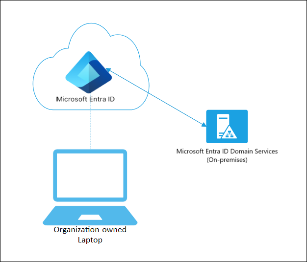

# Microsoft Entra joined devices

Any organization can deploy Microsoft Entra joined devices no matter the size or industry. Microsoft Entra join works even in hybrid environments, enabling access to both cloud and on-premises apps and resources.

| Microsoft Entra join | Description |
| --- | --- |
| **Definition** | <ul><li>Joined only to Microsoft Entra ID requiring organizational account to sign in to the device</li></ul> |
| **Primary audience** | <ul><li>Suitable for both cloud-only and hybrid organizations. </li><li>Applicable to all users in an organization</li></ul> |
| **Device ownership** | <ul><li>Organization</li></ul> |
| **Operating Systems** | <ul><li>All Windows 11 and Windows 10 devices except Home editions</li><li>[Windows Enterprise multi-session Virtual Machines running in Azure](/azure/virtual-desktop/windows-multisession-faq#can-windows-enterprise-multi-session-be-microsoft-entra-joined)</li><li>[Windows Server 2019 and newer Virtual Machines running in Azure](howto-vm-sign-in-azure-ad-windows.md) (Server core isn't supported)</li><li>Apple devices running macOS 13 or newer</li><li>Linux editions:<ul><li>Ubuntu 22.04/24.04 LTS</li><li>Red Hat Enterprise Linux 8/9 LTS</li></ul></li></ul> |
| **Provisioning** | <ul><li>Self-service: Windows Out of Box Experience (OOBE) or Settings</li><li>Bulk enrollment</li><li>Windows Autopilot</li><li>(Public preview) Apple Automated Device Enrollment (applies to Apple devices only)</li></ul> |
| **Device management** | <ul><li>Mobile Device Management (example: Microsoft Intune)</li><li>[Configuration Manager standalone or co-management with Microsoft Intune](/mem/configmgr/comanage/overview)</li></ul> |
| **Key capabilities** | <ul><li>single sign-on (SSO) to both cloud and on-premises resources</li><li>Conditional Access</li><li>[Self-service Password Reset and Windows Hello PIN reset on lock screen](../authentication/howto-sspr-windows.md)</li></ul> |
 |

## **Device sign in options**

The following are the supported sign-in options for Microsoft Entra joined devices. The availability of these options depends on the device's operating system and configuration. For example, Windows Hello for Business requires additional setup and may not be available on all devices.

| Platform | Password | SmartCard | Microsoft Authenticator phone sign-in | [Windows Hello for Business](/windows/security/identity-protection/hello-for-business/hello-planning-guide) / [Platform Credentials](macos-psso.md) | Web Sign-In | FIDO2  |
| --------------------- | --- | --- | --- | --- | ---| --- |  
|Windows 10/11          | ✅  | ✅ | ✅ | ✅ | ✅ |  ✅ |
|macOS 13+              | ✅  | ✅ |     |    |     |      |
|Ubuntu 22.04/24.04 LTS | ✅  | ✅ | ✅ |    |     |      |
|RHEL 8/9/10            | ✅  | ⚠️ | ✅ |    |     |      |

You sign in to Microsoft Entra joined devices using a Microsoft Entra account. Access to resources can be controlled based on your account and [Conditional Access policies](../conditional-access/policy-alt-all-users-compliant-hybrid-or-mfa.md) applied to the device.

Administrators can secure and further control Microsoft Entra joined devices using Mobile Device Management (MDM) tools like Microsoft Intune or in co-management scenarios using Microsoft Configuration Manager. These tools provide a means to enforce organization-required configurations like:

- Requiring storage to be encrypted
- Password complexity
- Software installation
- Software updates

Administrators can make organization applications available to Microsoft Entra joined devices using Configuration Manager to [Manage apps from the Microsoft Store for Business and Education](/mem/configmgr/apps/deploy-use/manage-apps-from-the-windows-store-for-business).

Microsoft Entra join can be accomplished using self-service options like the Out of Box Experience (OOBE), bulk enrollment, [Apple Automated Device Enrollment (public preview)](/mem/intune/enrollment/device-enrollment-program-enroll-macos), or [Windows Autopilot](/autopilot/enrollment-autopilot).

Microsoft Entra joined devices can still maintain single sign-on access to on-premises resources when they are on the organization's network. Devices that are Microsoft Entra joined can still authenticate to on-premises servers like file, print, and other applications.

## Scenarios

Microsoft Entra join can be used in various scenarios like:

- You want to transition to cloud-based infrastructure using Microsoft Entra ID and MDM like Intune.
- You can't use an on-premises domain join, for example, if you need to get mobile devices such as tablets and phones under control.
- Your users primarily need to access Microsoft 365 or other software as a service (SaaS) apps integrated with Microsoft Entra ID.
- You want to manage a group of users in Microsoft Entra ID instead of in Active Directory. This scenario can apply, for example, to seasonal workers, contractors, or students.
- You want to provide joining capabilities to workers who work from home or are in remote branch offices with limited on-premises infrastructure.

You can configure Microsoft Entra join for all Windows 11 and Windows 10 devices except for Home editions.

The goal of Microsoft Entra joined devices is to simplify:

- Windows and macOS deployments of work-owned devices
- Access to organizational apps and resources from any Windows or macOS device
- Cloud-based management of work-owned devices
- Users to sign in to their devices with their Microsoft Entra ID or synced Active Directory work or school accounts.

Microsoft Entra join can be deployed by using any of the following methods:

- [Windows Autopilot](/autopilot/windows-autopilot)
- [Bulk deployment](/mem/intune/enrollment/windows-bulk-enroll)
- [Self-service experience](device-join-out-of-box.md)
- [Apple Automated Device Enrollment (public preview)](/mem/intune/enrollment/device-enrollment-program-enroll-macos)

## Related content

- [Plan your Microsoft Entra join implementation](device-join-plan.md)
- [Co-management using Configuration Manager and Microsoft Intune](/mem/configmgr/comanage/overview)
- [How to manage the local administrators group on Microsoft Entra joined devices](assign-local-admin.md)
- [Manage device identities](manage-device-identities.md)
- [Manage stale devices in Microsoft Entra ID](manage-stale-devices.md)
- [macOS Platform Single Sign-on (preview)](macos-psso.md)
