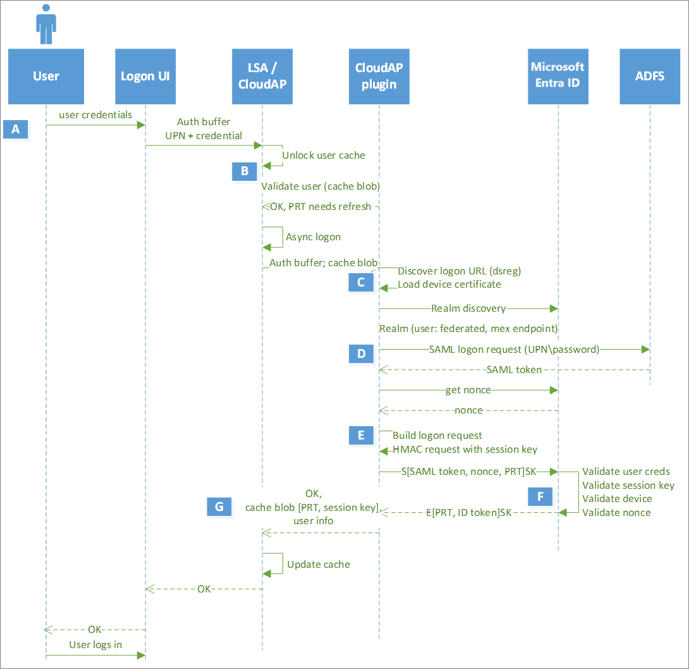
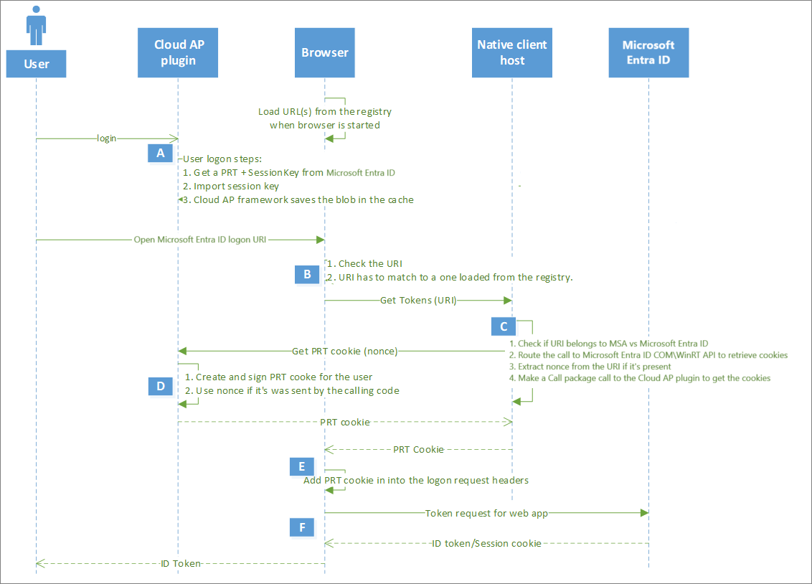

# Understanding Primary Refresh Token (PRT)

A Primary Refresh Token (PRT) is a key artifact of Microsoft Entra authentication in supported versions of Windows, iOS/macOS, Android, and Linux. A PRT is a secure artifact specially issued to Microsoft first party token brokers to enable single sign-on (SSO) across the applications used on those devices. This article explains how a PRT is issued, used, and protected, enhancing your security and enabling single sign-on (SSO) across applications.

This article assumes that you already understand the different device states available in Microsoft Entra ID and how single sign-on works in Windows. For more information about devices in Microsoft Entra ID, see [What is device management in Microsoft Entra ID?](overview.md).

## Key terminology and components

The following Windows components play a key role in requesting and using a Primary Refresh Token (PRT):

| **Term** | **Description** |
| :--- | --- |
| **Cloud Authentication Provider (CloudAP)**| CloudAP is the modern authentication provider for Windows sign in, that verifies users logging to a Windows 10 or newer device. CloudAP provides a plugin framework that identity providers can build on to enable authentication to Windows using that identity provider's credentials. |
| **Web Account Manager (WAM)**| WAM is the default token broker on Windows 10 or newer devices. WAM also provides a plugin framework that identity providers can build on and enable SSO to their applications relying on that identity provider.|
| **Microsoft Entra CloudAP plugin**| A Microsoft Entra specific plugin built on the CloudAP framework that verifies user credentials with Microsoft Entra ID during Windows sign in.|
| **Microsoft Entra WAM plugin**| A Microsoft Entra specific plugin built on the WAM framework that enables SSO to applications that rely on Microsoft Entra ID for authentication.|
| **Dsreg**| A Microsoft Entra specific component on Windows 10 or newer, that handles the device registration process for all device states.|
| **Trusted Platform Module (TPM)**| A TPM is a hardware component built into a device that provides hardware-based security functions for user and device secrets. More details can be found in the article [Trusted Platform Module Technology Overview](/windows/security/hardware-security/tpm/trusted-platform-module-overview).|

## What is a PRT used for?
- **Single Sign-On (SSO)** - Once a user signs into their device, the PRT allows them to access Microsoft 365, Azure, and other cloud apps without requiring the user to reenter their credentials. Apps like Office, Microsoft Edge, and Teams use the PRT via a broker to silently authenticate users, improving the user experience, reducing the need for multiple sign-ins, and enhancing productivity.
- **Token Acquisition** - The PRT is used to request access tokens and refresh tokens for various services (like Outlook, Teams, SharePoint, etc.) via the Windows Web Account Manager (WAM) or Broker plug-ins on other platforms.
- **Conditional Access Compliance** - It carries device and user claims, which are evaluated by Microsoft Entra ID to enforce Conditional Access policies (for example, requiring compliant devices, MFA, etc.).

## What are the types of a PRT?

At a high level, there are two different types of PRT artifacts.

- **Registered device PRTs** are bound to a device that has an associated Microsoft Entra identity. 
- **Unregistered device PRTs** are bound to a device that doesn't have a Microsoft Entra identity, which is associated with an on-device cryptographic key pair generated by the client.

Clients always attempt to use "registered device PRTs" whenever possible. PRTs only satisfy device registration policies if they're issued for registered devices. Unregistered device PRTs are used in scenarios where the device doesn't have a Microsoft Entra identity, such as when a user signs in to a browser on a personal device or when a user signs in to an app that doesn't support device registration.

### Can I see what's in a PRT?

A PRT is an opaque blob sent from Microsoft Entra whose contents aren't known to any client components. You can't see what’s inside a PRT.

## How is a PRT issued?

For **Registered device PRTs**, the PRT is issued to users on registered devices. For more in-depth details on device registration, see the article [Windows Hello for Business and Device Registration](./device-registration-how-it-works.md). During device registration, the dsreg component generates two sets of cryptographic key pairs:

- Device key (dkpub/dkpriv)
- Transport key (tkpub/tkpriv)

PRT can only be issued when a Microsoft Entra ID broker is present. Broker is a component distributed with the following apps: Intune Company Portal on macOS and Linux, Authenticator on iOS, Authenticator, Link to Windows, and Company portal on Android. On Mac, Mobile Device Management (MDM) is required to activate the broker alongside the SSO extension profile: [Apple SSO Plugin](../../identity-platform/apple-sso-plugin.md)

### [Windows](#tab/windows-prt-issued)

If the device has a valid and functioning TPM/Secure Hardware Storage, the private keys are bound to the device’s Secure Storage on supported platforms. The public keys are sent to Microsoft Entra ID during the device registration process in order to validate the device state during PRT requests.

The PRT is issued during user authentication on a Windows 10 or newer device in two scenarios:

* **Microsoft Entra joined** or **Microsoft Entra hybrid joined**: A PRT is issued during Windows sign-in when a user signs in with their organization credentials. A PRT is issued with all Windows 10 or newer supported credentials, for example, password and Windows Hello for Business. In this scenario, Microsoft Entra CloudAP plugin is the primary authority for the PRT
* **Microsoft Entra registered device**: A PRT is issued when a user adds a secondary work account to their Windows 10 or newer device. Users can add an account to Windows 10 or newer in two different ways:
   * Adding an account via the **Allow my organization to manage my device** prompt after signing in to an app (for example, Outlook)
   * Adding an account from **Settings** > **Accounts** > **Access Work or School** > **Connect**

In Microsoft Entra registered device scenarios, the Microsoft Entra WAM plugin is the primary authority for the PRT since Windows sign in isn't happening with this Microsoft Entra account.

### [macOS](#tab/macos-prt-issued)

**macOS with Platform SSO**

macOS [Platform Single Sign-on (PSSO)](macos-psso.md) is a new feature powered by Microsoft’s Enterprise SSO plug-in, Platform Credentials for macOS that enables users to sign in to Mac devices using their Microsoft Entra ID credentials.

The PSSO Primary Refresh Token (PRT) is issued exclusively to Entra-joined macOS devices that successfully completed Platform SSO registration. During this registration process, macOS generates secure enclave–backed cryptographic key pairs: one for device signing and another for device encryption. The public key references are shared with the SSO extension.

The SSO extension uses these keys to complete device registration with the Microsoft Entra ID Device Registration Service. It then configures Apple’s loginConfiguration API with the necessary parameters for PRT acquisition.

**macOS without Platform SSO**

macOS supports Unregistered PRTs for Microsoft Edge and Registered PRTs when device is workplace joined and broker is present

Once registration is successfully completed, macOS initiates a sign in request signed with the Device Signing key. Microsoft Entra ID validates the request, device signing key and associated parameters, and issues PRT response. macOS decrypts this response using Device Encryption key, stores the PRT and makes it available to the SSO extension. The sign in request is sent during user authentication on PSSO registered macOS.

### [iOS and Android](#tab/other-prt-issued)

**iOS, macOS, and Android** supports both Unregistered PRTs for Microsoft Edge and Registered PRTs when broker is present.

### [Linux](#tab/linux-prt-issued)
**Linux** supports both Unregistered PRTs for Microsoft Edge and Registered PRTs when broker is present.

---

### Browser behavior

Browsers gain access to the PRT in multiple ways, depending on the operating system:

### [Windows](#tab/browser-behavior-windows)

Windows - Will pull the PRT from the broker into the browser on the following browsers:
- Microsoft Edge
- Firefox

### [Android](#tab/browser-behavior-android)

Android - Microsoft Edge will pull the PRT from the broker into the browser

### [iOS and Android](#tab/browser-behavior-apple)

On iOS and macOS, browsers can also get the PRT when the SSO extension profile is installed, enabling:
- Chrome and Firefox support on macOS
- Safari support on both iOS and macOS
- Microsoft Edge on iOS

### [Linux](#tab/browser-behavior-linux)

Linux - Microsoft Edge will pull the PRT from the broker into the browser'

---

The list of supported browsers is available here: [Supported Browsers](../conditional-access/concept-conditional-access-conditions.md#supported-browsers)

> [!NOTE]
> Customers who enable Entra federation with non-Microsoft Identity Providers must configure those Identity Providers to support WS-Trust protocol to enable PRT issuance on Windows 10 or newer devices. Without WS-Trust for federation cases, a PRT can't be issued to users on Microsoft Entra hybrid joined or Microsoft Entra joined devices. 

> [!NOTE]
> For ADFS, `usernamemixed` endpoints are required. If `Smartcard/certificate` is used during Windows sign-in, then `certificatemixed` endpoints need to be configured on ADFS. `windowstransport` should be enabled as intranet facing endpoints only and **must NOT be exposed** as extranet facing endpoints through the Web Application Proxy.

> [!NOTE] 
> Microsoft Entra Conditional Access policies aren't evaluated when PRTs are issued.

> [!NOTE]
> We don't support non-Microsoft credential providers for issuance and renewal of Microsoft Entra PRTs.

## How is a PRT used?

### [Windows](#tab/windows-prt-used)

A PRT is used by two key components in Windows:

- **Microsoft Entra CloudAP plugin:** During Windows sign in, the Microsoft Entra CloudAP plugin requests a PRT from Microsoft Entra ID using the credentials provided by the user. It also caches the PRT to enable cached sign in when the user doesn't have access to an internet connection.
- **Microsoft Entra WAM plugin:** When users try to access applications, the Microsoft Entra WAM plugin uses the PRT to enable SSO on Windows 10 or newer. Microsoft Entra WAM plugin uses the PRT to request refresh and access tokens for applications that rely on WAM for token requests. It also enables SSO on browsers by injecting the PRT into browser requests. Browser SSO in Windows 10 or newer is supported on Microsoft Edge (natively), Chrome (via the [Windows 10 Accounts](https://chrome.google.com/webstore/detail/windows-10-accounts/ppnbnpeolgkicgegkbkbjmhlideopiji?hl=en) extension) and Mozilla Firefox v91+ (Firefox [Windows SSO setting](https://support.mozilla.org/kb/windows-sso)).
  > [!NOTE]
  >  In instances where a user has two accounts from the same Microsoft Entra tenant signed in to a browser application, the device authentication provided by the PRT of the primary account is automatically applied to the second account as well. As a result, the second account also satisfies any device-based Conditional Access policy on the tenant.

### [macOS](#tab/macos-prt-used)

A PSSO PRT is used by the [SSO extension](../../identity-platform/apple-sso-plugin.md) to provide SSO to apps and websites. A PRT is used to request refresh and access tokens for applications that rely on the SSO extension for token requests. It also enables SSO on browsers by injecting the PRT into browser requests.

The browsers that support Browser SSO are Safari, Firefox, Chrome, and Microsoft Edge.

### [iOS](#tab/ios-prt-used)

For iOS, only Microsoft Edge and Safari are supported for Browser SSO.

### [Android](#tab/android-prt-used)

For Android, only Microsoft Edge is supported for Browser SSO. 

### [Linux](#tab/linux-prt-used)

The only native apps integrated today are Intune and Microsoft Edge Browser. For browser support, only Microsoft Edge Browser is protected for device-bound tokens and Conditional Access enforcement.

---

## What is the lifetime of a PRT?

Once issued, a PRT is valid for 90 days and is continuously renewed as long as the user actively uses the device. Organizations can limit the lifetime of PRT sessions using the Sign-in [frequency session control](../conditional-access/concept-conditional-access-session.md)

## How is a PRT renewed?

### [Windows](#tab/windows-prt-renewal)

#### Windows Platform

A PRT is renewed in two different ways:

- **Microsoft Entra CloudAP plugin every 4 hours:** The CloudAP plugin renews the PRT every 4 hours during Windows sign in. If the user doesn't have internet connection during that time, CloudAP plugin will renew the PRT after the device is connected to the internet and a new Windows sign in is done.
- **Microsoft Entra WAM plugin during app token requests:** The WAM plugin enables SSO on Windows 10 or newer devices by enabling silent token requests for applications. The WAM plugin can renew the PRT during these token requests in two different ways:
   - An app requests WAM for an access token silently but there's no refresh token available for that app. In this case, WAM uses the PRT to request a token for the app and gets back a new PRT in the response.
   - An app requests WAM for an access token but the PRT is invalid or Microsoft Entra ID requires extra authorization (for example, Microsoft Entra multifactor authentication). In this scenario, WAM initiates an interactive sign-in requiring the user to reauthenticate or provide extra verification and a new PRT is issued on successful authentication.

In an ADFS environment, direct line of sight to the domain controller isn't required to renew the PRT. PRT renewal requires only `/adfs/services/trust/2005/usernamemixed` and `/adfs/services/trust/13/usernamemixed` endpoints enabled on proxy by using WS-Trust protocol.

Windows transport endpoints are required for password authentication only when a password is changed, not for PRT renewal.

#### Key considerations

- In Microsoft Entra joined and Microsoft Entra hybrid joined devices, the CloudAP plugin is the primary authority for a PRT. If a PRT is renewed during a WAM-based token request, the PRT is sent back to CloudAP plugin, which verifies the validity of the PRT with Microsoft Entra ID before accepting it.

### [macOS](#tab/macos-prt-renewal)

macOS renews the PSSO Primary Refresh Token (PRT) every 4 hours, or sooner if the SSO tokens are missing or have expired.

### [iOS](#tab/iOS-prt-renewal)

On iOS, there’s also an opportunistic update when device is charging, happening not more often than once every two days, subject to resources allocation by the iOS operating system. Similarly to other platforms, a PRT is valid for 90 days if in use.

### [Linux](#tab/linux-prt-renewal)

A PRT is valid for 90 days and is renewed every 4 hours if the user actively uses the device. 

### [Android](#tab/android-prt-renewal)

- A PRT is valid for 90 days and is continuously renewed as long as the user actively uses the device. 
- A PRT is only issued and renewed during native app authentication. A PRT isn't renewed or issued during a browser session.
- It's possible to obtain a PRT without the need for device registration ([Workplace Join](/windows-server/identity/ad-fs/operations/walkthrough--workplace-join-to-an-android-device)) and enable SSO.
- PRTs obtained without device registration can't satisfy the authorization criteria for Conditional Access that relies on the device's status or compliance.

---

> [!NOTE]
> Microsoft Entra Conditional Access policies aren't evaluated when PRTs are renewed.

## How is the PRT protected?

### [Windows](#tab/windows-prt-protection)

A PRT is protected by binding it to the device the user has signed in to, where it will use hardware binding when available and supported.

Microsoft Entra ID and Windows 10 or newer enable PRT protection through the following methods:

- **During first sign in:** During first sign in, a PRT is issued by signing requests using the device key cryptographically generated during device registration. On a device with a valid and functioning TPM, the device key is secured by the TPM preventing any malicious access. A PRT isn't issued if the corresponding device key signature can't be validated.
- **During token requests and renewal:** When a PRT is issued, Microsoft Entra ID also issues an encrypted session key to the device. It's encrypted with the public transport key (tkpub) generated and sent to Microsoft Entra ID as part of device registration. This session key can only be decrypted by the private transport key (tkpriv) secured by the TPM. The session key is the Proof-of-Possession (POP) key for any requests sent to Microsoft Entra ID. The session key is also protected by the TPM and no other OS component can access it. Token requests or PRT renewal requests are securely signed by this session key through the TPM and hence, can't be tampered with. Microsoft Entra invalidates any requests from the device that aren't signed by the corresponding session key.

By securing these keys with the TPM, we enhance the security for PRT from malicious actors trying to steal the keys or replay the PRT. So, using a TPM greatly enhances the security of Microsoft Entra joined, Microsoft Entra hybrid joined, and Microsoft Entra registered devices against credential theft. For performance and reliability, TPM 2.0 is the recommended version for all Microsoft Entra device registration scenarios on Windows 10 or newer. After the Windows 10, 1903 update, Microsoft Entra ID doesn't use TPM 1.2 for any of the above keys due to reliability issues.

### [macOS](#tab/macOS-prt-protection)

A Primary Refresh Token (PRT) is securely bound to the device on which the user signs in. Microsoft Entra ID and macOS enforce this protection through several mechanisms:

The PRT is issued only after a request is signed using a secure enclave–backed Device Signing Key, which is cryptographically generated during device registration. If the signature from this key can't be validated, the PRT won't be issued. 

For macOS where Platform SSO is used, it will use hardware binding by default.

### [Other operating systems](#tab/other-prt-protection)

Android, iOS, and Linux do not support hardware binding for PRTs.

---

## How are App Tokens protected?

For an overview of how tokens are protected in general, refer to [Protecting tokens in Microsoft Entra ID](protecting-tokens-microsoft-entra-id.md)

### [Windows](#tab/windows-apptokens)

- When an app requests token through WAM, Microsoft Entra ID issues an access token and, in some types of the requests, a refresh token. However, WAM only returns the access token to the app and secures the refresh token:
  - If it is a refresh token for an SSO user, then this refresh token is bound to the device, with a session key (the same as PRT) or the device key.
  - If it is a refresh token for a non-SSO user, then this refresh token is not bound to the device.
- All refresh tokens are encrypted by the DPAPI.

### [macOS & iOS](#tab/iOSMacOS-prt-apptokens)

- **iOS unmanaged**: On devices without MDM SSO extension profile, broker returns both the access token and the refresh token to the calling app. The calling app uses the refresh token for subsequent refreshes and that refresh token won’t be protected.
- **macOS/iOS managed**: On devices with MDM SSO extension profile, broker returns only the access token to the calling app. Broker uses PRT for any subsequent token refresh and doesn't use unprotected refresh token. We recommend customers to use this configuration over the unmanaged one due to the extra protection it provides.

### [Android](#tab/android-apptokens)

- Broker only returns the access token to the calling app and stores the app refresh token locally for both managed and unmanaged devices.

### [Linux](#tab/linux-apptokens)

- On Linux, the broker only returns the access token to the calling app and stores refresh tokens locally for both managed and unmanaged devices.
- The locally stored refresh tokens are encrypted with an encryption key stored in UNIX User’s sign in keyring.

---

## How are browser cookies protected

### [Windows](#tab/windows-browsercookies)

- In Windows 10 or newer, Microsoft Entra ID supports browser SSO in Microsoft Edge natively, in Google Chrome via native support or [extension](https://chromewebstore.google.com/detail/microsoft-single-sign-on/ppnbnpeolgkicgegkbkbjmhlideopiji) and in Mozilla Firefox v91+ via a browser setting.

- When a user initiates a browser interaction, the browser (or the extension) invokes a [platform API](/windows/win32/api/proofofpossessioncookieinfo/nf-proofofpossessioncookieinfo-iproofofpossessioncookieinfomanager-getcookieinfoforuri). The extension calls this API via a native messaging host. The API ensures that the page is from one of the allowed domains. The browser sends full query string, which includes a nonce. The platform API creates a PRT and device header, which are signed with the TPM-protected keys. The PRT-header is signed by the session key, the device header by device key, thus it's difficult to tamper with. These headers are included in all requests for Microsoft Entra ID to validate the device it's originating from and the user. Once Microsoft Entra ID validates those headers, it issues a session cookie to the browser. This session cookie also contains the same session or device key used to sign the request. During subsequent requests, the session key is validated effectively binding the cookie to the device and preventing replays from elsewhere.

### [iOS and Mac](#tab/iOS-browsercookies)

Safari and Microsoft Edge with the SSO extension profile will have cookies protected by the PRT session key. Microsoft Edge requires user to be logged into the Microsoft Edge profile. Cookies aren't protected without the SSO extension profile.

### [Android](#tab/android-browsercookies)

During interactive sign-ins, browser SSO cookie is generated (using the PRT and session key that is in Android account managed storage). Only applicable to Microsoft Edge browser and user must be signed in.

### [Linux](#tab/linux-browsercookies)

Microsoft Edge on Linux can request the broker for a browser SSO cookie to enable SSO in Microsoft Edge. The broker generates the SSO cookie using PRT and Session Key that is stored in the user and device broker context respectively to return the generated cookie to Microsoft Edge. Microsoft Edge requires user to be logged in to the profile. Theoretically, apps other than Microsoft Edge can also request this cookie from Broker since there's no app identity on the Linux platform. The OS security boundary is around the UNIX user and only apps in the same user context are able acquire SSO cookie for a user in that context.

---

## When does a PRT get an MFA claim?

A PRT can get a multifactor authentication claim in specific scenarios. When an MFA-based PRT is used to request tokens for applications, the MFA claim is transferred to those app tokens. This functionality provides a seamless experience to users by preventing MFA challenge for every app that requires it. A PRT can get an MFA claim in the following ways:

### [Windows](#tab/windows-mfa)

- **Sign in with Windows Hello for Business:** Windows Hello for Business replaces passwords and uses cryptographic keys to provide strong two-factor authentication. Windows Hello for Business is specific to a user on a device, and itself requires MFA to provision. When a user logs in with Windows Hello for Business, the user's PRT gets an MFA claim. This scenario also applies to users logging in with smart cards if Smartcard authentication produces an MFA claim from ADFS.
   - As Windows Hello for Business is considered multifactor authentication, the MFA claim is updated when the PRT itself is refreshed, so the MFA duration will continually extend when users sign in with Windows Hello for Business.
- **MFA during WAM interactive sign in:** During a token request through WAM, if a user is required to do MFA to access the app, the PRT that is renewed during this interaction is imprinted with an MFA claim.
   - In this case, the MFA claim isn't updated continuously, so the MFA duration is based on the lifetime set on the directory.
   - When a previous existing PRT and RT are used for access to an app, the PRT and RT are regarded as the first proof of authentication. A new RT is required with a second proof and an imprinted MFA claim. This process also issues a new PRT and RT.
- Windows 10 or newer maintain a partitioned list of PRTs for each credential. So, there's a PRT for each of Windows Hello for Business, password, or smart card. This partitioning ensures that MFA claims are isolated based on the credential used, and not mixed up during token requests.

> [!NOTE]
> When using password to sign into Windows 10 or newer Microsoft Entra joined or Microsoft Entra hybrid joined device, MFA during WAM interactive sign in might be required after session key associated with PRT is rolled - depending on if the user passed 2FA process within that session.

### [iOS/Mac/Android/Linux](#tab/other-mfa)

If the CA policies have been set by the admin, user is required to do MFA. In those cases, the PRT would be upgraded and will get an MFA claim. The claim duration is based on the lifetime set on the directory.

---

## How is a PRT invalidated?

A PRT is invalidated in the following scenarios:

- **Invalid user:** If a user is deleted or disabled in Microsoft Entra ID, their PRT is invalidated and can't be used to obtain tokens for applications. If a deleted or disabled user already signed in to a device before, cached sign-in would log them in, until CloudAP is aware of their invalid state. Once CloudAP determines that the user is invalid, it blocks subsequent logons. An invalid user is automatically blocked from sign in to new devices that don't have their credentials cached.
- **Invalid device:** If a device is deleted or disabled in Microsoft Entra ID, the PRT obtained on that device is invalidated and can't be used to obtain tokens for other applications. If a user is already signed in to an invalid device, they can continue to do so. But all tokens on the device are invalidated and the user doesn't have SSO to any resources from that device.
- **Password change:** If a user obtained the PRT with their password, the PRT is invalidated by Microsoft Entra ID when the user changes their password. Password change results in the user getting a new PRT. This invalidation can happen in two different ways:
   - If user signs in to Windows with their new password, CloudAP discards the old PRT and requests Microsoft Entra ID to issue a new PRT with their new password. If user doesn't have an internet connection, the new password can't be validated, Windows might require the user to enter their old password.
   - If a user has logged in with their old password or changed their password after signing in to Windows, the old PRT is used for any WAM-based token requests. In this scenario, the user is prompted to reauthenticate during the WAM token request and a new PRT is issued.
- **TPM issues:** Sometimes, a device's TPM can falter or fail, leading to inaccessibility of keys secured by the TPM. In this case, the device is incapable of getting a PRT or requesting tokens using an existing PRT as it can't prove possession of the cryptographic keys. As a result, any existing PRT is invalidated by Microsoft Entra ID. When Windows 10 detects a failure, it initiates a recovery flow to reregister the device with new cryptographic keys. With Microsoft Entra hybrid join, just like the initial registration, the recovery happens silently without user input. For Microsoft Entra joined or Microsoft Entra registered devices, the recovery needs to be performed by a user who has administrator privileges on the device. In this scenario, the recovery flow is initiated by a Windows prompt that guides the user to successfully recover the device.

## Detailed flows

The following diagrams illustrate the underlying details in issuing, renewing, and using a PRT to request an access token for an application. In addition, these steps also describe how the previously mentioned security mechanisms are applied during these interactions.

Below are the detailed flows specific for the Windows operating system.

### PRT issuance during first sign in (Windows)

> [!NOTE]
> In Microsoft Entra joined devices, Microsoft Entra PRT issuance (steps A-F) happens synchronously before the user can sign in to Windows. In Microsoft Entra hybrid joined devices, on-premises Active Directory is the primary authority. So, the user is able to sign in Microsoft Entra hybrid joined Windows after they can acquire a TGT to sign-in, while the PRT issuance happens asynchronously. This scenario doesn't apply to Microsoft Entra registered devices as sign in doesn't use Microsoft Entra credentials.

> [!NOTE]
> In a Microsoft Entra hybrid joined Windows environment, the issuance of the PRT occurs asynchronously. The issuance of the PRT might fail due to issues with the federation provider. This failure can result in sign-on issues when users try to access cloud resources. It's important to troubleshoot this scenario with the federation provider.

| Step | Description |
| :---: | --- |
| A | User enters their password in the sign in UI. LogonUI passes the credentials in an auth buffer to LSA, which in turns passes it internally to CloudAP. CloudAP forwards this request to the CloudAP plugin. |
| B | CloudAP plugin initiates a realm discovery request to identify the identity provider for the user. If user's tenant has a federation provider setup, Microsoft Entra ID returns the federation provider's Metadata Exchange endpoint (MEX) endpoint. If not, Microsoft Entra ID returns that the user is managed indicating that user can authenticate with Microsoft Entra ID. |
| C | If the user is managed, CloudAP gets the nonce from Microsoft Entra ID. If the user is federated, CloudAP plugin requests a Security Assertion Markup Language (SAML) token from the federation provider with the user's credentials. Nonce is requested before the SAML token is sent to Microsoft Entra ID. |
| D | CloudAP plugin constructs the authentication request with the user's credentials, nonce, and a broker scope, signs the request with the Device key (dkpriv) and sends it to Microsoft Entra ID. In a federated environment, CloudAP plugin uses the SAML token returned by the federation provider instead of the user's credentials. |
| E | Microsoft Entra ID validates the user credentials, the nonce, and device signature, verifies that the device is valid in the tenant and issues the encrypted PRT. Along with the PRT, Microsoft Entra ID also issues a symmetric key, called the Session key encrypted by Microsoft Entra ID using the Transport key (tkpub). In addition, the Session key is also embedded in the PRT. This Session key acts as the Proof-of-possession (PoP) key for subsequent requests with the PRT. |
| F | CloudAP plugin passes the encrypted PRT and Session key to CloudAP. CloudAP request the TPM to decrypt the Session key using the Transport key (tkpriv) and reencrypt it using the TPM's own key. CloudAP stores the encrypted Session key in its cache along with the PRT. |

### PRT renewal in subsequent logons (Windows)

| Step | Description |
| :---: | --- |
| A | User enters their password in the sign in UI. LogonUI passes the credentials in an auth buffer to LSA, which in turns passes it internally to CloudAP. CloudAP forwards this request to the CloudAP plugin. |
| B | If the user has previously signed in to the session, Windows initiates cached sign in and validates credentials to log the user in. Every 4 hours, the CloudAP plugin initiates PRT renewal asynchronously. |
| C | CloudAP plugin initiates a realm discovery request to identify the identity provider for the user. If the user's tenant has a federation provider setup, Microsoft Entra ID returns the federation provider's Metadata Exchange endpoint (MEX) endpoint. If not, Microsoft Entra ID returns that the user is managed indicating that user can authenticate with Microsoft Entra ID. |
| D | If the user is federated, CloudAP plugin requests a SAML token from the federation provider with the user's credentials. Nonce is requested before the SAML token is sent to Microsoft Entra ID. If the user is managed, CloudAP will directly get the nonce from Microsoft Entra ID. |
| E | CloudAP plugin constructs the authentication request with the user's credentials, nonce, and the existing PRT, signs the request with the Session key and sends it to Microsoft Entra ID. In a federated environment, CloudAP plugin uses the SAML token returned by the federation provider instead of the user's credentials. |
| F | Microsoft Entra ID validates the Session key signature by comparing it against the Session key embedded in the PRT, validates the nonce and verifies that the device is valid in the tenant and issues a new PRT. As seen before, the PRT is again accompanied with the Session key encrypted by Transport key (tkpub). |
| G | CloudAP plugin passes the encrypted PRT and Session key to CloudAP. CloudAP requests the TPM to decrypt the Session key using the Transport key (tkpriv) and reencrypt it using the TPM's own key. CloudAP stores the encrypted Session key in its cache along with the PRT. |

> [!NOTE]
> A PRT can be renewed externally without the need of a VPN connection when `usernamemixed` endpoints are enabled externally.

### PRT usage during app token requests (Windows)

| Step | Description |
| :---: | --- |
| A | An application, like Microsoft Outlook, initiates a token request to WAM. WAM, in turn, asks the Microsoft Entra WAM plugin to service the token request. |
| B | If a Refresh token for the application is already available, Microsoft Entra WAM plugin uses it to request an access token. To provide proof of device binding, WAM plugin signs the request with the Session key. Microsoft Entra ID validates the Session key and issues an access token and a new refresh token for the app, encrypted by the Session key. WAM plugin requests CloudAP plugin to decrypt the tokens, which, in turn, requests the TPM to decrypt using the Session key, resulting in WAM plugin getting both the tokens. Next, WAM plugin provides only the access token to the application, while it reencrypts the refresh token with DPAPI and stores it in its own cache |
| C | If a refresh token for the application isn't available, Microsoft Entra WAM plugin uses the PRT to request an access token. To provide proof of possession, WAM plugin signs the request containing the PRT with the Session key. Microsoft Entra ID validates the Session key signature by comparing it against the Session key embedded in the PRT, verifies that the device is valid and issues an access token and a refresh token for the application. In addition, Microsoft Entra ID can issue a new PRT (based on refresh cycle), all of them encrypted by the Session key. |
| D | WAM plugin requests CloudAP plugin to decrypt the tokens, which, in turn, requests the TPM to decrypt using the Session key, resulting in WAM plugin getting both the tokens. Next, WAM plugin provides only the access token to the application, while it reencrypts the refresh token with DPAPI and stores it in its own cache. WAM plugin uses the refresh token going forward for this application. WAM plugin also gives back the new PRT to CloudAP plugin, which validates the PRT with Microsoft Entra ID before updating it in its own cache. CloudAP plugin uses the new PRT going forward. |
| E | WAM provides the newly issued access token to the calling application. |

### Browser SSO using PRT (Windows)

| Step | Description |
| :---: | --- |
| A | User logs in to Windows with their credentials to get a PRT. Once user opens the browser, browser (or extension) loads the URLs from the registry.|
| B | When a user opens a Microsoft Entra sign in URL, the browser or extension validates the URL with the ones obtained from the registry. If they match, the browser invokes the native client host for getting a token.|
| C | The native client host validates that the URLs belong to the Microsoft identity providers (Microsoft account or Microsoft Entra ID), extracts a nonce sent from the URL and makes a call to CloudAP plugin to get a PRT cookie.|
| D | The CloudAP plugin creates the PRT cookie, signs it with the TPM-bound session key and sends it back to the native client host. |
| E | The native client host returns this PRT cookie to the browser, which includes it as part of the request header called x-ms-RefreshTokenCredential and requests tokens from Microsoft Entra ID. |
| F | Microsoft Entra ID validates the Session key signature on the PRT cookie, validates the nonce, verifies that the device is valid in the tenant, and issues an ID token for the web page and an encrypted session cookie for the browser.|

> [!NOTE]
> The Browser SSO flow described in the previous steps doesn't apply for sessions in private modes such as InPrivate in Microsoft Edge, Incognito in Google Chrome (when using the Microsoft Accounts extension) or in private mode in Mozilla Firefox v91+

## Next steps

For more information on troubleshooting PRT-related issues, see the article [Troubleshooting Microsoft Entra hybrid joined Windows 10 or newer and Windows Server 2016 devices](troubleshoot-hybrid-join-windows-current.md#troubleshoot-post-join-authentication-issues).
