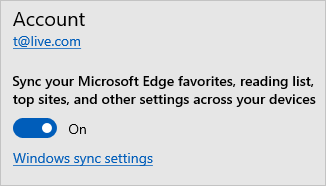

# Windows roaming settings reference

This is the list of settings that can be configured to sync across Windows. Other Microsoft products the user signs into can access them to enable a cohesive experience.

| Settings | Windows 10 (21H1 or newer)   Windows 11 (22H2 or newer)|
| --- | --- |
| Date, Time, and Region: country/region | sync |
| Date, Time, and Region: region format (locale) | sync |
| Inking & typing: Custom dictionary | sync (Windows 11 only) |
| Keyboard: turn on toggle keys | sync|
| Language: language profile | sync |
| Language: Windows Display language \* | sync   (to account only) |
| Mouse: Primary Mouse Button | sync |
| Passwords: Web Credentials | sync |
| Pen: Choose which hand you write with | sync |
| Pen: Use the top of the pen to erase ink when it’s available | sync (Windows 11 only) |
| Pen: Show visual effects, Show cursor | sync (Windows 11 only) |
| Pen: Display additional keys pressed when using my pen | sync (Windows 11 only) |
| Pen: Font, Font Size | sync (Windows 11 only) |
| Pen: Write with your fingertip | sync (Windows 11 only) |
| Touchpad: Scrolling Direction | sync |
| Voice Access: Automatic punctuation | sync (Windows 11 only) |
| Voice Typing: Voice typing launcher | sync (Windows 11 only) |
| Voice Typing: Automatic punctuation | sync (Windows 11 only) |
| Wi-Fi: Wi-Fi profiles (only WPA) | sync |

\* Display Language setting on Windows won't be impacted by changes from other devices or Microsoft products. 

Control over these settings can be found in Windows 10 under **Settings** > **Accounts** > **Sync your settings** or in Windows 11 under **Settings** > **Accounts** > **Windows backup** > **Remember my preferences**.

## Browser settings

For more information on the Sync behavior for the new Microsoft Edge, see the article [Microsoft Edge Sync](/deployedge/microsoft-edge-enterprise-sync).

Microsoft Edge browser setting group (favorites, reading list) syncing is managed through the Microsoft Edge browser Settings menu option.

## Next steps

For an overview, see [enterprise state roaming overview](./enterprise-state-roaming-enable.md).
