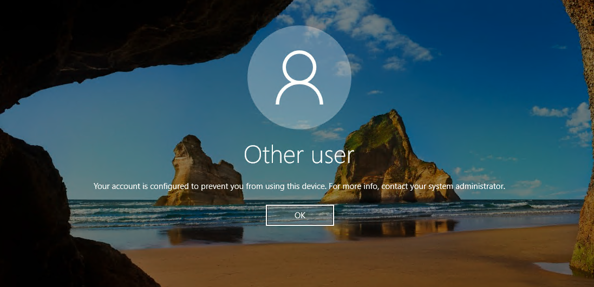
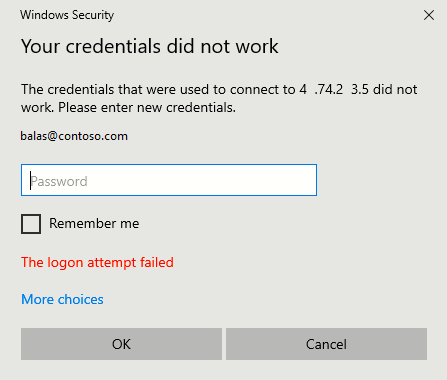
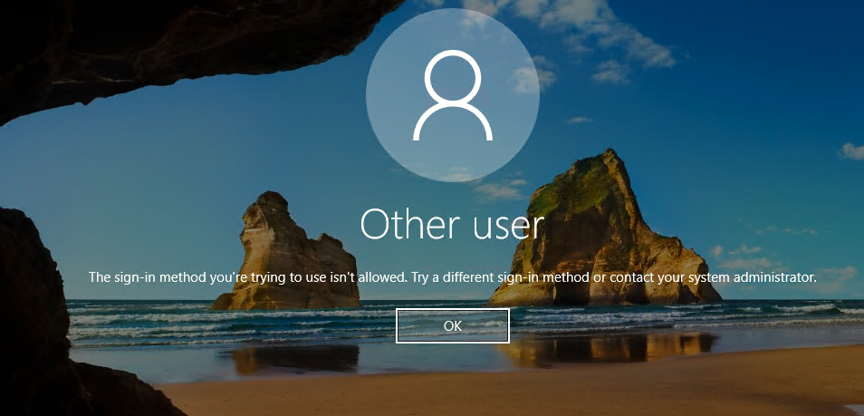

# Sign in to Windows virtual machine in Azure or Arc-enabled Windows Server, using Microsoft Entra ID and Azure Roles Based Access Control

Organizations can improve the security of Windows devices in Azure or connected using Azure Arc by integrating with Microsoft Entra authentication. You can now use Microsoft Entra ID as a core authentication platform to Remote Desktop Protocol (RDP) into supported versions of Windows. You can then centrally control and enforce Azure role-based access control (RBAC) and Conditional Access policies that allow or deny access to the devices.

This article shows you how to create and configure a Windows machine and sign in by using Microsoft Entra ID-based authentication.

There are many security benefits of using Microsoft Entra ID-based authentication to sign in to Windows devices in Azure or connected using Azure Arc. They include:

- Use Microsoft Entra authentication including passwordless to sign in to Windows devices. Reduce reliance on local administrator accounts.
- Use Password complexity and password lifetime policies that you configure for Microsoft Entra ID also help secure Windows devices.
- Use Azure role-based access control:
   - Specify who can sign in as a regular user or with administrator privileges.
   - When users join or leave your team, you can update Azure role-based access control policy to grant access as appropriate.
   - When employees leave your organization and their user accounts are disabled or removed from Microsoft Entra ID, they no longer have access to your resources.
- Use Conditional Access policy "phishing resistant MFA" and other signals such as user sign-in risk.
- Use Azure Policy to deploy and audit policies to require Microsoft Entra sign in for Windows devices and to flag the use of unapproved local accounts on the devices.
- Use Intune to automate and scale Microsoft Entra join with mobile device management (MDM) autoenrollment of Azure Windows VMs that are part of your virtual desktop infrastructure (VDI) deployments. MDM autoenrollment requires Microsoft Entra ID P1 licenses. Windows Server VMs don't support MDM enrollment.

MDM autoenrollment requires Microsoft Entra ID P1 licenses. Windows Server VMs don't support MDM enrollment.

> [!IMPORTANT]
> After you enable this capability, your Azure virtual machine / Arc-enabled machine will be Microsoft Entra joined. You can't join them to another domain, like on-premises Active Directory or Microsoft Entra Domain Services. If you need to do so, disconnect the device from Microsoft Entra by uninstalling the extension. In addition, if you deploy a supported golden image, you can enable Microsoft Entra ID authentication by installing the extension.

## Requirements

### Supported Azure regions and Windows distributions

This feature currently supports the following Windows distributions:

::: zone pivot="identity-extension-vm"
- Windows 11 21H2 or later installed.
- Windows 10, version 1809 or later installed.
- Windows Server 1809 or later installed with Desktop Experience.
::: zone-end

::: zone pivot="identity-extension-hybrid"
- Windows 11 24H2 or later installed.
- Windows Server 2025 or later installed with Desktop Experience.
::: zone-end

This feature is now available in the following Azure clouds:

- Azure Global
- Azure Government
- Microsoft Azure operated by 21Vianet

> [!NOTE]
> CIS hardened images support Microsoft Entra ID authentication for Microsoft Windows Enterprise and Microsoft Windows Server offerings. For more information, see: [CIS Hardened Images on Microsoft Windows Enterprise](https://azuremarketplace.microsoft.com/marketplace/apps/center-for-internet-security-inc.cis-windows-server).

### Network requirements

To enable Microsoft Entra authentication to virtual machines in Azure or Arc-enabled Windows Servers, you need to ensure that your network configuration permits outbound access to the following endpoints over TCP port 443.

Azure Global:
- `https://enterpriseregistration.windows.net`: Device registration.
::: zone pivot="identity-extension-vm"
- `http://169.254.169.254`: Azure Instance Metadata Service endpoint.
::: zone-end
::: zone pivot="identity-extension-hybrid"
- `http://localhost:40342`: Arc Instance Metadata Service endpoint.
::: zone-end
- `https://login.microsoftonline.com`: Authentication flows.
- `https://pas.windows.net`: Azure role-based access control flows.

Azure Government:
- `https://enterpriseregistration.microsoftonline.us`: Device registration.
::: zone pivot="identity-extension-vm"
- `http://169.254.169.254`: Azure Instance Metadata Service endpoint.
::: zone-end
::: zone pivot="identity-extension-hybrid"
- `http://localhost:40342`: Arc Instance Metadata Service endpoint.
::: zone-end

- `https://login.microsoftonline.us`: Authentication flows.
- `https://pasff.usgovcloudapi.net`: Azure role-based access control flows.

Microsoft Azure operated by 21Vianet:
- `https://enterpriseregistration.partner.microsoftonline.cn`: Device registration.
::: zone pivot="identity-extension-vm"
- `http://169.254.169.254`: Azure Instance Metadata Service endpoint.
::: zone-end
::: zone pivot="identity-extension-hybrid"
- `http://localhost:40342`: Arc Instance Metadata Service endpoint.
::: zone-end
- `https://login.chinacloudapi.cn`: Authentication flows.
- `https://pas.chinacloudapi.cn`: Azure role-based access control flows.

For Azure Arc-enabled Windows Servers, more network requirements are provided in the [Arc-connected server documentation](/azure/azure-arc/servers/network-requirements).

### Authentication requirements

[Microsoft Entra Guest accounts](~/external-id/what-is-b2b.md) can't connect to Azure VMs, Azure Bastion enabled VMs, or Arc-enabled Windows Servers via Microsoft Entra authentication.

<a name='enable-azure-ad-login-for-a-windows-vm-in-azure'></a>

## Enable Microsoft Entra sign in for a Windows virtual machine in Azure or Arc-enabled Windows Server

To use Microsoft Entra sign in for a Windows virtual machine in Azure or Arc-enabled Windows Server, you must:

1. Enable the Microsoft Entra sign in extension for the device.
1. Configure Azure role assignments for users.

### Enable Microsoft Entra sign in extension

Follow the appropriate link for your device for detailed deployment how-to and samples.

- [Azure virtual machine running Windows](/azure/virtual-machines/extensions/features-windows#run-vm-extensions)
- [Arc-enabled Windows Server](/azure/azure-arc/servers/manage-vm-extensions)

You must enable system-assigned managed identity on your Azure virtual machine or Arc-enabled Windows Server before you install the Microsoft Entra sign in virtual machine extension. Managed Identities are stored in a single Microsoft Entra tenant and currently don't support cross directory scenarios.

The following samples demonstrate Azure templates for Azure Virtual Machine extensions and extensions for Arc-enabled Windows Server.

::: zone pivot="identity-extension-vm"
```json
{
  "$schema": "http://schema.management.azure.com/schemas/2015-01-01/deploymentTemplate.json#",
  "contentVersion": "1.0.0.0",
  "parameters": {
    "vmName": {
      "type": "string"
    },
    "location": {
      "type": "string"
    }
  },
  "resources": [
    {
      "name": "[concat(parameters('vmName'),'/AADLogin')]",
      "type": "Microsoft.Compute/virtualMachines/extensions",
      "location": "[parameters('location')]",
      "apiVersion": "2015-06-15",
      "properties": {
        "publisher": "Microsoft.Azure.ActiveDirectory",
        "type": "AADLoginForWindows",
        "typeHandlerVersion": "1.0",
        "autoUpgradeMinorVersion": true
      }
    }
  ]
}
```
::: zone-end

::: zone pivot="identity-extension-hybrid"
```json
{
  "$schema": "https://schema.management.azure.com/schemas/2019-04-01/deploymentTemplate.json#",
  "contentVersion": "1.0.0.0",
  "parameters": {
    "vmName": {
      "type": "string"
    },
    "location": {
      "type": "string"
    }
  },
  "resources": [
    {
      "name": "[concat(parameters('vmName'),'/AADLogin')]",
      "type": "Microsoft.HybridCompute/machines/extensions",
      "location": "[parameters('location')]",
      "apiVersion": "2024-07-10",
      "properties": {
        "publisher": "Microsoft.Azure.ActiveDirectory",
        "type": "AADLoginForWindows",
        "typeHandlerVersion": "2.1.0.0",
        "autoUpgradeMinorVersion": true,
        "settings": {
            "mdmId": ""
        }
      }
    }
  ]
}
```

> [!NOTE]
> The Microsoft Entra sign in extension for Arc-enabled Windows Server requires the `mdmId` property nested within `settings`. The value of the property can be left as an empty string.
::: zone-end

After the extension is installed on the device, `provisioningState` shows `Succeeded`.

## Configure role assignments

A User account in Microsoft Entra must be added to a role assignment in Azure before the user is allowed to sign in to Azure virtual machines or Arc-connected Windows Server. The same roles are used for both Azure virtual machines and Arc-enabled Windows Server.

To assign user roles, you must have the [Virtual Machine Data Access Administrator](/azure/role-based-access-control/built-in-roles#virtual-machine-data-access-administrator-preview) role, or any role that includes the `Microsoft.Authorization/roleAssignments/write` action such as the [Role Based Access Control Administrator](/azure/role-based-access-control/built-in-roles#role-based-access-control-administrator-preview) role. However, if you use a different role than Virtual Machine Data Access Administrator, we recommend you [add a condition to reduce the permission to create role assignments](/azure/role-based-access-control/delegate-role-assignments-overview).

- **Virtual Machine Administrator Login:** Users who have this role assigned can sign in to an Azure virtual machine with administrator privileges.
- **Virtual Machine User Login:** Users who have this role assigned can sign in to an Azure virtual machine with regular user privileges.

> [!NOTE]
> Manually elevating a user to become a local administrator on the device by adding the user to a member of the local administrators group or by running `net localgroup administrators /add "AzureAD\UserUpn"` command isn't supported. You need to use roles in Azure to authorize sign in.

> [!NOTE]
>An Azure user who has the Owner or Contributor role assigned doesn't automatically have privileges to sign in to devices. The reason is to provide audited separation between the set of people who control virtual machines and the set of people who can access virtual machines.

The following documentation provides step-by-step details to add user accounts to role assignments in Azure:

- [Assign Azure roles by using the Azure portal](/azure/role-based-access-control/role-assignments-portal)
- [Assign Azure roles by using the Azure CLI](/azure/role-based-access-control/role-assignments-cli)
- [Assign Azure roles by using Azure PowerShell](/azure/role-based-access-control/role-assignments-powershell)


## Sign in by using Microsoft Entra credentials to a Windows VM

You can sign in over RDP using one of two methods:

- Passwordless using any of the supported Microsoft Entra credentials (recommended)
- Password/limited passwordless using Windows Hello for Business deployed using certificate trust model

<a name='log-in-using-passwordless-authentication-with-azure-ad'></a>

### Sign in using passwordless authentication with Microsoft Entra ID

To use passwordless authentication for your Windows VMs in Azure, you need the Windows client machine and the session host (VM) on the following operating systems:

- Windows 11 with [2022-10 Cumulative Updates for Windows 11 (KB5018418)](https://support.microsoft.com/kb/KB5018418) or later installed.
- Windows 10, version 20H2 or later with [2022-10 Cumulative Updates for Windows 10 (KB5018410)](https://support.microsoft.com/kb/KB5018410) or later installed.
- Windows Server 2022 with [2022-10 Cumulative Update for Microsoft server operating system (KB5018421)](https://support.microsoft.com/kb/KB5018421) or later installed.

> [!Note]
> When using the **web account to sign in to the remote computer** option, there is no requirement for the local device to be joined to a domain or Microsoft Entra ID.

To connect to the remote computer:

- Launch **Remote Desktop Connection** from Windows Search, or by running `mstsc.exe`.
- Select **Use a web account to sign in to the remote computer** option in the **Advanced** tab. This option is equivalent to the `enablerdsaadauth` RDP property. For more information, see [Supported RDP properties with Remote Desktop Services](/windows-server/remote/remote-desktop-services/clients/rdp-files).
- Specify the name of the remote computer and select **Connect**.

> [!IMPORTANT]
> IP address can't be used with **Use a web account to sign in to the remote computer** option.
> The name must match the hostname of the remote device in Microsoft Entra ID and be network addressable, resolving to the IP address of the remote device.

- When prompted for credentials, specify your user name in `user@domain.com` format.
- You're then prompted to allow the remote desktop connection when connecting to a new PC. Microsoft Entra remembers up to 15 hosts for 30 days before prompting again. If you see this dialogue, select **Yes** to connect.

> [!IMPORTANT]
> If your organization is using [Microsoft Entra Conditional Access](~/identity/conditional-access/overview.md), your device must satisfy the Conditional Access requirements to allow connection to the remote computer. Conditional Access policies might be applied to the application **Microsoft Remote Desktop (a4a365df-50f1-4397-bc59-1a1564b8bb9c)** for controlled access.

> [!NOTE]
> The Windows lock screen in the remote session doesn't support Microsoft Entra authentication tokens or passwordless authentication methods like FIDO keys. The lack of support for these authentication methods means that users can't unlock their screens in a remote session. When you try to lock a remote session, either through user action or system policy, the session is instead disconnected and the service sends a message to the user. Disconnecting the session also ensures that when the connection is relaunched after a period of inactivity, Microsoft Entra ID reevaluates the applicable Conditional Access policies.

<a name='log-in-using-passwordlimited-passwordless-authentication-with-azure-ad'></a>

### Sign in using password/limited passwordless authentication with Microsoft Entra ID

> [!IMPORTANT]
> Remote connection to VMs that are joined to Microsoft Entra ID is allowed only from Windows 10 or later PCs that are either Microsoft Entra registered (minimum required build is 20H1) or Microsoft Entra joined or Microsoft Entra hybrid joined to the *same* directory as the VM. Additionally, to RDP by using Microsoft Entra credentials, users must belong to one of the two Azure roles, Virtual Machine Administrator Login or Virtual Machine User Login.
>
> If you're using a Microsoft Entra registered Windows 10 or later PC, you must enter credentials in the `AzureAD\UPN` format (for example, `AzureAD\john@contoso.com`). At this time, you can use Azure Bastion to sign in with Microsoft Entra authentication [via the Azure CLI and the native RDP client mstsc](/azure/bastion/native-client).

To sign in to your Windows Server 2019 virtual machine by using Microsoft Entra ID:

1. Go to the overview page of the virtual machine enabled with Microsoft Entra sign in.
1. Select **Connect** to open the **Connect to virtual machine** pane.
1. Select **Download RDP File**.
1. Select **Open** to open the Remote Desktop Connection client.
1. Select **Connect** to open the Windows sign in dialog.
1. Sign in by using your Microsoft Entra credentials.

You're now signed in to the Windows Server 2019 Azure virtual machine with the role permissions as assigned, such as VM User or VM Administrator.

> [!NOTE]
> You can save the `.RDP` file locally on your computer to start future remote desktop connections to your virtual machine, instead of going to the virtual machine overview page in the Azure portal and using the connect option.

## Enforce Conditional Access policies

You can enforce Conditional Access policies, such as "phishing resistant MFA" or user sign-in risk check, before users can access Windows devices in Azure or Arc-enabled Windows Server. To apply a Conditional Access policy, you must select the **Microsoft Azure Windows Virtual Machine Sign-in** app from the cloud apps or actions assignment option.

Conditional Access policies that restrict sign in using device configuration rules aren't supported when connecting from a Windows Server device.

> [!NOTE]
> If you require MFA as a control, then you must supply an MFA claim as part of the client that initiates the RDP session to the target Windows device. The Remote Desktop application in Windows supports Conditional Access policies, however if you're using web sign in, you must use a Windows Hello for Business PIN or biometric authentication. Support for biometric authentication was added to the RDP client in Windows 10 version 1809. Remote desktop using Windows Hello for Business authentication is available only for deployments that use a certificate trust model and isn't available for a key trust model.

## Use Azure Policy to meet standards and assess compliance

Use Azure Policy to:

- Ensure that Microsoft Entra sign in is enabled for your new and existing Windows devices.
- Assess compliance of your environment at scale on a compliance dashboard.

With this capability, you can use many levels of enforcement. You can flag new and existing Windows devices within your environment that don't have Microsoft Entra sign in enabled. You can also use Azure Policy to deploy the Microsoft Entra extension to Windows virtual machines in Azure or Arc-enabled Windows Server.

In addition to these capabilities, you can use Azure Policy to detect and flag Windows machines that have unapproved local accounts created on their devices. To learn more, review [Azure Policy](/azure/governance/policy/overview).

## Troubleshoot deployment problems

The AADLoginForWindows extension must be installed successfully for the device to complete the Microsoft Entra join process. If the extension fails to be installed correctly, perform the following steps:

1. Connect to the device and examine the *CommandExecution.log* file under *C:\WindowsAzure\Logs\Plugins\Microsoft.Azure.ActiveDirectory.AADLoginForWindows\1.0.0.1*.

    If the extension restarts after the initial failure, the log with the deployment error will be saved as *CommandExecution_YYYYMMDDHHMMSSSSS.log*.

1. Open a PowerShell window on the device. Verify that the following queries against the Azure Instance Metadata Service endpoint running on the host return the expected output:

    For Azure virtual machines:
    
    | Command to run | Expected output |
    | --- | --- |
    | `curl.exe -H Metadata:true "http://169.254.169.254/metadata/instance?api-version=2017-08-01"` | Correct information about the Azure virtual machine |
    | `curl.exe -H Metadata:true "http://169.254.169.254/metadata/identity/info?api-version=2018-02-01"` | Valid tenant ID associated with the Azure subscription |
    | `curl.exe -H Metadata:true "http://169.254.169.254/metadata/identity/oauth2/token?resource=urn:ms-drs:enterpriseregistration.windows.net&api-version=2018-02-01"` | Valid access token issued by Microsoft Entra ID for the managed identity that is assigned to this virtual machine |
    
    For Arc-enabled Windows Servers:
    
    | Command to run | Expected output |
    | --- | --- |
    | `curl.exe -H Metadata:true "http://localhost:40342/metadata/instance?api-version=2017-08-01"` | Correct information about the Azure Arc-enabled Windows Server |
    | `curl.exe -H Metadata:true "http://localhost:40342/metadata/identity/info?api-version=2018-02-01"` | Valid tenant ID associated with the Azure subscription |
    | `curl.exe -H Metadata:true "http://localhost:40342/metadata/identity/oauth2/token?resource=urn:ms-drs:enterpriseregistration.windows.net&api-version=2018-02-01"` | Valid access token issued by Microsoft Entra ID for the managed identity that is assigned to this Azure Arc-enabled Windows Server |
    
    You can decode the access token by using a tool like [https://jwt.ms/](https://jwt.ms/). Verify that the `oid` value in the access token matches the managed identity of the device.

1. Ensure that the required endpoints are accessible from the device via PowerShell:

   - `curl.exe https://login.microsoftonline.com/ -D -`
   - `curl.exe https://login.microsoftonline.com/<TenantID>/ -D -`
   - `curl.exe https://enterpriseregistration.windows.net/ -D -`
   - `curl.exe https://device.login.microsoftonline.com/ -D -`
   - `curl.exe https://pas.windows.net/ -D -`

    Replace `<TenantID>` with the Microsoft Entra tenant ID associated with the Azure subscription. `login.microsoftonline.com/<TenantID>`,  `enterpriseregistration.windows.net`, and `pas.windows.net` should return 404 Not Found, which is expected behavior.

1. View the device state by running `dsregcmd /status`. The goal is for the device state to show as `AzureAdJoined : YES`.

   Microsoft Entra join activity is captured in Event Viewer under the *User Device Registration\Admin* log at *Event Viewer (local)\Applications* and *Services Logs\Microsoft\Windows\User Device Registration\Admin*.

If the AADLoginForWindows extension fails with an error code, you can perform the following steps.

### Device name already exists

If a device object with the same displayName as the hostname of the Azure virtual machine exists, the device fails to join Microsoft Entra with a hostname duplication error. Avoid duplication by [modifying the hostname](/azure/virtual-network/virtual-networks-viewing-and-modifying-hostnames#modify-a-hostname).

### Terminal error code 1007 and exit code -2145648574

Terminal error code 1007 and exit code -2145648574 translate to `DSREG_E_MSI_TENANTID_UNAVAILABLE`. The extension can't query the Microsoft Entra tenant information.

Connect to the device as a local administrator and verify that the endpoint returns a valid tenant ID from Azure Instance Metadata Service. Run the following command from an elevated PowerShell window on the device:

`curl -H Metadata:true http://169.254.169.254/metadata/identity/info?api-version=2018-02-01`

This problem can also happen when the admin attempts to install the AADLoginForWindows extension, but the device doesn't have a system-assigned managed identity. In that case, go to the **Identity** pane of the device. On the **System assigned** tab, verify that the **Status** toggle is set to **On**.

### Exit code -2145648607

Exit code -2145648607 translates to `DSREG_AUTOJOIN_DISC_FAILED`. The extension can't reach the `https://enterpriseregistration.windows.net` endpoint.

1. Verify that the required endpoints are accessible from the device via PowerShell:

   - `curl https://login.microsoftonline.com/ -D -`
   - `curl https://login.microsoftonline.com/<TenantID>/ -D -`
   - `curl https://enterpriseregistration.windows.net/ -D -`
   - `curl https://device.login.microsoftonline.com/ -D -`
   - `curl https://pas.windows.net/ -D -`

   Replace `<TenantID>` with the Microsoft Entra tenant ID of the Azure subscription. If you need to find the tenant ID, you can hover over your account name or select **Entra ID** > **Overview** > **Properties** > **Tenant ID**.

   Attempts to connect to `enterpriseregistration.windows.net` might return 404 Not Found, which is expected behavior. Attempts to connect to `pas.windows.net` might prompt for PIN credentials or might return 404 Not Found. (You don't need to enter the PIN.) Either one is sufficient to verify that the URL is reachable.

1. If any of the commands fails with "Couldn't resolve host `<URL>`," try running this command to determine which DNS server Windows is using:

   `nslookup <URL>`

   Replace `<URL>` with the fully qualified domain names that the endpoints use, such as `login.microsoftonline.com`.

1. See whether specifying a public DNS server allows the command to succeed:

   `nslookup <URL> 208.67.222.222`

1. If necessary, change the DNS server assigned to the network security group that the device belongs to.

### Exit code 51

Exit code 51 translates to "This extension isn't supported on this operating system."

The AADLoginForWindows extension is intended to be installed only on Azure virtual machines with operating systems Windows Server 2019 or Windows 10 1809 or later, and Arc-enabled Windows Servers with operating systems Windows Server 2025 or Windows 11 24H2 on Arc-enabled Windows Server. Ensure that your version or build of Windows is supported. If it isn't supported, uninstall the extension.

## Troubleshoot sign-in problems

Use the following information to correct sign-in problems.

You can view the device and single sign-on (SSO) state by running `dsregcmd /status`. The goal is for the device state to show as `AzureAdJoined : YES` and for the SSO state to show `AzureAdPrt : YES`.

RDP sign-in via Microsoft Entra accounts is captured in Event Viewer under the *Applications and Services Logs\Microsoft\Windows\AAD\Operational* event logs.

### Azure role not assigned

You might get the following error message when you initiate a remote desktop connection to your device: "Your account is configured to prevent you from using this device. For more info, contact your system administrator."



Verify the [Azure role-based access control policies](#configure-role-assignments) that grant the user the Virtual Machine Administrator Login or Virtual Machine User Login role.

If you're having problems with Azure role assignments, see [Troubleshoot Azure role-based access control](/azure/role-based-access-control/troubleshooting).

### Unauthorized client or password change required

You might get the following error message when you initiate a remote desktop connection to your device: "Your credentials didn't work."



Try these solutions:

- The Windows 10 or later PC that you're using to initiate the remote desktop connection must be Microsoft Entra joined, or Microsoft Entra hybrid joined to the same Microsoft Entra directory. For more information about device identity, see the article [What is a device identity?](./overview.md).

  Windows 10 Build 20H1 added support for a Microsoft Entra registered PC to initiate an RDP connection to your device. When you're using a PC that's Microsoft Entra registered (not Microsoft Entra joined or Microsoft Entra hybrid joined) as the RDP client to initiate connections to your device, you must enter credentials in the format `AzureAD\UPN` (for example, `AzureAD\john@contoso.com`).

  Verify that the AADLoginForWindows extension wasn't uninstalled after the Microsoft Entra join finished.

  Also, make sure that the security policy **Network security: Allow PKU2U authentication requests to this computer to use online identities** is enabled on both the server *and* the client.

- Verify that the user doesn't have a temporary password. Temporary passwords can't be used to sign in to a remote desktop connection.

  Sign in with the user account in a web browser. For instance, sign in to the [Azure portal](https://portal.azure.com) in a private browsing window. If you're prompted to change the password, set a new password. Then try connecting again.

### MFA sign-in method required

You might see the following error message when you initiate a remote desktop connection to your device: "The sign-in method you're trying to use isn't allowed. Try a different sign-in method or contact your system administrator."



If you configure a Conditional Access policy that requires MFA, you need to ensure that the device initiating the connection uses strong authentication such as Windows Hello.

Another MFA-related error message is the one described previously: "Your credentials didn't work."


If you configure a legacy per-user **Enabled/Enforced Microsoft Entra multifactor authentication** setting and you see the error, you can resolve the problem by removing the per-user MFA setting. For more information, see the article [Enable per-user Microsoft Entra multifactor authentication to secure sign-in events](../authentication/howto-mfa-userstates.md).

If Windows Hello for Business isn't an option, configure a Conditional Access policy that excludes the Microsoft Azure Windows Virtual Machine Sign-in app. To learn more about Windows Hello for Business, see [Windows Hello for Business overview](/windows/security/identity-protection/hello-for-business/hello-identity-verification).

Support for biometric authentication with RDP was added in Windows 10 version 1809. Using Windows Hello for Business authentication during RDP is available for deployments that use a certificate trust model or key trust model.

Share your feedback about this feature or report problems with using it on the [Microsoft Entra feedback forum](https://feedback.azure.com/d365community/forum/22920db1-ad25-ec11-b6e6-000d3a4f0789).

### Missing application

If the Microsoft Azure Windows Virtual Machine Sign-in application is missing from Conditional Access, make sure that the application is in the tenant:

1. Sign in to the [Microsoft Entra admin center](https://entra.microsoft.com) as at least a [Cloud Application Administrator](~/identity/role-based-access-control/permissions-reference.md#cloud-application-administrator).
1. Browse to **Entra ID** > **Enterprise apps**.
1. Remove the filters to see all applications, and search for **VM**. If you don't see **Microsoft Azure Windows Virtual Machine Sign-in** as a result, the service principal is missing from the tenant.


Another way to verify it is via Graph PowerShell:

1. [Install the Graph PowerShell SDK](/powershell/microsoftgraph/installation).
1. Run `Connect-MgGraph -Scopes "ServicePrincipalEndpoint.ReadWrite.All"`, followed by `"Application.ReadWrite.All"`.
1. Sign in with a Global Administrator account.
1. Consent to the permission prompt.
1. Run `Get-MgServicePrincipal -ConsistencyLevel eventual -Search '"DisplayName:Azure Windows VM Sign-In"'`.
   - If this command results in no output and returns you to the PowerShell prompt, you can create the service principal with the following Graph PowerShell command:

      `New-MgServicePrincipal -AppId 372140e0-b3b7-4226-8ef9-d57986796201`
   - Successful output shows that the Microsoft Azure Windows Virtual Machine Sign-in app and its ID were created.
1. Sign out of Graph PowerShell by using the `Disconnect-MgGraph` command.

Some tenants might see the application named Azure Windows VM Sign-in instead of Microsoft Azure Windows Virtual Machine Sign-in. The application has the same Application ID of 372140e0-b3b7-4226-8ef9-d57986796201.

### Unable to use this capability when require compliant device Conditional Access policy is enforced on Azure Windows VM Sign-in resource and you are connecting from a Windows Server device

Windows Server device compliance configuration in Conditional Access policy isn't supported.

## Next steps

For more information about Microsoft Entra ID, see [What is Microsoft Entra ID?](~/fundamentals/whatis.md).
