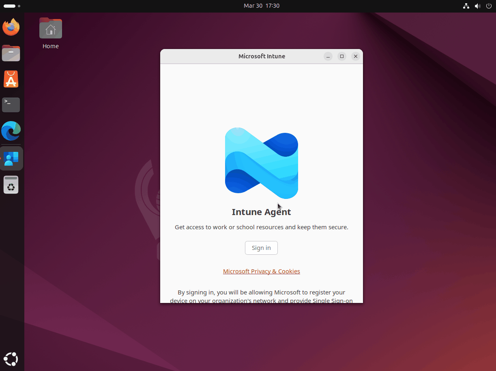

# What is Microsoft single sign-on for Linux?

Microsoft single sign-on (SSO) for Linux is powered by the Microsoft Identity Broker, a software component that integrates Linux devices with Microsoft Entra ID. This solution enables users to authenticate once with their Microsoft Entra ID credentials and access multiple applications and resources without repeated authentication prompts. The feature simplifies the sign-in process for users and reduces password management overhead for administrators. 

## Features

This feature empowers users on Linux desktop clients to register their devices with Microsoft Entra ID, enroll into Intune management, and satisfy device-based Conditional Access policies when accessing their corporate resources.

- Provides Microsoft Entra ID registration & enrollment of Linux desktops
- Provides SSO capabilities for native and web applications (for example, Azure CLI, Microsoft Edge, Teams PWA) to access Microsoft 365 and Azure protected resources
- Provides SSO for Microsoft Entra accounts across applications that use MSAL for .NET or MSAL for Python, enabling customers to use Microsoft Authentication Library (MSAL) to integrate SSO into custom apps
- Enables Conditional Access policies protecting web applications via Microsoft Edge
- Enables standard Intune compliance policies
- Enables support for Bash scripts for custom compliance policies

The Teams web application and a Progressive Web App (PWA) for Linux use Conditional Access configuration applied through Microsoft Intune to enable Linux users to access Teams using Microsoft Edge.

## Prerequisites

### Supported Operating Systems

Microsoft single sign-on for Linux is supported on the following operating systems (physical or Hyper-V machines with x86/64 CPUs):

- Ubuntu Desktop 24.04 LTS (Long Term Support)
- Ubuntu Desktop 22.04 LTS (Long Term Support) 
- Red Hat Enterprise Linux 8 (Long Term Support)
- Red Hat Enterprise Linux 9 (Long Term Support)

### System Requirements

- Internet connectivity for package installation and Microsoft Entra ID communication
- Administrative privileges for installation
- Desktop environment ([GNOME](https://www.gnome.org/), [KDE](https://kde.org/), or similar)

### Microsoft Entra ID Requirements

- Microsoft Entra ID tenant
- User accounts synchronized with or created in Microsoft Entra ID
- Appropriate licensing for conditional access policies (if applicable)

## SSO experience

The following animation shows the sign-in experience for brokered flows on Linux.

### [password authentication](#tab/password-auth)

Using Password authentication on Linux, as shown in the following animation.



### [phish-resistant MFA](#tab/prmfa-auth)

Using PRMFA auth via SmartCard on Linux provides a seamless sign-in experience, as shown in the following animation.


---

> [!NOTE]
> `microsoft-identity-broker` version 2.0.1 and earlier versions don't currently support [FIPS compliance](https://www.nist.gov/standardsgov/compliance-faqs-federal-information-processing-standards-fips).


## Installation

Run the following commands in a command line to manually install the Microsoft single sign-on (microsoft-identity-broker) and its dependencies on your device.  

### [Ubuntu](#tab/debian-install)

1. Install Curl. 

    ```bash
    sudo apt install curl gpg
    ```

2. Install the Microsoft package signing key.  

    ```bash
    curl https://packages.microsoft.com/keys/microsoft.asc | gpg --dearmor > microsoft.gpg
    sudo install -o root -g root -m 644 microsoft.gpg /usr/share/keyrings
    rm microsoft.gpg
    ```

3. Add and update Microsoft Linux Repository to the system repository list.

    ```bash
    sudo sh -c 'echo "deb [arch=amd64 signed-by=/usr/share/keyrings/microsoft.gpg] https://packages.microsoft.com/ubuntu/$(lsb_release -rs)/prod $(lsb_release -cs) main" >> /etc/apt/sources.list.d/microsoft-ubuntu-$(lsb_release -cs)-prod.list'
    sudo apt update
    ```

4. Install the Microsoft single sign-on (microsoft-identity-broker) app.

    ```bash
    sudo apt install microsoft-identity-broker
    ```

5. Reboot your device.  

### [RHEL 8/9](#tab/redhat89-install-prod)

1. Potential prerequisite depending on your systems configuration. 

     ```bash
    # This fixes gpg key issues
    sudo dnf update redhat-release
    
    # Update to the latest release
    sudo dnf upgrade -y
    
    # RHEL 10 does not ship `webkitgtk6.0` in its default repos. You must enable EPEL first:
    sudo dnf install -y https://dl.fedoraproject.org/pub/epel/epel-release-latest-10.noarch.rpm
    ```

2. Add the Microsoft repository.  

   ```bash
   sudo rpm --import https://packages.microsoft.com/keys/microsoft.asc
   sudo dnf install -y dnf-plugins-core
   sudo dnf config-manager --add-repo https://packages.microsoft.com/yumrepos/microsoft-rhel$(rpm -E %rhel).0-prod
   ```

3. Install the Microsoft single sign-on (microsoft-identity-broker) app.  

   ```bash
   sudo dnf install microsoft-identity-broker
   ```
   
4. Install the Microsoft single sign-on (microsoft-identity-broker) app.

    ```bash
    sudo dnf update
    sudo dnf install microsoft-identity-broker
    ```

5. Reboot your device.  


### [RHEL 10](#tab/redhat10-install-prod)

1. Potential pre-requisites depending on your systems configuration. 

     ```bash
    # This fixes any gpg key issues
    sudo dnf update redhat-release
    
    # Update to the latest release
    sudo dnf upgrade -y
    
    # RHEL 10 does not ship `webkitgtk6.0` in its default repos. You must enable EPEL first:
    sudo dnf install -y https://dl.fedoraproject.org/pub/epel/epel-release-latest-10.noarch.rpm
    ```

1. Install the Microsoft production package signing key. RHEL 10 packages are signed with a newer Microsoft GPG key (RSA-4096), different from the `microsoft.asc` key used for RHEL 8/9. You can find more information around [Microsoft GPG Repository Signing Keys](/windows-server/identity/ad-fs/operations/gpg-signing-keys). Import both keys
    
    ```bash
    # Legacy key (needed for Edge)
    sudo rpm --import https://packages.microsoft.com/keys/microsoft.asc
    
    # New key for RHEL 10 packages
    sudo rpm --import https://packages.microsoft.com/rhel/10/prod/repodata/repomd.xml.key
    ```
  
2. Then add the repository by creating a new repo file under `/etc/yum.repos.d/` with the following content:

    ```bash
    sudo tee /etc/yum.repos.d/microsoft-prod.repo > /dev/null <<EOF
    [microsoft-prod]
    name=Microsoft prod - RHEL 10
    baseurl=https://packages.microsoft.com/rhel/10/prod
    enabled=1
    gpgcheck=1
    gpgkey=https://packages.microsoft.com/rhel/10/prod/repodata/repomd.xml.key
    EOF
    ```

---

## Update Microsoft Identity Broker

Run the following commands to update the Microsoft Identity Broker manually.    

### [Ubuntu](#tab/debian-update)

1. Update the package repository and metadata.   

    ```bash
    sudo apt update
    ```

2. Upgrade the Microsoft Identity Broker package.  

    ```bash
    sudo apt upgrade microsoft-identity-broker
    ```

### [Red Hat Enterprise Linux](#tab/redhat-update)

Run one of the following commands to update the Microsoft Identity Broker.  

- Update to the latest release, which includes the latest Microsoft Identity Broker package.   
    
    ```bash
    sudo dnf update
    ```

- Upgrade only the Microsoft Identity Broker package.  

    ```bash
    sudo dnf update microsoft-identity-broker
    ```
   
---

## Uninstall Microsoft Identity Broker

Run the following commands to uninstall the Microsoft Identity Broker and remove local configuration data.

### [Ubuntu](#tab/debian-uninstall)

1. Remove the Microsoft Identity Broker from your system.  

    ```bash
    sudo apt remove microsoft-identity-broker
    ```
    
2. Remove the local configuration data.      

    ```bash
    sudo apt purge intune-portal
    sudo apt purge microsoft-identity-broker
    ``` 

### [Red Hat Enterprise Linux](#tab/redhat-uninstall)

Run the following commands to uninstall the Microsoft Identity Broker and remove local registration data on Red Hat Enterprise Linux.    

1. Remove the Microsoft Identity Broker package.  

    ```bash
    sudo dnf remove microsoft-identity-broker
    ```
   
2. Remove local registration data.  

    ```bash
    sudo rm -rf /var/opt/microsoft/identity-broker
    sudo rm -rf /etc/opt/microsoft/identity-broker
    sudo rm -rf /opt/microsoft/identity-broker
    ```  

---

> [!WARNING]
> Note that uninstalling the Microsoft Identity Broker doesn't automatically unregister your device from Microsoft Entra ID, nor unenroll your device from Intune management. To remove the device registration, you can either use the [dsregcmd tool](troubleshoot-device-registration-tool-linux.md) or remove the device from the Microsoft Entra ID portal.

---

## Unregister device using dsregc

With the release of 2.5.x of the `microsoft-identity-broker`, we've included a new utility called the `dsreg` tool that allows you to manage your device's registration with Microsoft Entra ID. 

To unregister your device from Microsoft Entra ID using the `dsreg` tool, run the following command in your terminal, replacing `<tenant-guid>` with your Microsoft Entra ID tenant GUID:

```bash
sudo dsreg --tenant-id <tenant-guid> --unregister
```

If your system gets into a bad state and you want to clean all local registration data and key material, you can use the `--cleanup` option with the `dsreg` tool. This utility mode is useful in scenarios where you want to ensure that all local traces of the Microsoft Identity Broker are removed from the device, such as when troubleshooting or preparing the device for a new user.

To unregister and remove any key material using the dsreg tool, run the following command in your terminal:

```bash
# Clean broker state including certificates (requires sudo)
sudo dsreg --cleanup
```

> [!WARNING]
> The `--cleanup` option is irreversible and removes all key material from the device. Use with caution.

## Enabling Phish-Resistant MFA (PRMFA) on Linux devices 

Beginning with version `2.0.2` of the microsoft-identity-broker, Phish-Resistant MFA (PRMFA) is supported on Linux devices using:
- SmartCard
- Certificate Based Authentication (CBA)
- USB tokens containing a PIV/Smartcard applet

The Smart Card integration is supported only on the following distributions:
- Ubuntu Desktop 24.04 LTS (Long Term Support)
- Ubuntu Desktop 22.04 LTS (Long Term Support)
- Red Hat Enterprise Linux 10 (Long Term Support)

Certificate-based client authentication is implemented through the Secure Sockets Layer (TLS/SSL) protocol. In this process, the client signs a randomly generated data block with its private key, then transmits both the certificate and the signed data to the server. The server checks the signature and validates the certificate before granting access.

The easiest way to configure Certificate-Based Authentication (CBA) is to use a Private Key Infrastructure (PKI) solution that issues user certificates to Linux devices. These certificates can then be used for authentication against Microsoft Entra ID. To configure Linux to accept these certificates for authentication, you typically need to set up the appropriate certificate stores and ensure that the system's authentication mechanisms are configured to use these certificates. 

### Smart Card Authentication

Smart card authentication extends certificate-based methods by introducing a physical token that stores user certificates. When the card is inserted into a reader, the system retrieves the certificates and performs validation.

Configuring SmartCard support involves setting up the necessary libraries and modules to enable certificate-based authentication using physical tokens. There are various SmartCard solutions available, such as YubiKey, which can be integrated with various Linux distributions. For instructions on the two supported platforms, refer to the distribution documentation:
- [Ubuntu SmartCard configuration](https://documentation.ubuntu.com/server/how-to/security/smart-card-authentication/)
- [Red Hat Enterprise Linux SmartCard configuration](https://docs.redhat.com/en/documentation/red_hat_enterprise_linux/9/html/managing_smart_card_authentication/index)
- [YubiKey SmartCard configuration](https://developers.yubico.com/pam-u2f/)
- [OpenSC SmartCard configuration](https://github.com/OpenSC/OpenSC/wiki)
- [PKCS#11 configuration reference](https://p11-glue.github.io/p11-glue/p11-kit/manual/pkcs11-conf.html)

### Example Smart Card configuration

The following steps configure a reference example of using the YubiKey/Edge bridge integration, but other smart card providers can be configured similarly. This is just an example configuration and your configuration may vary per provider. Refer to your smart card provider documentation for specific configuration instructions. 

### [Ubuntu](#tab/debian-sc-example)

1. Install Smart Card drivers and YubiKey support:

    ```bash
    sudo apt install pcscd yubikey-manager
    ```

2. Install YubiKey/Edge Bridge components:

    ```bash
    sudo apt install opensc libnss3-tools openssl
    ```

3. Configure Network Security Service (NSS) database for the current user:

    ```bash
    mkdir -p $HOME/.pki/nssdb
    chmod 700 $HOME/.pki
    chmod 700 $HOME/.pki/nssdb
    modutil -force -create -dbdir sql:$HOME/.pki/nssdb
    modutil -force -dbdir sql:$HOME/.pki/nssdb -add 'SC Module' -libfile /usr/lib/x86_64-linux-gnu/pkcs11/opensc-pkcs11.so
    ```

### [RHEL 10](#tab/rhel-sc-example)

1. Install Smart Card drivers support. Note: most of these packages are likely already installed as dependencies of the microsoft-identity-broker, but in case they aren't, you can install them with the following command:

    ```bash
    sudo dnf install -y pcsc-lite pcsc-lite-libs opensc nss-tools p11-kit p11-kit-devel
    ```

2. Enable pcscd service to read smart cards from the reader, and initialize Network Security Service (NSS) database for the current user:

    ```bash
    sudo systemctl enable --now pcscd
    
    mkdir -p $HOME/.pki/nssdb
    certutil -d sql:$HOME/.pki/nssdb -N --empty-password
    ```

---


## Related Content

For more information, see the following Intune documentation:

- [What's new in Microsoft single sign-on for Linux](whats-new-linux.md)
- [Troubleshoot device registration on Linux using dsregcmd](troubleshoot-device-registration-tool-linux.md)
- [Deployment guide: Manage Linux devices in Microsoft Intune](/mem/intune-service/fundamentals/deployment-guide-platform-linux)
- [Enrollment guide: Enroll Linux desktop devices in Microsoft Intune](/mem/intune-service/fundamentals/deployment-guide-enrollment-linux)

