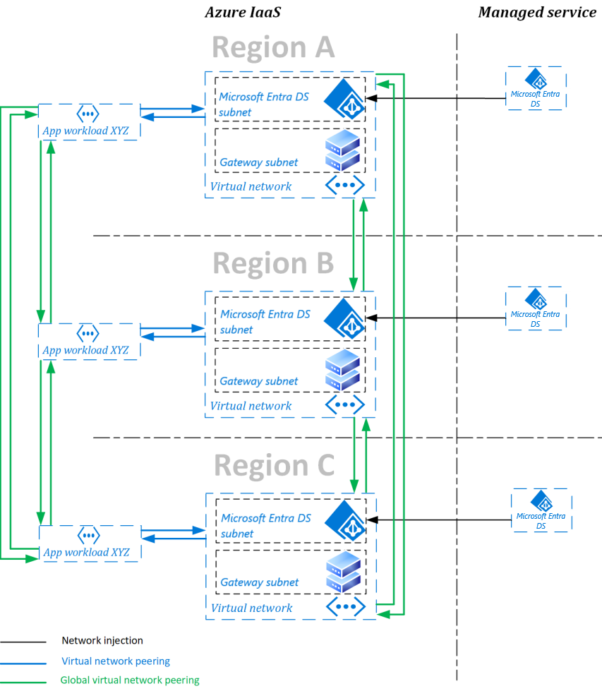

# Replica sets concepts and features for Microsoft Entra Domain Services

When you create a Microsoft Entra Domain Services managed domain, you define a unique namespace. This namespace is the domain name, such as *contosocloud.com*, and two domain controllers (DCs) are then deployed into your selected Azure region. This deployment of DCs is known as a replica set.

You can expand a managed domain to have more than one replica set per Microsoft Entra tenant. Replica sets can be added to any peered virtual network in any Azure region that supports Domain Services. Additional replica sets in different Azure regions provide geographical disaster recovery for legacy applications if an Azure region goes offline.

> [!NOTE]
> Replica sets don't let you deploy multiple unique managed domains in a single Azure tenant. Each replica set contains the same data.

## How replica sets work

When you create a managed domain, such as *contosocloud.com*, an initial replica set is created. Additional replica sets share the same namespace and configuration. Changes to Domain Services, including configuration, user identity and credentials, groups, group policy objects, computer objects, and other changes are applied to all replica sets in the managed domain using AD DS replication.

You create each replica set in a virtual network. Each virtual network must be peered to every other virtual network that hosts a managed domain's replica set. This configuration creates a mesh network topology that supports directory replication. A virtual network can support multiple replica sets, provided that each replica set is in a different virtual subnet.

All replica sets are placed in the same Active Directory site. As the result, all changes are propagated using intrasite replication for quick convergence.

> [!NOTE]
> It's not possible to define separate sites and define replication settings between replica sets.

The following diagram shows a managed domain with two replica sets. The first replica set is created with the domain namespace. A second replica set is created after that:

> [!NOTE]
> Replica sets ensure availability of authentication services in regions where a replica set is configured. For an application to have geographical redundancy if there's a regional outage, the application platform that relies on the managed domain must also reside in the other region.
>
> Resiliency of other services required for the application to function, such as Azure VMs or Azure App Services, isn't provided by replica sets. Availability design of other application components needs to consider resiliency features for services that make up the application.

The following example shows a managed domain with three replica sets to further provide resiliency and ensure availability of authentication services. In both examples, application workloads exist in the same region as the managed domain replica set:

## Deployment considerations

The default SKU for a managed domain is the *Enterprise* SKU, which supports multiple replica sets. To create additional replica sets if you changed to the *Standard* SKU, [upgrade the managed domain](change-sku.md) to *Enterprise* or *Premium*.

The supported maximum number of replica sets is five, including the first replica created when you created the managed domain.

Billing for each replica set is based on the domain configuration SKU. For example, if you have a managed domain that uses the *Enterprise* SKU and you have three replica sets, your subscription is billed per hour for each of the three replica sets.

## Frequently asked questions

### Can I create a replica set in subscription different from my managed domain?

No. Replica sets must be in the same subscription as the managed domain.

### How many replica sets can I create?

You can create a maximum of five replica sets—the initial replica set for the managed domain, plus four additional replica sets.

### How does user and group information get synchronized to my replica sets?

All replica sets are connected to each other using a mesh virtual network peering. One replica set receives user and group updates from Microsoft Entra ID. Those changes are then replicated to the other replica sets using intrasite AD DS replication over the peered network.

Just like with on-premises AD DS, an extended disconnected state can cause disruption in replication. As peered virtual networks aren't transitive, the design requirements for replica sets requires a fully meshed network topology.

### How do I make changes in my managed domain after I have replica sets?

Changes within the managed domain work just like they previously did. You [create and use a management VM with the RSAT tools that is joined to the managed domain](tutorial-create-management-vm.md). You can join as many management VMs to the managed domain as you wish.

## Next steps

To get started with replica sets, [create and configure a Domain Services managed domain][tutorial-create-advanced]. When deployed, [create and use additional replica sets][create-replica-set].

<!-- LINKS - INTERNAL -->
[tutorial-create-advanced]: tutorial-create-instance-advanced.md
[create-replica-set]: tutorial-create-replica-set.md
