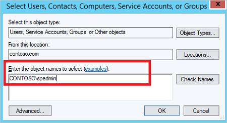

# Configure Microsoft Entra Domain Services to support user profile synchronization for SharePoint Server

SharePoint Server includes a service to synchronize user profiles. This feature allows user profiles to be stored in a central location and accessible across multiple SharePoint sites and farms. To configure the SharePoint Server user profile service, the appropriate permissions must be granted in a Microsoft Entra Domain Services managed domain. For more information, see [user profile synchronization in SharePoint Server](/SharePoint/administration/user-profile-service-administration).

This article shows you how to configure Domain Services to allow the SharePoint Server user profile sync service.

## Before you begin

To complete this article, you need the following resources and privileges:

* An active Azure subscription.
    * If you don't have an Azure subscription, [create an account](https://azure.microsoft.com/free/?WT.mc_id=A261C142F).
* A Microsoft Entra tenant associated with your subscription, either synchronized with an on-premises directory or a cloud-only directory.
    * If needed, [create a Microsoft Entra tenant][create-azure-ad-tenant] or [associate an Azure subscription with your account][associate-azure-ad-tenant].
* A Microsoft Entra Domain Services managed domain enabled and configured in your Microsoft Entra tenant.
    * If needed, complete the tutorial to [create and configure a Microsoft Entra Domain Services managed domain][create-azure-ad-ds-instance].
* A Windows Server management VM that is joined to the Domain Services managed domain.
    * If needed, complete the tutorial to [create a management VM][tutorial-create-management-vm].
* A user account that's a member of the *Microsoft Entra DC administrators* group in your Microsoft Entra tenant.
* The SharePoint service account name for the user profile synchronization service. For more information about the *Profile Synchronization account*, see [Plan for administrative and service accounts in SharePoint Server][sharepoint-service-account]. To get the *Profile Synchronization account* name from the SharePoint Central Administration website, click **Application Management** > **Manage service applications** > **User Profile service application**. For more information, see [Configure profile synchronization by using SharePoint Active Directory Import in SharePoint Server](/SharePoint/administration/configure-profile-synchronization-by-using-sharepoint-active-directory-import).

## Service accounts overview

In a managed domain, a security group named *Microsoft Entra DC Service Accounts* exists as part of the *Users* organizational unit (OU). Members of this security group are delegated the following privileges:

- **Replicate Directory Changes** privilege on the root DSE.
- **Replicate Directory Changes** privilege on the *Configuration* naming context (`cn=configuration` container).

The *Microsoft Entra DC Service Accounts* security group is also a member of the built-in group *Pre-Windows 2000 Compatible Access*.

When added to this security group, the service account for SharePoint Server user profile synchronization service is granted the required privileges to work correctly.

## Enable support for SharePoint Server user profile sync

The service account for SharePoint Server needs adequate privileges to replicate changes to the directory and let SharePoint Server user profile sync work correctly. To provide these privileges, add the service account used for SharePoint user profile synchronization to the *Microsoft Entra DC Service Accounts* group.

From your Domain Services management VM, complete the following steps:

> [!NOTE]
> To edit group membership in a managed domain, you must be signed in to a user account that's a member of the *AAD DC Administrators* group.

1. From the Start screen, select **Administrative Tools**. A list of available management tools is shown that were installed in the tutorial to [create a management VM][tutorial-create-management-vm].
1. To manage group membership, select **Active Directory Administrative Center** from the list of administrative tools.
1. In the left pane, choose your managed domain, such as *aaddscontoso.com*. A list of existing OUs and resources is shown.
1. Select the **Users** OU, then choose the *Microsoft Entra DC Service Accounts* security group.
1. Select **Members**, then choose **Add...**.
1. Enter the name of the SharePoint service account, then select **OK**. In the following example, the SharePoint service account is named *spadmin*:

    

<!-- INTERNAL LINKS -->
[create-azure-ad-tenant]: /azure/active-directory/fundamentals/sign-up-organization
[associate-azure-ad-tenant]: /azure/active-directory/fundamentals/how-subscriptions-associated-directory
[create-azure-ad-ds-instance]: tutorial-create-instance.md
[tutorial-create-management-vm]: tutorial-create-management-vm.md

<!-- EXTERNAL LINKS -->
[sharepoint-service-account]: /sharepoint/security-for-sharepoint-server/plan-for-administrative-and-service-accounts
