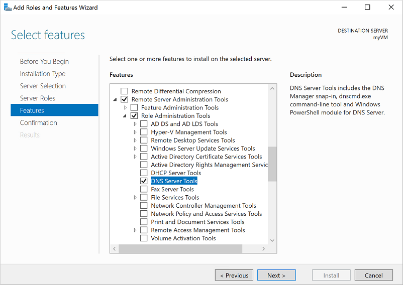
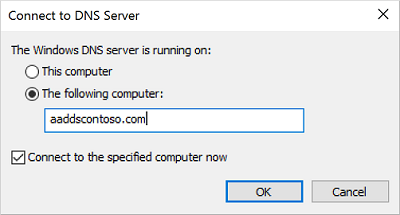
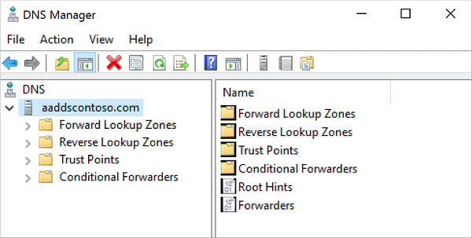

# Administer DNS and create conditional forwarders in a Microsoft Entra Domain Services managed domain

Microsoft Entra Domain Services includes a Domain Name System (DNS) server that provides name resolution for the managed domain. This DNS server includes built-in DNS records and updates for the key components that allow the service to run.

As you run your own applications and services, you may need to create DNS records for machines that aren't joined to the domain, configure virtual IP addresses for load balancers, or set up external DNS forwarders. Users who belong to the *AAD DC Administrators* group are granted DNS administration privileges on the Domain Services managed domain and can create and edit custom DNS records.

In a hybrid environment, DNS zones and records configured in other DNS namespaces, such as an on-premises AD DS environment, aren't synchronized to the managed domain. To resolve named resources in other DNS namespaces, create and use conditional forwarders that point to existing DNS servers in your environment.

Domain Services communicates with multiple Azure endpoints during normal operations. Redirecting zones such as file.core.windows.net or blob.core.windows.net puts Domain Services in an unsupportable state. 

Refrain from redirecting DNS zones related to windowsazure.com or core.windows.net. If DNS redirection is required, limit the redirection to individual host names instead of zones. For example, use server1.file.core.windows.net instead of file.core.windows.net.

>[!NOTE]
>Creating or changing root hints or server-level DNS forwarders isn't supported and causes issues for the Domain Services managed domain. 

This article shows you how to install the DNS Server tools then use the DNS console to manage records and create conditional forwarders in Domain Services.

## Before you begin

To complete this article, you need the following resources and privileges:

* An active Azure subscription.
    * If you don't have an Azure subscription, [create an account](https://azure.microsoft.com/free/?WT.mc_id=A261C142F).
* A Microsoft Entra tenant associated with your subscription, either synchronized with an on-premises directory or a cloud-only directory.
    * If needed, [create a Microsoft Entra tenant][create-azure-ad-tenant] or [associate an Azure subscription with your account][associate-azure-ad-tenant].
* A Microsoft Entra Domain Services managed domain enabled and configured in your Microsoft Entra tenant.
    * If needed, complete the tutorial to [create and configure a Microsoft Entra Domain Services managed domain][create-azure-ad-ds-instance].
* Connectivity from your Domain Services virtual network to where your other DNS namespaces are hosted.
    * This connectivity can be provided with an [Azure ExpressRoute][expressroute] or [Azure VPN Gateway][vpn-gateway] connection.
* A Windows Server management VM that is joined to the managed domain.
    * If needed, complete the tutorial to [create a Windows Server VM and join it to a managed domain][create-join-windows-vm].
* A user account that's a member of the *Microsoft Entra DC administrators* group in your Microsoft Entra tenant.

## Install DNS Server tools

To create and modify DNS records in a managed domain, you need to install the DNS Server tools. These tools can be installed as a feature in Windows Server. For more information on how to install the administrative tools on a Windows client, see install [Remote Server Administration Tools (RSAT)][install-rsat].

1. Sign in to your management VM. For steps on how to connect using the Microsoft Entra admin center, see [Connect to a Windows Server VM][connect-windows-server-vm].
1. If **Server Manager** doesn't open by default when you sign in to the VM, select the **Start** menu, then choose **Server Manager**.
1. In the *Dashboard* pane of the **Server Manager** window, select **Add Roles and Features**.
1. On the **Before You Begin** page of the *Add Roles and Features Wizard*, select **Next**.
1. For the *Installation Type*, leave the **Role-based or feature-based installation** option checked and select **Next**.
1. On the **Server Selection** page, choose the current VM from the server pool, such as *myvm.aaddscontoso.com*, then select **Next**.
1. On the **Server Roles** page, click **Next**.
1. On the **Features** page, expand the **Remote Server Administration Tools** node, then expand the **Role Administration Tools** node. Select **DNS Server Tools** feature from the list of role administration tools.

    

1. On the **Confirmation** page, select **Install**. It may take a minute or two to install the DNS Server Tools.
1. When feature installation is complete, select **Close** to exit the **Add Roles and Features** wizard.

## Open the DNS management console to administer DNS

With the DNS Server tools installed, you can administer DNS records on the managed domain.

> [!NOTE]
> To administer DNS in a managed domain, you must be signed in to a user account that's a member of the *AAD DC Administrators* group.

1. From the Start screen, select **Administrative Tools**. A list of available management tools is shown, including **DNS** installed in the previous section. Select **DNS** to launch the DNS Management console.
1. In the **Connect to DNS Server** dialog, select **The following computer**, then enter the DNS domain name of the managed domain, such as *aaddscontoso.com*:

    

1. The DNS Console connects to the specified managed domain. Expand the **Forward Lookup Zones** or **Reverse Lookup Zones** to create your required DNS entries or edit existing records as needed.

    

> [!WARNING]
> When you manage records using the DNS Server tools, make sure that you don't delete or modify the built-in DNS records that are used by Domain Services. Built-in DNS records include domain DNS records, name server records, and other records used for DC location. If you modify these records, domain services are disrupted on the virtual network.

## Create conditional forwarders

A Domain Services DNS zone should only contain the zone and records for the managed domain itself. Don't create additional zones in the managed domain to resolve named resources in other DNS namespaces. Instead, use conditional forwarders in the managed domain to tell the DNS server where to go in order to resolve addresses for those resources.

A conditional forwarder is a configuration option in a DNS server that lets you define a DNS domain, such as *contoso.com*, to forward queries to. Instead of the local DNS server trying to resolve queries for records in that domain, DNS queries are forwarded to the configured DNS for that domain. This configuration makes sure that the correct DNS records are returned, as you don't create a local a DNS zone with duplicate records in the managed domain to reflect those resources.

To create a conditional forwarder in your managed domain, complete the following steps:

1. Select your DNS zone, such as *aaddscontoso.com*.
1. Select **Conditional Forwarders**, then right-select and choose **New Conditional Forwarder...**
1. Enter your other **DNS Domain**, such as *contoso.com*, then enter the IP addresses of the DNS servers for that namespace, as shown in the following example:

    

1. Check the box for **Store this conditional forwarder in Active Directory, and replicate it as follows**, then select the option for *All DNS servers in this domain*, as shown in the following example:

    

    > [!IMPORTANT]
    > If the conditional forwarder is stored in the *forest* instead of the *domain*, the conditional forwarder fails.

1. To create the conditional forwarder, select **OK**.

Name resolution of the resources in other namespaces from VMs connected to the managed domain should now resolve correctly. Queries for the DNS domain configured in the conditional forwarder are passed to the relevant DNS servers.

## Next steps

For more information about managing DNS, see the [DNS tools article on TechNet](/previous-versions/windows/it-pro/windows-server-2008-R2-and-2008/cc753579(v=ws.11)).

<!-- INTERNAL LINKS -->
[create-azure-ad-tenant]: /azure/active-directory/fundamentals/sign-up-organization
[associate-azure-ad-tenant]: /azure/active-directory/fundamentals/how-subscriptions-associated-directory
[create-azure-ad-ds-instance]: tutorial-create-instance.md
[expressroute]: /azure/expressroute/expressroute-introduction
[vpn-gateway]: /azure/vpn-gateway/vpn-gateway-about-vpngateways
[create-join-windows-vm]: join-windows-vm.md
[tutorial-create-management-vm]: tutorial-create-management-vm.md
[connect-windows-server-vm]: join-windows-vm.md#connect-to-the-windows-server-vm

<!-- EXTERNAL LINKS -->
[install-rsat]: /windows-server/remote/remote-server-administration-tools#BKMK_Thresh
