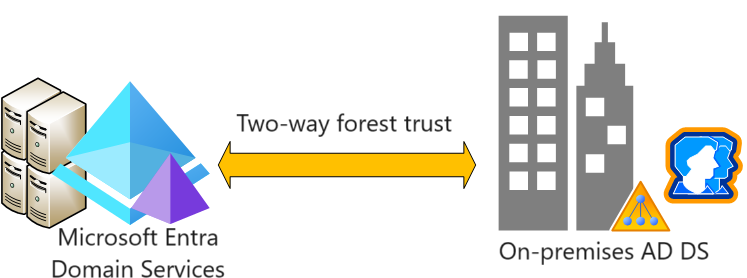
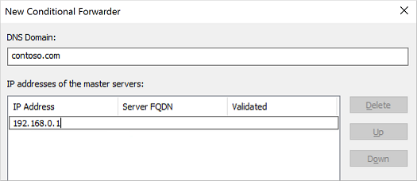
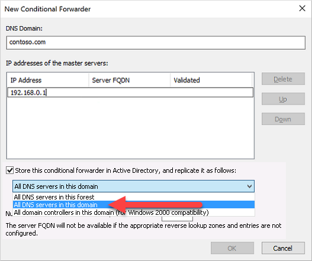
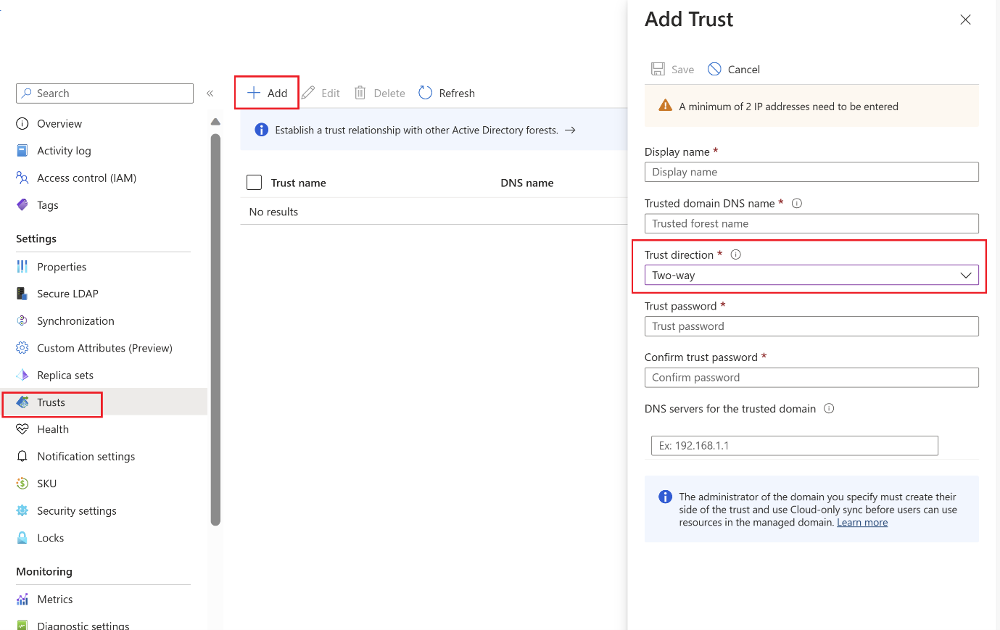
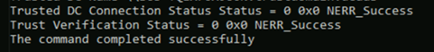

# Tutorial: Create a two-way forest trust in Microsoft Entra Domain Services with an on-premises domain

You can create a forest trust between Microsoft Entra Domain Services and on-premises AD DS environments. The forest trust relationship lets users, applications, and computers authenticate against an on-premises domain from the Domain Services managed domain, or vice versa. A forest trust can help users access resources in scenarios such as:

- Environments where you can't synchronize password hashes, or where users exclusively sign in using smart cards and don't know their password.
- Hybrid scenarios that require access to on-premises domains.

You can choose from three possible directions when you create a forest trust, depending on how users need to access resources. Domain Services only supports forest trusts. An external trust to a child domain on-premises isn't supported. 

Trust direction | User access
----------------|------------
Two-way | Allows users in both the managed domain and the on-premises domain to access resources in either domain. 
One-way outgoing | Allows users in the on-premises domain to access resources in the managed domain, but not vice versa. 
One-way incoming | Allows users in the managed domain to access resources in the on-premises domain. 



In this tutorial, you learn how to:

> [!div class="checklist"]
> * Configure DNS in an on-premises AD DS domain to support Domain Services connectivity
> * Create a two-way forest trust between the managed domain and the on-premises domain
> * Test and validate the forest trust relationship for authentication and resource access

If you don't have an Azure subscription, [create an account](https://azure.microsoft.com/free/?WT.mc_id=A261C142F) before you begin.

## Prerequisites

To complete this tutorial, you need the following resources and privileges:

* An active Azure subscription.
    * If you don't have an Azure subscription, [create an account](https://azure.microsoft.com/free/?WT.mc_id=A261C142F).
* A Microsoft Entra tenant associated with your subscription, either synchronized with an on-premises directory or a cloud-only directory.
    * If needed, [create a Microsoft Entra tenant][create-azure-ad-tenant] or [associate an Azure subscription with your account][associate-azure-ad-tenant].
* A Domain Services managed domain that is configured with a custom DNS domain name and a valid SSL certificate.
    * If needed, [create and configure a Microsoft Entra Domain Services managed domain][create-azure-ad-ds-instance-advanced].
* An on-premises Active Directory domain that is reachable from the managed domain over a VPN or ExpressRoute connection. 
* [Application Administrator](/azure/active-directory/roles/permissions-reference#application-administrator) and [Groups Administrator](/azure/active-directory/roles/permissions-reference#groups-administrator) Microsoft Entra roles in your tenant to modify a Domain Services instance.
* A Domain Admin account in the on-premises domain that has the permissions to create and verify trust relationships.     

> [!IMPORTANT]
> You need to use a minimum of *Enterprise* SKU for your managed domain. If needed, [change the SKU for a managed domain][howto-change-sku].

## Sign in to the Microsoft Entra admin center

In this tutorial, you create and configure the outbound forest trust from Domain Services using the Microsoft Entra admin center. To get started, first sign in to the [Microsoft Entra admin center](https://entra.microsoft.com).  

## Networking considerations

The virtual network that hosts the Domain Services forest needs a VPN or ExpressRoute connection to your on-premises Active Directory. Applications and services also need network connectivity to the virtual network hosting the Domain Services forest. Network connectivity to the Domain Services forest must be always on and stable otherwise users may fail to authenticate or access resources.

Before you configure a forest trust in Domain Services, make sure your networking between Azure and on-premises environment meets the following requirements:

* Make sure firewall ports and domain controllers allow traffic that is necessary to create and use a trust. For more information about which ports need to be open to use a trust, see [Configure firewall settings for AD DS trusts](/troubleshoot/windows-server/active-directory/config-firewall-for-ad-domains-and-trusts). All domain controllers in the domain that has a trust with Domain Services need to have these ports open.
* Use private IP addresses. Don't rely on DHCP with dynamic IP address assignment.
* Avoid overlapping IP address spaces to allow virtual network peering and routing to successfully communicate between Azure and on-premises.
* An Azure virtual network needs a gateway subnet to configure an [Azure site-to-site (S2S) VPN][vpn-gateway] or [ExpressRoute][expressroute] connection.
* Create subnets with enough IP addresses to support your scenario.
* Make sure Domain Services has its own subnet, don't share this virtual network subnet with application VMs and services.
* Peered virtual networks are NOT transitive.
    * Azure virtual network peerings must be created between all virtual networks you want to use the Domain Services forest trust to the on-premises AD DS environment.
* Provide continuous network connectivity to your on-premises Active Directory forest. Don't use on-demand connections.
* Make sure there's continuous DNS name resolution between your Domain Services forest name and your on-premises Active Directory forest name.

## Configure DNS in the on-premises domain

To correctly resolve the managed domain from the on-premises environment, you may need to add forwarders to the existing DNS servers. To configure the on-premises environment to communicate with the managed domain, complete the following steps from a management workstation for the on-premises AD DS domain:

1. Select **Start** > **Administrative Tools** > **DNS**.
1. Select your DNS zone, such as *aaddscontoso.com*.
1. Select **Conditional Forwarders**, then right-select and choose **New Conditional Forwarder...**
1. Enter your other **DNS Domain**, such as *contoso.com*, then enter the IP addresses of the DNS servers for that namespace, as shown in the following example:

    

1. Check the box for **Store this conditional forwarder in Active Directory, and replicate it as follows**, then select the option for *All DNS servers in this domain*, as shown in the following example:

    

    > [!IMPORTANT]
    > If the conditional forwarder is stored in the *forest* instead of the *domain*, the conditional forwarder fails.

1. To create the conditional forwarder, select **OK**.

## Create a two-way forest trust in the on-premises domain

The on-premises AD DS domain needs a two-way forest trust for the managed domain. This trust must be manually created in the on-premises AD DS domain; it can't be created from the Microsoft Entra admin center.

To configure a two-way trust in the on-premises AD DS domain, complete the following steps as a Domain Admin from a management workstation for the on-premises AD DS domain:

1. Select **Start** > **Administrative Tools** > **Active Directory Domains and Trusts**.
1. Right-click the domain, such as *onprem.contoso.com*, then select **Properties**.
1. Choose **Trusts** tab, then **New Trust**.
1. Enter the name for Domain Services domain name, such as *aaddscontoso.com*, then select **Next**.
1. Select the option to create a **Forest trust**, then to create a **Two-way** trust.
1. Choose to create the trust for **This domain only**. In the next step, you create the trust in the Microsoft Entra admin center for the managed domain.
1. Choose to use **Forest-wide authentication**, then enter and confirm a trust password. This same password is also entered in the Microsoft Entra admin center in the next section.
1. Step through the next few windows with default options, then choose the option for **No, do not confirm the outgoing trust**.
1. Select **Finish**.

If the forest trust is no longer needed for an environment, complete the following steps as a Domain Admin to remove it from the on-premises domain:

1. Select **Start** > **Administrative Tools** > **Active Directory Domains and Trusts**.
1. Right-click the domain, such as *onprem.contoso.com*, then select **Properties**.
1. Choose **Trusts** tab, then **Domains that trust this domain (incoming trusts)**, click the trust to be removed, and then click **Remove**.
1. On the Trusts tab, under **Domains trusted by this domain (outgoing trusts)**, click the trust to be removed, and then click Remove.
1. Click **No, remove the trust from the local domain only**.

<a name='create-outbound-forest-trust-in-azure-ad-ds'></a>

## Create a two-way forest trust in Domain Services

To create the two-way trust for the managed domain in the Microsoft Entra admin center, complete the following steps:

1. In the Microsoft Entra admin center, search for and select **Microsoft Entra Domain Services**, then select your managed domain, such as *aaddscontoso.com*.
1. From the menu on the left-hand side of the managed domain, select **Trusts**, then choose to **+ Add** a trust.
1. Select **Two-way** as the trust direction.
1. Enter a display name that identifies your trust, then the on-premises trusted forest DNS name, such as *onprem.contoso.com*.
1. Provide the same trust password that was used to configure the inbound forest trust for the on-premises AD DS domain in the previous section.
1. Provide at least two DNS servers for the on-premises AD DS domain, such as *10.1.1.4* and *10.1.1.5*.
1. When ready, **Save** the outbound forest trust.

    

If the forest trust is no longer needed for an environment, complete the following steps to remove it from Domain Services:

1. In the Microsoft Entra admin center, search for and select **Microsoft Entra Domain Services**, then select your managed domain, such as *aaddscontoso.com*.
1. From the menu on the left-hand side of the managed domain, select **Trusts**, choose the trust, and click **Remove**.
1. Provide the same trust password that was used to configure the forest trust and click **OK**.

## Verify trust creation
After you create a two-way or one-way incoming trust, you can verify the incoming trust (the outbound trust from your on-premises domain) by using either the Active Directory Domains and Trusts console or the nltest command-line tool after you configure the forest trust.

### Use Active Directory Domains and Trusts to verify a trust

Complete the following steps from the on-premises AD DS domain controller using an account that has permissions to create and validate trust relationships.

1. Select **Start** > **Administrative Tools** > **Active Directory Domains and Trusts**.
1. Right-click your domain and select **Properties**.
1. Choose the **Trusts** tab.
1. Under **Domains trusted by this domain (outgoing trusts)**, select the trust you created.
1. Choose **Properties**.
1. Select **Validate**.
1. Select **No, do not validate the incoming trust**.
1. Click **Ok**.

If the trust is configured correctly, you’ll see the message: 

`The outgoing trust has been validated. It is in place and active.`

### Use nltest to verify a trust

You can also verify the trust by using the nltest command-line tool. Complete the following steps from the on-premises AD DS domain controller using an account that has permissions to create and validate trust relationships.

1. Open an elevated command prompt on your on-premises domain controller or administrative workstation.
1. Run the following command:

   ```
   nltest /sc_verify:<TrustedDomain>
   ```

   Replace \<TrustedDomain> with the name of the Microsoft Entra Domain Services domain. If the trust is valid, the command returns a success message.

   

## Validate resource access

The following common scenarios let you validate that forest trust correctly authenticates users and access to resources:

* [On-premises user authentication from the Domain Services forest](#on-premises-user-authentication-from-the-azure-ad-ds-forest)
* [Access resources in the Domain Services forest using on-premises user](#access-resources-in-the-azure-ad-ds-forest-using-on-premises-user)
    * [Enable file and printer sharing](#enable-file-and-printer-sharing)
    * [Create a security group and add members](#create-a-security-group-and-add-members)
    * [Create a file share for cross-forest access](#create-a-file-share-for-cross-forest-access)
    * [Validate cross-forest authentication to a resource](#validate-cross-forest-authentication-to-a-resource)

<a name='on-premises-user-authentication-from-the-azure-ad-ds-forest'></a>

### On-premises user authentication from the Domain Services forest

You should have Windows Server virtual machine joined to the managed domain. Use this virtual machine to test your on-premises user can authenticate on a virtual machine. If needed, [create a Windows VM and join it to the managed domain][join-windows-vm].

1. Connect to the Windows Server VM joined to the Domain Services forest using [Azure Bastion](/azure/bastion/bastion-overview) and your Domain Services administrator credentials.
1. Open a command prompt and use the `whoami` command to show the distinguished name of the currently authenticated user:

    ```console
    whoami /fqdn
    ```

1. Use the `runas` command to authenticate as a user from the on-premises domain. In the following command, replace `userUpn@trusteddomain.com` with the UPN of a user from the trusted on-premises domain. The command prompts you for the user's password:

    ```console
    Runas /u:userUpn@trusteddomain.com cmd.exe
    ```

1. If the authentication is a successful, a new command prompt opens. The title of the new command prompt includes `running as userUpn@trusteddomain.com`.
1. Use `whoami /fqdn` in the new command prompt to view the distinguished name of the authenticated user from the on-premises Active Directory.

<a name='access-resources-in-the-azure-ad-ds-forest-using-on-premises-user'></a>

### Access resources in the Domain Services forest using on-premises user

From the Windows Server VM joined to the Domain Services forest, you can test scenarios. For example, you can test if a user who signs in to the on-premises domain can access resources in the managed domain. The following examples cover common test scenarios.

#### Enable file and printer sharing

1. Connect to the Windows Server VM joined to the Domain Services forest using [Azure Bastion](/azure/bastion/bastion-overview) and your Domain Services administrator credentials.

1. Open **Windows Settings**.
1. Search for and select **Network and Sharing Center**.
1. Choose the option for **Change advanced sharing** settings.
1. Under the **Domain Profile**, select **Turn on file and printer sharing** and then **Save changes**.
1. Close **Network and Sharing Center**.

#### Create a security group and add members

1. Open **Active Directory Users and Computers**.
1. Right-select the domain name, choose **New**, and then select **Organizational Unit**.
1. In the name box, type *LocalObjects*, then select **OK**.
1. Select and right-click **LocalObjects** in the navigation pane. Select **New** and then **Group**.
1. Type *FileServerAccess* in the **Group name** box. For the **Group Scope**, select **Domain local**, then choose **OK**.
1. In the content pane, double-click **FileServerAccess**. Select **Members**, choose to **Add**, then select **Locations**.
1. Select your on-premises Active Directory from the **Location** view, then choose **OK**.
1. Type *Domain Users* in the **Enter the object names to select** box. Select **Check Names**, provide credentials for the on-premises Active Directory, then select **OK**.

    > [!NOTE]
    > You must provide credentials because the trust relationship is only one way. This means users from the Domain Services managed domain can't access resources or search for users or groups in the trusted (on-premises) domain.

1. The **Domain Users** group from your on-premises Active Directory should be a member of the **FileServerAccess** group. Select **OK** to save the group and close the window.

#### Create a file share for cross-forest access

1. On the Windows Server VM joined to the Domain Services forest, create a folder and provide name such as *CrossForestShare*.
1. Right-select the folder and choose **Properties**.
1. Select the **Security** tab, then choose **Edit**.
1. In the *Permissions for CrossForestShare* dialog box, select **Add**.
1. Type *FileServerAccess* in **Enter the object names to select**, then select **OK**.
1. Select *FileServerAccess* from the **Groups or user names** list. In the **Permissions for FileServerAccess** list, choose *Allow* for the **Modify** and **Write** permissions, then select **OK**.
1. Select the **Sharing** tab, then choose **Advanced Sharing…**.
1. Choose **Share this folder**, then enter a memorable name for the file share in **Share name** such as *CrossForestShare*.
1. Select **Permissions**. In the **Permissions for Everyone** list, choose **Allow** for the **Change** permission.
1. Select **OK** two times and then **Close**.

#### Validate cross-forest authentication to a resource

1. Sign in a Windows computer joined to your on-premises Active Directory using a user account from your on-premises Active Directory.
1. Using **Windows Explorer**, connect to the share you created using the fully qualified host name and the share such as `\\fs1.aaddscontoso.com\CrossforestShare`.
1. To validate the write permission, right-select in the folder, choose **New**, then select **Text Document**. Use the default name **New Text Document**.

    If the write permissions are set correctly, a new text document is created. Complete the following steps to open, edit, and delete the file as appropriate.
1. To validate the read permission, open **New Text Document**.
1. To validate the modify permission, add text to the file and close **Notepad**. When prompted to save changes, choose **Save**.
1. To validate the delete permission, right-select **New Text Document** and choose **Delete**. Choose **Yes** to confirm file deletion.

## Next steps

In this tutorial, you learned how to:

> [!div class="checklist"]
> * Configure DNS in an on-premises AD DS environment to support Domain Services connectivity
> * Create a one-way inbound forest trust in an on-premises AD DS environment
> * Create a one-way outbound forest trust in Domain Services
> * Test and validate the trust relationship for authentication and resource access

For more conceptual information about forest in Domain Services, see [How do forest trusts work in Domain Services?][concepts-trust].

<!-- INTERNAL LINKS -->
[concepts-trust]: concepts-forest-trust.md
[create-azure-ad-tenant]: /azure/active-directory/fundamentals/sign-up-organization
[associate-azure-ad-tenant]: /azure/active-directory/fundamentals/how-subscriptions-associated-directory
[create-azure-ad-ds-instance-advanced]: tutorial-create-instance-advanced.md
[howto-change-sku]: change-sku.md
[vpn-gateway]: /azure/vpn-gateway/vpn-gateway-about-vpngateways
[expressroute]: /azure/expressroute/expressroute-introduction
[join-windows-vm]: join-windows-vm.md
