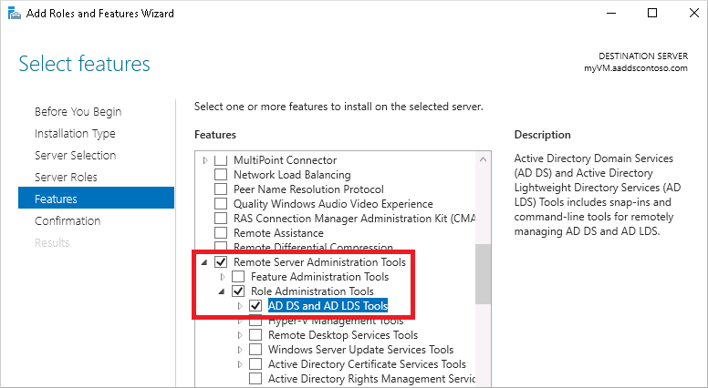
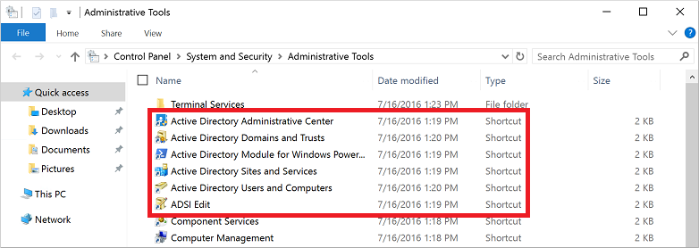
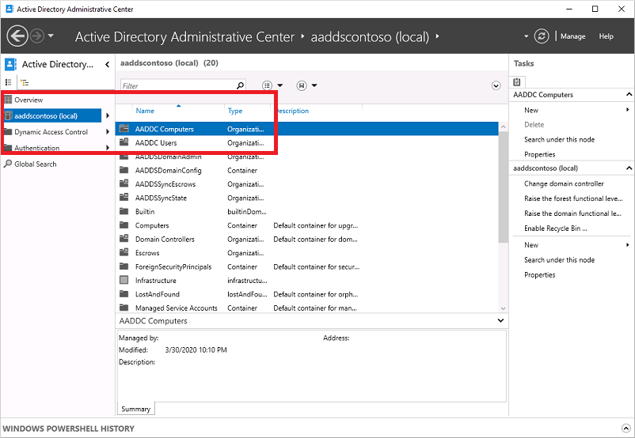

# Tutorial: Create a management VM to configure and administer a Microsoft Entra Domain Services managed domain

Microsoft Entra Domain Services provides managed domain services such as domain join, group policy, LDAP, and Kerberos/NTLM authentication that is fully compatible with Windows Server Active Directory. You administer this managed domain using the same Remote Server Administration Tools (RSAT) as with an on-premises Active Directory Domain Services domain. As Domain Services is a managed service, there are some administrative tasks that you can't perform, such as using remote desktop protocol (RDP) to connect to the domain controllers.

This tutorial shows you how to configure a Windows Server VM in Azure and install the required tools to administer a Domain Services managed domain.

In this tutorial, you learn how to:

> [!div class="checklist"]
> * Understand the available administrative tasks in a managed domain
> * Install the Active Directory administrative tools on a Windows Server VM
> * Use the Active Directory Administrative Center to perform common tasks

If you don't have an Azure subscription, [create an account](https://azure.microsoft.com/free/?WT.mc_id=A261C142F) before you begin.

## Prerequisites

To complete this tutorial, you need the following resources and privileges:

* An active Azure subscription.
    * If you don't have an Azure subscription, [create an account](https://azure.microsoft.com/free/?WT.mc_id=A261C142F).
* A Microsoft Entra tenant associated with your subscription, either synchronized with an on-premises directory or a cloud-only directory.
    * If needed, [create a Microsoft Entra tenant][create-azure-ad-tenant] or [associate an Azure subscription with your account][associate-azure-ad-tenant].
* A Microsoft Entra Domain Services managed domain enabled and configured in your Microsoft Entra tenant.
    * If needed, see the first tutorial to [create and configure a Microsoft Entra Domain Services managed domain][create-azure-ad-ds-instance].
* A Windows Server VM that is joined to the managed domain.
    * If needed, see the previous tutorial to [create a Windows Server VM and join it to a managed domain][create-join-windows-vm].
* A user account that's a member of the *Microsoft Entra DC administrators* group in your Microsoft Entra tenant.
* An Azure Bastion host deployed in your Domain Services virtual network.
    * If needed, [create an Azure Bastion host][azure-bastion].

## Sign in to the Microsoft Entra admin center

In this tutorial, you create and configure a management VM using the Microsoft Entra admin center. To get started, first sign in to the [Microsoft Entra admin center](https://entra.microsoft.com).

## Available administrative tasks in Domain Services

Domain Services provides a managed domain for your users, applications, and services to consume. This approach changes some of the available management tasks you can do, and what privileges you have within the managed domain. These tasks and permissions may be different than what you experience with a regular on-premises Active Directory Domain Services environment. You also can't connect to domain controllers on the managed domain using Remote Desktop.

### Administrative tasks you can perform on a managed domain

Members of the *AAD DC Administrators* group are granted privileges on the managed domain that enables them to do tasks such as:

* Configure the built-in group policy object (GPO) for the *AADDC Computers* and *AADDC Users* containers in the managed domain.
* Administer DNS on the managed domain.
* Create and administer custom organizational units (OUs) on the managed domain.
* Gain administrative access to computers joined to the managed domain.

### Administrative privileges you don't have on a managed domain

The managed domain is locked down, so you don't have privileges to do certain administrative tasks on the domain. Some of the following examples are tasks you can't do:

* Extend the schema of the managed domain.
* Connect to domain controllers for the managed domain using Remote Desktop.
* Add domain controllers to the managed domain.
* You don't have *Domain Administrator* or *Enterprise Administrator* privileges for the managed domain.

## Sign in to the Windows Server VM

In the previous tutorial, a Windows Server VM was created and joined to the managed domain. Use that VM to install the management tools. If needed, [follow the steps in the tutorial to create and join a Windows Server VM to a managed domain][create-join-windows-vm].

> [!NOTE]
> In this tutorial, you use a Windows Server VM in Azure that is joined to the managed domain. You can also use a Windows client, such as Windows 10, that is joined to the managed domain.
>
> For more information on how to install the administrative tools on a Windows client, see [install Remote Server Administration Tools (RSAT)](https://social.technet.microsoft.com/wiki/contents/articles/2202.remote-server-administration-tools-rsat-for-windows-client-and-windows-server-dsforum2wiki.aspx)

To get started, connect to the Windows Server VM as follows:

1. In the Microsoft Entra admin center, select **Resource groups** on the left-hand side. Choose the resource group where your VM was created, such as *myResourceGroup*, then select the VM, such as *myVM*.
1. In the **Overview** pane for your VM, select **Connect**, then **Bastion**.

    

1. Enter the credentials for your VM, then select **Connect**.

   

If needed, allow your web browser to open pop-ups for the Bastion connection to be displayed. It takes a few seconds to make the connection to your VM.

## Install Active Directory administrative tools

You use the same administrative tools in a managed domain as on-premises AD DS environments, such as the Active Directory Administrative Center (ADAC) or AD PowerShell. These tools can be installed as part of the Remote Server Administration Tools (RSAT) feature on Windows Server and client computers. Members of the *AAD DC Administrators* group can then administer managed domains remotely using these AD administrative tools from a computer that is joined to the managed domain.

To install the Active Directory Administration tools on a domain-joined VM, complete the following steps:

1. If **Server Manager** doesn't open by default when you sign in to the VM, select the **Start** menu, then choose **Server Manager**.
1. In the *Dashboard* pane of the **Server Manager** window, select **Add Roles and Features**.
1. On the **Before You Begin** page of the *Add Roles and Features Wizard*, select **Next**.
1. For the *Installation Type*, leave the **Role-based or feature-based installation** option checked and select **Next**.
1. On the **Server Selection** page, choose the current VM from the server pool, such as *myvm.aaddscontoso.com*, then select **Next**.
1. On the **Server Roles** page, click **Next**.
1. On the **Features** page, expand the **Remote Server Administration Tools** node, then expand the **Role Administration Tools** node.

    Choose **AD DS and AD LDS Tools** feature from the list of role administration tools, then select **Next**.

    

1. On the **Confirmation** page, select **Install**. It may take a minute or two to install the administrative tools.
1. When feature installation is complete, select **Close** to exit the **Add Roles and Features** wizard.

## Use Active Directory administrative tools

With the administrative tools installed, let's see how to use them to administer the managed domain. Make sure that you're signed in to the VM with a user account that's a member of the *AAD DC Administrators* group.

1. From the **Start** menu, select **Windows Administrative Tools**. The AD administrative tools installed in the previous step are listed.

    

1. Select **Active Directory Administrative Center**.
1. To explore the managed domain, choose the domain name in the left pane, such as *aaddscontoso*. Two containers named *AADDC Computers* and *AADDC Users* are at the top of the list.

    

1. To see the users and groups that belong to the managed domain, select the **AADDC Users** container. The user accounts and groups from your Microsoft Entra tenant are listed in this container.

    In the following example output, a user account named *Contoso Admin* and a group for *AAD DC Administrators* are shown in this container.

    

1. To see the computers that are joined to the managed domain, select the **AADDC Computers** container. An entry for the current virtual machine, such as *myVM*, is listed. Computer accounts for all devices that are joined to the managed domain are stored in this *AADDC Computers* container.

Common Active Directory Administrative Center actions such as resetting a user account password or managing group membership are available. These actions only work for users and groups created directly in the managed domain. Identity information only synchronizes *from* Microsoft Entra ID to Domain Services. There's no write back from Domain Services to Microsoft Entra ID. You can't change passwords or managed group membership for users synchronized from Microsoft Entra ID and have those changes synchronized back.

You can also use the *Active Directory Module for Windows PowerShell*, installed as part of the administrative tools, to manage common actions in your managed domain.

## Next steps

In this tutorial, you learned how to:

> [!div class="checklist"]
> * Understand the available administrative tasks in a managed domain
> * Install the Active Directory administrative tools on a Windows Server VM
> * Use the Active Directory Administrative Center to perform common tasks

To safely interact with your managed domain from other applications, enable secure Lightweight Directory Access Protocol (LDAPS).

> [!div class="nextstepaction"]
> [Configure secure LDAP for your managed domain](tutorial-configure-ldaps.md)

<!-- INTERNAL LINKS -->
[create-azure-ad-tenant]: /azure/active-directory/fundamentals/sign-up-organization
[associate-azure-ad-tenant]: /azure/active-directory/fundamentals/how-subscriptions-associated-directory
[create-azure-ad-ds-instance]: tutorial-create-instance.md
[create-join-windows-vm]: join-windows-vm.md
[azure-bastion]: /azure/bastion/tutorial-create-host-portal
