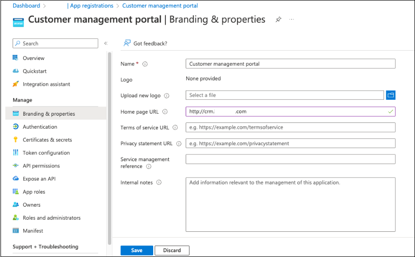

# Tutorial: Configure Conditional Access policies in Cloudflare Access

With Conditional Access, administrators enforce policies on application and user policies in Microsoft Entra ID. Conditional Access brings together identity-driven signals, to make decisions, and enforce organizational policies. Cloudflare Access creates access to self-hosted, software as a service (SaaS), or nonweb applications.

Learn more: [What is Conditional Access?](~/identity/conditional-access/overview.md)

## Prerequisites

* A Microsoft Entra subscription
  * If you don't have one, get an [Azure free account](https://azure.microsoft.com/free/)
* A Microsoft Entra tenant linked to the Microsoft Entra subscription
  * See, [Quickstart: Create a new tenant in Microsoft Entra ID](~/fundamentals/create-new-tenant.md)
* One of the following roles: Cloud Application Administrator, or Application Administrator.
* Configured users in the Microsoft Entra subscription  
* A Cloudflare account
  * Go to `dash.cloudflare.com` to [Get started with Cloudflare](https://dash.cloudflare.com/sign-up)

## Scenario architecture

* **Microsoft Entra ID** - Identity Provider (IdP) that verifies user credentials and Conditional Access
* **Application** - You created for IdP integration
* **Cloudflare Access** - Provides access to applications

## Set up an identity provider

Go to developers.cloudflare.com to [set up Microsoft Entra ID as an IdP](https://developers.cloudflare.com/cloudflare-one/identity/idp-integration/entra-id/#set-up-entra-id-as-an-identity-provider).

   > [!NOTE]
   > It's recommended you name the IdP integration in relation to the target application. For example, **Microsoft Entra ID - Customer management portal**.

## Configure Conditional Access

1. Sign in to the [Microsoft Entra admin center](https://entra.microsoft.com) as at least a [Cloud Application Administrator](~/identity/role-based-access-control/permissions-reference.md#cloud-application-administrator). 
2. Browse to **Identity** > **Applications** > **App registrations** > **All applications**
3. Select the application you created.
4. Go to **Branding & properties**.
5. For **Home page URL**, enter the application hostname.

   

7. Browse to **Identity** > **Applications** > **Enterprise applications** > **All applications**.
8. Select your application.
9. Select **Properties**.
10. For **Visible to users**, select **Yes**. This action enables the app to appear in App Launcher and in [My Apps](https://myapplications.microsoft.com/).
11. Under **Security**, select **Conditional Access**.
12. See, [Building a Conditional Access policy](~/identity/conditional-access/concept-conditional-access-policies.md).
13. Create and enable other policies for the application.

## Create a Cloudflare Access application

Enforce Conditional Access policies on a Cloudflare Access application.

1. Go to `dash.cloudflare.com` to [sign in to Cloudflare](https://dash.cloudflare.com/login).
2. In **Zero Trust**, go to **Access**.
3. Select **Applications**.
4. See, [Add a self-hosted application](https://developers.cloudflare.com/cloudflare-one/applications/configure-apps/self-hosted-apps/).
5. In **Application domain**, enter the protected application target URL.
6. For **Identity providers**, select the IdP integration.
7. Create an Access policy. See, [Access policies](https://developers.cloudflare.com/cloudflare-one/policies/access/) and the following example. 

   > [!NOTE]
   > Reuse the IdP integration for other applications if they require the same Conditional Access policies. For example, a baseline IdP integration with a Conditional Access policy requiring multifactor authentication and a modern authentication client. If an application requires specific Conditional Access policies, set up a dedicated IdP instance for that application.

## Next steps

* [What is Conditional Access?](~/identity/conditional-access/overview.md)
* [Secure Hybrid Access with Microsoft Entra ID partner integrations](secure-hybrid-access-integrations.md)
* [Tutorial: Configure Cloudflare with Microsoft Entra ID for secure hybrid access](cloudflare-integration.md)
