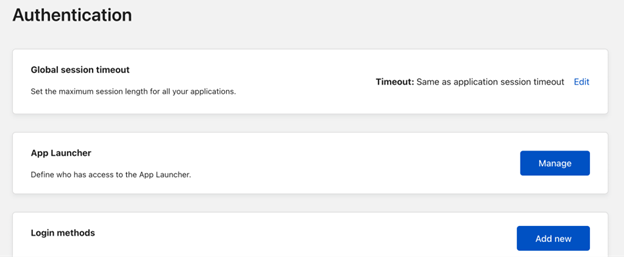

# Tutorial: Configure Cloudflare with Microsoft Entra ID for secure hybrid access

In this tutorial, learn to integrate Microsoft Entra ID with Cloudflare Zero Trust. Build rules based on user identity and group membership. Users authenticate with Microsoft Entra credentials and connect to Zero Trust protected applications.

## Prerequisites

* A Microsoft Entra subscription
  * If you don't have one, get an [Azure free account](https://azure.microsoft.com/free/)
* A Microsoft Entra tenant linked to the Microsoft Entra subscription
  * See, [Quickstart: Create a new tenant in Microsoft Entra ID](~/fundamentals/create-new-tenant.md)
* A Cloudflare Zero Trust account
  * If you don't have one, go to [Get started with Cloudflare's Zero Trust platform](https://dash.cloudflare.com/sign-up/teams)
* One of the following roles: Global Administrator, Cloud Application Administrator, or Application Administrator.

## Integrate organization identity providers with Cloudflare Access

Cloudflare Zero Trust Access helps enforce default-deny, Zero Trust rules that limit access to corporate applications, private IP spaces, and hostnames. This feature connects users faster and safer than a virtual private network (VPN). Organizations can use multiple identity providers (IdPs), reducing friction when working with partners or contractors.

To add an IdP as a sign-in method, sign in to Cloudflare on the [Cloudflare sign in page](https://dash.teams.cloudflare.com/) and Microsoft Entra ID.

The following architecture diagram shows the integration.

   

## Integrate a Cloudflare Zero Trust account with Microsoft Entra ID

Integrate Cloudflare Zero Trust account with an instance of Microsoft Entra ID.

1. Sign in to the Cloudflare Zero Trust dashboard on the [Cloudflare sign in page](https://dash.teams.cloudflare.com/).
2. Navigate to **Settings**.
3. Select **Authentication**.
4. For **Login methods**, select **Add new**.

   

5. Under **Select an identity provider**, select **Microsoft Entra ID**.
6. The **Add Azure ID** dialog appears. 
7. Enter Microsoft Entra instance credentials and make needed selections.
8. Select **Save**.

## Register Cloudflare with Microsoft Entra ID

[!INCLUDE [portal updates](~/includes/portal-update.md)]

Use the instructions in the following three sections to register Cloudflare with Microsoft Entra ID.

1. Sign in to the [Microsoft Entra admin center](https://entra.microsoft.com) as at least a [Cloud Application Administrator](~/identity/role-based-access-control/permissions-reference.md#cloud-application-administrator). 
2. Browse to **Identity** > **Applications** > **App registrations**.
3. Select **New registration**.
4. Enter an application **Name**.
5. Enter a team name with **callback** at the end of the path. For example, `https://<your-team-name>.cloudflareaccess.com/cdn-cgi/access/callback`
6. Select **Register**.

See the [team domain](https://developers.cloudflare.com/cloudflare-one/glossary#team-domain) definition in the Cloudflare Glossary.

   :::image type="content" source="./media/cloudflare-integration/register-application.png" alt-text="Screenshot of options and selections for Register an application.":::

### Certificates & secrets

1. On the **Cloudflare Access** screen, under **Essentials**, copy and save the Application (Client) ID and the Directory (Tenant) ID.

   :::image type="content" source="./media/cloudflare-integration/cloudflare-access.png" alt-text="Screenshot of the Cloudflare Access screen." lightbox="./media/cloudflare-integration/cloudflare-access.png":::

2. In the left menu, under **Manage**, select **Certificates & secrets**.

   :::image type="content" source="./media/cloudflare-integration/add-client-secret.png" alt-text="Screenshot of the certificates and secrets screen.":::

3. Under **Client secrets**, select **+ New client secret**.
4. In **Description**, enter the Client Secret.
5. Under **Expires**, select an expiration.
6. Select **Add**.
7. Under **Client secrets**, from the **Value** field, copy the value. Consider the value an application password. The example value appears, Azure values appear in the Cloudflare Access configuration.

   :::image type="content" source="./media/cloudflare-integration/cloudflare-access-configuration.png" alt-text="Screenshot of Client secrets input.":::

### Permissions

1. In the left menu, select **API permissions**.
2. Select **+ Add a permission**.
3. Under **Select an API**, select **Microsoft Graph**.

   :::image type="content" source="./media/cloudflare-integration/microsoft-graph.png" alt-text="Screenshot of the Microsoft Graph option under Request API permissions.":::

4. Select **Delegated permissions** for the following permissions:

   * Email
   * openid
   * profile
   * offline_access
   * user.read
   * directory.read.all
   * group.read.all

5. Under **Manage**, select **+ Add permissions**.

   :::image type="content" source="./media/cloudflare-integration/request-api-permissions.png" alt-text="Screenshot options and selections for Request API permissions." lightbox="./media/cloudflare-integration/request-api-permissions.png":::

6. Select **Grant Admin Consent for ...**.

   :::image type="content" source="./media/cloudflare-integration/grant-admin-consent.png" alt-text="Screenshot of configured permissions under API permissions." lightbox="./media/cloudflare-integration/grant-admin-consent.png":::

7. On the Cloudflare Zero Trust dashboard, navigate to **Settings > Authentication**.
8. Under **Login methods**, select **Add new**.
9. Select **Microsoft Entra ID**.
10. Enter values for **Application ID**, **Application Secret**, and **Directory ID**.
11. Select **Save**.

  >[!NOTE]
  >For Microsoft Entra groups, in **Edit your Microsoft Entra identity provider**, for **Support Groups** select **On**.

## Test the integration

1. On the Cloudflare Zero Trust dashboard, navigate to **Settings** > **Authentication**.
2. Under **Login methods**, for Microsoft Entra ID select **Test**.
3. Enter Microsoft Entra credentials.
4. The **Your connection works** message appears.

   

## Next steps

- Go to developer.cloudflare.com for [Integrate SSO](https://developers.cloudflare.com/cloudflare-one/identity/idp-integration/)
- [Tutorial: Configure Conditional Access policies for Cloudflare Access](cloudflare-conditional-access-policies.md)
- [Tutorial: Configure Cloudflare Web Application Firewall with Azure AD B2C](/azure/active-directory-b2c/partner-cloudflare)
