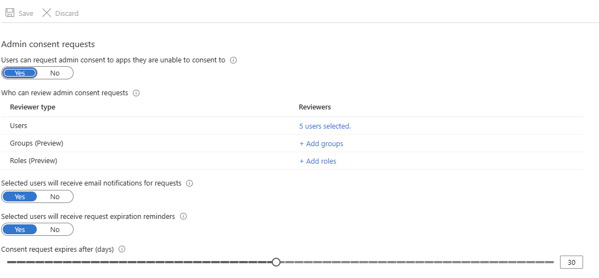

# Configure the admin consent workflow

In this article, you learn how to configure the admin consent workflow to enable users to request access to applications that require admin consent. You enable the ability to make requests by using an admin consent workflow. For more information on consenting to applications, see [User and admin consent](user-admin-consent-overview.md).

The admin consent workflow gives admins a secure way to grant access to applications that require admin approval. When a user tries to access an application but is unable to provide consent, they can send a request for admin approval. The request is sent via email to admins who are designated as reviewers. A reviewer takes action on the request, and the user is notified of the action.

To approve requests, a reviewer must have the [permissions required](grant-admin-consent.md#prerequisites) to grant admin consent for the application requested. Simply designating them as a reviewer doesn't elevate their privileges.

## Prerequisites

To configure the admin consent workflow, you need:

- An Azure account. [Create an account for free](https://azure.microsoft.com/free/?WT.mc_id=A261C142F).
- You must be a Global Administrator to turn on the admin consent workflow.

[!INCLUDE [least-privilege-note](../../includes/definitions/least-privilege-note.md)]

## Enable the admin consent workflow

To enable the admin consent workflow and choose reviewers:

1. Sign in to the [Microsoft Entra admin center](https://entra.microsoft.com) as a [Global Administrator](~/identity/role-based-access-control/permissions-reference.md#global-administrator).
1. Browse to **Entra ID** > **Enterprise apps** > **Consent and permissions** > **Admin consent settings**. 
1. Under **Admin consent requests**,  select **Yes** for **Users can request admin consent to apps they are unable to consent to** .

   
   
1. Configure the following settings:

   - **Who can review admin consent requests** - Select users, groups, or roles that are designated as reviewers for admin consent requests. Reviewers can view, block, or deny admin consent requests, but only Global Administrators can approve admin consent requests for apps requesting for Microsoft Graph app roles (application permissions). People designated as reviewers can view incoming requests in the **My Pending** tab after they're set as reviewers. Any new reviewers aren't able to act on existing or expired admin consent requests.
   - **Selected users will receive email notifications for requests** - Enable or disable email notifications to the reviewers when a request is made.  
   - **Selected users will receive request expiration reminders** - Enable or disable reminder email notifications to the reviewers when a request is about to expire. The first about-to-expire reminder email is likely sent out in the middle of the configured "Consent request expires after (days)." For example, if you configure the consent request to expire in three days, the first reminder email is sent out on the second day, and the last expiration email is sent out almost immediately the consent request expires.
   - **Consent request expires after (days)** - Specify how long requests stay valid.

1. Select **Save**. It can take up to an hour for the workflow to become enabled.

> [!NOTE]
> You can add or remove reviewers for this workflow by modifying the **Who can review admin consent requests** list. A current limitation of this feature is that a reviewer retains the ability to review requests that were made while they were designated as a reviewer and will receive expiration reminder emails for those requests after they're removed from the reviewers list. Additionally, new reviewers won't be assigned to requests that were created before they were set as a reviewer.

## Configure the admin consent workflow using Microsoft Graph

To configure the admin consent workflow programmatically, use the [Update adminConsentRequestPolicy](/graph/api/adminconsentrequestpolicy-update) API in Microsoft Graph.

## Next steps

[Grant tenant-wide admin consent to an application](grant-admin-consent.md)

[Review admin consent requests](review-admin-consent-requests.md)
