# Configure Datawiza Access Proxy for Microsoft Entra SSO and MFA for Outlook Web Access

In this tutorial, learn how to configure Datawiza Access Proxy (DAP) to enable Microsoft Entra single sign-on (SSO) and Microsoft Entra multifactor authentication for Outlook Web Access (OWA). Help solve issues when modern identity providers (IdPs) integrate with legacy OWA, which supports Kerberos token authentication to identify users.

Often, legacy app and modern SSO integration are a challenge because there's no modern protocol support. Datawiza Access Proxy removes the protocol support gap, reduces integration overhead, and improves application security.

Integration benefits:

-   Improved Zero Trust security with SSO, MFA, and Conditional Access:
    -   See, [Embrace proactive security with Zero Trust](https://www.microsoft.com/security/business/zero-trust)
    -   See, [What is Conditional Access?](~/identity/conditional-access/overview.md)
-   No-code integration with Microsoft Entra ID and web apps:
    -   OWA
    -   Oracle JD Edwards
    -   Oracle E-Business Suite
    -   Oracle Siebel
    -   Oracle PeopleSoft
    -   Your apps
    -   See, [Easy authentication and authorization in Microsoft Entra ID with no-code Datawiza](https://www.microsoft.com/security/blog/2022/05/17/easy-authentication-and-authorization-in-azure-active-directory-with-no-code-datawiza/)
-   Use the Datawiza Cloud Management Console (DCMC) to manage access to cloud and on-premises apps:
    -   Go to
        [login.datawizwa.com](https://login.datawiza.com/df3f213b-68db-4966-bee4-c826eea4a310/b2c_1a_linkage/oauth2/v2.0/authorize?client_id=4f011d0f-44d4-4c42-ad4c-88c7bbcd1ac8&scope=https%3A%2F%2Fdatawizab2cprod.onmicrosoft.com%2F4f011d0f-44d4-4c42-ad4c-88c7bbcd1ac8%2FReadWrite.All%20openid%20profile%20offline_access&redirect_uri=https%3A%2F%2Fconsole.datawiza.com%2Fhome&client-request-id=3c20ca19-1dc7-4226-b2cf-fab4d7af3929&response_mode=fragment&response_type=code&x-client-SKU=msal.js.browser&x-client-VER=2.14.2&x-client-OS=&x-client-CPU=&client_info=1&code_challenge=hz6u_I8Z04mD8zz-olLBSXJ_OI1T2-Evy699ff0O8Ik&code_challenge_method=S256&nonce=80f15c2b-ff10-40a8-a48c-a2533fb2b8d9&state=eyJpZCI6ImY1NzEyZTcyLTBiZTItNGJjMC1hMmExLTYzNjE3NzYyMGU1OSIsIm1ldGEiOnsiaW50ZXJhY3Rpb25UeXBlIjoicmVkaXJlY3QifX0%3D) to sign in or sign up for an account

## Architecture

DAP integration architecture includes the following components:

-   **Microsoft Entra ID** - identity and access management service that helps users sign in and access external and internal resources
-   **OWA** - the legacy, Exchange Server component to be protected by Microsoft Entra ID
-   **Domain controller** - a server that manages user authentication and access to network resources in a Windows-based network
-   **Key distribution center (KDC)** - distributes and manages secret keys and tickets in a Kerberos authentication system
-   **DAP** - a reverse-proxy that implements OpenID Connect (OIDC), OAuth, or Security Assertion Markup Language (SAML) for user sign in. DAP integrates with protected applications by using:
    -   HTTP headers
    -   Kerberos
    -   JSON web token (JWT)
    -   other protocols
-   **DCMC** - the DAP management console with UI and RESTful APIs to manage configurations and access control policies

The following diagram illustrates a user flow with DAP in a customer network.

   

The following diagram illustrates the user flow from user browser to OWA.

   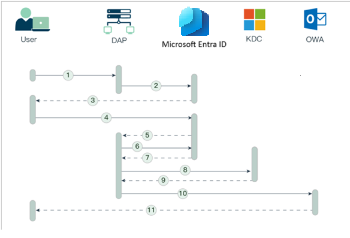

1. The user browser requests access to DAP-protected OWA.
2. The user browser is directed to Microsoft Entra ID.
3. The Microsoft Entra sign-in page appears.
4. The user enters credentials.
5. Upon authentication, the user browser is directed to DAP.
6. DAP and Microsoft Entra ID exchange tokens.
7. Microsoft Entra ID issues the username and relevant information to DAP.
8. DAP accesses the key distribution center (KDC) with credentials. DAP requests a Kerberos ticket.
9. KDC returns a Kerberos ticket.
10. DAP redirects the user browser to OWA.
11. The OWA resource appears.|

   >[!NOTE]
   >Subsequent user browser requests contain the Kerberos token, which enables access to OWA via DAP.

## Prerequisites

You need the following components. Prior DAP experience isn't necessary.

-   An Azure account
    -   If you don't have one, get an [Azure free account](https://azure.microsoft.com/free/)
-   A Microsoft Entra tenant linked to the Azure account
    -   See, [Quickstart: Create a new tenant in Microsoft Entra ID](~/fundamentals/create-new-tenant.md)
-   Docker and Docker Compose are required to run DAP
    -   See, [Get Docker](https://docs.docker.com/get-docker/)
    -   See, Install Docker Compose, [Overview](https://docs.docker.com/compose/install/)
-   User identities synchronized from an on-premises directory to Microsoft Entra ID, or created in Microsoft Entra ID and flowed back to your on-premises directory
    -   See, [Microsoft Entra Connect Sync: Understand and customize synchronization](~/identity/hybrid/connect/how-to-connect-sync-whatis.md)
-   An account with Microsoft Entra Application Administrator permissions
    -   See, Application Administrator and other roles on, [Microsoft Entra built-in roles](~/identity/role-based-access-control/permissions-reference.md)
-   An Exchange Server environment. Supported versions:
    -   Microsoft Internet Information Services (IIS) Integrated Windows Authentication (IWA) - IIS 7 or later
    -   Microsoft OWA IWA - IIS 7 or later
-   A Windows Server instance configured with IIS and Microsoft Entra services running as a domain controller (DC) and implementing Kerberos (IWA) SSO
    -   It's unusual for large production environments to have an application server (IIS) that also functions as a DC.
-   **Optional**: an SSL Web certificate to publish services over HTTPS, or DAP self-signed certificates, for testing.

## Enable Kerberos authentication for OWA

1.  Sign in to the [Exchange admin center](https://admin.exchange.microsoft.com/).

2.  In the Exchange admin center, left navigation, select **servers**.

3.  Select the **virtual directories** tab.

    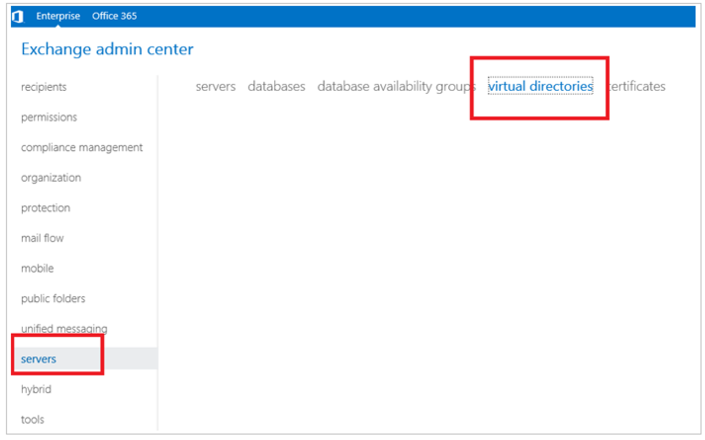

4.  From the **select server** dropdown, select a server.

5.  Double-click **owa (Default Web Site)**.

6.  In the **Virtual Directory**, select the **authentication** tab.

7.  On the authentication tab, select **Use one or more standard authentication methods**, and then select **Integrated Windows authentication**.

8.  Select **save**

    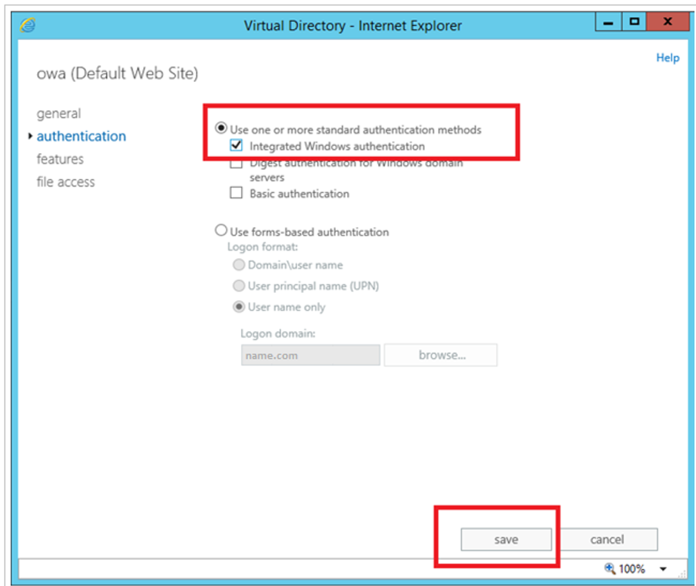

9.  Open a command prompt.

10. Execute the **iisreset** command.

    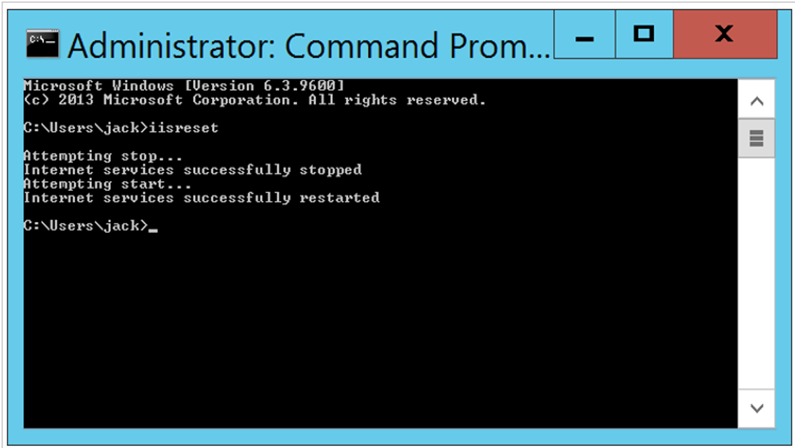

## Create a DAP service account

DAP requires known Windows credentials that are used by the instance to configure the Kerberos service. The user is the DAP service account.

1.  Sign in to the Windows Server instance.

2.  Select **Users and Computers**.

3.  Select the DAP instance down-arrow. The example is **datawizatest.com**.

4.  In the list, right-click **Users**.

5.  From the menu, select **New**, then select **User**.

6.  On **New Object--User**, enter a **First name** and **Last name**.

7.  For **User logon name**, enter **dap**.

8.  Select **Next**. 

    

10.  In **Password**, enter a password.

11. Enter it again in **Confirm**.

12. Check the boxes for **User cannot change password** and **Password never expires**.

    

13. Select **Next**.

14. Right-click the new user to see the configured properties.

## Create a service principal name for the service account

Before you create the service principal name (SPN), you can list SPNs and confirm the http SPN is among them.

1.  To list SPNs, use the following syntax on the Windows command line.

    `setspn -Q \*/\<**domain.com**`

2.  Confirm the http SPN is among them.

3.  To register the host SPN for the account, use the following syntax on the Windows command line.

    `setspn -A host/dap.datawizatest.com dap`

   >[!NOTE]
   >`host/dap.datawizatest.com` is the unique SPN, and dap is the service account you created.

## Configure Windows Server IIS for Constrained Delegation

1.  Sign in to a domain controller (DC).

2.  Select **Users and Computers.**

3.  In your organization, locate and select the **Users** object.

4.  Locate the service account you created.

5.  Right-click the account.

6.  From the list, select **Properties**.

7.  Select the **Delegation** tab.

8.  Select **Trust this user for delegation to specified services only**.

9.  Select **Use any authentication protocol**.

10. Select **Add**.

    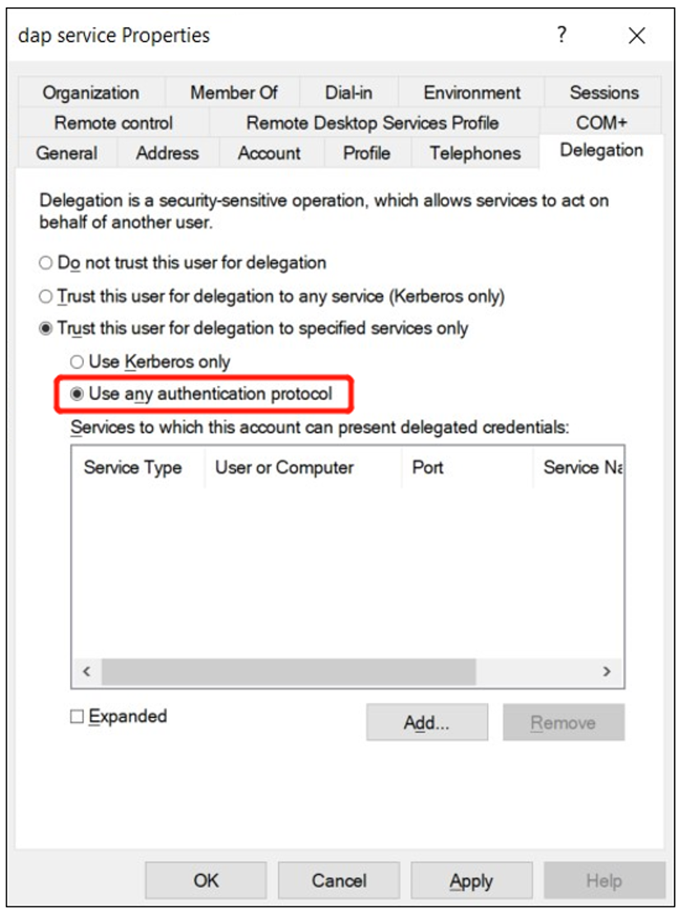

11. On **Add Services**, select **Users or Computers.**

    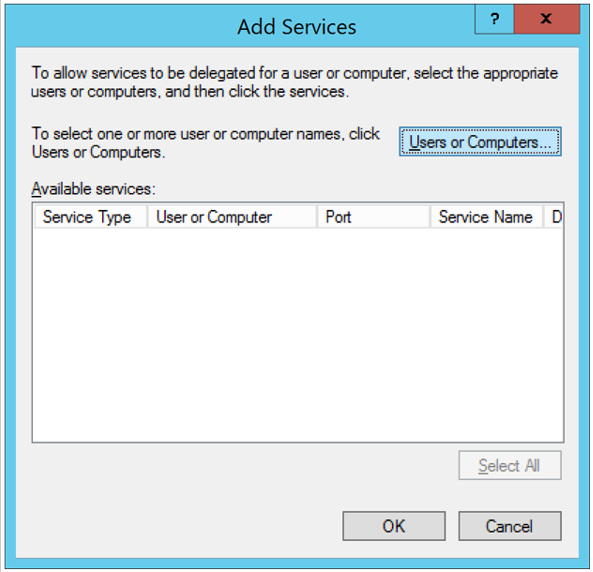

12. In **Enter the object names to select**, type in the machine name.

13. Select **OK**

    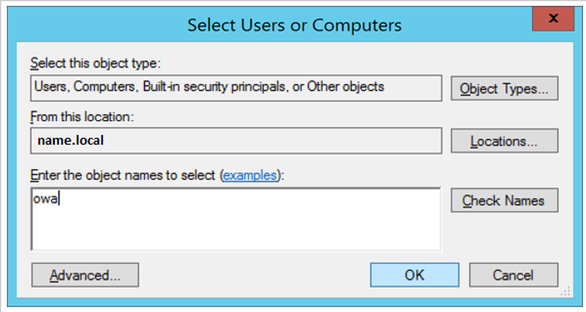

14. On **Add Services**, in Available services, under Service Type, select **http.**

15. Select **OK**

    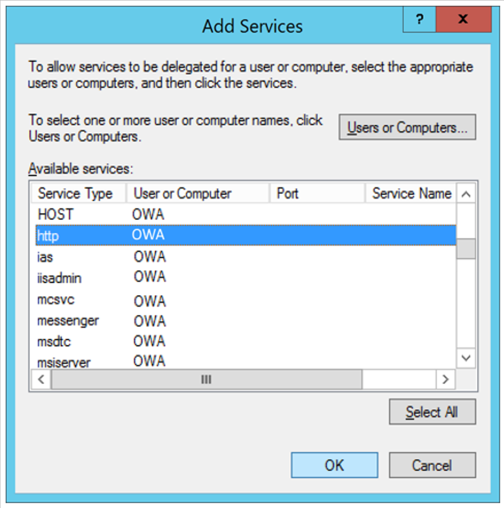

## Integrate OWA with Microsoft Entra ID

Use the following instructions to integrate OWA with Microsoft Entra ID.

1.  Sign in to the [Datawiza Cloud Management Console (DCMC)](https://console.datawiza.com/).

2.  The Welcome page appears.

3.  Select the orange **Getting started** button.

    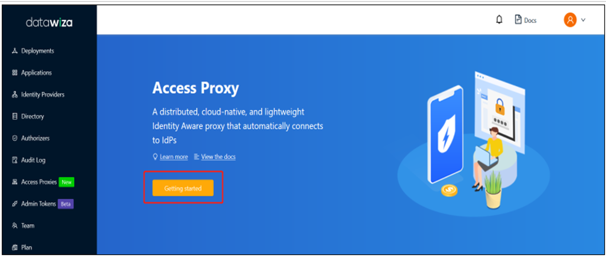

### Deployment Name

1.  On **Deployment Name**, type a **Name** and a **Description**.

2.  Select **Next**.

    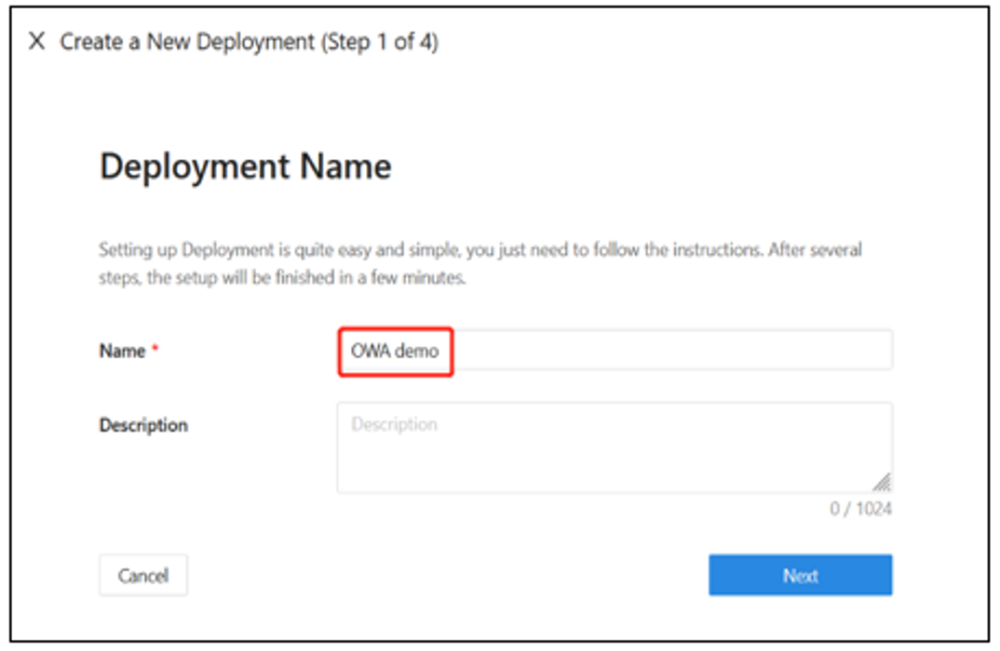

### Add Application

1.  On **Add Application**, for **Platform**, select **Web**.

2.  For **App name**, enter the app name. We recommend a meaningful naming convention.

3.  For **Public Domain**, enter the app's external-facing URL. For example, `https://external.example.com`. Use localhost domain name server (DNS) for testing.

4.  For **Listen Port**, enter the port DAP listens on. If DAP isn't deployed behind a load balancer, you can use port indicated in Public Domain.

5.  For **Upstream Servers**, enter the OWA implementations' URL and port combination.

6.  Select **Next**.

    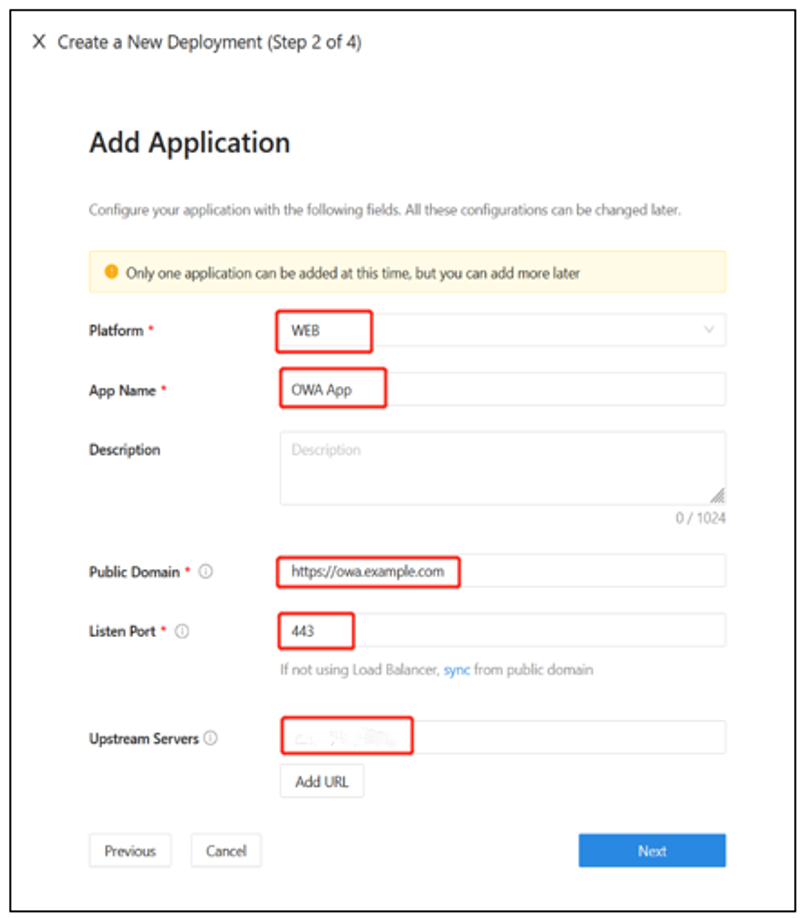

### Configure IdP

DCMC integration features help complete Microsoft Entra configuration. Instead, DCMC calls Microsoft Graph API to perform the tasks. The feature reduces time, effort, and errors.

1.  On **Configure IdP**, enter a **Name**.

2.  For **Protocol**, select **OIDC**.

3.  For **Identity Provider**, select **Microsoft Entra ID**.

4.  Enable **Automatic Generator**.

5.  For **Supported account types**, select **Account in this organizational directory only (Single tenant)**.

6.  Select **Create**.

7.  A page appears with deployment steps for DAP and the application.

8.  See the deployment's Docker Compose file, which includes an image of the DAP, also **PROVISIONING_KEY** and **PROVISIONING_SECRET.** DAP uses the keys to pull the latest DCMC configuration and policies.

### Configure Kerberos

1.  On your application page, select **Application Detail**.

2.  Select the **Advanced** tab.

3.  On the **Kerberos** sub tab, enable **Kerberos**.

4.  For **Kerberos Realm**, enter the location where the Kerberos database is stored, or the domain.

5.  For **SPN**, enter the OWA application's service principal name. It's not the same SPN you created.

6.  For **Delegated Login Identity**, enter the applications external-facing URL. Use localhost DNS for testing.

7.  For **KDC**, enter a domain controller IP. If DNS is configured, enter a fully qualified domain name (FQDN).

8.  For **Service Account**, enter the service account you created.

9.  For **Auth Type**, select **Password**.

10. Enter a service account **Password**.

11. Select **Save**.
    
    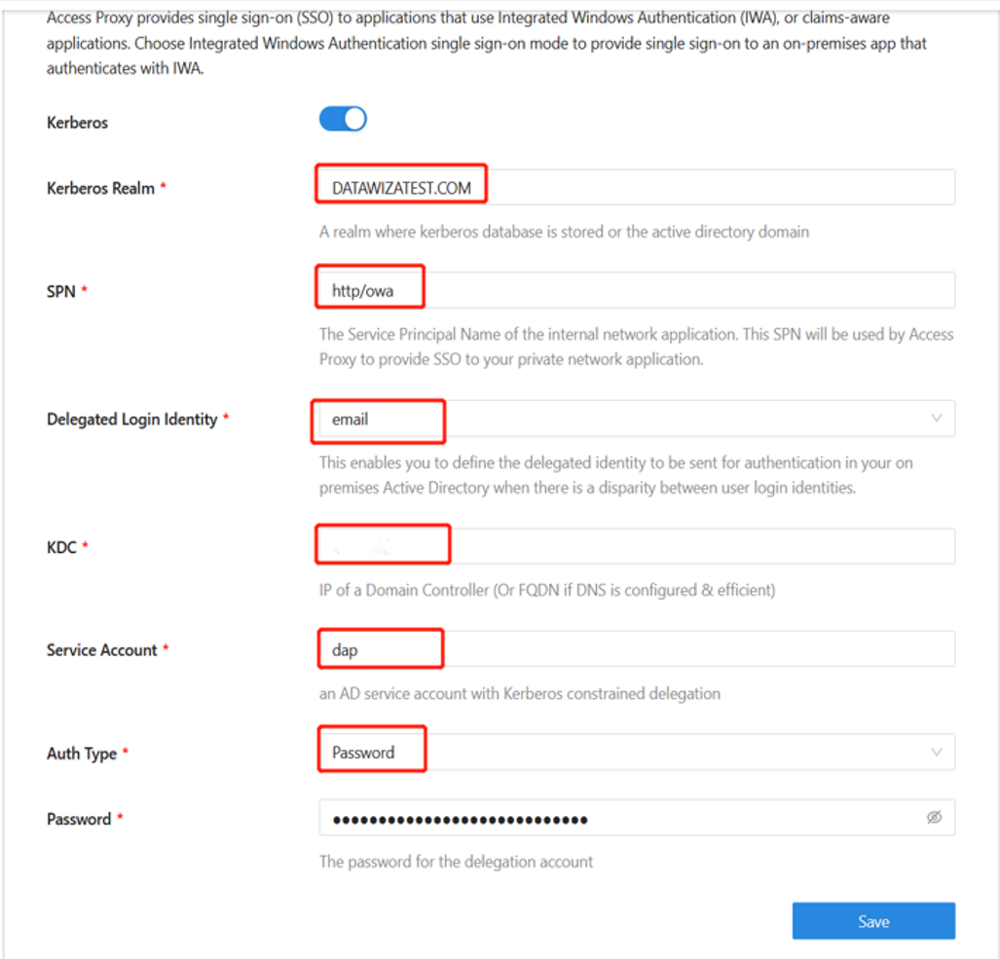

### SSL configuration

1.  On your application page, select the **Advanced** tab.

2.  Select the **SSL** subtab.

3.  Select **Edit**.

    

4.  Select the option to **Enable SSL**.

5.  From **Cert Type**, select a certificate type. You can use the provided self-signed localhost certificate for testing.

    

6.  Select **Save**.

## Optional: Enable Microsoft Entra multifactor authentication

To provide more sign-in security, you can enforce Microsoft Entra multifactor authentication. The process starts in the Microsoft Entra admin center.

1. Sign in to the [Microsoft Entra admin center](https://entra.microsoft.com) as an [Application Administrator](~/identity/role-based-access-control/permissions-reference.md#application-administrator).
2. Browse to **Identity** > **Overview** > **Properties** tab.
3. Under **Security defaults**, select **Manage security defaults**.
4. On the **Security defaults** pane, toggle the dropdown menu to select **Enabled**.
5. Select **Save**.

## Next steps

-   [Enable SSO and MFA for Oracle JD Edwards with Microsoft Entra ID via Datawiza](https://www.youtube.com/watch?v=_gUGWHT5m90)
-   [Configure Secure Hybrid Access with Microsoft Entra ID and Datawiza](./datawiza-configure-sha.md)
-   Go to docs.datawiza.com for [Datawiza user guides](https://docs.datawiza.com/)
