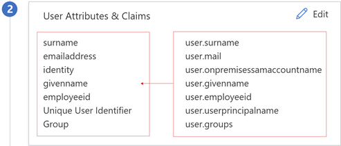
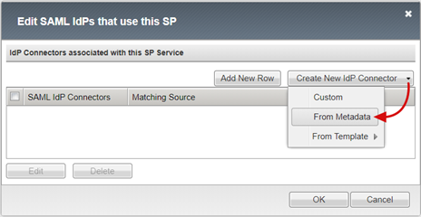
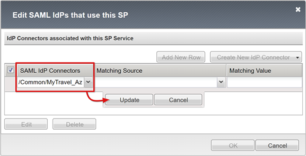
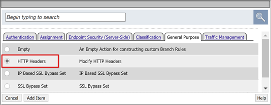
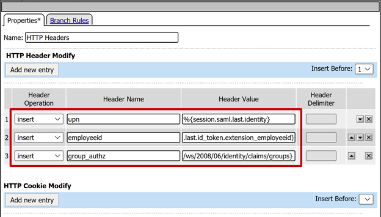
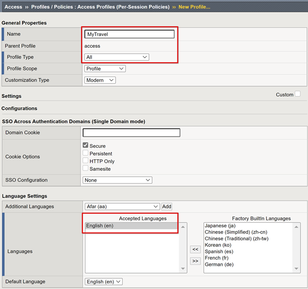
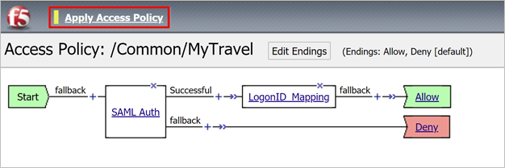
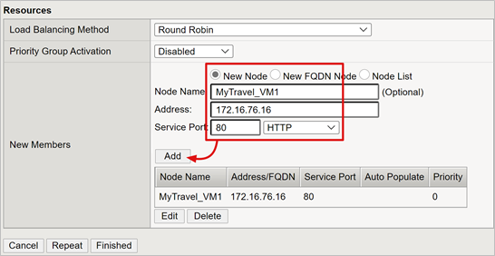

# Tutorial: Configure F5 BIG-IP Access Policy Manager for header-based single sign-on

Learn to implement secure hybrid access (SHA) with single sign-on (SSO) to header-based applications, using F5 BIG-IP advanced configuration. BIG-IP published applications and Microsoft Entra configuration benefits:

* Improved Zero Trust governance through Microsoft Entra preauthentication and Conditional Access
  * See, [What is Conditional Access?](~/identity/conditional-access/overview.md)
  * See, [Zero Trust security](/azure/security/fundamentals/zero-trust)
* Full SSO between Microsoft Entra ID and BIG-IP published services
* Managed identities and access from one control plane
  * See, the [Microsoft Entra admin center](https://entra.microsoft.com)

Learn more:

* [Integrate F5 BIG-IP with Microsoft Entra ID](./f5-integration.md)
* [Enable SSO for an enterprise application](add-application-portal-setup-sso.md)

## Scenario description

For this scenario, there's a legacy application using HTTP authorization headers to control access to protected content. Ideally, Microsoft Entra ID manages application access. However, legacy lacks a modern authentication protocol. Modernization takes effort and time, while introducing downtime costs and risks. Instead, deploy a BIG-IP between the public internet and the internal application to gate inbound access to the application.

A BIG-IP in front of the application enables overlay of the service with Microsoft Entra preauthentication and header-based SSO. The configuration improves the application security posture.

## Scenario architecture

The secure hybrid access solution for this scenario is made up of:

* **Application** - BIG-IP published service to be protected by Microsoft Entra SHA
* **Microsoft Entra ID** - Security Assertion Markup Language (SAML) identity provider (IdP) that verifies user credentials, Conditional Access, and SSO to the BIG-IP
  * With SSO, Microsoft Entra ID provides the BIG-IP required session attributes, including user identifiers
* **BIG-IP** - reverse-proxy and SAML service provider (SP) to the application, delegating authentication to the SAML IdP, before header-based SSO to the back-end application

The following diagram illustrates the user flow with Microsoft Entra ID, BIG-IP, APM, and an application.

   

1. User connects to application SAML SP endpoint (BIG-IP).
2. BIG-IP APM access policy redirects user to Microsoft Entra ID (SAML IdP).
3. Microsoft Entra preauthenticates user and applies ConditionalAccess policies.
4. User is redirected to BIG-IP (SAML SP) and SSO occurs using issued SAML token. 
5. BIG-IP injects Microsoft Entra attributes as headers in request to the application. 
6. Application authorizes request and returns payload.

## Prerequisites

For the scenario you need:

* An Azure subscription
  * If you don't have one, get an [Azure free account](https://azure.microsoft.com/free/)
* One of the following roles: Cloud Application Administrator, or Application Administrator
* A BIG-IP or deploy a BIG-IP Virtual Edition (VE) in Azure
  * See, [Deploy F5 BIG-IP Virtual Edition Virtual Machine in Azure](./f5-bigip-deployment-guide.md)
* Any of the following F5 BIG-IP licenses:
  * F5 BIG-IP® Best bundle
  * F5 BIG-IP Access Policy Manager™ (APM) standalone license
  * F5 BIG-IP Access Policy Manager™ (APM) add-on license on a BIG-IP F5 BIG-IP® Local Traffic Manager™ (LTM)
  * 90-day BIG-IP full feature trial. See, [Free Trials](https://www.f5.com/trial/big-ip-trial.php).
* User identities synchronized from an on-premises directory to Microsoft Entra ID
  * [Microsoft Entra Connect Sync: Understand and customize synchronization](~/identity/hybrid/connect/how-to-connect-sync-whatis.md)
* An SSL certificate to publish services over HTTPS, or use default certificates while testing
  * See, [SSL profile](./f5-bigip-deployment-guide.md#ssl-profile)
* A header-based application or an IIS header app for testing

## BIG-IP configuration method

The following instructions are an advanced configuration method, a flexible way to implement SHA. Manually create BIG-IP configuration objects. Use this method for scenarios not included in the Guided Configuration templates. 

   >[!NOTE]
   > Replace example strings or values with those from your environment.

## Add F5 BIG-IP from the Microsoft Entra gallery

To implement SHA, the first step is to set up a SAML federation trust between BIG-IP APM and Microsoft Entra ID. The trust establishes the integration for BIG-IP to hand off preauthentication and Conditional Access to Microsoft Entra ID, before granting access to the published service.

Learn more: [What is Conditional Access?](~/identity/conditional-access/overview.md)

1. Sign in to the [Microsoft Entra admin center](https://entra.microsoft.com) as at least a [Cloud Application Administrator](~/identity/role-based-access-control/permissions-reference.md#cloud-application-administrator). 
2. Browse to **Entra ID** > **Enterprise apps** > **All applications**.
3. On the top ribbon, select **+ New application**.
4. In the gallery, search for **F5**.
5. Select **F5 BIG-IP APM Microsoft Entra ID integration**.

6. Enter an application **Name**.
7. Select **Add/Create**. 
8. The name reflects the service.

## Configure Microsoft Entra SSO 

1. The new **F5** application properties appear
2. Select **Manage** > **Single sign-on**
3. On the **Select a single sign-on method** page, select **SAML**.
4. Skip the prompt to save the single sign-on settings.
5. Select **No, I'll save later**.
6. On **Set up single sign-on with SAML**, for **Basic SAML Configuration**, select the **pen** icon.
7. Replace the **Identifier** URL with the BIG-IP published service URL. For example, `https://mytravel.contoso.com`
8. Repeat for **Reply URL** and include the APM SAML endpoint path. For example, `https://mytravel.contoso.com/saml/sp/profile/post/acs`

   >[!NOTE]
   >In this configuration, the SAML flow operates in IdP mode: Microsoft Entra ID issues the user a SAML assertion before being redirected to the BIG-IP service endpoint for the application. The BIG-IP APM supports IdP and SP modes.

9. For **Logout URI** enter the BIG-IP APM Single Logout (SLO) endpoint, prepended by the service host header. The SLO URI ensures user BIG-IP APM sessions end after Microsoft Entra sign-out. For example, `https://mytravel.contoso.com/saml/sp/profile/redirect/slr`

   

   >[!Note]
   >From Traffic Management operating system (TMOS) v16 onward, the SAML SLO endpoint changed to `/saml/sp/profile/redirect/slo`.

10. Select **Save**.
11. Exit SAML configuration.
12. Skip the SSO test prompt.
13. To edit the **User Attributes & Claims > + Add new claim**, select the **pen** icon.
14. For **Name** select **Employeeid**.
15. For **Source attribute** select **user.employeeid**.
16. Select **Save**

   

17. Select **+ Add a group claim**
18. Select **Groups assigned to the application** > **Source Attribute** > **sAMAccountName**.

   

19. Select **Save** the configuration.
20. Close the view.
21. Observe the **User Attributes & Claims** section properties. Microsoft Entra ID issues users properties for BIG-IP APM authentication and SSO to the back-end application.

   

   > [!NOTE]
   > Add other claims the BIG-IP published application expects as headers. More defined claims are issued if they're in Microsoft Entra ID. Define directory memberships and user objects in Microsoft Entra ID before claims can be issued. See, [Configure group claims for applications by using Microsoft Entra ID](~/identity/hybrid/connect/how-to-connect-fed-group-claims.md).

22. In the **SAML Signing Certificate** section, select **Download**. 
23. The **Federation Metadata XML** file is saved on your computer.

SAML signing certificates created by Microsoft Entra ID have a lifespan of three years.

### Microsoft Entra authorization

By default, Microsoft Entra ID issues tokens to users granted access to an application.

1. In the application's configuration view, select **Users and groups**.
2. Select **+ Add user** and in **Add Assignment**, select **Users and groups**.
3. In the **Users and groups** dialog, add the user groups authorized to access the header-based application. 
4. Select **Select**.
5. Select **Assign**.

Microsoft Entra SAML federation trust is complete. Next, set up BIG-IP APM to publish the web application, configured with properties to complete SAML preauthentication trust.

## Advanced configuration

Use the following sections to configure SAML, header SSO, access profile, and more.

### SAML configuration

To federate the published application with Microsoft Entra ID, create the BIG-IP SAML service provider and corresponding SAML IdP objects.

1. Select **Access** > **Federation** > **SAML Service Provider** > **Local SP Services** > **Create**.

   

2. Enter a **Name**.
3. Enter the **Entity ID** defined in Microsoft Entra ID.

   

4. For **SP Name Settings**, make selections if the Entity ID doesn't match the hostname of the published URL, or make selections if it isn't in regular hostname-based URL format. Provide the external scheme and application hostname if entity ID is `urn:mytravel:contosoonline`.
5. Scroll down to select the new SAML SP object.
6. Select **Bind/UnBind IdP Connectors**.

   

7. Select **Create New IdP Connector**. 
8. From the drop-down, select **From Metadata**.

   

9. Browse to the federation metadata XML file you downloaded.
10. Enter an **Identity Provider Name** for the APM object for the external SAML IdP. For example, `MyTravel_EntraID`

   

11. Select **Add New Row**.
12. Select the new **SAML IdP Connector**.
13. Select **Update**.

   

14. Select **OK**.

   

### Header SSO configuration

Create an APM SSO object.

1. Select **Access** > **Profiles/Policies** > **Per-Request Policies** > **Create**.
2. Enter a **Name**.
3. Add at least one **Accepted Language**.
4. Select **Finished.** 

   

5. For the new per-request policy, select **Edit**.

   

6. The visual policy editor starts.
7. Under **fallback**, select the **+** symbol.

   

8. On the **General Purpose** tab, select **HTTP Headers** > **Add Item**.

   

9. Select **Add new entry**.
10. Create three HTTP and Header modify entries.
11. For **Header Name**, enter **upn**.
12. For **Header Value**, enter **%{session.saml.last.identity}**.
13. For **Header Name**, enter **employeeid**.
14. For **Header Value**, enter **%{session.saml.last.attr.name.employeeid}**.
15. For **Header Name**, enter **group\_authz**.
16. For **Header Value**, enter **%{session.saml.last.attr.name.`http://schemas.microsoft.com/ws/2008/06/identity/claims/groups`}**.

   >[!Note]
   >APM session variables in curly brackets are case sensitive. We recommend you define attributes in lowercase.

   

17. Select **Save**.
18. Close the visual policy editor.

   

### Access profile configuration

An access profile binds many APM elements managing access to BIG-IP virtual servers, including access policies, SSO configuration, and UI settings.

1. Select **Access** > **Profiles / Policies** > **Access Profiles (Per-Session Policies)** > **Create**.
2. For **Name**, enter **MyTravel**.
3. For **Profile Type**, select **All**.
4. For **Accepted Language**, select at least one language.
5. select **Finished**.

   

6. For the per-session profile you created, select **Edit**.

   

7. The visual policy editor starts.
8. Under fallback, select the **+** symbol.

   

9. Select **Authentication** > **SAML Auth** > **Add Item**.

   

10. For the **SAML authentication SP** configuration, from the **AAA Server** dropdown, select the SAML SP object you created.
11. Select **Save**.

   

### Attribute mapping

The following instructions are optional. With a LogonID_Mapping configuration, the BIG-IP active sessions list has the signed-in user principal name (UPN), not a session number. Use this data when analyzing logs or troubleshooting.

1. For the SAML Auth **Successful** branch, select the **+** symbol.

   

2. In the pop-up, select **Assignment** > **Variable Assign** > **Add Item**.

   

3. Enter a **Name**
4. In the **Variable Assign** section, select **Add new entry** > **change**. For example, LogonID_Mapping.

   

5. For **Custom Variable**, set **session.saml.last.identity**.
6. For **Session Variable**, set **session.logon.last.username**.
7. Select **Finished**.
8. Select**Save**.
9. On the Access Policy **Successful** branch, select the **Deny** terminal.
10. Select **Allow**.
11. Select **Save**.
12. Select **Apply Access Policy**.
13. Close the visual policy editor.

### Back-end pool configuration

To enable BIG-IP to forward client traffic correctly, create an APM node object representing the back-end server hosting your application. Place the node in an APM pool.

1. Select **Local Traffic > Pools > Pool List > Create**. 
2. For a server pool object, enter a **Name**. For example, MyApps_VMs.

   

3. Add a pool member object.
4. For **Node Name**, enter a name for the server hosting the back-end web application.
5. For **Address**, enter the IP address of the server hosting the application.
6. For **Service Port** enter the HTTP/S port the application is listening on.
7. Select **Add**.

   

   >[!NOTE]
   >To learn more go to my.f5.com for [K13397: Overview of HTTP health monitor request formatting for the BIG-IP DNS system](https://support.f5.com/csp/article/K13397).

## Virtual server configuration

A virtual server is a BIG-IP data plane object represented by a virtual IP address listening for clients requests to the application. Received traffic is processed and evaluated with the APM access profile associated with the virtual server. Traffic is directed according to policy.

1. Select **Local Traffic** > **Virtual Servers** > **Virtual Server List** > **Create**.
2. Enter a virtual server **Name**. 
3. For **Destination Address/Mask**, select **Host**
4. Enter an unused IP IPv4 or IPv6 to be assigned to the BIG-IP to receive client traffic.
5. For **Service Port**, select **Port**, **443**, and **HTTPS**.

   

6. For **HTTP Profile (Client)**, select **http**.
7. For **SSL Profile (Client)**, select the client SSL profile you created, or leave the default for testing.

   

8. For **Source Address Translation**, select **Auto Map**.

   

9. For **Access Policy**, select the **Access Profile** created earlier. This action binds the Microsoft Entra SAML preauthentication profile and headers SSO policy to the virtual server.
10. For **Per-Request Policy**, select **SSO_Headers**.

   

11. For **Default Pool**, select the back-end pool objects you created.
12. Select **Finished**.

   

## Session management

Use the BIG-IPs session management setting to define the conditions for user session termination or continuation. Create policy with **Access Policy** > **Access Profiles**. Select an application from the list.

Regarding SLO functionality, a SLO URI in Microsoft Entra ID ensures an IdP-initiated sign-out from the MyApps portal terminates the session between the client and the BIG-IP APM. The imported application federation metadata.xml provides the APM with the Microsoft Entra SAML sign-out endpoint, for SP initiated sign-out. Therefore, enable the APM to know when a user signs out.

If there's no BIG-IP web portal, the user can't instruct the APM to sign out. If the user signs out of the application, the BIG-IP is oblivious to the action. The application session can be reinstated through SSO. Therefore, SP-initiated sign out needs careful consideration. 

To ensure sessions terminate securely, add an SLO function to your application **Sign out** button. Enable it to redirect the client to the Microsoft Entra SAML sign-out endpoint. For the SAML sign out endpoint for your tenant, go to **App Registrations** > **Endpoints**.

If you can't change the app, enable the BIG-IP to listen for the app sign-out call and trigger SLO. To learn more:

* Go to support.f5.com for [K42052145: Configuring automatic session termination (logout) based on a URI-referenced file name](https://support.f5.com/csp/article/K42052145)
* Go to my.f5.com for [K12056: Overview of the Logout URI Include option](https://support.f5.com/csp/article/K12056)

## Deploy

1. Select **Deploy** to commit settings. 
2. Verify the application appears in your tenant. 
3. The application is published and accessible via SHA, with its URL or Microsoft portals.

## Test

Perform the following test as a user.

1. Select the application external URL, or in the MyApps portal select the application icon. 
2. Authenticate to Microsoft Entra ID.
3. A redirection occurs to the BIG-IP virtual server for the app and signed in with SSO.
4. The injected header output appears by the header-based application.

For increased security, block direct access to the application, enforcing a path through the BIG-IP.

## Troubleshooting

Use the following guidance for troubleshooting.

### Log verbosity

BIG-IP logs have information to help isolate authentication and SSO issues. Increase the log verbosity level:

1. Go to **Access Policy** > **Overview** > **Event Logs**.
2. Select **Settings**. 
3. Select the row of your published application.
4. Select **Edit** > **Access System Logs**. 
5. From the SSO list, select **Debug**.
6. Select **OK**. 
7. Reproduce the issue.
8. Review the logs.
9. When finished, revert the settings.

### BIG-IP error message

If a BIG-IP error appears after redirection, the issue likely relates to SSO from Microsoft Entra ID to the BIG-IP. 

1. Navigate to **Access Policy** > **Overview**.
2. Select **Access reports**.
3. Run the report for the last hour.
4. Review the logs for clues. 
5. For your session, select the **View session variables** link. 
6. Verify the APM receives the expected claims from Microsoft Entra ID.

### No BIG-IP error message

If no BIG-IP error message appears, then the issue is probably more related to SSO from the BIG-IP to the backend application. 

1. Navigate to **Access Policy** > **Overview**.
2. Select **Active Sessions**.
3. Select the link for your active session. 
4. Select the **View Variables** link to determine any SSO issues. 
5. Confirm the BIG-IP APM fails or succeeds to obtain the correct user and domain identifiers.

Learn more:

* Go to devcentral.f5.com for [APM variable assign examples](https://devcentral.f5.com/s/articles/apm-variable-assign-examples-1107)
* Go to techdocs.f5.com for [BIG-IP Access Policy Manager: Visual Policy Editor](https://techdocs.f5.com/en-us/bigip-16-1-0/big-ip-access-policy-manager-visual-policy-editor.html)

## Resources

* [Passwordless authentication](https://www.microsoft.com/security/business/identity/passwordless)
* [What is Conditional Access?](~/identity/conditional-access/overview.md)
* [Zero Trust framework to enable remote work](https://www.microsoft.com/security/blog/2020/04/02/announcing-microsoft-zero-trust-assessment-tool/)
