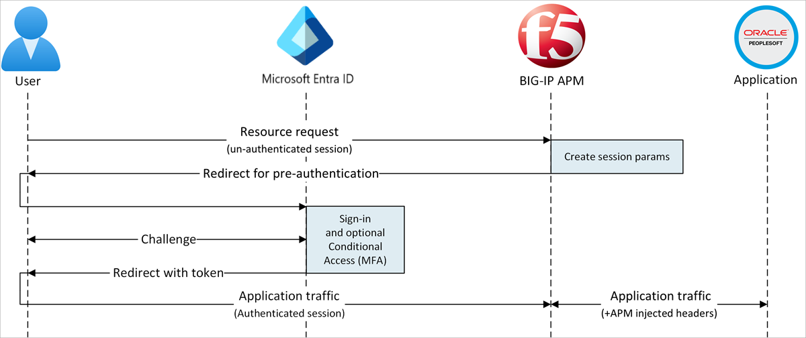
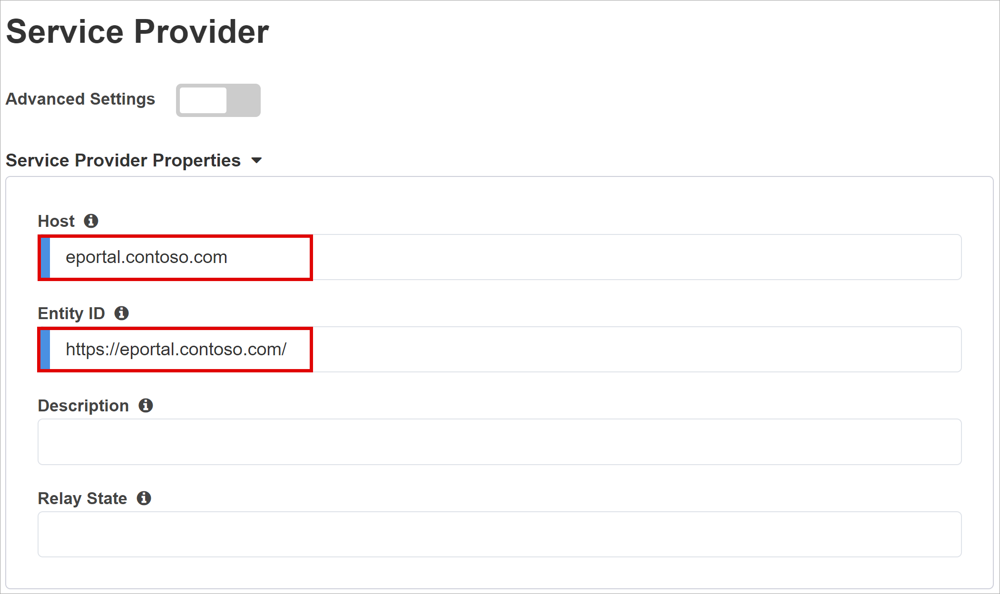
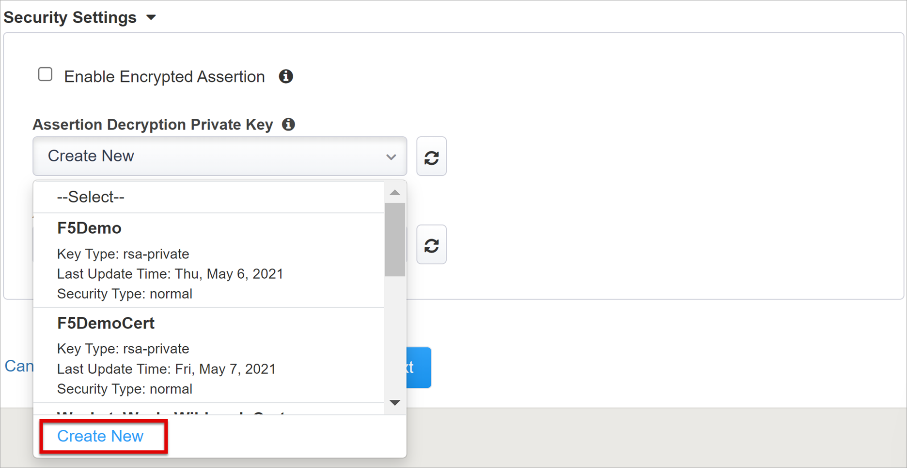
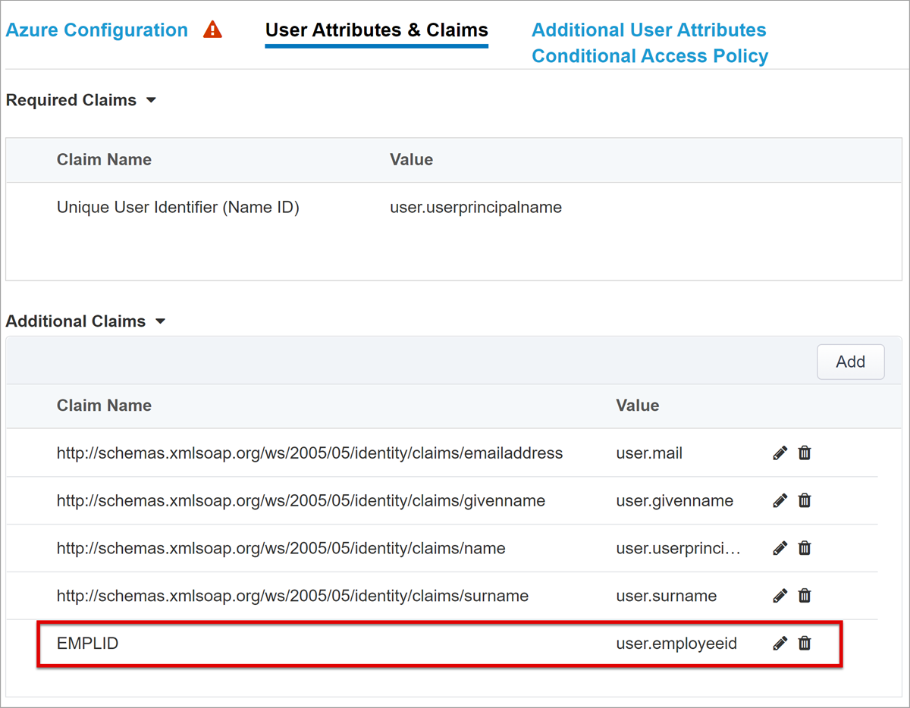
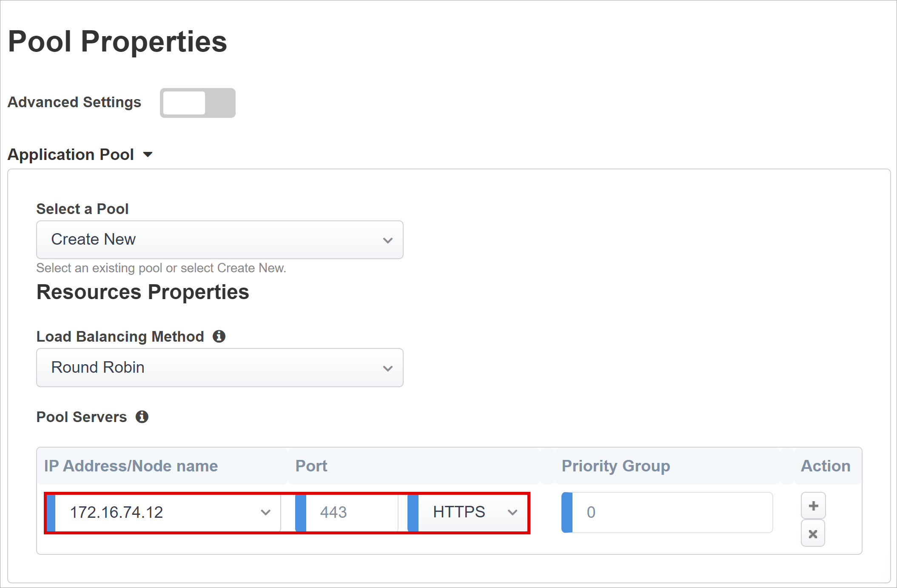
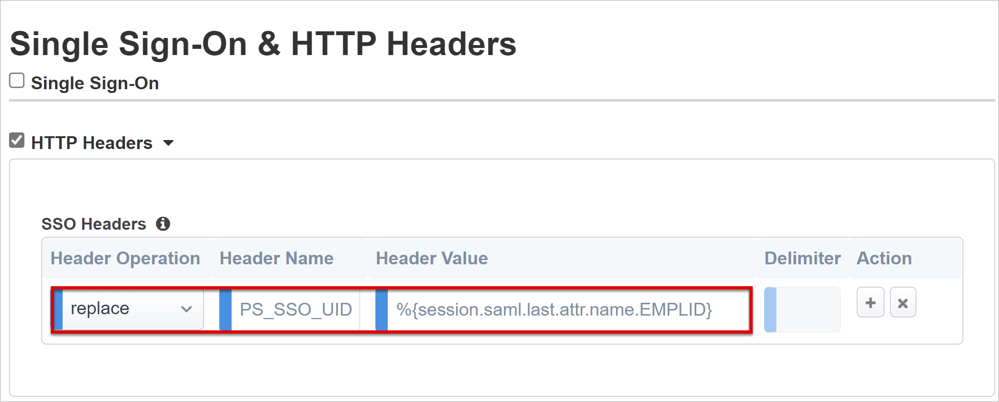
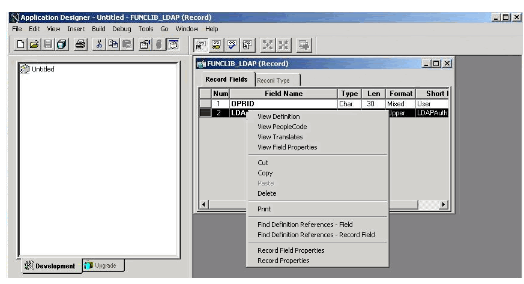
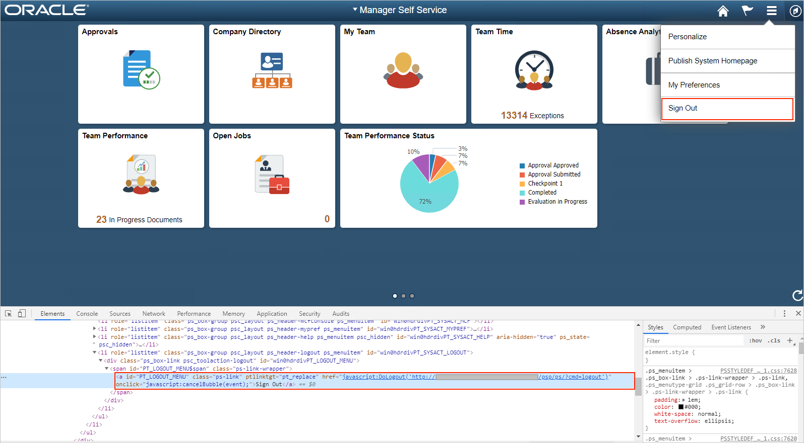

# Tutorial: Configure F5 BIG-IP Easy Button for SSO to Oracle PeopleSoft

In this article, learn to secure Oracle PeopleSoft (PeopleSoft) using Microsoft Entra ID, with F5 BIG-IP Easy Button Guided Configuration 16.1.

Integrate BIG-IP with Microsoft Entra ID for many benefits:

* Improved Zero Trust governance through Microsoft Entra preauthentication and Conditional Access
  * See, [Zero Trust framework to enable remote work](https://www.microsoft.com/security/blog/2020/04/02/announcing-microsoft-zero-trust-assessment-tool/)  
  * See, [What is Conditional Access?](~/identity/conditional-access/overview.md)
* Single sign-on (SSO) between Microsoft Entra ID and BIG-IP published services
* Manage identities and access from the [Microsoft Entra admin center](https://entra.microsoft.com)

Learn more: 

* [Integrate F5 BIG-IP with Microsoft Entra ID](./f5-integration.md)
* [Enable single sign-on for an enterprise application](add-application-portal-setup-sso.md)

## Scenario description

For this tutorial, there's use of a PeopleSoft application using HTTP authorization headers to manage access to protected content.

Legacy applications lack modern protocols to support Microsoft Entra integration. Modernization is costly, requires planning, and introduces potential downtime risk. Instead, use an F5 BIG-IP Application Delivery Controller (ADC) to bridge the gap between legacy applications and modern ID control, with protocol transitioning.

With a BIG-IP in front of the app, you overlay the service with Microsoft Entra preauthentication and header-based SSO. This action improves the application's security posture.

   > [!NOTE]
   > Gain remote access to this type of application with Microsoft Entra application proxy. </br> See, [Remote access to on-premises applications through Microsoft Entra application proxy](/entra/identity/app-proxy).

## Scenario architecture

The secure hybrid access (SHA) solution for this tutorial has the following components:

* **PeopleSoft Application** - BIG-IP published service secured by Microsoft Entra SHA
* **Microsoft Entra ID** - Security Assertion Markup Language (SAML) identity provider (IdP) that verifies user credentials, Conditional Access, and SAML-based SSO to the BIG-IP
  * Through SSO, Microsoft Entra ID provides session attributes to the BIG-IP 
* **BIG-IP** - reverse-proxy and SAML service provider (SP) to the application. It delegates authentication to the SAML IdP, then performs header-based SSO to the PeopleSoft service.

For this scenario, SHA supports SP- and IdP-initiated flows. The following diagram illustrates the SP-initiated flow.

   

1. User connects to application endpoint (BIG-IP).
2. BIG-IP APM access policy redirects user to Microsoft Entra ID (SAML IdP).
3. Microsoft Entra preauthenticates user and applies Conditional Access policies.
4. User is redirected to BIG-IP (SAML SP) and SSO occurs with issued SAML token.
5. BIG-IP injects Microsoft Entra attributes as headers in the request to the application.
6. Application authorizes request and returns payload.

## Prerequisites

* A Microsoft Entra ID Free account, or higher
  * If you don't have one, get an [Azure free account](https://azure.microsoft.com/free/active-directory/)
* A BIG-IP or a BIG-IP Virtual Edition (VE) in Azure
  * See, [Deploy F5 BIG-IP Virtual Edition VM in Azure](./f5-bigip-deployment-guide.md)
* Any of the following F5 BIG-IP licenses:
    * F5 BIG-IP&reg; Best bundle
    * F5 BIG-IP APM standalone license
    * F5 BIG-IP APM add-on license on an existing BIG-IP F5 BIG-IP&reg; Local Traffic Manager&trade; (LTM)
    * 90-day BIG-IP full feature [trial license](https://www.f5.com/trial/big-ip-trial.php)
* User identities synchronized from an on-premises directory to Microsoft Entra ID, or created in Microsoft Entra ID and flowed back to the on-premises directory
  * See, [Microsoft Entra Connect Sync: Understand and customize synchronization](~/identity/hybrid/connect/how-to-connect-sync-whatis.md)
* One of the following roles: Global Administrator, Cloud Application Administrator, or Application Administrator.
* An SSL Web certificate to publish services over HTTPS, or use default BIG-IP certs for testing
  * See, [Deploy F5 BIG-IP Virtual Edition VM in Azure](./f5-bigip-deployment-guide.md)
* A PeopleSoft environment

## BIG-IP configuration

This tutorial uses Guided Configuration 16.1 with an Easy button template.

With the Easy Button, admins don't go between Microsoft Entra ID and a BIG-IP to enable services for SHA. APM Guided Configuration wizard and Microsoft Graph handle deployment and policy management. The integration ensures applications support identity federation, SSO, and Conditional Access.

   >[!NOTE] 
   > Replace example strings or values in this tutorial with those in your environment.

## Register the Easy Button

[!INCLUDE [portal updates](~/includes/portal-update.md)]

Before a client or service accesses Microsoft Graph, the Microsoft identity platform must trust it.

Learn more: [Quickstart: Register an application with the Microsoft identity platform](~/identity-platform/quickstart-register-app.md)

The following instructions help you create a tenant app registration to authorize Easy Button access to Graph. With these permissions, the BIG-IP pushes the configurations to establish a trust between a SAML SP instance for published application, and Microsoft Entra ID as the SAML IdP.

1. Sign in to the [Microsoft Entra admin center](https://entra.microsoft.com) as at least a [Cloud Application Administrator](~/identity/role-based-access-control/permissions-reference.md#cloud-application-administrator). 
2. Browse to **Identity** > **Applications** > **App registrations > New registration**.
3. Enter an application **Name**.
4. For **Accounts in this organizational directory only**, specify who uses the application.
5. Select **Register**. 
6. Navigate to **API permissions**.
7. Authorize the following Microsoft Graph **Application permissions**:

   * Application.ReadWrite.All
   * Application.ReadWrite.OwnedBy
   * Directory.Read.All
   * Group.Read.All
   * IdentityRiskyUser.Read.All
   * Policy.Read.All
   * Policy.ReadWrite.ApplicationConfiguration
   * Policy.ReadWrite.ConditionalAccess
   * User.Read.All

8. Grant admin consent to your organization.
9. Go to **Certificates & Secrets**.
10. Generate a new **Client Secret** and note it.
11. Go to **Overview** and note the **Client ID** and **Tenant ID**.

## Configure the Easy Button

1. Initiate the APM Guided Configuration.
2. Launch the Easy Button template.
3. Navigate to **Access > Guided Configuration**.
4. Select **Microsoft Integration**.
5. Select **Microsoft Entra Application**.
6. Review the configuration sequence.
7. Select **Next**
8. Follow the configuration sequence.


   
### Configuration Properties

Use the **Configuration Properties** tab to creat new application configurations and SSO objects. The **Azure Service Account Details** section represents the client you registered in the Microsoft Entra tenant, as an application. Use the settings for BIG-IP OAuth client to register a SAML SP in the tenant, with SSO properties. Easy Button does this action for BIG-IP services published and enabled for SHA.

   > [!NOTE]
   > Some of the following settings are global. You can reuse them to publish more applications.

1. Enter a **Configuration Name**. Unique names help distinguish configurations.
2. For **Single Sign-On (SSO) & HTTP Headers**, select **On**.
3. Enter the **Tenant ID, Client ID**, and **Client Secret** you noted.
4. Confirm the BIG-IP connects to the tenant.
5. Select **Next**.


 
### Service Provider

Use the **Service Provider** settings to define SAML SP properties for the APM instance that represents the SHA-secured application.

1. For **Host**, enter the public FQDN of the secured application.
2. For **Entity ID**, enter the identifier Microsoft Entra ID uses to identify the SAML SP requesting a token.



3. (Optional) For **Security Settings**, indicate Microsoft Entra ID encrypts issued SAML assertions. This option increases assurance that content tokens aren't intercepted, nor data compromised.

4. From the **Assertion Decryption Private Key** list, select **Create New**.



5. Select **OK**. 
6. The **Import SSL Certificate and Keys** dialog appears in a new tab.
7. For **Import Type**, select **PKCS 12 (IIS)**. This option imports your certificate and private key.
8. Close the browser tab to return to the main tab.


9. For **Enable Encrypted Assertion**, check the box.
10. If you enabled encryption, from the **Assertion Decryption Private Key** list, select your certificate. This private key is for the certificate that BIG-IP APM uses to decrypt Microsoft Entra assertions.
11. If you enabled encryption, from the **Assertion Decryption Certificate** list, select your certificate. BIG-IP uploads this certificate to Microsoft Entra ID to encrypt issued SAML assertions.


 
<a name='azure-active-directory'></a>

### Microsoft Entra ID

The Easy Button has templates for Oracle PeopleSoft, Oracle E-Business Suite, Oracle JD Edwards, SAP ERP and a generic SHA template. 

1. Select **Oracle PeopleSoft**.
2. Select **Add**.

#### Azure Configuration

1. Enter **Display Name** for the app BIG-IP creates in the tenant. The name appears on an icon in [My Apps](https://myapplications.microsoft.com/).
2. (Optional) For **Sign On URL** enter the PeopleSoft application public FQDN.
3. Next to the **Signing Key** and **Signing Certificate**, select **refresh**. This action locates the certificate you imported.
4. For **Signing Key Passphrase**, enter the certificate password.

5. (Optional) For **Signing Option**, select an option. This selection ensures BIG-IP accepts tokens and claims signed by Microsoft Entra ID.


6. **User And User Groups** are dynamically queried from the Microsoft Entra tenant. 
7. Add a user or group for testing, otherwise access is denied.


 
 #### User Attributes & Claims

When a user authenticates, Microsoft Entra ID issues a SAML token with default claims and attributes identifying the user. The **User Attributes & Claims** tab has default claims to issue for the new application. Use it to configure more claims. The Easy Button template has the employee ID claim required by PeopleSoft.


 
If needed, include other Microsoft Entra attributes. The sample PeopleSoft application requires predefined attributes.

#### Additional User Attributes

The **Additional User Attributes** tab supports distributed systems that require attributes are stored in other directories for session augmentation. Attributes from an LDAP source are injected as more SSO headers to control access based on roles, Partner IDs, etc. 

   >[!NOTE] 
   >This feature has no correlation to Microsoft Entra ID; it's another attribute source.
 
 #### Conditional Access Policy

Conditional Access policies are enforced after Microsoft Entra preauthentication to control access based on device, application, location, and risk signals. The **Available Policies** view has Conditional Access policies with no user actions. The **Selected Policies** view has policies targeting cloud apps. You can't deselect or move these policies to the Available Policies list because they're enforced at the tenant level.

Select a policy for the application.

1. In the **Available Policies** list, select a policy.
2. Select the **right arrow** and move the policy to **Selected Policies**.

Selected policies have the **Include** or **Exclude** option checked. If both options are checked, the policy isn't enforced.


   > [!NOTE]
   > The policy list appears once, when you select the tab. Use **Refresh** for the wizard to query the tenant. This option appears after the application is deployed.

### Virtual Server Properties

A virtual server is a BIG-IP data plane object represented by a virtual IP address. The server listens for client requests to the application. Received traffic is processed and evaluated against the virtual server APM profile. Then, traffic is directed according to policy.

1. For **Destination Address**, enter the IPv4 or IPv6 address BIG-IP uses to receive client traffic. A corresponding record appears in DNS, which enables clients to resolve the published application's external URL to the IP. Use a test computer localhost DNS for testing.
2. For **Service Port**, enter **443** and select **HTTPS**.
3. For **Enable Redirect Port**, check the box.
4. For **Redirect Port**, enter **80** and select **HTTP**. This option redirects incoming HTTP client traffic to HTTPS.
5. For **Client SSL Profile**, select **Use Existing**.
6. Under **Common** select the option you created. If testing, leave the default. Client SSL Profile enables the virtual server for HTTPS, so client connections are encrypted over TLS.


 
 ### Pool Properties

The **Application Pool** tab has services behind a BIG-IP, represented as a pool with application servers.

1. For **Select a Pool**, select **Create New**, or select one.
2. For **Load Balancing Method**, select **Round Robin**.
3. For **Pool Servers**, in **IP Address/Node Name** select a node, or enter an IP and port for servers hosting the PeopleSoft application.



 #### Single sign-on & HTTP Headers

The Easy Button wizard supports Kerberos, OAuth Bearer, and HTTP authorization headers for SSO to published applications. The PeopleSoft application expects headers. 

1. For **HTTP Headers**, check the box.
2. For **Header Operation**, select **replace**.
3. For **Header Name**, enter **PS_SSO_UID**.
4. For **Header Value**, enter **%{session.sso.token.last.username}**.



   >[!NOTE] 
   >APM session variables in curly brackets are case-sensitive. For instance, if you enter OrclGUID, and the attribute name is orclguid, attribute mapping fails.

### Session Management

Use BIG-IP session management settings to define conditions for user sessions termination or continuation. Set limits for users and IP addresses, and corresponding user info. 

To learn more, go to support.f5.com for [K18390492: Security | BIG-IP APM operations guide](https://support.f5.com/csp/article/K18390492)

Not covered in the operations guide is single log-out (SLO) functionality, which ensures IdP, BIG-IP, and user agent sessions terminate when users sign out. When the Easy Button instantiates a SAML application in the Microsoft Entra tenant, it populates the Logout URL with the APM SLO endpoint. IdP-initiated sign out from [My Apps](https://myapplications.microsoft.com/) terminates BIG-IP and client sessions.
 
Published-application SAML federation data is imported from the tenant. This action provides the APM with the SAML sign-out endpoint for Microsoft Entra ID, which ensures SP-initiated sign out terminates client and Microsoft Entra sessions. The APM needs to know when a user signs out.

When the BIG-IP webtop portal accesses published applications, the APM processes a sign out to call the Microsoft Entra sign-out endpoint. If the BIG-IP webtop portal isn't used, the user can't instruct the APM to sign out. If the user signs out of the application, the BIG-IP is oblivious. SP-initiated sign out needs secure session termination. Add an SLO function to your application **Sign out** button, to redirect your client to the Microsoft Entra SAML or BIG-IP sign out endpoint. The SAML sign out endpoint URL for your tenant in **App Registrations > Endpoints**.

If you can't change the app, consider having the BIG-IP listen for application sign out calls, and trigger SLO. For more information, see **PeopleSoft Single Logout** in the following section.

### Deployment

1. Select **Deploy**.
2. Verify the application in the tenant list of Enterprise applications. 
3. The application is published and accessible with SHA.
 
## Configure PeopleSoft
 
Use Oracle Access Manager for PeopleSoft application identity and access management. 

To learn more, got o docs.oracle.com for [Oracle Access Manger Integration Guide, Integrating PeopleSoft](https://docs.oracle.com/cd/E12530_01/oam.1014/e10356/people.htm)

### Configure Oracle Access Manager SSO

Configure Oracle Access Manager to accept SSO from the BIG-IP. 

1.    Sign into the Oracle console with admin permissions.


 
2. Navigate to **PeopleTools > Security**.
3. Select **User Profiles**.
4. Select **User Profiles**.
5. Create a new user profile.
6. For **User ID**, enter **OAMPSFT**
7. For **User Role**, enter **PeopleSoft User**.
8. Select **Save**.


 
9.    Navigate to **People Tools** > **Web Profile**.
10.    Select the web profile.
11.    On **Security** tab, in **Public Users**, select **Allow Public Access**.
12.    For **User ID**, enter **OAMPSFT**.
13.    Enter the **Password**.


 
14.    Leave the Peoplesoft console.
15.    Start **PeopleTools Application Designer**.
16.    Right-click the **LDAPAUTH** field.
17.    Select **View PeopleCode**.


 
18.    The **LDAPAUTH** code windows opens.
19.    Locate the **OAMSSO_AUTHENTICATION** function.
20. Replace the **&defaultUserId** value with **OAMPSFT**. 

    
 
21.    Save the record. 
22.    Navigate to **PeopleTools > Security.
23.    Select **Security Objects**.
24.    Select **Sign on PeopleCode**.
25.    Enable **OAMSSO_AUTHENTICATION**.
 
### PeopleSoft Single Logout

When you sign out of [My Apps](https://myapplications.microsoft.com/), PeopleSoft SLO is initiated, which in turn calls the BIG-IP SLO endpoint. BIG-IP needs instructions to perform SLO on behalf of the application. Have the BIG-IP listen for user sign out requests to PeopleSoft, and then trigger SLO.

Add SLO support for PeopleSoft users.

1.    Obtain the PeopleSoft portal sign-out URL.
2.    Open the portal with a web browser.
3.    Enable the debug tools. 
4.    Locate the element with the **PT_LOGOUT_MENU** ID.
5.    Save the URL path with the query parameters. In this example: `/psp/ps/?cmd=logout`.


 
Create a BIG-IP iRule to redirect users to the SAML SP sign out endpoint: `/my.logout.php3`.
 
1.    Navigate to **Local Traffic > iRules List.
2.    Select **Create**. 
3.    Enter a rule **Name**.
4.    Enter the following command lines.
 
   ```when HTTP_REQUEST {switch -glob -- [HTTP::uri] { "/psp/ps/?cmd=logout" {HTTP::redirect "/my.logout.php3" }}}```

5. Select **Finished**.

Assign the iRule to the BIG-IP Virtual Server.
 
1. Navigate to **Access > Guided Configuration**.
2. Select the PeopleSoft application configuration link.


 
3.    From the top navigation bar, select **Virtual Server**.
4.    For **Advanced Settings**, select **On*.


4.    Scroll to the bottom.
5.    Under **Common**, add the iRule you created.


 
5.    Select **Save**.
6.    Select **Next**.
7.    Continue to configure settings. 
 
To learn more, go to support.f5.com for:

* [K42052145: Configuring automatic session termination (logout) based on a URI-referenced file name](https://support.f5.com/csp/article/K42052145)
* [K12056: Overview of the Logout URI Include option](https://support.f5.com/csp/article/K12056)

### Default to PeopleSoft landing page
 
Redirect user requests from the root ("/") to the external PeopleSoft portal, usually located in: "/psc/ps/EXTERNAL/HRMS/c/NUI_FRAMEWORK.PT_LANDINGPAGE.GBL"
 
1.    Navigate to **Local Traffic > iRule**.
2.    Select **iRule_PeopleSoft**.
3.    Add the following command lines.
 
   ```when HTTP_REQUEST {switch -glob -- [HTTP::uri] {"/" {HTTP::redirect "/psc/ps/EXTERNAL/HRMS/c/NUI_FRAMEWORK.PT_LANDINGPAGE.GB"/psp/ps/?cmd=logout" {HTTP::redirect "/my.logout.php3"} } }```
 
4.    Assign the iRule to the BIG-IP Virtual Server.
 
## Confirm configuration
 
1. With a browser, go to the PeopleSoft application external URL, or select the application icon in [My Apps](https://myapps.microsoft.com/). 
2. Authenticate to Microsoft Entra ID.
3. You're redirected to the BIG-IP virtual server and signed in with SSO.

   > [!NOTE]
   > You can block direct access to the application, thereby enforcing a path through the BIG-IP.

## Advanced deployment

Sometimes, the Guided Configuration templates lack flexibility. 

Learn more: [Tutorial: Configure F5 BIG-IP Access Policy Manager for header-based SSO](./f5-big-ip-header-advanced.md) 

Alternatively, in BIG-IP disable the Guided Configuration strict management mode. You can manually change configurations, although most configurations are automated with wizard templates.

1. Navigate to **Access > Guided Configuration**.
2. At the end of the row, select the **padlock**.


Changes with the wizard UI aren't possible, however BIG-IP objects associated with the application published instance are unlocked for management.

   > [!NOTE] 
   > When you reenable strict mode and deploy a configuration, settings performed outside Guided Configuration are overwritten. We recommend advanced configuration for production services.
 
## Troubleshooting

Use BIG-IP logging to isolate issues with connectivity, SSO, policy violations, or misconfigured variable mappings. 

### Log verbosity

1. Navigate to **Access Policy > Overview**.
2. Select **Event Logs**.
3. Select **Settings**.
4. Select the row of your published application. 
5. Select**Edit**.
6. Select **Access System Logs**
7. From the SSO list, select **Debug**.
8. Select **OK**.
9. Reproduce your issue.
10. Inspect the logs.

When complete, revert this feature because verbose mode generates lots of data. 

### BIG-IP error message

If a BIG-IP error appears after Microsoft Entra preauthentication, it's possible the issue relates to Microsoft Entra ID to BIG-IP SSO.

1. Navigate to **Access > Overview**.
2. Select **Access reports**.
3. Run the report for the last hour.
4. Review the logs for clues. 

Use the session's **View session** link to confirm the APM receives expected Microsoft Entra claims.

### No BIG-IP error message

If no BIG-IP error message appears, the issue might be related to the back-end request, or BIG-IP to application SSO.

1. Navigate to **Access Policy > Overview**.
2. Select **Active Sessions**.
3. Select the active session link.

Use the **View Variables** link to determine SSO issues, particularly if BIG-IP APM obtains incorrect attributes from session variables.

Learn more:

* Go to devcentral.f5.com for [APM variable assign examples](https://devcentral.f5.com/s/articles/apm-variable-assign-examples-1107)
* Go to techdocs.f5.com for [Session Variables](https://techdocs.f5.com/en-us/bigip-15-0-0/big-ip-access-policy-manager-visual-policy-editor/session-variables.html)
