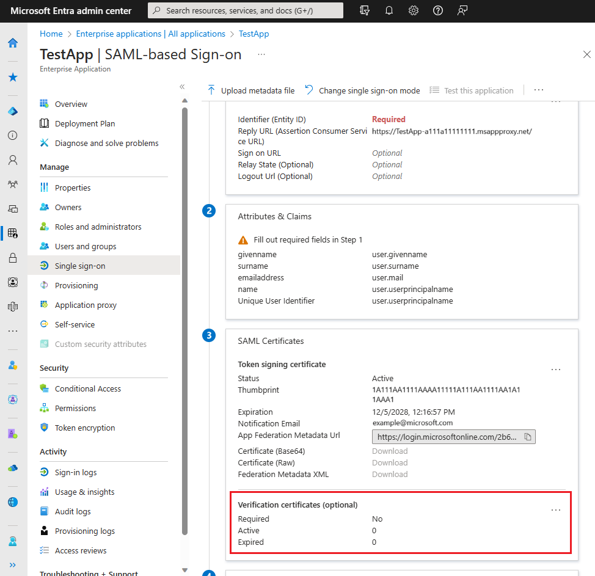
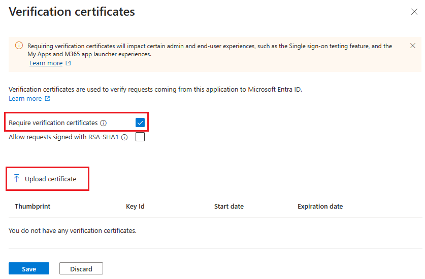
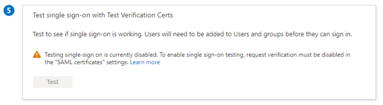
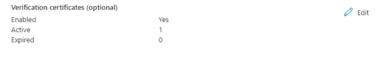

--- 
title: Enforce signed SAML authentication requests 
description: Learn how to enforce signed SAML authentication requests. 
 
author: omondiatieno
manager: CelesteDG 
ms.service: entra-id 
ms.subservice: enterprise-apps 
 
ms.topic: concept-article 
ms.date: 07/19/2024
ms.author: jomondi
ms.reviewer: alamaral
ms.collection: M365-identity-device-management
ms.custom: enterprise-apps

#customer intent: As an IT Admin, I want to enable and disable the enforcement of signed authentication requests and upload public keys for validation, so that I can ensure the security and integrity of the requests made to Microsoft Entra ID.
--- 

# Enforce signed SAML authentication requests  

SAML Request Signature Verification is a functionality that validates the signature of signed authentication requests. An App Admin now can enable and disable the enforcement of signed requests and upload the public keys that should be used to do the validation.  

If enabled Microsoft Entra ID validates the requests against the public keys configured. There are some scenarios where the authentication requests can fail:  

- Protocol not allowed for signed requests. Only SAML protocol is supported.  
- Request not signed, but verification is enabled.  
- No verification certificate configured for SAML request signature verification. For more information about the certificate requirements, see [Certificate signing options](certificate-signing-options.md).
- Signature verification failed.  
- Key identifier in request is missing and two most recently added certificates don't match with the request signature.  
- Request signed but algorithm missing.  
- No certificate matching with provided key identifier.
- Signature algorithm not allowed. Only RSA-SHA256 is supported.

> [!NOTE] 
> A `Signature` element in `AuthnRequest` elements is optional. If `Require Verification certificates` is not checked, Microsoft Entra ID does not validate signed authentication requests if a signature is present. Requestor verification is provided for by only responding to registered Assertion Consumer Service URLs.

>  If `Require Verification certificates` is checked, SAML Request Signature Verification will work for SP-initiated(service provider/relying party initiated) authentication requests only. Only the application configured by the service provider will have the access to to the private and public keys for signing the incoming SAML Authentication Requests from the application. The public key should be uploaded to allow the verification of the request, in which case Microsoft Entra ID will have access to only the public key.

> Enabling `Require Verification certificates` will not allow IDP-initiated authentication requests (like SSO testing feature, MyApps or M365 app launcher) to be validated as the IDP would not possess the same private keys as the registered application.

## Prerequisites

To configure SAML request signature verification, you need:

- A Microsoft Entra user account. If you don't already have one, you can [Create an account for free](https://azure.microsoft.com/free/?WT.mc_id=A261C142F).
- One of the following roles: Cloud Application Administrator, Application Administrator, or owner of the service principal.

[!INCLUDE [portal updates](~/includes/portal-update.md)]

## Configure SAML Request Signature Verification

1. Sign in to the [Microsoft Entra admin center](https://entra.microsoft.com) as at least a [Cloud Application Administrator](~/identity/role-based-access-control/permissions-reference.md#cloud-application-administrator). 
1. Browse to **Identity** > **Applications** > **Enterprise applications** > **All applications**.
1. Enter the name of the existing application in the search box, and then select the application from the search results.
1. Navigate to **Single sign-on**.
1. In the **Single sign-on** screen, scroll to the subsection called **Verification certificates** under **SAML Certificates.** 
    
     
    
1. Select **Edit.**  

1. In the new pane, you're able to enable the verification of signed requests and opt-in for weak algorithm verification in case your application still uses RSA-SHA1 to sign the authentication requests.   

1. To enable the verification of signed requests, select **Require verification certificates** and upload a verification public key that matches with the private key used to sign the request. 
    
     

1. Once you have your verification certificate uploaded, select **Save**. 

1. When the verification of signed requests is enabled, the test experience is disabled as the service provider has to sign the request.  
    
     
    
1. If you want to see the current configuration of an enterprise application, you can navigate to the **Single Sign-on** screen and see the summary of your configuration under **SAML Certificates**. There you're able to see if the verification of signed requests is enabled and the count of Active and Expired verification certificates. 
    
     

## Next steps  

- Find out [How Microsoft Entra ID uses the SAML protocol](~/identity-platform/saml-protocol-reference.md) 
- Learn the format, security characteristics, and contents of [SAML tokens in Microsoft Entra ID](~/identity-platform/reference-saml-tokens.md)
