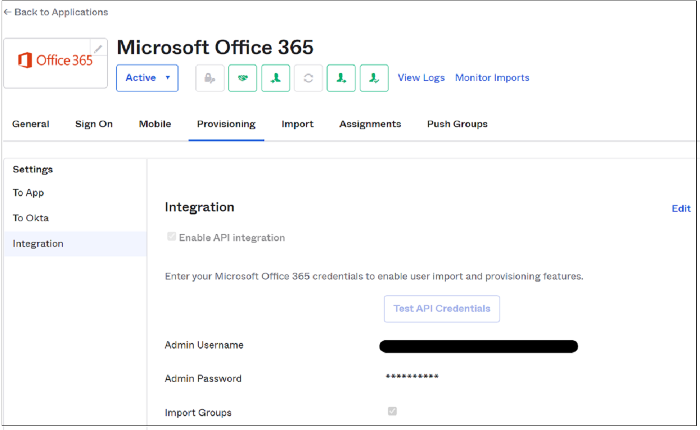
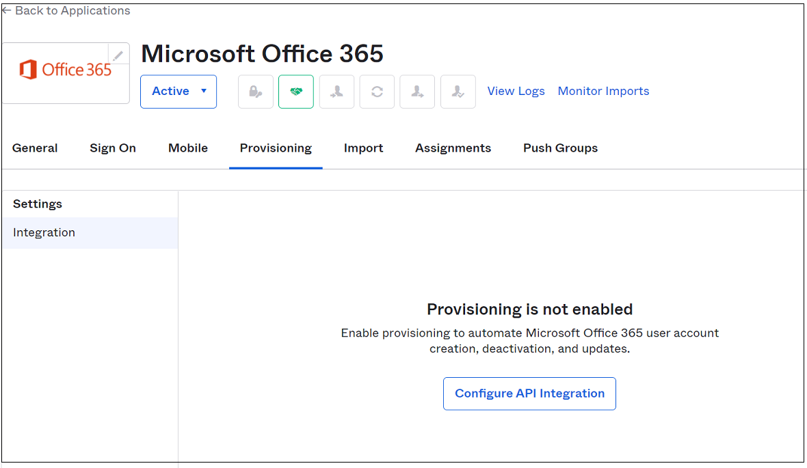

# Tutorial: Migrate Okta sync provisioning to Microsoft Entra Connect synchronization

In this tutorial, learn to migrate user provisioning from Okta to Microsoft Entra ID and migrate User Sync or Universal Sync to Microsoft Entra Connect. This capability enables provisioning into Microsoft Entra ID and Office 365.

   > [!NOTE]
   > When migrating synchronization platforms, validate steps in this article against your environment before you remove Microsoft Entra Connect from staging mode or enable the Microsoft Entra cloud provisioning agent.

## Prerequisites

When you switch from Okta provisioning to Microsoft Entra ID, there are two choices. Use a Microsoft Entra Connect server or Microsoft Entra cloud provisioning. 

Learn more: [Comparison between Microsoft Entra Connect and cloud sync](~/identity/hybrid/cloud-sync/what-is-cloud-sync.md#comparison-between-azure-ad-connect-and-cloud-sync).

Microsoft Entra cloud provisioning is the most familiar migration path for Okta customers who use Universal Sync or User Sync. The cloud provisioning agents are lightweight. You can install them on, or near, domain controllers like the Okta directory sync agents. Don't install them on the same server.

When you synchronize users, use a Microsoft Entra Connect server if your organization needs any of the following technologies:

- Device synchronization: Microsoft Entra hybrid join or Hello for Business
- Pass-through authentication
- Support for more than 150,000 objects
- Support for writeback

To use Microsoft Entra Connect, you need to sign in with a Hybrid Identity Administrator role.

>[!NOTE]
>Take all prerequisites into consideration when you install Microsoft Entra Connect or Microsoft Entra cloud provisioning. Before you continue with installation, see [Prerequisites for Microsoft Entra Connect](~/identity/hybrid/connect/how-to-connect-install-prerequisites.md).

## Confirm ImmutableID attribute synchronized by Okta

The ImmutableID attribute ties synchronized objects to their on-premises counterparts. Okta takes the Active Directory objectGUID of an on-premises object and converts it to a Base-64-encoded string. By default, it then stamps that string to the ImmutableID field in Microsoft Entra ID.

You can connect to Microsoft Graph PowerShell and examine the current ImmutableID value. If you haven't used the Microsoft Graph PowerShell module, run:

 `Install-Module Microsoft.Graph -Scope CurrentUser -Repository PSGallery -Force` in an administrative session before you run the following commands:
 
 ```Powershell
 Connect-MgGraph
 ```

If you have the module, a warning might appear to update to the latest version.

1. Import the installed module.
2. In the authentication window, sign in as at least a [Hybrid Identity Administrator](~/identity/role-based-access-control/permissions-reference.md#hybrid-identity-administrator).
3. Connect to the tenant.
4. Verify ImmutableID value settings. The following example is the default of converting the objectGUID into the ImmutableID.
5. Manually confirm the conversion from objectGUID to Base64 on-premises. To test an individual value, use these commands:

   ```PowerShell
   Get-MgUser onpremupn | fl objectguid
   $objectguid = 'your-guid-here-1010'
   [system.convert]::ToBase64String(([GUID]$objectGUID).ToByteArray())
   ```

## ObjectGUID mass-validation methods

Before you move to Microsoft Entra Connect, it's critical to validate that the ImmutableID values in Microsoft Entra ID match their on-premises values.

The following command gets on-premises Microsoft Entra users and exports a list of their objectGUID values and ImmutableID values already calculated to a CSV file.

1. Run the following command in Microsoft Graph PowerShell on an on-premises domain controller:

   ```PowerShell
   Get-ADUser -Filter * -Properties objectGUID | Select-Object
   UserPrincipalName, Name, objectGUID, @{Name = 'ImmutableID';
   Expression = {
   [system.convert]::ToBase64String((GUID).tobytearray())
   } } | export-csv C:\Temp\OnPremIDs.csv
   ```

2. Run the following command in a Microsoft Graph PowerShell session to list the synchronized values:

   ```powershell
   Get-MgUser -all $true | Where-Object {$_.dirsyncenabled -like
   "true"} | Select-Object UserPrincipalName, @{Name = 'objectGUID';
   Expression = {
   [GUID][System.Convert]::FromBase64String($_.ImmutableID) } },
   ImmutableID | export-csv C:\\temp\\AzureADSyncedIDS.csv
   ```

3. After both exports, confirm user ImmutableID values match.

   >[!IMPORTANT]
   >If your ImmutableID values in the cloud don't match objectGUID values, you've modified the defaults for Okta sync. You've likely chosen another attribute to determine ImmutableID values. Before going the next section, identify which source attribute populates ImmutableID values. Before you disable Okta sync, update the attribute Okta is syncing.

<a name='install-azure-ad-connect-in-staging-mode'></a>

## Install Microsoft Entra Connect in staging mode

After you prepare your list of source and destination targets, install a Microsoft Entra Connect server. If you use Microsoft Entra Connect cloud provisioning, skip this section.

1. Download and install Microsoft Entra Connect on a server. See, [Custom installation of Microsoft Entra Connect](~/identity/hybrid/connect/how-to-connect-install-custom.md).
2. In the left panel, select **Identifying users**.
3. On the **Uniquely identifying your users** page, under **Select how users should be identified with Microsoft Entra ID**, select **Choose a specific attribute**. 
4. If you didn't modify the Okta default, select **mS-DS-ConsistencyGUID**.

   >[!WARNING]
   >This step is critical. Ensure the attribute you select for a source anchor populates your Microsoft Entra users. If you select the wrong attribute, uninstall and reinstall Microsoft Entra Connect to reselect this option.
   
5. Select **Next**.
6. In the left panel, select **Configure**.
7. On the **Ready to configure** page, select **Enable staging mode**. 
8. Select **Install**.
9. Verify the ImmutableID values match.
10. When the configuration is complete, select **Exit**.
11. Open **Synchronization Service** as an administrator.
12. Find the **Full Synchronization** to the domain.onmicrosoft.com connector space. 
13. Confirm there are users under the **Connectors with Flow Updates** tab.
14. Verify no pending deletions in the export. 
15. Select the **Connectors** tab.
16. Highlight the domain.onmicrosoft.com connector space. 
17. Select **Search Connector Space**.
18. In the **Search Connector Space** dialog, under **Scope**, select **Pending Export**.
19. Select **Delete**.
20. Select **Search**. If all objects match, no matching records appear for **Deletes**. 
21. Record objects pending deletion and their on-premises values.
22. Clear **Delete**.
23. Select **Add**.
24. Select **Modify**. 
25. Select **Search**. 
26. Update functions appear for users being synchronized to Microsoft Entra ID via Okta. Add new objects Okta isn't syncing, which are in the organizational unit (OU) structure selected during Microsoft Entra Connect installation.
27. To see what Microsoft Entra Connect communicates with Microsoft Entra ID, double-click an update.

   > [!NOTE]
   > If there are **add** functions for a user in Microsoft Entra ID, their on-premises account doesn't match the cloud account. Entra Connect creates a new object and records new and unexpected adds. 

28. Before you exit the staging mode, correct the ImmutableID value in Microsoft Entra ID.

In this example, Okta stamped the **mail** attribute to the user's account, although the on-premises value wasn't accurate. When Microsoft Entra Connect takes over the account, the **mail** attribute is deleted from the object.

29. Verify updates include attributes expected in Microsoft Entra ID. If multiple attributes are being deleted, you can populate on-premises AD values before you remove the staging mode.

   >[!NOTE]
   >Before you continue, ensure user attributes are syncing and appear on the **Pending Export** tab. If they're deleted, ensure the ImmutableID values match and the user is in a selected OU for synchronization.

<a name='install-azure-ad-cloud-sync-agents'></a>

## Install Microsoft Entra Connect cloud sync agents

After you prepare your list of source and destination targets, install and configure Microsoft Entra Connect cloud sync agents. See, [Tutorial: Integrate a single forest with a single Microsoft Entra tenant](~/identity/hybrid/cloud-sync/tutorial-single-forest.md). 

   > [!NOTE]
   > If you use a Microsoft Entra Connect server, skip this section.

<a name='disable-okta-provisioning-to-azure-ad'></a>

## Disable Okta provisioning to Microsoft Entra ID

After you verify the Microsoft Entra Connect installation, disable Okta provisioning to Microsoft Entra ID.

1. Go to the Okta portal
2. Select **Applications**.
3. Select the Okta app that provisions users to Microsoft Entra ID. 
4. Select the **Provisioning** tab.
5. Select the **Integration** section.

   

6. Select **Edit**.
7. Clear the **Enable API integration** option.
8. Select **Save**.

   

   >[!NOTE]
   >If you have multiple Office 365 apps that handle provisioning to Microsoft Entra ID, ensure they switched off.

<a name='disable-staging-mode-in-azure-ad-connect'></a>

## Disable staging mode in Microsoft Entra Connect

After you disable Okta provisioning, the Microsoft Entra Connect server can synchronize objects. 

   >[!NOTE]
   >If you use Microsoft Entra Connect cloud sync agents, skip this section.

1. From the desktop, run the installation wizard from the desktop.
2. Select **Configure**.
3. Select **Configure staging mode** 
4. Select **Next**. 
5. Enter the credentials of the Hybrid Identity Administrator account for your environment.
6. Clear **Enable staging mode**.
7. Select **Next**.
8. Select **Configure**.
9. After configuration, open the **Synchronization Service** as an administrator. 
10. On the domain.onmicrosoft.com connector, view the **Export**. 
11. Verify additions, updates, and deletions.
12. Migration is complete. Rerun the installation wizard to update and expand Microsoft Entra Connect features.

## Enable cloud sync agents


After you disable Okta provisioning, the Microsoft Entra Connect cloud sync agent can synchronize objects.

1. Sign in to the [Microsoft Entra admin center](https://entra.microsoft.com) as at least a [Hybrid Identity Administrator](~/identity/role-based-access-control/permissions-reference.md#hybrid-identity-administrator).
2. Browse to **Entra ID** > **Entra Connect** > **Connect Sync**. 
3. Select **Configuration** profile.
4. Select **Enable**.
5. Return to the provisioning menu and select **Logs**.
6. Confirm the provisioning connector updated in-place objects. The cloud sync agents are nondestructive. Updates fail if a match isn't found.
7. If a user is mismatched, make updates to bind the ImmutableID values. 
8. Restart the cloud provisioning sync.

## Next steps

- [Tutorial: Migrate your applications from Okta to Microsoft Entra ID](migrate-applications-from-okta.md)
- [Tutorial: Migrate Okta federation to Microsoft Entra ID managed authentication](migrate-okta-federation.md)
- [Tutorial: Migrate Okta sign-on policies to Conditional Access](./migrate-okta-sign-on-policies-conditional-access.md)
