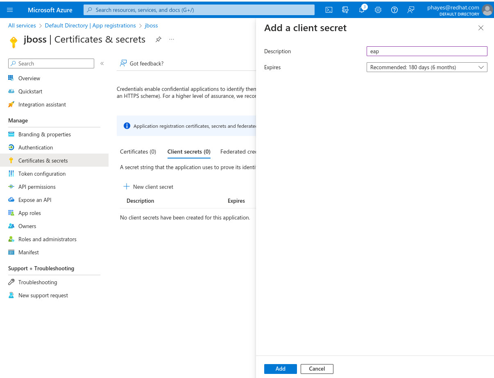
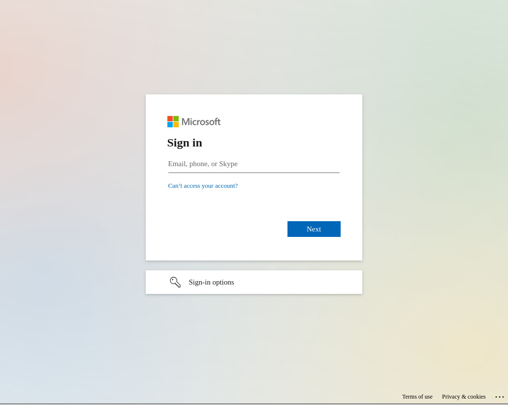

# Secure JBoss EAP apps with Microsoft Entra ID & OpenID Connect

The recent release of Red Hat JBoss EAP 8.0 includes native support for OpenID Connect (OIDC) via the elytron-oidc-client subsystem. OIDC is an identity layer that enables clients, such as JBoss EAP, to verify a user’s identity based on authentication performed by an OpenID provider. For example, you can secure your JBoss EAP applications using the Red Hat build of Keycloak as the OpenID provider.

In this article, we will use the elytron-oidc-subsystem to secure a simple web application using Microsoft Entra ID (formerly Azure Active Directory) as the OpenID provider.


## Prerequisites

* A local installation of JBoss EAP 8.0. [Download the installation manager from Red Hat Developer.](https://developers.redhat.com/content-gateway/file/eap/8.0.0/jboss-eap-8.0.0-installation-manager.zip)
* JBOSS_HOME environment variable set as the installation folder for JBoss EAP 8.0.
* A Microsoft Azure account with an active subscription.

## Connect a web application to Microsoft Entra ID

In this section we're going to configure the connection to Microsoft Entra ID.

1. Check out the sample application here.
2. Create a file src/main/webapp/WEB-INF/oidc.json with the following contents:
    ```
    {
        "client-id" : "<<from azure>",
        "provider-url" : "<<from azure>",
        "ssl-required" : "EXTERNAL",
        "credentials" : {
            "secret" : "<<from azure>>"
        }
    }
    ```
3. In the Azure portal, go to the All Services page and click Microsoft Entra ID.
4. In the left-hand menu, select App registrations and click New Registration. You will see the Register an application page shown in the following screenshot.
    
5. Enter a name (e.g., jboss) and click the Register button. This brings you to the App registrations overview page for your application.
6. Click Add a Redirect URL, then click Add a Platform.
7. Select Web; you will see the Configure Web page, as shown in the image below.
    
8. Enter the following URL:
    ```
    http://localhost:8080/simple-webapp-oidc/secured
    ```
9. Click the Configure button.
10. Go back to the Overview page and click Add a certificate or secret.
11. Select + New Client secret. This brings you to the Add a client secret page as shown below:
    
12. Enter a description (e.g., EAP) and click the Add button.
13. Copy the value shown on the next page and paste this value into src/main/webapp/WEB-INF/oidc.json as the secret value.
14. Return to the Overview page and click on Endpoints.
15. Copy the value from OpenID Connect metadata document and paste it into src/main/webapp/WEB-INF/oidc.json as the provider-url. Be sure to remove the text /.well-known/openid-configuration.
16. Return to the Overview page. Copy the Application (client) ID and paste this value in src/main/webapp/WEB-INF/oidc.json as the client-id.
17. Save the changes to the oidc.json file.

Our connection to Microsoft Entra ID is now configured, and we can deploy our application to JBoss EAP 8.0 and test the authentication.

## Test the Azure authentication
In this section we're going to depoy our application to a local instance of JBoss EAP and test integration to Microsoft Entra ID

1. First, we're going to start our JBoss EAP 8.0 instance. Run the following command to start JBoss EAP 8.0:
    ```
    $JBOSS_HOME/bin/standalone.sh 
    ```
2. We can now deploy our app. From the folder containing the sample application source code, enter:
    ```
    mvn wildfly:deploy 
    ```
3. We can access our application using http://localhost:8080/simple-webapp-oidc/.
4. Click Access Secured Servlet. Now you'll be redirected to the Azure login page as shown below. Log in with your Azure credentials.

    

5. Next, you'll be redirected back to our application and you should see the Secured Servlet page:
    Secured Servlet
    Current Principal 'xxxx'

We were able to successfully log in to our application via the Microsoft Entra ID provider!

With JBoss EAP 8.0, OpenID Connect support is provided by the included elytron-oidc-subsytem. In this article, we demonstrated how to secure a simple JBoss EAP 8.0 web application with Azure authentication via Open ID Connect.

## Next steps
For further information on JBoss EAP 8.0 OpenID support, refer to the [JBoss EAP product documentation](https://access.redhat.com/documentation/en-us/red_hat_jboss_enterprise_application_platform/8.0/html/using_single_sign-on_with_jboss_eap/single-sign-on-in-server_default)