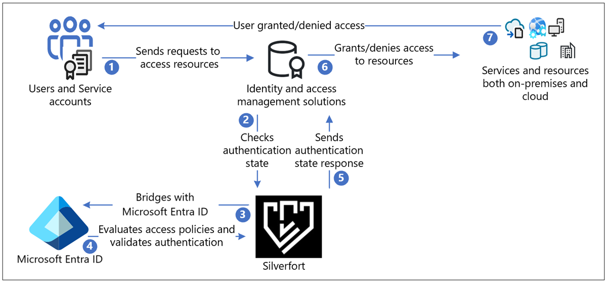
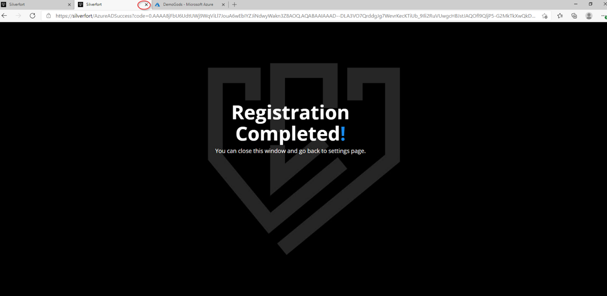
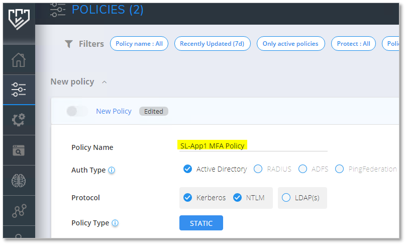
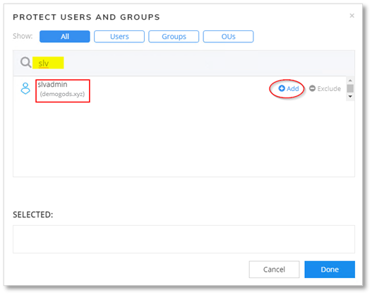
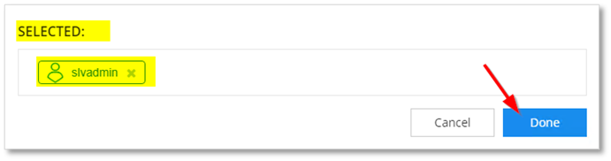

# Tutorial: Configure Secure Hybrid Access with Microsoft Entra ID and Silverfort  

[Silverfort](https://www.silverfort.com/) uses agent-less and proxy-less technology to connect your assets on-premises and in the cloud to Microsoft Entra ID. This solution enables organizations to apply identity protection, visibility, and user experience across environments in Microsoft Entra ID. It enables universal risk-based monitoring and assessment of authentication activity for on-premises and cloud environments, and helps to prevent threats.  

In this tutorial, learn how to integrate your on-premises Silverfort implementation with Microsoft Entra ID.

Learn more: 

* [Microsoft Entra hybrid joined devices](~/identity/devices/concept-hybrid-join.md)
* [Silverfort bridging to Microsoft Entra ID](https://www.silverfort.com/resources/solution-brief/silverfort-bridging-to-entra-id/)

Silverfort connects assets with Microsoft Entra ID. These bridged assets appear as regular applications in Microsoft Entra ID and can be protected with [Conditional Access](~/identity/conditional-access/overview.md), single-sign-on (SSO), multifactor authentication, auditing and more. Use Silverfort to connect assets including:

- Legacy and homegrown applications
- Remote desktop and Secure Shell (SSH)
- Command-line tools and other admin access
- File shares and databases
- Infrastructure and industrial systems

Silverfort integrates corporate assets and third-party Identity and Access Management (IAM) platforms, which includes Active Directory Federation Services (AD FS), and Remote Authentication Dial-In User Service (RADIUS) in Microsoft Entra ID. The scenario includes hybrid and multicloud environments.

Use this tutorial to configure and test the Silverfort Microsoft Entra ID bridge in your Microsoft Entra tenant to communicate with your Silverfort implementation. After configuration, you can create Silverfort authentication policies that bridge authentication requests from identity sources to Microsoft Entra ID for SSO. After an application is bridged, you can manage it in Microsoft Entra ID.

## Silverfort with Microsoft Entra authentication architecture

The following diagram shows the authentication architecture orchestrated by Silverfort, in a hybrid environment.

   

### User flow

1. Users send authentication request to the original identity provider (IdP) through protocols such as Kerberos, SAML, NTLM, OIDC, and LDAPs
2. Responses are routed as-is to Silverfort for validation to check authentication state
3. Silverfort provides visibility, discovery, and a bridge to Microsoft Entra ID
4. If the application is bridged, the authentication decision passes to Microsoft Entra ID. Microsoft Entra ID evaluates Conditional Access policies and validates authentication.
5. The authentication state response goes as-is from Silverfort to the IdP
6. IdP grants or denies access to the resource
7. Users are notified if access request is granted or denied 

## Prerequisites

You need Silverfort deployed in your tenant or infrastructure to perform this tutorial. To deploy Silverfort in your tenant or infrastructure, go to silverfort.com [Silverfort](https://www.silverfort.com/) to install the Silverfort desktop app on your workstations.

Set up Silverfort Microsoft Entra Adapter in your Microsoft Entra tenant:

- An Azure account with an active subscription
  - You can create an [Azure free account](https://azure.microsoft.com/free/?WT.mc_id=A261C142F)
- One of the following roles in your Azure account: 
  - Cloud Application Administrator
  - Application Administrator
  - Service Principal Owner
- The Silverfort Microsoft Entra Adapter application in the Microsoft Entra application gallery is preconfigured to support SSO. From the gallery, add the Silverfort Microsoft Entra Adapter to your tenant as an Enterprise application.

## Configure Silverfort and create a policy

1. From a browser, sign in to the Silverfort admin console.
2. In the main menu, navigate to **Settings** and then scroll to **Microsoft Entra ID Bridge Connector** in the General section. 
3. Confirm your tenant ID, and then select **Authorize**.
4. Select **Save Changes**.
5. On the **Permissions requested** dialog, select **Accept**.
6. A Registration Completed message appears in a new tab. Close this tab.

   

7. On the **Settings** page, select **Save Changes**.
8. Sign in to your Microsoft Entra account. In the left pane, select **Enterprise applications**. The **Silverfort Microsoft Entra Adapter** application appears as registered.
9. In the Silverfort admin console, navigate to the **Policies** page and select **Create Policy**. The **New Policy** dialog appears. 
10. Enter a **Policy Name**, the application name to be created in Azure. For example, if you're adding multiple servers or applications for this policy, name it to reflect the resources covered by the policy. In the example, we create a policy for the SL-APP1 server.

   

11. Select the **Auth Type**, and **Protocol**.

12. In the **Users and Groups** field, select the **Edit** icon to configure users affected by the policy. These users' authentication bridges to Microsoft Entra ID.

   

13. Search and select users, groups, or Organization Units (OUs).

   

14. Selected users appear in the **SELECTED** box.

   

15. Select the **Source** for which the policy applies. In this example, **All Devices** is selected.

    

16. Set the **Destination** to SL-App1. Optional: You can select the **edit** button to change or add more resources, or groups of resources.

    

17. For Action, select **Entra ID BRIDGE**.
18. Select **Save**. You're prompted to turn on the policy. 
19. In the Entra ID Bridge section, the policy appears on the Policies page.
20. Return to the Microsoft Entra account, and navigate to **Enterprise applications**. The new Silverfort application appears. You can include this application in Conditional Access policies. 

Learn more: [Tutorial: Secure user sign-in events with Microsoft Entra multifactor authentication](~/identity/authentication/tutorial-enable-azure-mfa.md?bc=/azure/active-directory/conditional-access/breadcrumb/toc.json&toc=/azure/active-directory/conditional-access/toc.json#create-a-conditional-access-policy).

## Next steps

- [Silverfort Microsoft Entra Adapter](https://azuremarketplace.microsoft.com/marketplace/apps/aad.silverfortazureadadapter?tab=overview)
- [Silverfort resources](https://www.silverfort.com/resources/)
- [Silverfort, company contact](https://www.silverfort.com/company/contact/)
