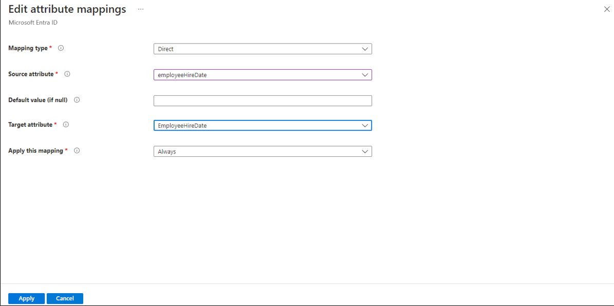

# Cloud sync directory extensions and custom attribute mapping

Microsoft Entra ID must contain all the data (attributes) required to create a user profile when provisioning user accounts from Microsoft Entra ID to a line of business (LOB), [SaaS app](~/identity/saas-apps/tutorial-list.md), or on-premises application. You can use directory extensions to extend the schema in Microsoft Entra ID with your own attributes. This feature enables you to build LOB apps by consuming attributes that you continue to manage on-premises, provision users from Active Directory to Microsoft Entra ID or SaaS apps, and use extension attributes in Microsoft Entra ID and Microsoft Entra ID Governance features such as dynamic membership groups or Group provisioning to Active Directory.

For more information on directory extensions, see [Using directory extension attributes in claims](../../../identity-platform/schema-extensions.md), [Microsoft Entra Connect Sync: directory extensions](~/identity/hybrid/connect/how-to-connect-sync-feature-directory-extensions.md), and [Syncing extension attributes for Microsoft Entra application provisioning](~/identity/app-provisioning/user-provisioning-sync-attributes-for-mapping.md).

You can see the available attributes by using [Microsoft Graph Explorer](https://developer.microsoft.com/graph/graph-explorer).

>[!NOTE]
> In order to discover new Active Directory extension attributes, the provisioning agent needs to be restarted. You should restart the agent after the directory extensions have been created. For Microsoft Entra extension attributes, the agent doesn't need to be restarted.
 
<a name='syncing-directory-extensions-for-azure-active-directory-connect-cloud-sync-'></a>

## Syncing directory extensions for Microsoft Entra Cloud Sync 

You can use [directory extensions](/graph/api/resources/extensionproperty?view=graph-rest-1.0&preserve-view=true) to extend the synchronization schema directory definition in Microsoft Entra ID with your own attributes. 

>[!Important]
> Directory extension for Microsoft Entra Cloud Sync is only supported for applications with the identifier URI `API://<tenantId>/CloudSyncCustomExtensionsApp` and the [Tenant Schema Extension App](../connect/how-to-connect-sync-feature-directory-extensions.md#configuration-changes-in-azure-ad-made-by-the-wizard) created by Microsoft Entra Connect.

### Create application and service principal for directory extension 

You need to create an [application](/graph/api/resources/application?view=graph-rest-1.0&preserve-view=true) with the identifier URI `API://<tenantId>/CloudSyncCustomExtensionsApp` if it doesn't exist and create a service principal for the application if it doesn't exist. 


 1. Check if application with the identifier URI `API://<tenantId>/CloudSyncCustomExtensionsApp` exists.

     - Using Microsoft Graph 

     ```
     GET /applications?$filter=identifierUris/any(uri:uri eq 'api://<tenantId>/CloudSyncCustomExtensionsApp')
     ```

     For more information, see [Get application](/graph/api/application-get?view=graph-rest-1.0&tabs=http&preserve-view=true)

     - Using PowerShell 
     
     ```powershell
     $tenantId = (Get-MgOrganization).Id
     
     Get-MgApplication -Filter "identifierUris/any(uri:uri eq 'API://$tenantId/CloudSyncCustomExtensionsApp')"
     ```

     For more information, see [Get-MgApplication](/powershell/module/microsoft.graph.applications/get-mgapplication)

 2. If the application doesn't exist, create the application with identifier URI `API://<tenantId>/CloudSyncCustomExtensionsApp`.

     - Using Microsoft Graph 
     ```
     POST https://graph.microsoft.com/v1.0/applications
     Content-type: application/json

     {
      "displayName": "CloudSyncCustomExtensionsApp",
      "identifierUris": ["api://<tenant id>/CloudSyncCustomExtensionsApp"]
     }
     ```
     For more information, see [create application](/graph/api/application-post-applications?view=graph-rest-1.0&tabs=http&preserve-view=true)

     - Using PowerShell (Note: take the `$tenantId` variable from previous steps)

     ```powershell
     New-MgApplication -DisplayName "CloudSyncCustomExtensionsApp" -IdentifierUris "API://$tenantId/CloudSyncCustomExtensionsApp"
     ```

     For more information, see [New-MgApplication](/powershell/module/microsoft.graph.applications/new-mgapplication)
 

 3. Check if the service principal exists for the application with identifier URI `API://<tenantId>/CloudSyncCustomExtensionsApp`.

     - Using Microsoft Graph 
     ```
     GET /servicePrincipals?$filter=(appId eq '{appId}')
     ```
     For more information, see [get service principal](/graph/api/serviceprincipal-get?view=graph-rest-1.0&tabs=http&preserve-view=true)

     - Using PowerShell (Note: take the `$tenantId` variable from previous steps)

     ```powershell
     $appId = (Get-MgApplication -Filter "identifierUris/any(uri:uri eq 'API://$tenantId/CloudSyncCustomExtensionsApp')").AppId
     
     Get-MgServicePrincipal -Filter "AppId eq '$appId'"
     ```

     For more information, see [Get-MgServicePrincipal](/powershell/module/microsoft.graph.applications/get-mgserviceprincipal)
 

 4. If a service principal doesn't exist, create a new service principal for the application with identifier URI `API://<tenantId>/CloudSyncCustomExtensionsApp`.

     - Using Microsoft Graph 
     ```
     POST https://graph.microsoft.com/v1.0/servicePrincipals
     Content-type: application/json

     {
     "appId": 
     "<application appId>"
     }
     ```
     For more information, see [create servicePrincipal](/graph/api/serviceprincipal-post-serviceprincipals?view=graph-rest-1.0&tabs=http&preserve-view=true)

     - Using PowerShell (Note: take the `$appId` variable from previous steps)
     
     ```powershell     
     New-MgServicePrincipal -AppId $appId
     ```
     For more information, see [New-MgServicePrincipal](/powershell/module/microsoft.graph.applications/new-mgserviceprincipal)
 
 5. Create a directory extension in Microsoft Entra ID. For example, a new extension called 'WritebackEnabled', of boolean type, for Group objects.

     - Using Microsoft Graph 
     ```
     POST https://graph.microsoft.com/v1.0/applications/<ApplicationId>/extensionProperties
     Content-type: application/json
     
     {
         "name": "WritebackEnabled",
         "dataType": "Boolean",
         "isMultiValued": false,
         "targetObjects": [
             "Group"
         ]
     }    
     ```

     - Using PowerShell (Note: take the `$tenantId` variable from previous steps)
     ```powershell     
     $appObjId = (Get-MgApplication -Filter "identifierUris/any(uri:uri eq 'API://$tenantId/CloudSyncCustomExtensionsApp')").Id
     
     New-MgApplicationExtensionProperty -ApplicationId $appObjId -Name WritebackEnabled -DataType Boolean -TargetObjects Group
     ```
 
You can create directory extensions in Microsoft Entra ID in several different ways, as described in the following table:

|Method|Description|URL|
|-----|-----|-----|
|MS Graph|Create extensions using GRAPH|[Create extensionProperty](/graph/api/application-post-extensionproperty?view=graph-rest-1.0&tabs=http&preserve-view=true)|
|PowerShell|Create extensions using PowerShell|[New-MgApplicationExtensionProperty](/powershell/module/microsoft.graph.applications/new-mgapplicationextensionproperty)| 
Using cloud sync and Microsoft Entra Connect|Create extensions using Microsoft Entra Connect|[Create an extension attribute using Microsoft Entra Connect](../../app-provisioning/user-provisioning-sync-attributes-for-mapping.md#create-an-extension-attribute-using-azure-ad-connect)|
|Customizing attributes to sync|Information on customizing, which attributes to synch|[Customize which attributes to synchronize with Microsoft Entra ID](../connect/how-to-connect-sync-feature-directory-extensions.md#select-which-attributes-to-synchronize-with-microsoft-entra-id)


## Use attribute mapping to map Directory Extensions
If you extended Active Directory to include custom attributes, you can add these attributes and map them to users.  

To discover and map attributes, select **Add attribute mapping** and the attributes become available in the drop-down under **source attribute**. Fill in the type of mapping you want and select **Apply**.
 [](media/custom-attribute-mapping/schema-1.png#lightbox)

For information on new attributes that are added and updated in Microsoft Entra ID see the [`user` resource type](/graph/api/resources/user?view=graph-rest-1.0#properties&preserve-view=true) and consider subscribing to [change notifications](/graph/webhooks).

For more information on extension attributes, see [Syncing extension attributes for Microsoft Entra Application Provisioning](../../app-provisioning/user-provisioning-sync-attributes-for-mapping.md).

## More resources

- [Understand the Microsoft Entra schema and custom expressions](concept-attributes.md)
- [Microsoft Entra Connect Sync: Directory extensions](../connect/how-to-connect-sync-feature-directory-extensions.md)
- [Attribute mapping in Microsoft Entra Cloud Sync](how-to-attribute-mapping.md)
