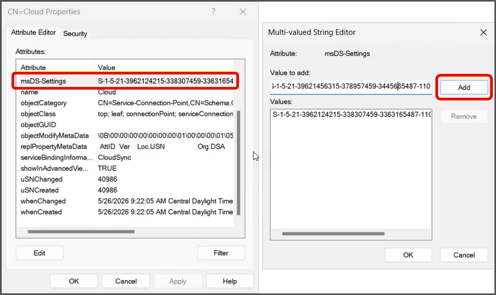

# Configure AD group enforcement in Microsoft Entra Cloud Sync (preview)

Microsoft Entra Cloud Sync can provision cloud groups to on-premises Active Directory (AD). AD group enforcement lets you designate specific synced groups so that modifications can only be performed through the Microsoft Entra provisioning service. This alignment between Microsoft Entra ID and AD groups removes the need for a separate reconciliation process and helps ensure that all access is granted through Microsoft Entra.

> [!IMPORTANT]
> AD group enforcement is currently in **PREVIEW**. The preview spans two parts that you configure together: the **Active Directory enforcement engine** on your domain controllers (the code ships in a cumulative Windows Server update but is disabled by default and turned on by a Group Policy package during the preview) and the **Microsoft Entra Cloud Sync** configuration that marks groups for enforcement. See the [Supplemental Terms of Use for Microsoft Azure Previews](https://azure.microsoft.com/support/legal/preview-supplemental-terms/) for legal terms that apply to Azure features that are in beta, preview, or otherwise not yet released into general availability.

## How AD group enforcement works

Enforcement is evaluated by Active Directory **at the point of an LDAP write, on whichever domain controller processes that write**. When a change targets a group that's marked for enforcement, the domain controller checks whether the calling identity is authorized by the policy. If it isn't, the change is blocked (Enforced mode) or logged (Audit mode) before any drift occurs.

Two pieces work together:

- A domain-wide **policy** that lists the security identifiers (SIDs) authorized to change enforced objects, and the current mode (Enforced or Audit). The policy is stored in a `SOA-Policies` container created under `CN=System,DC=<your domain>`. Because it lives in the domain partition, it replicates to every domain controller in the domain.
- A per-object marker, the [`msDS-ObjectSoa`](/openspecs/windows_protocols/ms-ada2/426118f6-06ea-4ea0-adbe-03556bb58c9c) attribute, that you set through Cloud Sync. The policy applies only to objects that have this attribute set.

| Mode | Behavior |
| --- | --- |
| **Enforced** | Only SIDs allowed by the policy can change enforced groups. The policy blocks LDAP modify operations and restores from the Recycle Bin. It still permits LDAP Add operations, even when the add contains the `msDS-ObjectSoa` attribute. |
| **Audit** | Changes are allowed per your existing AD role-based access control (RBAC). The policy writes an event to the **Directory Service** log when an unauthorized identity changes an enforced object. Use Audit mode to discover out-of-band changes before you switch to Enforced. To see the events, enable Security Diagnostics logging (see [View enforcement events in the event log](#view-enforcement-events-in-the-event-log)). |

AD group enforcement is **additive** to your existing AD RBAC model. It places an additional restriction on top of your current access control without granting any additional access.

> [!WARNING]
> **Enforcement is domain-wide and all-or-nothing.** A change can be written on any writable domain controller, and the PDC emulator (PDCe) role can be transferred or seized to any writable domain controller at any time. Enforcement is only in effect for a domain when **every writable domain controller that can ever process a write** runs a supported operating system, has the update installed, and has the feature enabled. If even one writable domain controller isn't enabled, an unauthorized change directed at that domain controller succeeds and the control is bypassed. Plan to update and enable **all** writable domain controllers before you rely on enforcement.

## Before you begin

Make sure the following prerequisites are already in place before you start the configuration steps.

| Prerequisite | Details |
| --- | --- |
| Microsoft Entra license | A Microsoft Entra tenant with Microsoft Entra ID P1 licenses for configuring group provisioning to AD. |
| AD role | Domain Admin, to run the PowerShell script that installs the policy and to manage the policy object. |
| Supported domain controller OS on every writable DC | Windows Server 2022 or Windows Server 2025. Because enforcement must be enabled on every writable domain controller, confirm that all of them can run a supported OS. Domain controllers that can't be brought to a supported OS can't participate, which means enforcement can't be guaranteed for the domain. |
| Provisioning agent host | A Windows Server 2019 or Windows Server 2022 machine joined to your AD domain. The agent doesn't have to run on a domain controller. |
| No domain functional level requirement | Enforcement doesn't require raising the domain or forest functional level. It's an operational requirement to enable every writable domain controller, not a functional-level setting. |
| Schema | Uses the existing `msDS-ObjectSoa` attribute, present since the Windows Server 2016 schema. No schema extension is required. |
| Domain controller inventory | An inventory of all writable domain controllers in the domain. Any of them can hold the PDCe role now or in the future, so all of them are in scope for the steps that follow. |

For the full list of provisioning agent prerequisites, see [Prerequisites for Microsoft Entra Cloud Sync](how-to-prerequisites.md).

## Plan your rollout

For a production rollout, consider deploying in **Audit** mode first. Audit mode lets you discover which on-premises processes or administrators are making direct changes to the groups you intend to enforce, without blocking anyone. After you confirm there's no legitimate on-premises write path that you've missed, switch to **Enforced** mode.

The high-level configuration is:

1. Install the update and enable the feature on **every writable domain controller** in the domain, not just the PDCe.
2. Install the policy in Enforced or Audit mode.
3. Mark the groups you want to protect.

## Step 1: Update and enable every writable domain controller

Bring the enforcement engine online across the domain. Repeat the update and enablement on **every writable domain controller**, not just the current PDCe role holder. This is required for enforcement to be in effect; it isn't an optional step for broader coverage.

There are two paths to enable the engine on a domain controller:

- **Production path (Windows Server 2022 or 2025):** Install the latest cumulative Windows Server update, then install the matching Group Policy package to turn the feature on. The minimum version of `C:\Windows\System32\ntdsai.dll` is **10.0.20348.5257** for Windows Server 2022 and **10.0.26100.32995** for Windows Server 2025. To verify the installed version, run `(Get-Item C:\Windows\System32\ntdsai.dll).VersionInfo.FileVersion` on the domain controller.
- **Lab-only path (Windows Server Insider Preview):** A [Windows Server Insider Preview](https://www.microsoft.com/software-download/windowsinsiderpreviewserver) build has the feature already enabled and doesn't require the Group Policy package. Use this path only in a test lab, not on production domain controllers.

Do the following:

1. Identify the current PDCe role holder. The `SOA-Policies` container is created on the PDCe and then replicates to every domain controller. You can find the PDCe by running `netdom query fsmo` or `Get-ADDomain | Select-Object PDCEmulator`.
1. On every writable domain controller, install the latest cumulative Windows Server update (production path). Skip this if the domain controller is running a Windows Server Insider Preview build.
1. Restart the domain controller if the update prompts you to.
1. On every writable domain controller, install the matching Group Policy package to enable the enforcement code that's already in the OS update. The package uses a Known Issue Rollback (KIR) style enablement model. Skip this if the domain controller is running a Windows Server Insider Preview build:

    - Windows Server 2022: https://aka.ms/ADEnforcementGPMSI2022
    - Windows Server 2025: https://aka.ms/ADEnforcementGPMSI2025
1. Restart each domain controller after enablement.
1. Confirm that `SOA-Policies` exists under `CN=System,DC=<your domain>` (substitute your actual domain name). The container can take 5 to 10 minutes to appear.

:::image type="content" source="media/how-to-ad-group-enforcement/soa-policies-container.png" alt-text="Screenshot of ADSI Edit showing the CN=SOA-Policies container under CN=System." lightbox="media/how-to-ad-group-enforcement/soa-policies-container.png":::

## Step 2: Install the policy in Enforced or Audit mode

After the `SOA-Policies` container is in place, install the Cloud Sync provisioning agent and run the PowerShell script that configures the policy mode:

1. Install the Microsoft Entra Cloud Sync provisioning agent. For installation instructions, see [Install the Microsoft Entra Cloud Sync provisioning agent](how-to-install.md).
1. Download the [`Set-CloudSyncSOAPolicy.ps1`](https://github.com/AzureAD/EntraIDGovernance/blob/main/Set-CloudSyncSOAPolicy.ps1) PowerShell script from the AzureAD/EntraIDGovernance repo on GitHub.
1. Open PowerShell as an administrator.
1. Change directory to the folder that contains the script.
1. Run the script. When prompted, specify `Enforced` as the mode (use `Audit` for a "what-if" rollout):

    ```powershell
   .\Set-CloudSyncSOAPolicy.ps1 -EnforcementMode Enforced -Credential (Get-Credential -Message "Enter Domain Admin credentials (format: DOMAIN\Username)")
   ```
1. Confirm that the policy is configured with the keyword **Enforced** (or **Audit**).

## Step 3: Mark a group for enforcement

Mark a group for enforcement by setting the `msDS-ObjectSoa` attribute to `Cloud` through the Cloud Sync attribute mapping.

1. In your group provisioing to AD configuration, edit the attribute mappings.
1. Add `msDS-ObjectSoa` as a target attribute with the value `Cloud`. Choose one of the following:
    - **Constant mapping** (recommended for most customers): sets the property for all groups in scope of the provisioning job.
    - **Expression mapping**: limits the groups for which the property is set, based on conditional logic.
1. Assign the groups you want to protect to the provisioning scope.
1. Provision the group on demand or by starting the sync cycle.

For details on configuring group provisioning to AD, see [Configure provisioning Microsoft Entra ID to Active Directory](how-to-configure-entra-to-active-directory.md).

## Verify the attribute is set on the group

Use ADSI Edit on a domain controller to confirm that the policy is applied to the on-premises group:

1. Open **ADSI Edit**.
1. Select **View** > **Advanced Features**.
1. Navigate to the group, then open **Properties**.
1. Confirm that the `msDS-ObjectSoa` property is set on the group.

:::image type="content" source="media/how-to-ad-group-enforcement/verify-msds-objectsoa-attribute.png" alt-text="Screenshot of an Active Directory group's Attribute Editor tab in ADSI Edit, showing the msDS-ObjectSoa attribute set." lightbox="media/how-to-ad-group-enforcement/verify-msds-objectsoa-attribute.png":::

## What administrators see when a change is blocked

In **Enforced** mode, an unauthorized attempt to modify an enforced group is blocked at the LDAP write layer and returns a specific error indicating that the object is managed by a cloud SOA policy. The change is never committed, so there's no drift to reconcile. The error is distinct from a generic "Access Denied," so administrators can tell that the change was intentionally blocked and that the group must be managed through Microsoft Entra. The exact wording varies by tool (Active Directory Users and Computers, PowerShell, or an LDAP client), but the meaning is the same.

In **Audit** mode, the same change is allowed and an event is written to the **Directory Service** log indicating that the change would have been blocked.

## Switch between Enforced and Audit modes

To change the mode, run `Set-CloudSyncSOAPolicy.ps1` again with the new value for `-EnforcementMode`:

```powershell
.\Set-CloudSyncSOAPolicy.ps1 -EnforcementMode Audit -Credential (Get-Credential -Message "Enter Domain Admin credentials (format: DOMAIN\Username)")
```

## Break-glass accounts

You can authorize additional identities to change enforced groups on-premises, for example an emergency administrator account to use when cloud provisioning is unavailable. You do this by adding the account's SID to the policy.

1. Open **ADSI Edit**.
1. Navigate to **CN=SOA-Policies** > **CN=CloudSyncSOAPolicy**.
1. Open the **Attribute Editor**.
1. Edit the `msDS-Settings` attribute and add the SID of the break-glass account.

    [](media/how-to-ad-group-enforcement/add-break-glass-sid.png#lightbox)

Keep the following limits and behaviors in mind:

- **Keep the allow list as small as possible.** For the strongest governance posture, allow only the provisioning agent SID and avoid adding break-glass accounts unless you have a specific operational need. The policy supports a maximum of **64 SIDs**.
- **SIDs are validated when the policy loads.** A single invalid or stale SID causes the **entire policy to fail to load**, which leaves no identities authorized. Watch the **Directory Service** log for a policy-load error and correct the SID.
- **Account changes are an operational risk.** If an authorized account is removed or recreated and its SID changes, update `msDS-Settings` accordingly. Document this in your operational runbooks.

## View enforcement events in the event log

To see audit events for unauthorized changes:

1. Set the Security Diagnostics value to `1` in the registry. For more information, see [AD and LDS diagnostic event logging](/troubleshoot/windows-server/active-directory/configure-ad-and-lds-event-logging).
1. Open Event Viewer and view the **Directory Service** event log.

With Security Diagnostics at the default value of `0`, only policy-load events are logged; individual block and audit events aren't recorded.

## Troubleshoot the enforcement policy

If AD group enforcement doesn't behave as expected (for example, on-premises changes that should be blocked are still processed), use the `Check-CloudSyncSOAPolicy.ps1` script to confirm that enforcement is enabled on a domain controller.

1. Download the [`Check-CloudSyncSOAPolicy.ps1`](https://github.com/AzureAD/EntraIDGovernance/blob/main/Check-CloudSyncSOAPolicy.ps1) script from the AzureAD/EntraIDGovernance repo on GitHub.
1. Sign in to the domain controller you want to validate.
1. Open PowerShell as an administrator.
1. Change directory to the folder that contains the script.
1. Run the script. It reports whether the AD group enforcement policy is enabled on that domain controller.

If a change that should be blocked still succeeds, check the following:

- The change was written to a domain controller that **isn't** updated and enabled. Confirm that **every writable domain controller** has the update and the Group Policy package, and was restarted afterward. To find which domain controller a client uses, run `nltest /dsgetdc:<your domain>`.
- The policy is in **Audit** mode rather than **Enforced**.
- The `SOA-Policies` container exists under `CN=System,DC=<your domain>`.
- The `msDS-ObjectSoa` attribute is set on the target group (see [Verify the attribute is set on the group](#verify-the-attribute-is-set-on-the-group)). If it isn't, the change is on the cloud side; confirm the attribute mapping and run a provisioning cycle.

If an authorized change is unexpectedly blocked, confirm that the acting account's SID is present in the policy's `msDS-Settings` attribute and that the change replicated to the domain controller processing the write.

## Test the policy

Use these example test cases to validate the configuration:

- Update the membership of an enforced group on-premises with an unauthorized account. The change should be blocked.
- Switch the policy to **Audit** and repeat the test. The change is allowed, and an event appears in the **Directory Service** event log.
- Add a SID to the policy as a break-glass account and make an update with that account. The change should succeed.
- Attempt the same unauthorized change against each writable domain controller to confirm enforcement is consistent across the domain.

## Known behavior and limitations in this preview

- Only group objects are supported in this preview. User provisioning to AD through the provisioning agent isn't yet supported.
- Converting the source of authority of a group in Microsoft Entra doesn't automatically lock down the group in AD. Complete the steps in this article to mark a group as enforced through group provisioning to AD.
- Enforcement doesn't prevent deletions.
- Enforcement protects the marked object's own membership and attributes. Nesting an enforced group into an unenforced group isn't restricted.
- Existing limitations of group provisioning to AD continue to apply during this preview.
- Enforcement is only in effect on domain controllers where it's enabled. As described in [How AD group enforcement works](#how-ad-group-enforcement-works), enable the feature on every writable domain controller; otherwise a change written to a domain controller that isn't enabled is processed.
