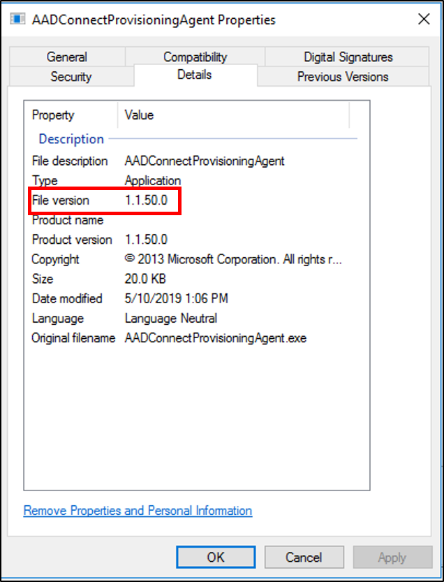
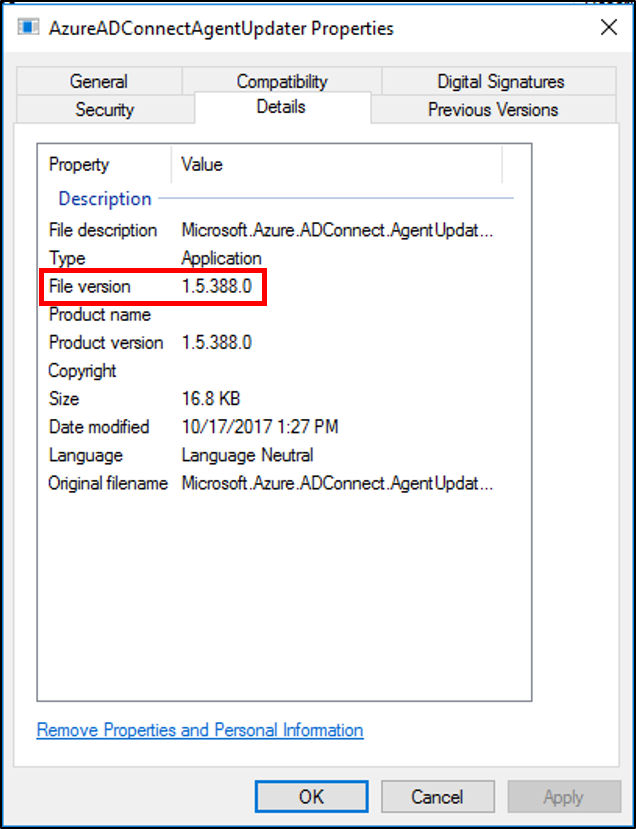
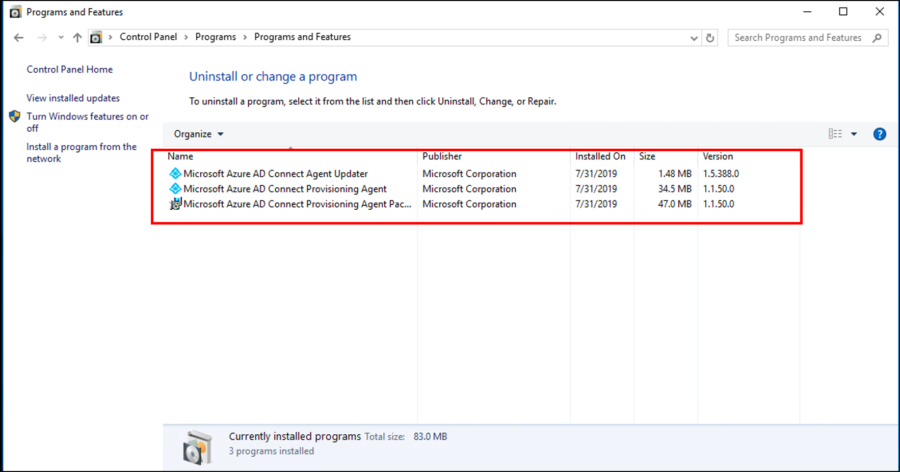

# Microsoft Entra Connect cloud provisioning agent: Automatic upgrade

Making sure your Microsoft Entra Connect cloud provisioning agent installation is always up to date is easy with the automatic upgrade feature.

The agent is installed here: "Program files\Azure AD Connect Provisioning Agent\AADConnectProvisioningAgent.exe"

To verify your version, right-click the executable and select properties and then details.

The agent updater is installed here: "Program files\Azure AD Connect Provisioning Agent Updater\AzureADConnectAgentUpdater.exe"

To verify your version, right-click the executable and select properties and then details.

## Uninstall the agent
To remove the agent, go to **Uninstall or change a program** and uninstall the following:

- **Microsoft Entra Connect Agent Updater**
- **Microsoft Entra Provisioning Agent**
- **Microsoft Entra Provisioning Agent Package**

## Next steps 

- [What is provisioning?](../what-is-provisioning.md)
- [What is Microsoft Entra Cloud Sync?](what-is-cloud-sync.md)
