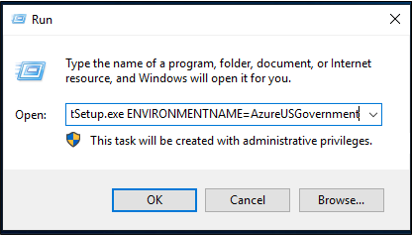

# Install the Microsoft Entra provisioning agent

This article walks you through the installation process for the Microsoft Entra provisioning agent and how to initially configure it in the Microsoft Entra admin center.

> [!IMPORTANT]
> The following installation instructions assume that you've met all the [prerequisites](how-to-prerequisites.md).

>[!NOTE]
>This article deals with installing the provisioning agent by using the wizard. For information about installing the Microsoft Entra provisioning agent by using a CLI, see [Install the Microsoft Entra provisioning agent by using a CLI and PowerShell](how-to-install-pshell.md).

For more information and an example, view the following video:

> [!VIDEO https://www.microsoft.com/en-us/videoplayer/embed/RWK5mR]

## Group Managed Service Accounts
A group Managed Service Account (gMSA) is a managed domain account that provides automatic password management, simplified service principal name (SPN) management, and the ability to delegate the management to other administrators. A gMSA also extends this functionality over multiple servers. Microsoft Entra Cloud Sync supports and recommends the use of a gMSA for running the agent. For more information, see [Group Managed Service Accounts](how-to-prerequisites.md#group-managed-service-accounts).


### Update an existing agent to use the gMSA
To update an existing agent to use the Group Managed Service Account created during installation, upgrade the agent service to the latest version by running *AADConnectProvisioningAgent.msi*. Now run through the installation wizard again and provide the credentials to create the account when you're prompted to do so.

## Install the agent

[!INCLUDE [active-directory-cloud-sync-how-to-install](~/includes/entra-cloud-sync-how-to-install.md)]

## Verify the agent installation

[!INCLUDE [active-directory-cloud-sync-how-to-verify-installation](~/includes/entra-cloud-sync-how-to-verify-installation.md)]

>[!IMPORTANT]
> After you've installed the agent, you must configure and enable it before it will start synchronizing users. To configure a new agent, see [Create a new configuration for Microsoft Entra Cloud Sync](how-to-configure.md).

## Harden your Microsoft Entra provisioning agent server
We recommend that you harden your Microsoft Entra provisioning agent server to decrease the security attack surface for this critical component of your IT environment. Following these recommendations will help to mitigate some security risks to your organization.

- We recommend hardening the Microsoft Entra provisioning agent server as a Control Plane (formerly Tier 0) asset by following the guidance provided in [Secure Privileged Access](/security/privileged-access-workstations/overview) and [Active Directory administrative tier model](/security/privileged-access-workstations/privileged-access-access-model).
- Restrict administrative access to the Microsoft Entra provisioning agent server to only domain administrators or other tightly controlled security groups.
- Create a [dedicated account for all personnel with privileged access](/windows-server/identity/securing-privileged-access/securing-privileged-access). Administrators shouldn't be browsing the web, checking their email, and doing day-to-day productivity tasks with highly privileged accounts.
- Follow the guidance provided in [Securing privileged access](/security/privileged-access-workstations/overview). 
- Deny use of NTLM authentication with the Microsoft Entra provisioning agent server. Here are some ways to do this: [Restricting NTLM on the Microsoft Entra provisioning agent Server](/windows/security/threat-protection/security-policy-settings/network-security-restrict-ntlm-outgoing-ntlm-traffic-to-remote-servers) and [Restricting NTLM on a domain](/windows/security/threat-protection/security-policy-settings/network-security-restrict-ntlm-ntlm-authentication-in-this-domain)
- Ensure every machine has a unique local administrator password. For more information, see [Local Administrator Password Solution (Windows LAPS)](/windows-server/identity/laps/laps-overview) can configure unique random passwords on each workstation and server store them in Active Directory protected by an ACL. Only eligible authorized users can read or request the reset of these local administrator account passwords. Additional guidance for operating an environment with Windows LAPS and privileged access workstations (PAWs) can be found in [Operational standards based on clean source principle](/security/privileged-access-workstations/privileged-access-access-model#operational-standards-based-on-clean-source-principle). 
- Implement dedicated [privileged access workstations](https://4sysops.com/archives/understand-the-microsoft-privileged-access-workstation-paw-security-model/) for all personnel with privileged access to your organization's information systems. 
- Follow these [additional guidelines](/windows-server/identity/ad-ds/plan/security-best-practices/reducing-the-active-directory-attack-surface) to reduce the attack surface of your Active Directory environment.
- Follow the [Monitor changes to federation configuration](how-to-connect-monitor-federation-changes.md) to set up alerts to monitor changes to the trust established between your Idp and Microsoft Entra ID. 
- Enable Multi Factor Authentication (MFA) for all users that have privileged access in Microsoft Entra ID or in AD. One security issue with using Microsoft Entra provisioning agent is that if an attacker can get control over the Microsoft Entra provisioning agent server they can manipulate users in Microsoft Entra ID. To prevent an attacker from using these capabilities to take over Microsoft Entra accounts, MFA offers protections so that even if an attacker manages to, such as reset a user's password using Microsoft Entra provisioning agent they still cannot bypass the second factor.
- Disable Soft Matching on your tenant. Soft Matching is a great feature to help transferring source of authority for existing cloud managed objects to provisioning agent, but it comes with certain security risks. If you do not require it, you should [disable Soft Matching](how-to-connect-syncservice-features.md#blocksoftmatch).
- Disable Hard Match Takeover. Hard match takeover allows Microsoft Entra provisioning agent to take control of a cloud managed object and changing the source of authority for the object to Active Directory. Once the source of authority of an object is taken over by provisioning agent, changes made to the Active Directory object that is linked to the Microsoft Entra object will overwrite the original Microsoft Entra data - including the password hash, if Password Hash Sync is enabled. An attacker could use this capability to take over control of cloud managed objects. To mitigate this risk, [disable hard match takeover](/powershell/module/microsoft.graph.identity.directorymanagement/update-mgdirectoryonpremisesynchronization).


## Enable password writeback in cloud sync 

You can enable password writeback in SSPR directly in the portal or through PowerShell. 

### Enable password writeback in the portal
To use *password writeback* and enable the self-service password reset (SSPR) service to detect the cloud sync agent, using the portal, complete the following steps: 

1. Sign in to the [Microsoft Entra admin center](https://entra.microsoft.com) as at least a [Hybrid Identity Administrator](~/identity/role-based-access-control/permissions-reference.md#hybrid-identity-administrator).
 2. On the left, select **Protection**, select **Password reset**, then choose **On-premises integration**.
 3. Check the option for **Enable password write back for synced users** .
 4. (optional) If Microsoft Entra Connect provisioning agents are detected, you can additionally check the option for **Write back passwords with Microsoft Entra Cloud Sync**.   
 5. Check the option for **Allow users to unlock accounts without resetting their password** to *Yes*.
 6. When ready, select **Save**.

### Using PowerShell

To use *password writeback* and enable the self-service password reset (SSPR) service to detect the cloud sync agent, use the `Set-AADCloudSyncPasswordWritebackConfiguration` cmdlet and the tenant’s Global Administrator credentials: 

  ```   
   Import-Module "C:\\Program Files\\Microsoft Azure AD Connect Provisioning Agent\\Microsoft.CloudSync.Powershell.dll" 
   Set-AADCloudSyncPasswordWritebackConfiguration -Enable $true -Credential $(Get-Credential)
  ```

For more information about using password writeback with Microsoft Entra Cloud Sync, see [Tutorial: Enable cloud sync self-service password reset writeback to an on-premises environment ](~/identity/authentication/tutorial-enable-cloud-sync-sspr-writeback.md).

## Install an agent in the US government cloud

By default, the Microsoft Entra provisioning agent is installed in the default Azure environment. If you're installing the agent for US government use, make this change in step 7 of the preceding installation procedure:

- Instead of selecting **Open file**, select **Start** > **Run**, and then go to the *AADConnectProvisioningAgentSetup.exe* file.  In the **Run** box, after the executable, enter **ENVIRONMENTNAME=AzureUSGovernment**, and then select **OK**.

    [](media/how-to-install/new-install-12.png#lightbox)

## Password hash synchronization and FIPS with cloud sync

If your server has been locked down according to the Federal Information Processing Standard (FIPS), MD5 (message-digest algorithm 5) is disabled.

To enable MD5 for password hash synchronization, do the following:

1. Go to %programfiles%\Microsoft Azure AD Connect Provisioning Agent.
1. Open *AADConnectProvisioningAgent.exe.config*.
1. Go to the configuration/runtime node at the top of the file.
1. Add the `<enforceFIPSPolicy enabled="false"/>` node.
1. Save your changes.

For reference, your code should look like the following snippet:

```xml
<configuration>
   <runtime>
      <enforceFIPSPolicy enabled="false"/>
   </runtime>
</configuration>
```

For information about security and FIPS, see [Microsoft Entra password hash sync, encryption, and FIPS compliance](https://techcommunity.microsoft.com/t5/microsoft-entra-azure-ad-blog/aad-password-sync-encryption-and-fips-compliance/ba-p/243709).

## Next steps 

- [What is provisioning?](../what-is-provisioning.md)
- [What is Microsoft Entra Cloud Sync?](what-is-cloud-sync.md)
- [Create a new configuration for Microsoft Entra Cloud Sync](how-to-configure.md).
