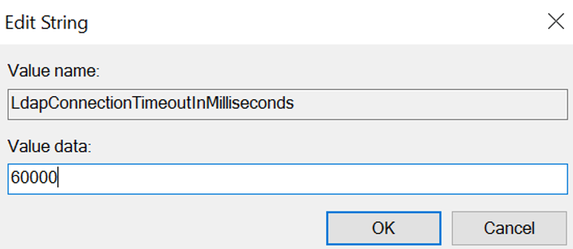
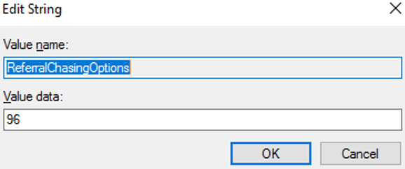

# Manage agent registry options

This section describes registry options that you can set to control the runtime processing behavior of the Microsoft Entra provisioning agent. 

## Configure LDAP connection timeout
When performing LDAP operations on configured Active Directory domain controllers, by default, the provisioning agent uses the default connection timeout value of 30 seconds. If your domain controller takes more time to respond, then you might see the following error message in the agent log file: 

`
System.DirectoryServices.Protocols.LdapException: The operation was aborted because the client side timeout limit was exceeded.
`

LDAP search operations can take longer if the search attribute isn't indexed. As a first step, if you get the aforementioned error, first check if the search/lookup attribute is [indexed](/windows/win32/ad/indexed-attributes). If the search attributes are indexed and the error persists, you can increase the LDAP connection timeout using the following steps: 

1. Sign-in as Administrator on the Windows server running the Microsoft Entra provisioning agent.
1. Use the *Run* menu item to open the registry editor (regedit.exe) 
1. Locate the key folder **HKEY_LOCAL_MACHINE\SOFTWARE\Microsoft\Azure AD Connect Agents\Azure AD Connect Provisioning Agent**
1. Right-select and select "New -> String Value"
1. Provide the name: 
  `LdapConnectionTimeoutInMilliseconds`
1. Double-select on the **Value Name** and enter the value data as `60000` milliseconds.
    > [!div class="mx-imgBorder"]
    > 
1. Restart the Microsoft Entra Connect Provisioning Service from the *Services* console.
1. If you've deployed multiple provisioning agents, apply this registry change to all agents for consistency. 

## Configure referral chasing
By default, the Microsoft Entra provisioning agent doesn't chase [referrals](/windows/win32/ad/referrals). 
You might want to enable referral chasing, to support certain HR inbound provisioning scenarios such as: 
* Checking uniqueness of UPN across multiple domains
* Resolving cross-domain manager references

Use the following steps to turn on referral chasing:

1. Sign-in as Administrator on the Windows server running the Microsoft Entra provisioning agent.
1. Use the *Run* menu item to open the registry editor (regedit.exe) 
1. Locate the key folder **HKEY_LOCAL_MACHINE\SOFTWARE\Microsoft\Azure AD Connect Agents\Azure AD Connect Provisioning Agent**
1. Right-select and select "New -> String Value"
1. Provide the name: 
  `ReferralChasingOptions`
1. Double-select on the **Value Name** and enter the value data as `96`. This value corresponds to the constant value for `ReferralChasingOptions.All` and specifies that both subtree and base-level referrals are followed by the agent. 
    > [!div class="mx-imgBorder"]
    > 
1. Restart the Microsoft Entra Connect Provisioning Service from the *Services* console.
1. If you've deployed multiple provisioning agents, apply this registry change to all agents for consistency.

> [!NOTE]
> You can confirm the registry options have been set by enabling [verbose logging](how-to-troubleshoot.md#log-files). The logs emitted during agent startup display the config values picked from the registry. 

## Next steps 

- [What is provisioning?](../what-is-provisioning.md)
- [What is Microsoft Entra Cloud Sync?](what-is-cloud-sync.md)
