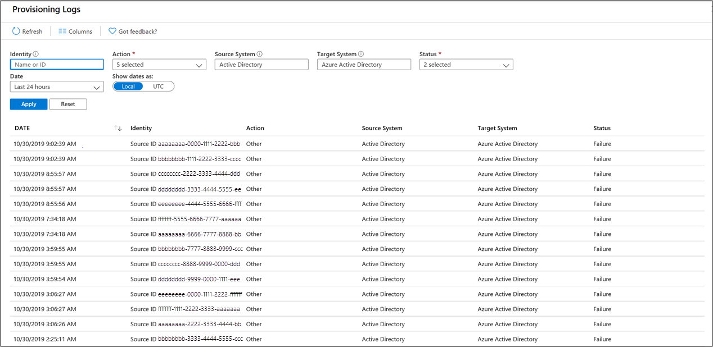
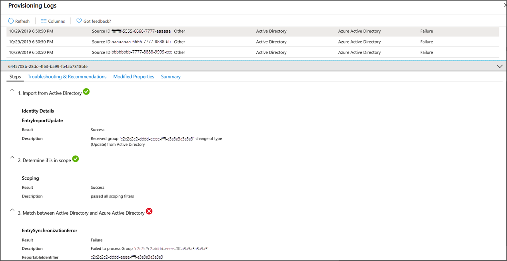
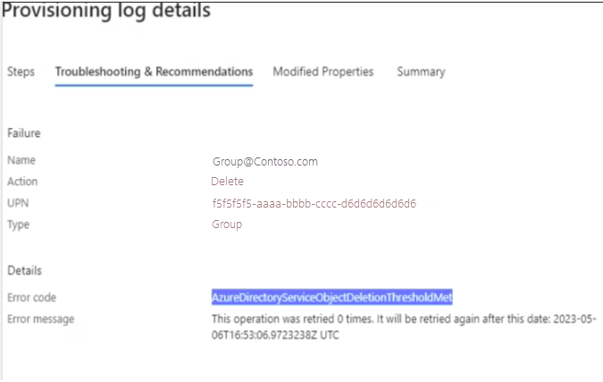

# Cloud sync troubleshooting

Cloud sync has many different dependencies and interactions, which can give rise to various problems. This article helps you troubleshoot these problems. It introduces the typical areas for you to focus on, how to gather additional information, and the various techniques you can use to track down problems.

## Agent problems

When you troubleshoot agent problems, you verify that the agent was installed correctly, and that it communicates with Microsoft Entra ID. In particular, some of the first things that you want to verify with the agent are:

- Is it installed?
- Is the agent running locally?
- Is the agent in the portal?
- Is the agent marked as healthy?

You can verify these items in the portal and on the local server that's running the agent.

### Microsoft Entra admin center agent verification


To verify that Azure detects the agent, and that the agent is healthy, follow these steps:

 [!INCLUDE [sign in](~/includes/cloud-sync-sign-in.md)]
 3. Select **cloud sync**.
 4. You should see the agents you've installed. Verify that the agent in question is there. If all is well, you will see the *active* (green) status for the agent.

### Verify the required open ports

Verify that the Microsoft Entra provisioning agent is able to communicate successfully with Azure datacenters. If there's a firewall in the path, make sure that the following ports to outbound traffic are open:

| Port number | How it's used |
| ----------- | ------------------------------------------------------------ |
| 80          | Downloading certificate revocation lists (CRLs), while validating the TLS/SSL certificate. |
| 443         | Handling all outbound communication with the Application Proxy service. |

If your firewall enforces traffic according to originating users, also open ports 80 and 443 for traffic from Windows services that run as a network service.

### Allow access to URLs

Allow access to the following URLs:

| URL | Port | How it's used |
| --- | --- | --- |
| `*.msappproxy.net` <br> `*.servicebus.windows.net` | 443/HTTPS | Communication between the connector and the Application Proxy cloud service. |
| `crl3.digicert.com` <br> `crl4.digicert.com` <br> `ocsp.digicert.com` <br> `crl.microsoft.com` <br> `oneocsp.microsoft.com` <br> `ocsp.msocsp.com`<br> | 80/HTTP   | The connector uses these URLs to verify certificates.        |
| `login.windows.net` <br> `secure.aadcdn.microsoftonline-p.com` <br> `*.microsoftonline.com` <br> `*.microsoftonline-p.com` <br> `*.msauth.net` <br> `*.msauthimages.net` <br> `*.msecnd.net` <br> `*.msftauth.net` <br> `*.msftauthimages.net` <br> `*.phonefactor.net` <br> `enterpriseregistration.windows.net` <br> `management.azure.com` <br> `policykeyservice.dc.ad.msft.net` <br> `ctldl.windowsupdate.com` <br> `www.microsoft.com/pkiops` | 443/HTTPS | The connector uses these URLs during the registration process. |
| `ctldl.windowsupdate.com` | 80/HTTP | The connector uses this URL during the registration process. |

You can allow connections to `*.msappproxy.net`, `*.servicebus.windows.net`, and other of the preceding URLs, if your firewall or proxy lets you configure access rules based on domain suffixes. If not, you need to allow access to the [Azure IP ranges and service tags - public cloud](https://www.microsoft.com/download/details.aspx?id=56519). The IP ranges are updated each week.

> [!IMPORTANT]
> Avoid all forms of inline inspection and termination on outbound TLS communications between Microsoft Entra private network connectors and Microsoft Entra application proxy cloud services.

<a name='dns-name-resolution-for-azure-ad-application-proxy-endpoints'></a>

### DNS name resolution for Microsoft Entra application proxy endpoints

Public DNS records for Microsoft Entra application proxy endpoints are chained CNAME records, pointing to an A record. This ensures fault tolerance and flexibility. It’s guaranteed that the Microsoft Entra private network connector always accesses host names with the domain suffixes `*.msappproxy.net` or `*.servicebus.windows.net`.

However, during the name resolution, the CNAME records might contain DNS records with different host names and suffixes. Due to this, you must ensure that the device can resolve all the records in the chain, and allows connection to the resolved IP addresses. Because the DNS records in the chain might be changed from time to time, we can't provide you with any list DNS records.

### On the local server

To verify that the agent is running, follow these steps:

1. On the server with the agent installed, open **Services**. Do this by going to **Start** > **Run** > **Services.msc**.
1. Under **Services**, make sure **Microsoft Entra Connect Agent Updater** and **Microsoft Entra Provisioning Agent** are there. Also confirm that their status is *Running*.

   

### Common agent installation problems

The following sections describe some common agent installation problems, and typical resolutions of those problems.

#### Agent failed to start

You might receive an error message that states:

*Service 'Microsoft Entra Provisioning Agent' failed to start. Verify that you have sufficient privileges to start the system services.* 

This problem is typically caused by a group policy. The policy prevented permissions from being applied to the local NT Service sign-in account created by the installer (`NT SERVICE\AADConnectProvisioningAgent`). These permissions are required to start the service.

To resolve this problem, follow these steps:

1. Sign in to the server with an administrator account.
1. Open **Services** by going to **Start** > **Run** > **Services.msc**.
1. Under **Services**, double-click **Microsoft Entra Provisioning Agent**.
1. On the **Log On** tab, change **This account** to a domain admin. Then restart the service. 

   

#### Agent times out or certificate isn't valid

You might get the following error message when you attempt to register the agent.


This problem is usually caused by the agent being unable to connect to the hybrid identity service. To resolve this problem, configure an outbound proxy. 

The provisioning agent supports the use of an outbound proxy. You can configure it by editing the following agent .config file: *C:\Program Files\Microsoft Azure AD Connect Provisioning Agent\AADConnectProvisioningAgent.exe.config*.

Add the following lines into it, toward the end of the file, just before the closing `</configuration>` tag. Replace the variables `[proxy-server]` and `[proxy-port]` with your proxy server name and port values.

```xml
    <system.net>
        <defaultProxy enabled="true" useDefaultCredentials="true">
            <proxy
                usesystemdefault="true"
                proxyaddress="http://[proxy-server]:[proxy-port]"
                bypassonlocal="true"
            />
        </defaultProxy>
    </system.net>
```

#### Agent registration fails with security error

You might get an error message when you install the cloud provisioning agent. This problem is typically caused by the agent being unable to run the PowerShell registration scripts, due to local PowerShell execution policies.

To resolve this problem, change the PowerShell execution policies on the server. You need to have machine and user policies set as `Undefined` or `RemoteSigned`. If they're set as `Unrestricted`, you'll see this error. For more information, see [PowerShell execution policies](/powershell/module/microsoft.powershell.core/about/about_execution_policies). 

### Log files

By default, the agent emits minimal error messages and stack trace information. You can find these trace logs in the following folder: *C:\ProgramData\Microsoft\Azure AD Connect Provisioning Agent\Trace*.

To gather additional details for troubleshooting agent-related problems, follow these steps.

1. [Install the AADCloudSyncTools PowerShell module](reference-powershell.md#install-the-aadcloudsynctools-powershell-module).
1. Use the `Export-AADCloudSyncToolsLogs` PowerShell cmdlet to capture the information. You can use the following options to fine-tune your data collection.
      - `SkipVerboseTrace` to only export current logs without capturing verbose logs (default = false).
      - `TracingDurationMins` to specify a different capture duration (default = 3 minutes).
      - `OutputPath` to specify a different output path (default = user’s Documents folder).

## Object synchronization problems

In the portal, you can use provisioning logs to help track down and troubleshoot object synchronization problems. To view the logs, select **Logs**.


Provisioning logs provide a wealth of information on the state of the objects being synchronized between your on-premises Active Directory environment and Azure.



You can filter the view to focus on specific problems, such as dates. You can also search the logs for activities relating to an Active Directory object using its Active Directory `ObjectGuid`. Double-click an individual event to see additional information.



This information provides detailed steps and where the synchronization problem is occurring. In this way, you can pinpoint the exact spot of the problem.

#### Skipped objects

If you have been synchronizing users and groups from Active Directory, you may be unable to locate one or more groups in Microsoft Entra ID.  This could be due to synchronization having not yet completed or not yet caught up with the creation of the object in Active Directory, a sync error that is blocking the object being created in Microsoft Entra ID, or a synchronization rule scoping rule might be applied that is excluding the object.

If you restart sync, and then when the provisioning cycle completes, search the provisioning log for activities relating to an object using that object's Active Directory `ObjectGuid`. If an event with an Identity containing only a Source ID and a Status of `Skipped` is present in the log, this can indicate that the agent filtered the Active Directory object because it was out of scope.

By default, the scoping rules exclude the following objects from being synchronized to Microsoft Entra ID:

 * users, groups and contacts with `IsCriticalSystemObject` set to TRUE, including many of the built-in users and groups in Active Directory
 * replication victim objects

Additional restrictions can be present in the [synchronization schema](concept-attributes.md).

<a name='microsoft-entra-id-object-deletion-threshold'></a>

#### Microsoft Entra object deletion threshold

If you have an implementation topology with Microsoft Entra Connect and Microsoft Entra Cloud Sync, both exporting to the same Microsoft Entra tenant, or if you completely moved from using Microsoft Entra Connect to Microsoft Entra Cloud Sync, you might get the following export error message when you're deleting or moving multiple objects out of the defined scope:



This error isn't related to the [accidental deletions prevention feature](/azure/active-directory/cloud-sync/how-to-accidental-deletes) of Microsoft Entra Connect cloud sync. It's triggered by the [accidental deletion prevention feature](../connect/how-to-connect-sync-feature-prevent-accidental-deletes.md) set in the Microsoft Entra directory from Microsoft Entra Connect.
If you don't have a Microsoft Entra Connect server installed from which you could toggle the feature, you can use the ["AADCloudSyncTools"](/azure/active-directory/cloud-sync/reference-powershell) PowerShell module installed with the Microsoft Entra Connect cloud sync agent to disable the setting on the tenant and allow the blocked deletions to export after confirming they are expected and should be allowed. Use the following command:

```PowerShell
Disable-AADCloudSyncToolsDirSyncAccidentalDeletionPrevention -tenantId "aaaabbbb-0000-cccc-1111-dddd2222eeee"
```

During the next provisioning cycle, the objects that were marked for deletion should be deleted from the Microsoft Entra directory successfully.

## Provisioning quarantined problems

Cloud sync monitors the health of your configuration, and places unhealthy objects in a quarantine state. If most or all of the calls made against the target system consistently fail because of an error (for example, invalid admin credentials), the sync job is marked as in quarantine.


By selecting the status, you can see additional information about the quarantine. You can also obtain the error code and message.


Right-clicking on the status will bring up additional options to:

- View the provisioning logs.
- View the agents.
- Clear the quarantine.


### Resolve a quarantine

There are two different ways to resolve a quarantine. You can clear the quarantine, or you can restart the provisioning job.

#### Clear the quarantine

To clear the watermark and run a delta sync on the provisioning job after you have verified it, simply right-click on the status and select **Clear quarantine**.

You should see a notice that the quarantine is clearing.


Then you should see the status on your agent as healthy.


#### Restart the provisioning job

Use the portal to restart the provisioning job. On the agent configuration page, select **Restart sync**.

  

Alternatively, you can use Microsoft Graph to [restart the provisioning job](/graph/api/synchronization-synchronizationjob-restart?tabs=http&view=graph-rest-beta&preserve-view=true). You have full control over what you restart. You can choose to clear:

- Escrows, to restart the escrow counter that accrues toward quarantine status.
- Quarantine, to remove the application from quarantine.
- Watermarks. 
  
Use the following request:
 
  `POST /servicePrincipals/{id}/synchronization/jobs/{jobId}/restart`

## Repair the cloud sync service account

If you need to repair the cloud sync service account, you can use the `Repair-AADCloudSyncToolsAccount` command.

   1. [Install the AADCloudSyncTools PowerShell module](reference-powershell.md#install-the-aadcloudsynctools-powershell-module).

   1. From a PowerShell session with administrative privileges, type, or copy and paste, the following:

      ```powershell
      Connect-AADCloudSyncTools
      ```

   1. Enter your Microsoft Entra Global Administrator credentials.

   1. Type, or copy and paste, the following:

      ```powershell
      Repair-AADCloudSyncToolsAccount
      ```

   1. After this completes, it should say that the account was repaired successfully.

## Password writeback

To enable and use password writeback with cloud sync, keep the following in mind:

- If you need to update the [gMSA permissions](how-to-gmsa-cmdlets.md#using-set-aadcloudsyncpermissions), it might take an hour or more for these permissions to replicate to all the objects in your directory. If you don't assign these permissions, writeback can appear to be configured correctly, but users might encounter errors when they update their on-premises passwords from the cloud. Permissions must be applied to **This object and all descendant objects** for **Unexpire Password** to appear. 
- If passwords for some user accounts aren't written back to the on-premises directory, make sure that inheritance isn't disabled for the account in the on-premises Active Directory Domain Services (AD DS) environment. Write permissions for passwords must be applied to descendant objects for the feature to work correctly. 
- Password policies in the on-premises AD DS environment might prevent password resets from being correctly processed. If you're testing this feature and want to reset passwords for users more than once per day, the group policy for the minimum password age must be set to 0. You can find this setting in the following location: **Computer Configuration** > **Policies** > **Windows Settings** > **Security Settings** > **Account Policies**, within **gpmc.msc**. 
     - If you update the group policy, wait for the updated policy to replicate, or use the `gpupdate /force` command. 
     - For passwords to be changed immediately, the minimum password age must be set to 0. However, if users adhere to the on-premises policies, and the minimum password age is set to a value greater than 0, password writeback doesn't work after the on-premises policies are evaluated. 

## Next steps 

- [Known limitations](how-to-prerequisites.md#known-limitations)
- [Error codes](reference-error-codes.md)
