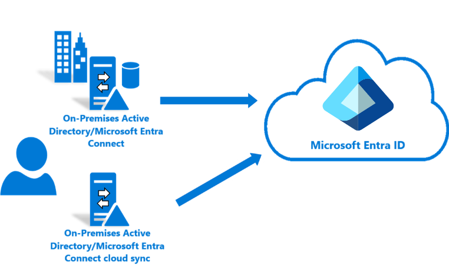
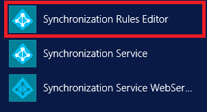
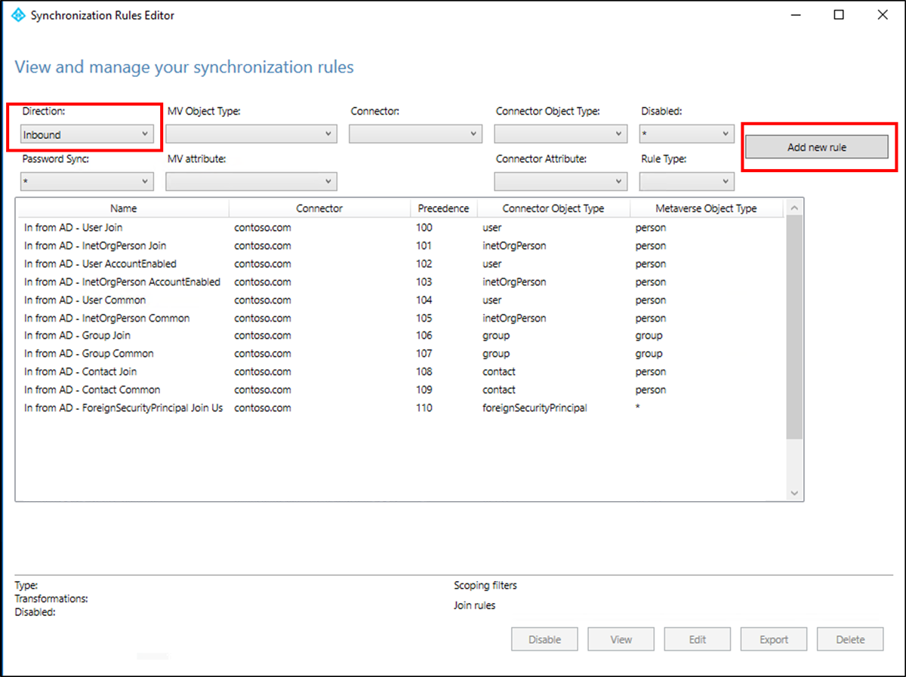
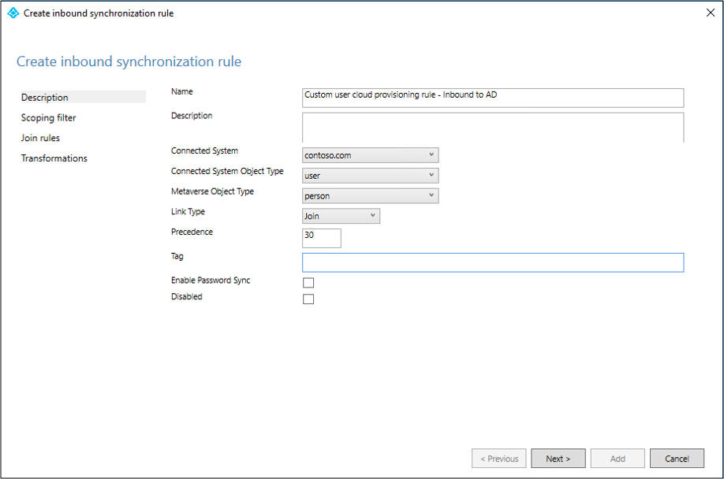
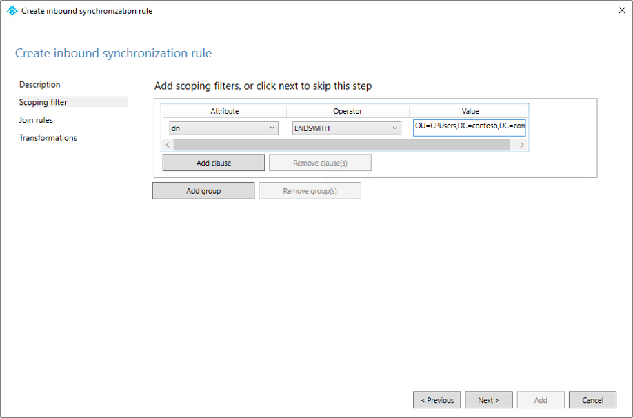
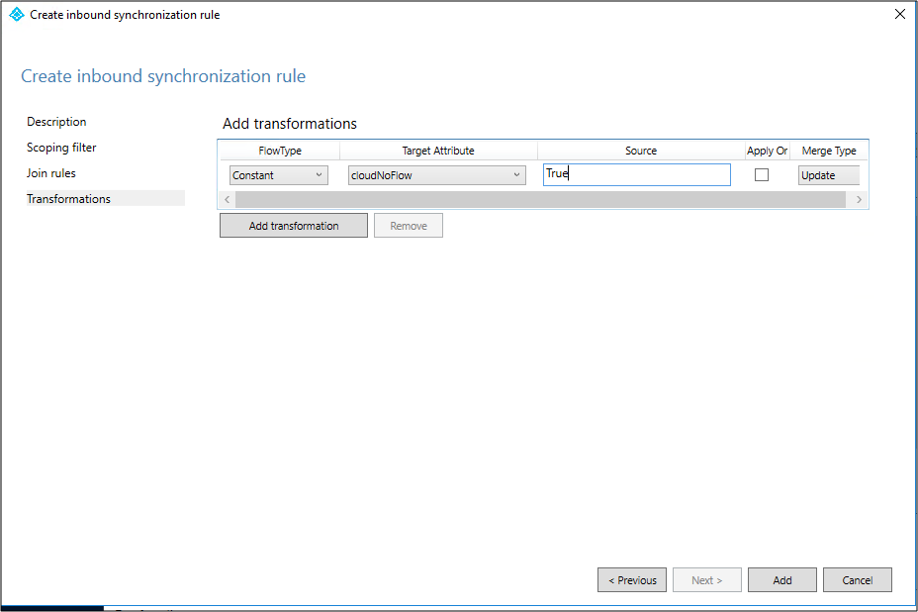
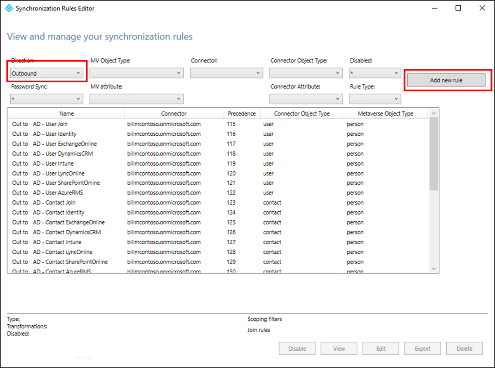
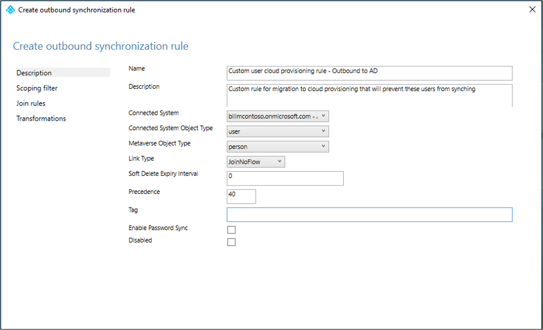
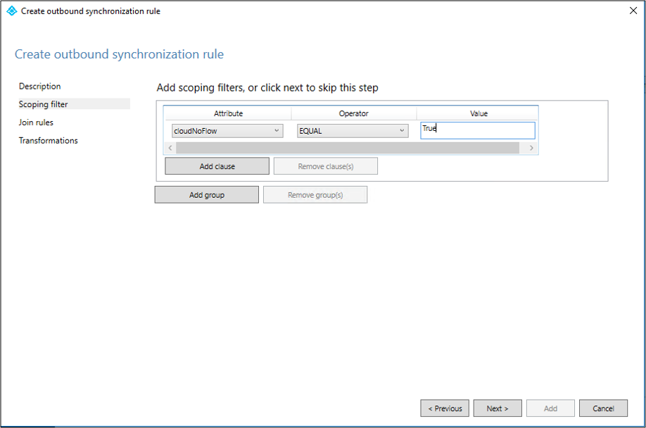

# Tutorial: Migrate to Microsoft Entra Cloud Sync for a synced Active Directory forest

This tutorial walks you through how to migrate to Microsoft Entra Cloud Sync for a test Active Directory forest that was synced by using Microsoft Entra Connect Sync.

This article provides information for a basic migration. Review the [Migrate to Microsoft Entra Cloud Sync](migrate-azure-ad-connect-to-cloud-sync.md) documentation before you attempt to migrate your production environment.

In this tutorial, you learn how to:

> [!div class="checklist"]
> - Stop the scheduler.
> - Create custom user inbound and outbound rules.
> - Install the provisioning agent.
> - Verify the agent installation.
> - Configure Microsoft Entra Cloud Sync.
> - Restart the scheduler.

## Considerations

Before you try this tutorial, consider the following items:

 - Ensure that you're familiar with the basics of Microsoft Entra Cloud Sync.
 - Ensure that you're running Microsoft Entra Connect Sync version 1.4.32.0 or later and that you configured the sync rules as documented.
 - Ensure that for a pilot that you remove a test organizational unit (OU) or group from Microsoft Entra Connect Sync scope. Moving objects out of scope leads to deletion of those objects in Microsoft Entra ID.

    - User objects in Microsoft Entra ID are soft-deleted, so you can restore them.
    - Group objects in Microsoft Entra ID are hard-deleted, so you can't restore them.
 
     Microsoft Entra Connect Sync introduces a new link type, which prevents the deletion in a piloting scenario.

 - Ensure that the objects in the pilot scope have `ms-ds-consistencyGUID` populated so that Microsoft Entra Cloud Sync hard matches the objects.

   Microsoft Entra Connect Sync doesn't populate `ms-ds-consistencyGUID` by default for group objects.

- Follow the steps in this tutorial precisely. This configuration is for advanced scenarios.

## Prerequisites

The following are prerequisites required for completing this tutorial

- A test environment with Microsoft Entra Connect Sync version 1.4.32.0 or later
- An OU or group that is in scope of sync and can be used during the pilot. We recommend starting with a small set of objects.
- A server running Windows Server 2016 or later that will host the provisioning agent.
- Source anchor for Microsoft Entra Connect Sync should be either *objectGuid* or *ms-ds-consistencyGUID*

## Update Microsoft Entra Connect

At a minimum, you should have [Microsoft Entra Connect](https://www.microsoft.com/download/details.aspx?id=47594) 1.4.32.0. To update Microsoft Entra Connect Sync, follow the steps in [Microsoft Entra Connect: Upgrade to the latest version](../connect/how-to-upgrade-previous-version.md).

## Back up your Microsoft Entra Connect configuration

Before you make any changes, back up your Microsoft Entra Connect configuration. This way, you can roll back to your previous configuration. For more information, see [Import and export Microsoft Entra Connect configuration settings](../connect/how-to-connect-import-export-config.md).

## Stop the scheduler

Microsoft Entra Connect Sync synchronizes changes occurring in your on-premises directory using a scheduler. In order to modify and add custom rules, you want to disable the scheduler so that synchronizations won't run while you're working and making the changes. To stop the scheduler, use the following steps:

1. On the server that's running Microsoft Entra Connect Sync, open PowerShell with administrative privileges.
1. Run `Stop-ADSyncSyncCycle`. Select Enter.
1. Run `Set-ADSyncScheduler -SyncCycleEnabled $false`.

> [!NOTE]
> If you're running your own custom scheduler for Microsoft Entra Connect Sync, disable the custom sync scheduler.

## Create a custom user inbound rule

In the Microsoft Entra Connect Synchronization Rules Editor, you need to create an inbound sync rule that filters out users in the OU that you identified previously. The inbound sync rule is a join rule with a target attribute of `cloudNoFlow`. This rule tells Microsoft Entra Connect not to synchronize attributes for these users. For more information, see [Migrate to Microsoft Entra Cloud Sync](migrate-azure-ad-connect-to-cloud-sync.md) before you attempt to migrate your production environment.

1. Open the Synchronization Rules Editor from the application menu on the desktop.

    

1. Under **Direction**, select **Inbound** from the dropdown list. Then select **Add new rule**.

    

1. On the **Description** page, enter the following values and select **Next**:

    - **Name**: Give the rule a meaningful name.
    - **Description**: Add a meaningful description.
        - **Connected System**: Choose the Microsoft Entra connector for which you're writing the custom sync rule.
        - **Connected System Object Type**: Select **user**.
        - **Metaverse Object Type**: Select **person**.
        - **Link Type**: Select **Join**.
        - **Precedence**: Provide a value that's unique in the system.
        - **Tag**: Leave this field empty.

    
  
1. On the **Scoping filter** page, enter the OU or security group on which you want to base the pilot. To filter on OU, add the OU portion of the distinguished name. This rule applies to all users who are in that OU. So, if the distinguished name (DN) ends with `OU=CPUsers,DC=contoso,DC=com`, you add this filter. Then select **Next**.

    |Rule|Attribute|Operator|Value|
    |-----|----|----|-----|
    |Scoping OU|`DN`|`ENDSWITH`|Distinguished name of the OU.|
    |Scoping group||`ISMEMBEROF`|Distinguished name of the security group.|

    

 5. On the **Join** rules page, select **Next**.
 6. On the **Transformations** page, add a Constant transformation: Source value of True for the cloudNoFlow attribute. Select **Add**.

    

Follow the same steps for all object types (user, group, and contact). Repeat the steps according to the configured Active Directory connector or Active Directory forest.

## Create a custom user outbound rule

You need an outbound sync rule with a link type of `JoinNoFlow` and the scoping filter that has the `cloudNoFlow` attribute set to `True`. This rule tells Microsoft Entra Connect not to synchronize attributes for these users. For more information, see [Migrate to Microsoft Entra Cloud Sync](migrate-azure-ad-connect-to-cloud-sync.md) before you attempt to migrate your production environment.

1. Under **Direction**, select **Outbound** from the dropdown list. Then select **Add rule**.

    

1. On the **Description** page, enter the following values and select **Next**:

    - **Name**: Give the rule a meaningful name.
    - **Description**: Add a meaningful description.
        - **Connected System**: Choose the Microsoft Entra connector for which you're writing the custom sync rule.
        - **Connected System Object Type**: Select **user**.
        - **Metaverse Object Type**: Select **person**.
        - **Link Type**: Select **JoinNoFlow**.
        - **Precedence**: Provide a value that's unique in the system.
        - **Tag**: Leave this field empty.

    
  
1. On the **Scoping filter** page, for the **Attribute**, select **cloudNoFlow**. For **Value**, select **True**. Then select **Next**.

    

1. On the **Join rules** page, select **Next**.

1. On the **Transformations** page, select **Add**.

Follow the same steps for all object types (user, group, and contact).

## Install the Microsoft Entra provisioning agent

If you're using the [Basic Active Directory and Azure environment](tutorial-basic-ad-azure.md) tutorial, use CP1. To install the agent, follow these steps.

[!INCLUDE [active-directory-cloud-sync-how-to-install](~/includes/entra-cloud-sync-how-to-install.md)]

## Verify the agent installation

[!INCLUDE [active-directory-cloud-sync-how-to-verify-installation](~/includes/entra-cloud-sync-how-to-verify-installation.md)]

## Configure Microsoft Entra Cloud Sync

To configure provisioning, follow these steps:

[!INCLUDE [sign in](~/includes/cloud-sync-sign-in.md)]

3. Select **New configuration**.

    :::image type="content" source="media/how-to-configure/new-ux-configure-1.png" alt-text="Screenshot that shows adding a configuration." lightbox="media/how-to-configure/new-ux-configure-1.png":::

4. On the configuration screen, select your domain and whether to enable password hash sync. Then select **Create**.

    :::image type="content" source="media/how-to-configure/new-ux-configure-2.png" alt-text="Screenshot that shows a new configuration." lightbox="media/how-to-configure/new-ux-configure-2.png":::

5. On the **Get started** screen, select **Add scoping filters** next to the **Add scoping filters** icon. Or on the left pane under **Manage**, select **Scoping filters**.

    :::image type="content" source="media/how-to-configure/new-ux-configure-5.png" alt-text="Screenshot that shows the scoping filters." lightbox="media/how-to-configure/new-ux-configure-5.png":::

6. Select the scoping filter. For this tutorial, select **Selected organizational units**. This filter scopes the configuration to apply to specific OUs.

7. In the box, enter **OU=CPUsers,DC=contoso,DC=com**.
    :::image type="content" source="media/tutorial-migrate-aadc-aadccp/configure-1.png" alt-text="Screenshot that shows the scoping filter." lightbox="media/tutorial-migrate-aadc-aadccp/configure-1.png":::

8. Select **Add** > **Save**.

## Start the scheduler

Microsoft Entra Connect Sync synchronizes changes that occur in your on-premises directory by using a scheduler. Now that you modified the rules, you can restart the scheduler.

1. On the server that's running Microsoft Entra Connect Sync, open PowerShell with administrator privileges.
1. Run `Set-ADSyncScheduler -SyncCycleEnabled $true`.
1. Run `Start-ADSyncSyncCycle`. Then select <kbd>Enter</kbd>.

> [!NOTE]
> If you're running your own custom scheduler for Microsoft Entra Connect Sync, reenable the custom sync scheduler.

After the scheduler is enabled, Microsoft Entra Connect stops exporting any changes on objects with `cloudNoFlow=true` in the metaverse, unless any reference attribute (such as `manager`) is being updated. If there's any reference attribute update on the object, Microsoft Entra Connect ignores the `cloudNoFlow` signal and exports all updates on the object.

## Troubleshooting

If the pilot doesn't work as expected, go back to the Microsoft Entra Connect Sync setup.

1. Disable provisioning configuration in the portal.
1. Use the Sync Rule Editor tool to disable all the custom sync rules that you created for cloud provisioning. Disabling causes a full sync on all the connectors.

## Related content

- [What is provisioning?](../what-is-provisioning.md)
- [What is Microsoft Entra Cloud Sync?](what-is-cloud-sync.md)
