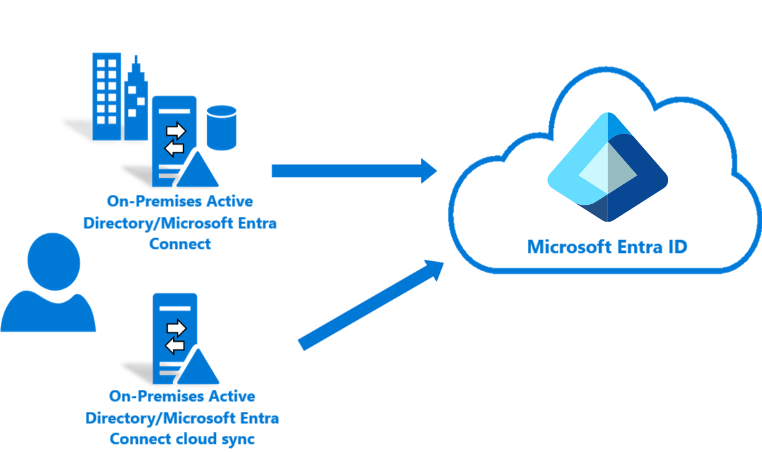
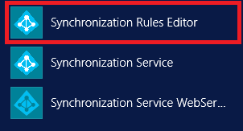
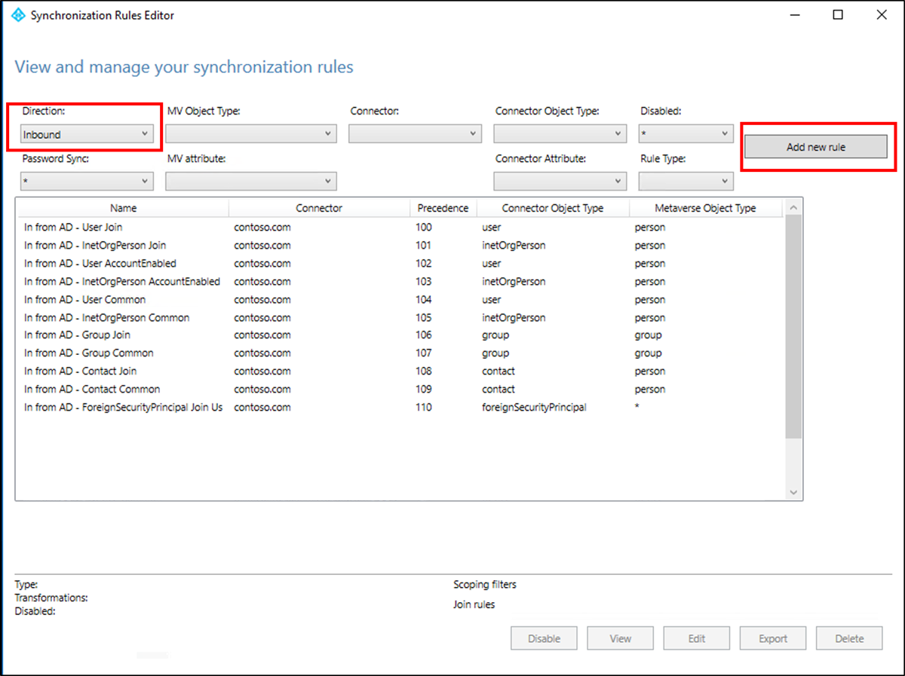
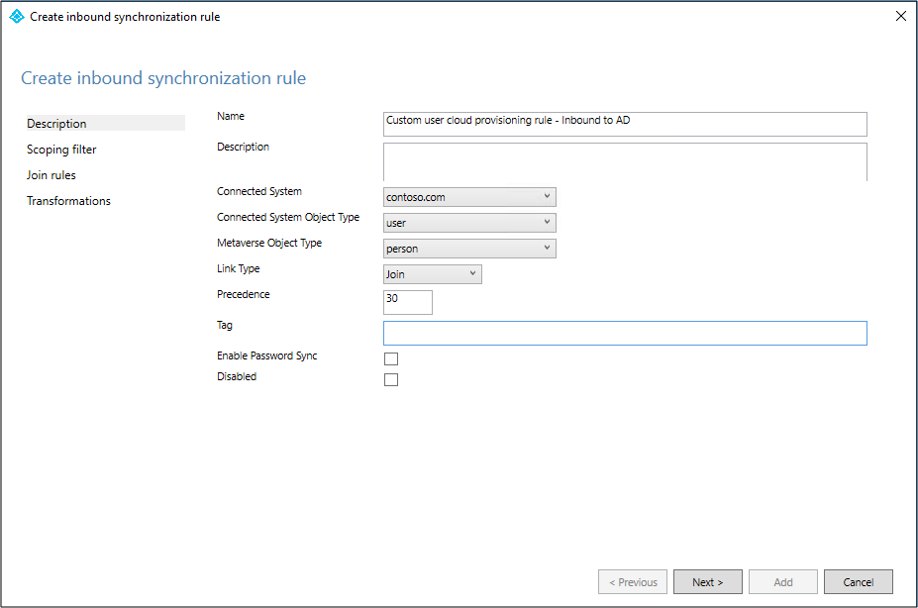
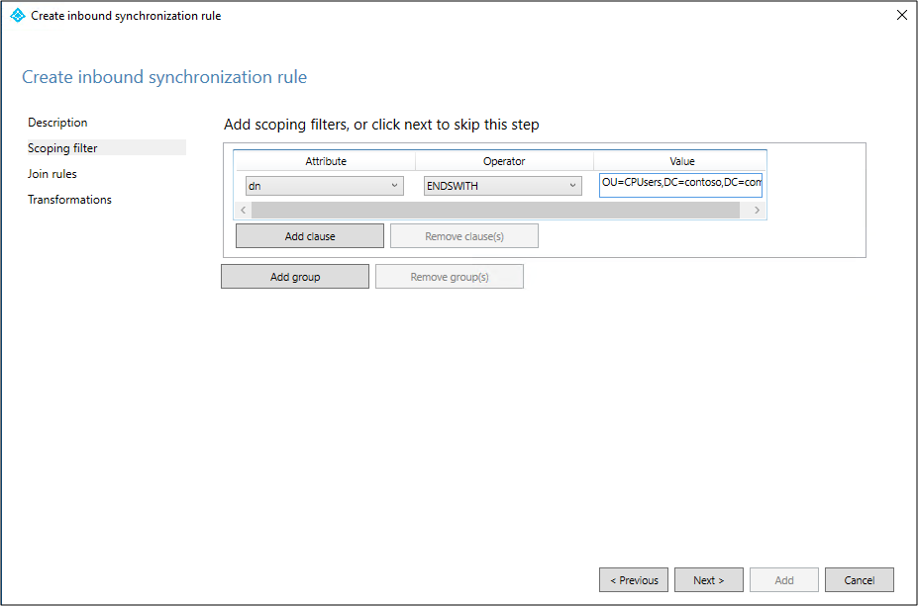
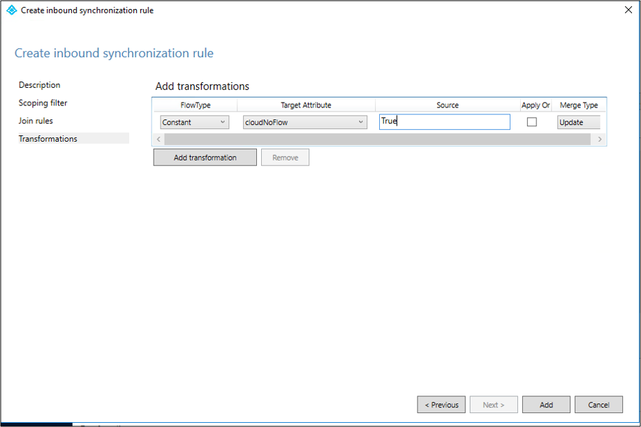
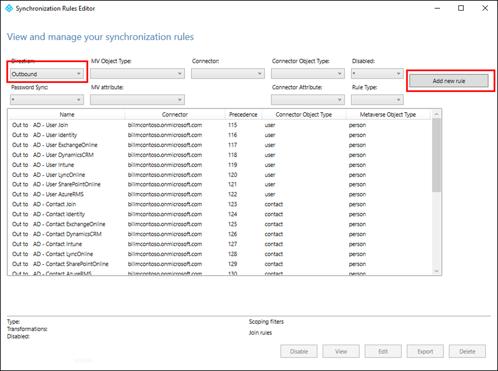
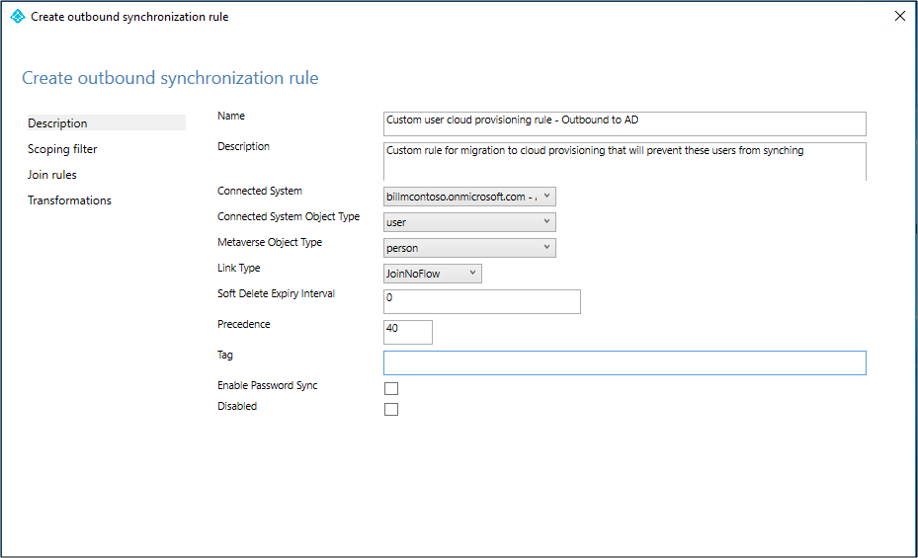
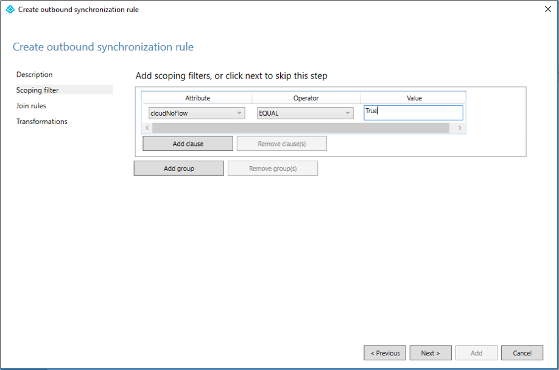

# Tutorial: Migrate to Microsoft Entra Cloud Sync for a synced Active Directory forest

This tutorial walks you through how to migrate to Microsoft Entra Cloud Sync for a test Active Directory forest that was synced by using Microsoft Entra Connect Sync.

This article provides information for a basic migration. Review the [Migrate to Microsoft Entra Cloud Sync](migrate-azure-ad-connect-to-cloud-sync.md) documentation before you attempt to migrate your production environment.

In this tutorial, you learn how to:

> [!div class="checklist"]
> - Stop the scheduler.
> - Create custom user inbound and outbound rules.
> - Install the provisioning agent.
> - Verify the agent installation.
> - Configure Microsoft Entra Cloud Sync.
> - Restart the scheduler.

## Considerations

Before you try this tutorial, consider the following items:

- Ensure that you're familiar with the basics of Microsoft Entra Cloud Sync.

- Ensure that you're running Microsoft Entra Connect Sync version 1.4.32.0 or later and that you configured the sync rules as documented.

- During the pilot or coexistence phase, don't remove the pilot organizational unit (OU), group, domain, or any related referenced objects from Microsoft Entra Connect Sync scope. Keep the objects in scope and use the custom `cloudNoFlow` inbound rule and `JoinNoFlow` outbound rule described in this tutorial to prevent Microsoft Entra Connect Sync from exporting object adds, object deletes, and non-reference attribute updates.

  Removing objects from Microsoft Entra Connect Sync scope removes them from the Active Directory connector space, metaverse, and Microsoft Entra connector space. This removal can remove references in the connector space and cause reference deletes, such as group membership removals, to be exported to Microsoft Entra ID.

- Ensure that the objects in the pilot scope have `ms-ds-consistencyGUID` populated so that Microsoft Entra Cloud Sync hard matches the objects.

  Microsoft Entra Connect Sync doesn't populate `ms-ds-consistencyGUID` by default for group objects.

- Follow the steps in this tutorial precisely. This configuration is for advanced scenarios.

### Plan scope removal from Microsoft Entra Connect Sync

Don't remove OUs, groups, or domains from Microsoft Entra Connect Sync scope during the coexistence or pilot phase. Do this only after migration for that scope is complete and you've verified that Cloud Sync is authoritative for the objects and their references.

Before you remove a scope from Microsoft Entra Connect Sync, verify that:

- All objects in that scope are included in the appropriate Cloud Sync configuration.
- Related referenced objects, such as group members and managers, are also migrated or no longer depend on Microsoft Entra Connect Sync for reference maintenance.
- There are no remaining cross-scope or cross-domain references that Microsoft Entra Connect Sync might delete from its connector space and export as reference removals.

Remove a domain from Microsoft Entra Connect Sync only after migration for that domain is complete and you're certain there are no remaining cross-domain references.

## Prerequisites

The following are prerequisites required for completing this tutorial

- A test environment with Microsoft Entra Connect Sync version 1.4.32.0 or later
- An OU or group that is in scope of sync and can be used during the pilot. We recommend starting with a small set of objects.
- A server that runs Windows Server 2022, Windows Server 2019, or Windows Server 2016 to host the provisioning agent.
- Source anchor for Microsoft Entra Connect Sync should be either *objectGuid* or *ms-ds-consistencyGUID*

## Update Microsoft Entra Connect

At a minimum, you should have [Microsoft Entra Connect](https://www.microsoft.com/download/details.aspx?id=47594) 1.4.32.0. To update Microsoft Entra Connect Sync, follow the steps in [Microsoft Entra Connect: Upgrade to the latest version](../connect/how-to-upgrade-previous-version.md).

## Back up your Microsoft Entra Connect configuration

Before you make any changes, back up your Microsoft Entra Connect configuration. This way, you can roll back to your previous configuration. For more information, see [Import and export Microsoft Entra Connect configuration settings](../connect/how-to-connect-import-export-config.md).

## Stop the scheduler

Microsoft Entra Connect Sync synchronizes changes occurring in your on-premises directory using a scheduler. In order to modify and add custom rules, you want to disable the scheduler so that synchronizations won't run while you're working and making the changes. To stop the scheduler, use the following steps:

1. On the server that's running Microsoft Entra Connect Sync, open PowerShell with administrative privileges.
1. Run `Stop-ADSyncSyncCycle`. Select Enter.
1. Run `Set-ADSyncScheduler -SyncCycleEnabled $false`.

> [!NOTE]
> If you're running your own custom scheduler for Microsoft Entra Connect Sync, disable the custom sync scheduler.

## Create a custom user inbound rule

In the Microsoft Entra Connect Synchronization Rules Editor, create an inbound sync rule that sets the `cloudNoFlow` attribute to `True` for users in the OU or group that you identified for the pilot. This attribute is used with the `JoinNoFlow` outbound rule later in this tutorial to prevent Microsoft Entra Connect Sync from exporting object adds, object deletes, and non-reference attribute updates for these users. Reference attribute updates, such as `member` and `manager`, can still flow for reference resolution.
> [!IMPORTANT]
> The `cloudNoFlow` attribute doesn't place objects in a full read-only or staging mode. When it's used with a `JoinNoFlow` outbound rule, Microsoft Entra Connect Sync prevents object adds, object deletes, and non-reference attribute updates from being exported. However, reference attribute updates, such as `member` and `manager`, can still flow. This behavior supports reference resolution during migration.
>
> To avoid unintended reference deletes such as group membership removals, keep both sides of a reference in Microsoft Entra Connect Sync scope while `cloudNoFlow` and `JoinNoFlow` are active. For example, if a group remains in Microsoft Entra Connect Sync and its members are migrated to Microsoft Entra Cloud Sync, keep both the group and member objects in Microsoft Entra Connect Sync scope until the migration for that scope is complete.
1. Open the Synchronization Rules Editor from the application menu on the desktop.

    
1. Under **Direction**, select **Inbound** from the dropdown list. Then select **Add new rule**.

    
   
1. On the **Description** page, enter the following values and select **Next**:

    - **Name**: Give the rule a meaningful name.
    - **Description**: Add a meaningful description.
    - **Connected System**: Choose the Microsoft Entra connector for which you're writing the custom sync rule.
    - **Connected System Object Type**: Select **user**.
    - **Metaverse Object Type**: Select **person**.
    - **Link Type**: Select **Join**.
    - **Precedence**: Provide a value that's unique in the system.
    - **Tag**: Leave this field empty.

    
   
1. On the **Scoping filter** page, enter the OU or security group on which you want to base the pilot. To filter on OU, add the OU portion of the distinguished name. This rule applies to all users who are in that OU. So, if the distinguished name (DN) ends with `OU=CPUsers,DC=contoso,DC=com`, you add this filter. Then select **Next**.

    |Rule|Attribute|Operator|Value|
    |-----|----|----|-----|
    |Scoping OU|`DN`|`ENDSWITH`|Distinguished name of the OU.|
    |Scoping group||`ISMEMBEROF`|Distinguished name of the security group.|

   

1. On the **Join** rules page, select **Next**.
1. On the **Transformations** page, add a Constant transformation: Source value of True for the cloudNoFlow attribute. Select **Add**.

   
   
Follow the same steps for all object types (user, group, and contact). Repeat the steps according to the configured Active Directory connector or Active Directory forest.

## Create a custom user outbound rule

You need an outbound sync rule with a link type of `JoinNoFlow` and the scoping filter that has the `cloudNoFlow` attribute set to `True`. This rule tells Microsoft Entra Connect Sync not to export object adds, object deletes, or non-reference attribute updates for these users. Reference attribute updates, such as `member` and `manager`, can still flow for reference resolution.

1. Under **Direction**, select **Outbound** from the dropdown list. Then select **Add rule**.

    
   
1. On the **Description** page, enter the following values and select **Next**:

    - **Name**: Give the rule a meaningful name.
    - **Description**: Add a meaningful description.
    - **Connected System**: Choose the Microsoft Entra connector for which you're writing the custom sync rule.
    - **Connected System Object Type**: Select **user**.
    - **Metaverse Object Type**: Select **person**.
    - **Link Type**: Select **JoinNoFlow**.
    - **Precedence**: Provide a value that's unique in the system.
    - **Tag**: Leave this field empty.

    
   
1. On the **Scoping filter** page, for the **Attribute**, select **cloudNoFlow**. For **Value**, select **True**. Then select **Next**.

    
   
1. On the **Join rules** page, select **Next**.

1. On the **Transformations** page, select **Add**.

Follow the same steps for all object types (user, group, and contact).

## Install the Microsoft Entra provisioning agent

If you're using the [Basic Active Directory and Azure environment](tutorial-basic-ad-azure.md) tutorial, use CP1. To install the agent, follow these steps.

[!INCLUDE [active-directory-cloud-sync-how-to-install](~/includes/entra-cloud-sync-how-to-install.md)]

## Verify the agent installation

[!INCLUDE [active-directory-cloud-sync-how-to-verify-installation](~/includes/entra-cloud-sync-how-to-verify-installation.md)]

## Configure Microsoft Entra Cloud Sync

To configure provisioning, follow these steps:

[!INCLUDE [sign in](~/includes/cloud-sync-sign-in.md)]

3. Select **New configuration**.

    :::image type="content" source="media/how-to-configure/new-ux-configure-1.png" alt-text="Screenshot that shows adding a configuration." lightbox="media/how-to-configure/new-ux-configure-1.png":::

4. On the configuration screen, select your domain and whether to enable password hash sync. Then select **Create**.

    :::image type="content" source="media/how-to-configure/new-ux-configure-2.png" alt-text="Screenshot that shows a new configuration." lightbox="media/how-to-configure/new-ux-configure-2.png":::

5. On the **Get started** screen, select **Add scoping filters** next to the **Add scoping filters** icon. Or on the left pane under **Manage**, select **Scoping filters**.

    :::image type="content" source="media/how-to-configure/new-ux-configure-5.png" alt-text="Screenshot that shows the scoping filters." lightbox="media/how-to-configure/new-ux-configure-5.png":::

6. Select the scoping filter. For this tutorial, select **Selected organizational units**. This filter scopes the configuration to apply to specific OUs.

7. In the box, enter **OU=CPUsers,DC=contoso,DC=com**.

    :::image type="content" source="media/tutorial-migrate-aadc-aadccp/configure-1.png" alt-text="Screenshot that shows the scoping filter." lightbox="media/tutorial-migrate-aadc-aadccp/configure-1.png":::

8. Select **Add** > **Save**.

## Start the scheduler

Microsoft Entra Connect Sync synchronizes changes that occur in your on-premises directory by using a scheduler. Now that you modified the rules, you can restart the scheduler.

1. On the server that's running Microsoft Entra Connect Sync, open PowerShell with administrator privileges.
1. Run `Set-ADSyncScheduler -SyncCycleEnabled $true`.
1. Run `Start-ADSyncSyncCycle`. Then select <kbd>Enter</kbd>.

> [!NOTE]
> If you're running your own custom scheduler for Microsoft Entra Connect Sync, reenable the custom sync scheduler.

After the scheduler is enabled, Microsoft Entra Connect Sync stops exporting object adds, object deletes, and non-reference attribute updates for objects where `cloudNoFlow=true` in the metaverse and the outbound rule uses `JoinNoFlow`. Reference attributes are handled differently. Updates to reference attributes, such as `member` and `manager`, can still be exported for reference resolution.

If an object is removed from Microsoft Entra Connect Sync scope, its connector space and metaverse objects are removed. Any references to or from that object can be dropped in the Microsoft Entra connector space and exported as reference deletes. This behavior can cause group membership removals or other reference changes in Microsoft Entra ID.

## Troubleshooting

If the pilot doesn't work as expected, go back to the Microsoft Entra Connect Sync setup.

1. Disable provisioning configuration in the portal.
1. Use the Sync Rule Editor tool to disable all the custom sync rules that you created for cloud provisioning. Disabling causes a full sync on all the connectors.

### Removed group memberships or manager references

This issue can happen if objects are removed from Microsoft Entra Connect Sync scope while related groups, users, contacts, or other referenced objects are still in coexistence. When objects are removed from scope, Microsoft Entra Connect Sync removes the corresponding connector space and metaverse objects. This removal can drop references in the Microsoft Entra connector space and export reference deletes to Microsoft Entra ID.

To recover, readd the affected objects to Microsoft Entra Connect Sync scope and run a full synchronization to rebuild the connector space and metaverse references. Before you attempt to remove the scope again, verify that Microsoft Entra Cloud Sync is provisioning all affected objects and that references, such as group memberships and manager relationships, remain intact after a Cloud Sync provisioning cycle.

## Related content

- [What is provisioning?](../what-is-provisioning.md)
- [What is Microsoft Entra Cloud Sync?](what-is-cloud-sync.md)
