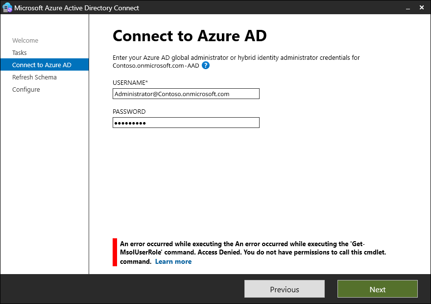

# Hardening update to Microsoft Entra Connect Sync by April 30, 2025 

In October 2024, we released new versions [2.4.18.0](reference-connect-version-history.md#24180) of Microsoft Entra Connect Sync. These versions contain a back-end service change that hardens our services and readies Connect Sync for the [MSOnline PowerShell retirement](https://aka.ms/msonlineretirement) in April 2025. **All customers are required to upgrade** to the [minimum versions](#minimum-versions) by **April 30, 2025**.

>[!IMPORTANT]
>**All customers are required to upgrade** to the [minimum versions](#minimum-versions) by **April 30, 2025**.

The deadline has been extended by three weeks from the earlier communicated date of April 7, 2025.


## Expected impacts 

Though the deadline has been extended, if you are not yet on a minimum supported version, you'll experience the following impacts after the original date:

- After April 7, 2025, configuration of Active Directory Federation Services (ADFS) scenarios through Microsoft Entra Connect wizard won't work.
 - After April 7, 2025, configuration of PingFederate scenarios through the Microsoft Entra Connect wizard won't work.
 - After April 30, 2025, all authentication requests to Microsoft Entra ID on the Microsoft Entra Connect wizard will fail. Some of the capabilities that will be impacted include schema refresh, configuration of staging mode and user sign-in changes.

For example, when calling the MSOnline PowerShell cmdlet `Get-MsolUserRole`, Microsoft Entra Connect wizard throws an error: _"Access Denied. You do not have permissions to call this cmdlet"_




## What won't be impacted

- Your sync service will run as usual, and changes will continue to sync to Microsoft Entra.
 - The ability to upgrade your Microsoft Entra Connect Sync instance. You can still perform the upgrade after April 30, 2025.
   
>[!NOTE]
>If you're unable to upgrade by the deadline, you can still restore the impacted functionalities by upgrading to the [latest version](https://www.microsoft.com/download/details.aspx?id=47594). You will, however, lose the ability to **make changes on the Entra Connect Sync wizard that require user sign in with the Entra ID credentials** during the time period between **April 30, 2025 and when you upgrade**.

### Minimum versions 

To avoid service impacts, customers should be on version by April 30, 2025. 
- Customers in commercial clouds: [2.4.18.0](reference-connect-version-history.md#24180) or any newer version (see [version history](reference-connect-version-history.md)\)
- Customers in noncommercial clouds: [2.4.21.0](reference-connect-version-history.md#24210) or any newer version (see [version history](reference-connect-version-history.md))

To upgrade to the latest version.
> [!div class="nextstepaction"]
> [Install the latest Microsoft Entra Connect Sync](https://www.microsoft.com/download/details.aspx?id=47594)

>[!IMPORTANT]
> Make sure you familiarize yourself with the [minimum requirements](how-to-connect-install-prerequisites.md) for the versions, including but not limited to: 
>  - [.NET 4.7.2](https://dotnet.microsoft.com/download/dotnet-framework/net472#:~:text=Downloads%20for%20building%20and%20running%20applications%20with%20.NET%20Framework%204.7.2)

To assist customers with the upgrade process, we perform autoupgrades for select releases, which can help streamline the upgrade process for you. If you would like to be autoupgraded, ensure you have the [autoupgrade feature](how-to-connect-install-automatic-upgrade.md) configured. For [autoupgrade to work](security-updates-pks.md), ensure that you meet the [minimum requirements](how-to-connect-install-automatic-upgrade.md#auto-upgrade-eligibility) for autoupgrade. 

### Workaround for enabling Staging mode post MSOnline retirement

Post the MSOnline retirement date, older versions of Microsoft Entra Connect can’t switch Staging mode via the wizard.

You can safely proceed with the in-place upgrade to fully restore Microsoft Entra Connect functionally, but in case you want to enable Staging mode prior to upgrade your server, the following workaround via PowerShell is available.

> [!NOTE]
> The following cmdlet is not supported in PowerShell 7 and only works on older Microsoft Entra Connect versions that have MSOnline module dependencies.

1. Open a PowerShell session with "Run as administrator".

1. Run the following commands to import ADSyncTools module. If ADSyncTools is already present, this command updates it, otherwise it installs the latest version.

      ```PowerShell
   if (Get-Module -Name ADSyncTools -ListAvailable) {Update-Module -Name ADSyncTools} else {Install-Module -Name ADSyncTools}
   Import-Module ADSyncTools
   ```

1. To enable staging mode, type:

   ```PowerShell
   Enable-ADSyncToolsStagingMode
   ```

1. You can now upgrade your server while in Staging mode. After the server has been upgraded you can switch staging mode as normally via the wizard and re-enable the sync scheduler.


## Consider moving to Microsoft Entra Cloud Sync

If you're eligible, we recommend migrating from Microsoft Entra Connect Sync to Microsoft Entra Cloud Sync. Microsoft Entra Cloud Sync is the new sync client that works from the cloud and allows customers to set up and manage their sync preferences online. We recommend that you use Cloud Sync because we're introducing new features that improve the sync experiences through Cloud Sync. You can avoid future migrations by choosing Cloud Sync if that's the right option for you. Use the https://aka.ms/EvaluateSyncOptions to see if Cloud Sync is the right sync client for you. 

See the video below to understand how Cloud sync provides value to your business.

> [!VIDEO https://www.youtube.com/embed/9T6lKEloq0Q]

For more information, see [What is cloud sync?](/azure/active-directory/cloud-sync/what-is-cloud-sync)

## Upgrading Microsoft Entra Connect Sync 

If you aren't yet eligible to move to Cloud Sync, use this table for more information on upgrading. 

|Title|Description| 
|-----|-----|
|[Upgrading from a previous version](how-to-upgrade-previous-version.md)|Information on moving from one version of Microsoft Entra Connect to another| 
|[Information on deprecation](deprecated-azure-ad-connect.md)|Information on using a deprecated or unsupported version of Microsoft Entra Connect (some information is applicable to versions that are impacted by a service change)| 


## Next steps

- [What is Microsoft Entra Connect V2?](whatis-azure-ad-connect-v2.md)
- [Microsoft Entra Cloud Sync](/azure/active-directory/cloud-sync/what-is-cloud-sync)
- [Microsoft Entra Connect version history](reference-connect-version-history.md)

