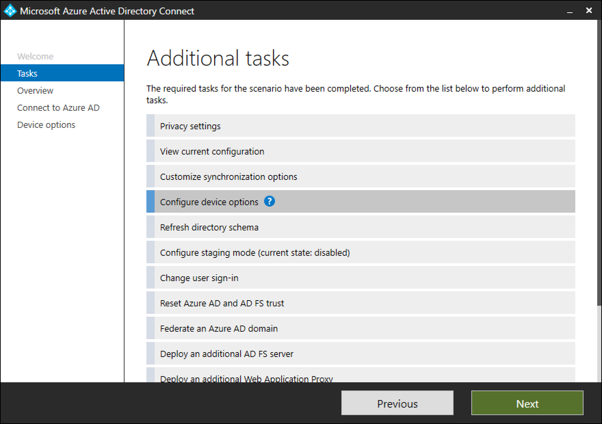
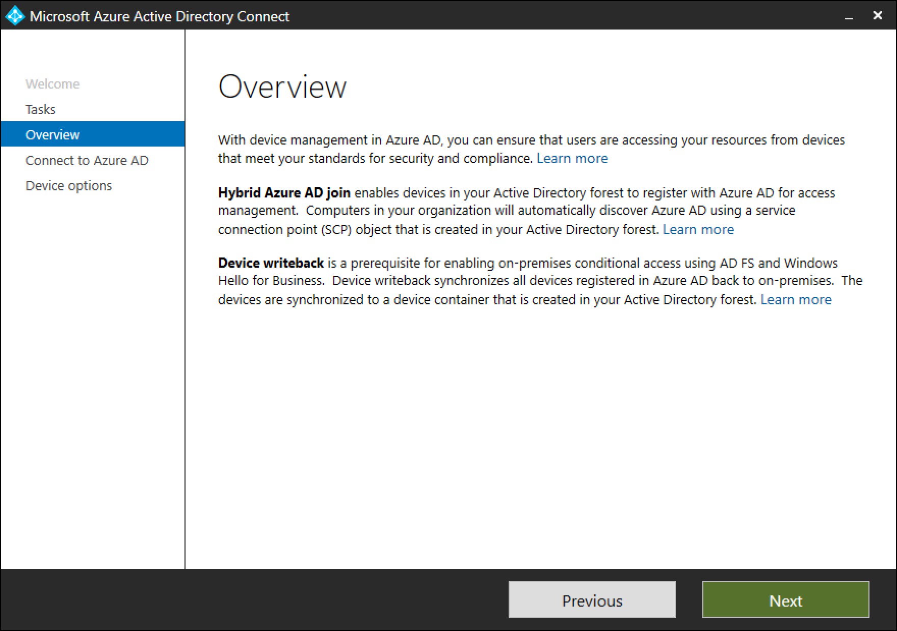
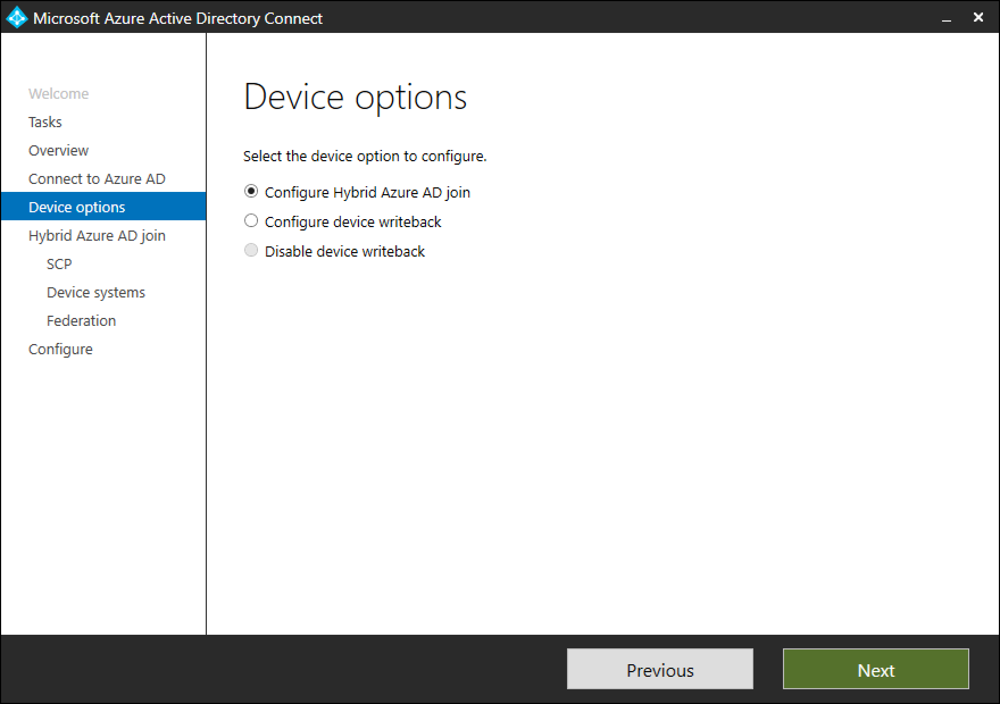

# Microsoft Entra Connect: Device options

The following documentation provides information about the various device options available in Microsoft Entra Connect. You can use Microsoft Entra Connect to configure the following two operations: 
* **Microsoft Entra hybrid join**: If your environment has an on-premises AD footprint and you want the benefits of Microsoft Entra ID, you can implement Microsoft Entra hybrid joined devices. These devices are joined  both to your on-premises Active Directory, and your Microsoft Entra ID.
* **Device writeback**: Device writeback is used to enable Conditional Access based on devices to AD FS (2012 R2 or higher) protected devices

## Configure device options in Microsoft Entra Connect

1. Run Microsoft Entra Connect. In the **Additional tasks** page, select **Configure device options**.  Click **Next**.
     

    The **Overview** page displays the details.
    

    >[!NOTE]
    > The new Configure device options is available only in version 1.1.819.0 and newer.

2. After providing the credentials for Microsoft Entra ID, you can chose the operation to be performed on the Device options page.
    

## Next steps

* [Configure Microsoft Entra hybrid join](~/identity/devices/hybrid-join-plan.md)
* [Configure / Disable device writeback](how-to-connect-device-writeback.md)
