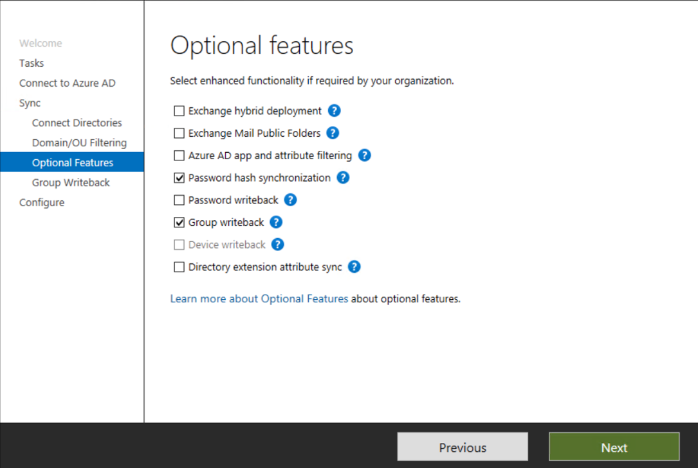

# Group writeback for Microsoft 365 groups

[!INCLUDE [deprecation](~/includes/gwb-v2-deprecation.md)]

Group writeback is a feature that you can use to write cloud groups back to your on-premises Active Directory instance by using Microsoft Entra Connect Sync. Group writeback V2 using Microsoft Entra Connect was deprecated. Group writeback V1 using Microsoft Entra Connect still functions, and you should use it if you're synchronizing Microsoft 365 groups. This version of group writeback is being replaced with [Microsoft Entra Cloud Sync group provisioning to Active Directory](../group-writeback-cloud-sync.md). The V1 functionality continues to work until Microsoft Entra Cloud Sync supports synchronizing Microsoft 365 groups.

This article provides information and walks you through how to enable group writeback V1.

> [!IMPORTANT]
> This article describes how to enable group writeback V1 with Microsoft Entra Connect Sync. Only customers who provision Microsoft 365 groups to Active Directory should use it.

## Prerequisites and information

To enable group writeback, you must have:

- Azure Active Directory Premium licenses for your tenant.
- A hybrid deployment configured between your Exchange on-premises organization and Microsoft 365 and verify that it's functioning correctly.
- A supported version of Exchange installed on-premises.
- Single sign-on configured by using Azure Active Directory Connect.

Consider the following information when you use group writeback V1 with Microsoft Entra Connect Sync:

- Microsoft 365 groups with up to 250,000 members can be written back to on-premises.
- If you don't want to write back all existing Microsoft 365 groups to Active Directory, make changes to group writeback default behavior before you perform the steps in this article to enable the feature. For more information, see [Modify Microsoft 365 groups](#modify-default-behavior-for-microsoft-365-groups).

## Enable group writeback

To enable group writeback, follow these steps:

1. Open the Azure Active Directory Connect wizard, select **Configure**, and then select **Next**.
1. Select **Customize synchronization options** and then select **Next**.
1. On the **Connect to Azure AD** page, enter your credentials. Select **Next**.
1. On the **Optional features** page, verify that the options you previously configured are still selected.
1. Select **Group writeback** and then select **Next**.
1. On the **Group Writeback** page, select an Active Directory organizational unit to store objects that are synchronized from Microsoft 365 to your on-premises organization. Then select **Next**.
1. To make it easier to find groups being written back from Microsoft Entra ID to Active Directory, select the **Writeback group Distinguished Name with cloud Display Name** option:

    - Default format:
    `CN=Group_3a5c3221-c465-48c0-95b8-e9305786a271, OU=WritebackContainer, DC=domain, DC=com`  

    - New format:
    `CN=Administrators_e9305786a271, OU=WritebackContainer, DC=domain, DC=com`  

    When you configure group writeback, a checkbox appears at the bottom of the configuration window. Select it to enable this feature.

    > [!NOTE]
    > Groups that are written back from Microsoft Entra ID to Active Directory have a source of authority in the cloud. Any changes made on-premises to groups that are written back from Microsoft Entra ID are overwritten in the next sync cycle.

    :::image type="content" source="media/how-to-connect-group-writeback/optional-group-writeback-1.png" alt-text="Screenshot that shows selecting the Writeback group Distinguished Name with cloud Display Name option." lightbox="media/how-to-connect-group-writeback/optional-group-writeback-1.png":::

1. On the **Ready to configure** page, select **Configure**.
1. When the wizard is complete, on the **Configuration complete** page, select **Exit**.
1. Open Windows PowerShell as an administrator on the Microsoft Entra Connect server, and run the following commands:

    ```powershell
    $AzureADConnectSWritebackAccountDN = <MSOL_ account DN>
    Import-Module "C:\Program Files\Microsoft Azure Active Directory Connect\AdSyncConfig\AdSyncConfig.psm1"
    
    # To grant the <MSOL_account> permission to all domains in the forest:
    Set-ADSyncUnifiedGroupWritebackPermissions -ADConnectorAccountDN $AzureADConnectSWritebackAccountDN
    
    # To grant the <MSOL_account> permission to specific OU (eg. the OU chosen to writeback Office 365 Groups to):
    $GroupWritebackOU = <DN of OU where groups are to be written back to>
    Set-ADSyncUnifiedGroupWritebackPermissions -ADConnectorAccountDN $AzureADConnectSWritebackAccountDN -ADObjectDN $GroupWritebackOU
    ```

For more information on how to configure Microsoft 365 groups, see [Configure Microsoft 365 groups with on-premises Exchange hybrid](/exchange/hybrid-deployment/set-up-microsoft-365-groups#enable-group-writeback-in-azure-ad-connect).

## Disable group writeback

To disable group writeback, follow these steps:

1. Open the Azure Active Directory Connect wizard and go to the **Additional tasks** page. Select the **Customize synchronization options** task and select **Next**.
1. On the **Optional features** page, clear the **Group writeback** checkbox. A warning states that you are about to delete groups. Select **Yes**.

     > [!IMPORTANT]
     > Disabling group writeback causes any groups that this feature created previously to be deleted from your local Active Directory on the next sync cycle.

     

1. Select **Next**.
1. Select **Configure**.

 > [!NOTE]
 > Disabling group writeback sets the `Full Import` and `Full Synchronization` flags to `true` on the Azure Active Directory Connector. The rule changes propagate through on the next sync cycle and delete the groups that were previously written back to your Active Directory.

## Modify default behavior for Microsoft 365 groups

The following sections provide guidance on how to modify the default behavior for Microsoft 365 groups.

### Write back Microsoft 365 groups with up to 250,000 members

Because the default synchronization rule that limits the group size is created when group writeback is enabled, you must complete the following steps after you enable group writeback:

1. On your Microsoft Entra Connect server, open a PowerShell prompt as an administrator.
1. Disable the [Microsoft Entra Connect Sync scheduler](./how-to-connect-sync-feature-scheduler.md):

     ``` PowerShell 
     Set-ADSyncScheduler -SyncCycleEnabled $false 
     ``` 

1. Open the [Synchronization Rules Editor](./how-to-connect-create-custom-sync-rule.md).
1. Set the direction to **Outbound**.
1. Locate and disable the **Out to AD – Group Writeback Member Limit** synchronization rule.
1. Enable the Microsoft Entra Connect Sync scheduler:

     ``` PowerShell 
     Set-ADSyncScheduler -SyncCycleEnabled $true 
     ``` 

> [!NOTE]
> Disabling the synchronization rule sets the flag for full synchronization to `true` on the Microsoft Entra Connector. This change causes the rule changes to propagate through on the next sync cycle.

## Related content

- [Microsoft Entra Connect group writeback](how-to-connect-group-writeback-v2.md)
